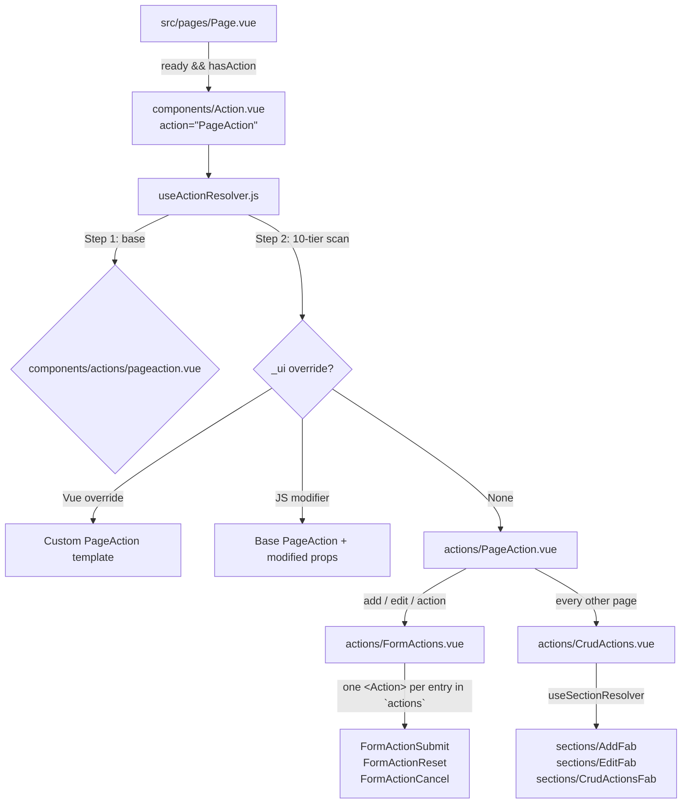

# AQL Action System Guide

This is the canonical reference for AQL's **Action Subsystem** — the third first-class
placeholder paradigm alongside `Section.vue` and `Content.vue`.

| Paradigm | Placeholder | Resolver | Base folder | Renders |
|----------|-------------|----------|-------------|---------|
| Section | `components/Section.vue` (`AqlSection`) | `useSectionResolver.js` | `components/sections/` | Page chrome (header, filter, switcher) |
| Content | `components/Content.vue` (`AqlContent`) | `useContentResolver.js` | `components/contents/` | Page body, inside `AqlContentWrapper` |
| **Action** | **`components/Action.vue` (`AqlAction`)** | **`useActionResolver.js`** | **`components/actions/`** | **Page-level actions: sticky form bar, CRUD FABs** |

All three share the identical 10-tier `_ui/` override model. Only the base folder and
the identity prop (`section` / `content` / `action`) differ.

---

## 1. Architectural Overview



### 1.1 Why a separate subsystem
Actions are structurally different from sections and contents:

* They are mounted **outside** `.aql-page-body`, as a direct `q-page` child, because the
  page entrance animation applies a CSS `transform` to body children — and a transformed
  ancestor becomes the containing block for `position: fixed` descendants, which would
  trap the `q-page-sticky` FAB at the end of the content flow instead of the viewport.
* They are the only components that **dispatch** (submit / execute / reset), so their
  override surface has to reach the submission lifecycle, not just presentation.
* They compose recursively — `PageAction` mounts `FormActions`, which mounts individual
  buttons — and every level must be independently overridable.

Giving them their own placeholder + resolver + folder makes each of those levels an
addressable override target instead of a hardcoded child.

### 1.2 Page integration (`src/pages/Page.vue`)
```html
<Action
  v-if="ready && hasAction"
  action="PageAction"
  v-bind="pageProps"
/>
```
Mounted after `AqlContentWrapper`, as a **sibling of the `<Transition>`** — never inside
`.aql-page-body`. `hasAction` comes from `usePageResolver` and is simply
`sections.includes('PageAction')`.

> [!NOTE]
> `PageAction` is still **declared inside the page contract's `sections` array** — base
> contracts (`pages/[Scope]/[page].js`) were not changed. `usePageResolver` filters it out
> of `visibleSectionsBeforeAction` and exposes it via `hasAction` instead, so the Action
> subsystem takes over the mount without any BP churn.
> `hasActionSection` remains exported as a deprecated alias of `hasAction`.

### 1.3 The Action Placeholder (`src/components/Action.vue`)
`AqlAction` mirrors `Section.vue` / `Content.vue` exactly:
* Accepts a required `action: String` prop; captures everything else via `useAttrs()`.
* Builds `preparedProps = { ...attrs, action }` and calls `useActionResolver(preparedProps)`.
* Handles three states:
  1. **Loading (`!ready`)** — `q-spinner-dots`.
  2. **Resolved** — `<component :is="resolvedComponent" v-bind="finalProps" />`.
  3. **Undefined** — an "Action Not Defined" warning card naming the action, page,
     resource, and scope.
* `inheritAttrs: false`, so nothing leaks onto the DOM.

### 1.4 The Action Resolver (`src/composables/resources/useActionResolver.js`)
Two Vite glob registries built once at module load, both lowercasing every path key
(so **all file names are case-insensitive on every OS**):

| Registry | Source Glob | Key Format |
|----------|-------------|------------|
| `frameworkRegistry` | `../../components/**/*.{vue,js}` | `components/…` (lowercased) |
| `customUiRegistry` | `../../_ui/**/*.{vue,js}` | `_ui/…` (lowercased) |

It injects `resourceConfig`, `resourceRecord`, and `pageState` internally so it can hand
them to JS modifier functions, and re-exports `evaluateProp` so action components get the
same closure-prop semantics as sections without importing the section resolver.

Signature: `useActionResolver(preparedProps, defaultComponent = null) => { ready, resolvedComponent, finalProps }`

> [!IMPORTANT]
> **`finalProps` is reactive, not a snapshot.** `useSectionResolver` / `useContentResolver`
> assign their merged props *inside* the watch callback, which only re-runs when one of the
> five lookup keys (`action`/`section`/`content`, `page`, `scope`, `resource`, `uiName`)
> changes — so any other prop is frozen at first resolve. Action props change without
> touching a lookup key constantly: a submit button enabling once an outcome is selected, a
> label switching on record status, `disabled` flipping mid-form. `useActionResolver`
> therefore exposes `finalProps` as a **computed** over the live `preparedProps`, caching
> only the JS-modifier result (the one thing the async scan actually produced):
> ```javascript
> const finalProps = computed(() => {
>   const current = preparedProps.value || {}
>   return modifierProps.value ? { ...current, ...modifierProps.value } : current
> })
> ```
> Practical consequence: a JS modifier's returned object always wins over live props, and it
> is evaluated **once** per resolve. Use function-valued props (evaluated per render by the
> receiving component through `evaluateProp`) when a modifier needs to react to record state.

---

## 2. Resolution Sequence

### 2.1 Step 1 — Base action component
First match wins:
1. `_ui/{uiName}/components/actions/{action}.vue` — tenant-wide generic base.
2. `components/actions/{action}.vue` — framework default base.
3. Otherwise, the first `.vue` candidate from the 10-tier list below is promoted to base.
4. Otherwise, the caller-supplied `defaultComponent` (used by `PageAction.vue` when it
   resolves `FormActions` / `CrudActions`).
5. Otherwise, `Action.vue` renders the "Action Not Defined" card.

### 2.2 Step 2 — The 10-Tier Override Scan
Identical in shape to the Section and Content resolvers (first match wins):

| # | Tier | Path | Type |
|---|------|------|------|
| 1 | resource + page | `_ui/{ui}/components/{scope}/{Resource}/{page}/{Action}.vue` | Vue override |
| 2 | resource + page | `_ui/{ui}/components/{scope}/{Resource}/{page}/{Action}.js` | JS modifier |
| 3 | resource | `_ui/{ui}/components/{scope}/{Resource}/{Action}.vue` | Vue override |
| 4 | resource | `_ui/{ui}/components/{scope}/{Resource}/{Action}.js` | JS modifier |
| 5 | page | `_ui/{ui}/components/{scope}/{page}/{Action}.vue` | Vue override |
| 6 | page | `_ui/{ui}/components/{scope}/{page}/{Action}.js` | JS modifier |
| 7 | scope-wide | `_ui/{ui}/components/{scope}/{Action}.vue` | Vue override |
| 8 | scope-wide | `_ui/{ui}/components/{scope}/{Action}.js` | JS modifier |
| 9 | ui-wide | `_ui/{ui}/components/{Action}.vue` | Vue override |
| 10 | ui-wide | `_ui/{ui}/components/{Action}.js` | JS modifier |

**Path segment transformation rules** (get these wrong and nothing resolves):

| Segment | Input | Transformation | Example |
|---------|-------|----------------|---------|
| `{ui}` | `customUIName` | Lowercased as-is (defaults to `AQL`) | `aql` |
| `{scope}` | Route scope | Lowercased as-is | `master` |
| `{Resource}` | Resource slug | `toPascalCase` → then lowercased | `'purchase-orders'` → `PurchaseOrders` → `purchaseorders` |
| `{page}` | Canonical page | Lowercased as-is | `add` |
| `{Action}` | Action name | Lowercased as-is | `formactionsubmit` |

### 2.3 Vue Overrides vs JS Modifiers
* **Vue override (`.vue`)** — replaces the base action entirely. `finalProps` flows through
  unmodified so the override can use `$attrs`.
* **JS modifier (`.js`)** — keeps the base action and adjusts its props:
  ```javascript
  // _ui/AQL/components/master/products/add/formactionsubmit.js
  export default (currentProps, { pageState, resourceRecord, resourceConfig }) => ({
    label: (record) => record?.Status === 'Draft' ? 'Save Draft' : 'Create Product',
    color: 'accent',
    icon: 'cloud_upload'
  })
  ```
  A plain object export works too. Function-valued props are evaluated by the receiving
  component through `evaluateProp(val, resourceRecord, resourceConfig)`, which calls the
  closure with **plain unwrapped objects** `(record, config)` — never call `.value` inside.

---

## 3. The `components/actions/` Directory

| Component | Role |
|-----------|------|
| `PageAction.vue` | Root action container. Owns the submission lifecycle and picks the live cluster per route. |
| `FormActions.vue` | Sticky bottom bar. Renders a configurable list of buttons, each through `<Action>`. |
| `FormActionSubmit.vue` | Base submit button. |
| `FormActionReset.vue` | Base reset button. |
| `FormActionCancel.vue` | Base cancel button — self-navigates via `nav.goBack()`. |
| `CrudActions.vue` | Floating CRUD FABs with the 750ms-delayed `bounceIn` entrance. |

> [!IMPORTANT]
> **Action components carry no `<style>` block.** Every rule lives in
> `src/css/custom.scss` under `.aql-form-actions-*` / `.aql-crud-action-*`
> (ARCHITECTURE RULES §7).

### 3.1 `PageAction.vue`
Mounted by `Page.vue`. Decides which cluster is live:
* `add` / `edit` / `action` → `FormActions` (the sticky bar owns these pages entirely).
* everything else → `CrudActions` (which applies its own record/permission gating).

Both clusters are mounted through `useActionResolver` (with the framework component as
`defaultComponent`), so each is independently overridable at any of the 10 tiers.

**Props** — every one is settable from a `pageaction.js` JS modifier:

| Prop | Type | Default | Description |
|------|------|---------|-------------|
| `page` | `String` (required) | — | Canonical page name |
| `scope` / `resource` / `uiName` | `String` | `null` | Resolver context; falls back to injected `resourceConfig` |
| `actions` | `Array` | `null` | Forwarded to `FormActions`; `null` lets `FormActions`' own default apply |
| `submit` / `reset` / `cancel` | `Function` | `null` | Unified action handlers — see §3.1.1 |
| `modifyPayload` | `Function` | `null` | `(requests, ctx) => requests` payload interceptor |
| `successRoute` | `String\|Function` | `null` | `'view'` \| `'index'` \| `(code, ctx) => target` |
| `successMessage` | `String\|Function` | `''` | Notification text on success |
| `onSubmitSuccess` | `Function` | `null` | `({ response, code }, ctx) => void` — replaces default navigation |
| `onSubmitError` | `Function` | `null` | `(result, ctx) => void` |
| `submitLabel` | `String\|Function` | `null` | Overrides the derived label (`Create` / `Save` / action label) |

`ctx` is `{ pageState, resourceConfig, resourceRecord, nav }`.

#### 3.1.1 The unified action dispatcher

Every button in the bar — built-in or custom — routes through one function,
`handleAction(actionName, extraPayload)`. There is no per-action prop pipeline and no
`beforeSubmit`: a handler is simply looked up **by the action's own name**.

```
button click
   │
   ├─ resolveHandler(actionName)
   │     built-in key ('submit'|'reset'|'cancel') → props[actionName]
   │     custom key   ('nextStep', …)             → $attrs[actionName]
   │
   ├─ no handler AND not built-in → console.warn('[PageAction] No action handler supplied for:', name) → stop
   │
   ├─ handler? → result = await handler(actionName, ctx)      ctx = { pageState, resourceConfig, resourceRecord, nav, payload }
   │      result === false          → abort
   │      result.valid === false    → abort (notify result.message if present)
   │      Array                     → { requests: [...] }
   │      Object                    → merged into the pageState call options
   │      undefined | true          → continue with defaults
   │
   └─ built-in default
         submit → pageState.submit(options)  (or pageState.run() on an action page)
         reset  → onReset()
         cancel → nav.goBack()
         custom → pageState.run(options), but only when the handler returned
                  `requests` or `build`; otherwise the handler is assumed to have
                  done its own work
```

Handlers are `async`-aware — a returned promise is awaited before the built-in runs.
Returned options are merged **over** the defaults, except `onSuccess`, which is only
filled in when the handler did not supply one.

```javascript
// _ui/AQL/components/operation/purchaseorders/add/pageaction.js
export default {
  // Veto — the built-in pageState.submit() never runs
  submit: (name, { pageState }) => {
    const node = pageState.state.nodes.get('PurchaseOrders')
    if (!node?.children?.length) return { valid: false, message: 'Add at least one item.' }
  },

  // Confirm before discarding; returning false leaves the form untouched
  reset: () => window.confirm('Discard all changes?'),

  // Custom key — requires `actions: [..., 'nextStep', ...]` on FormActions.
  // Returning requests dispatches them through pageState.run().
  nextStep: (name, { pageState }) => [ /* …request objects… */ ]
}
```

A custom key listed in `actions` with **no** handler is a no-op plus a console warning —
the button still renders, so the misconfiguration is visible rather than silent.

> [!NOTE]
> A custom action key must be listed in `FormActions`' `actions` array to render a
> button, and its handler must be exported from a `pageaction.js` modifier (it reaches
> `PageAction` via `$attrs`, since only the three built-ins are declared props).

**Reset semantics (`onReset`)** — a silent discard, no navigation and no notification:
* On `add`: `pageState.initResource(resource, { isPrimaryKey: true, reset: true })` swaps in
  a fresh record object. `FormRecord.vue` keys its default-seeding watch on that object's
  identity, so the resource's configured default values are re-seeded rather than leaving
  a blank form.
* On `edit` / `action`: additionally `pageState.load(resource, original)` re-hydrates the
  pristine server record (`resourceRecord` is never mutated by form input — only
  `pageState.node.record` is), so unsaved edits are discarded without losing originals.

> [!NOTE]
> `FormActions` deliberately does **not** receive `...attrs`. `pageProps` carries an
> `onCancel` (navigateBack) handler that Vue would bind as a `cancel` emit listener,
> double-navigating on top of `FormActionCancel`'s own `goBack()`.

### 3.2 `FormActions.vue` — the configurable action array
Renders the sticky bar chrome and one `<Action>` per entry in `actions`:

```html
<div class="aql-form-actions-spacer">
  <div class="aql-form-actions-bar shadow-up-3">
    <div class="aql-form-actions-content row items-center justify-end q-gutter-sm">
      <Action v-for="entry in resolvedActions" :key="entry.id" :action="entry.action" v-bind="entry.props" />
    </div>
  </div>
</div>
```

**Name mapping**: a short key is prefixed with `FormAction` and capitalised; an
already-qualified name passes through.

| `actions` entry | Resolved action name | Base component |
|-----------------|----------------------|----------------|
| `'submit'` | `FormActionSubmit` | `actions/FormActionSubmit.vue` |
| `'reset'` | `FormActionReset` | `actions/FormActionReset.vue` |
| `'cancel'` | `FormActionCancel` | `actions/FormActionCancel.vue` |
| `'draft'` | `FormActionDraft` | *(none — tenant supplies it under `_ui/`)* |
| `'FormActionDraft'` | `FormActionDraft` | same as above |

**Props**:

| Prop | Type | Default | Description |
|------|------|---------|-------------|
| `actions` | `Array` | `['reset', 'submit']` | Ordered button list, left → right. Entries are strings or `{ name, ...props }` objects |
| `page` / `scope` / `resource` / `uiName` | `String` | `null` | Resolver context passed to every button `<Action>` |
| `submitLabel` / `resetLabel` / `cancelLabel` | `String\|Function` | `'Save'` / `'Reset'` / `'Cancel'` | |
| `submitIcon` / `resetIcon` / `cancelIcon` | `String\|Function` | `'check'` / `'restart_alt'` / `'close'` | |
| `submitColor` / `resetColor` / `cancelColor` | `String\|Function` | `'primary'` / `'grey-7'` / `'grey-7'` | |
| `disabled` | `Boolean\|Function` | `false` | Submit-only gate (e.g. an action page awaiting an outcome) |
| `actionProps` | `Object` | `{}` | Extra props merged per key, e.g. `{ submit: { icon: 'send' } }` |

**Emits**: `submit`, `reset`, `cancel`, and `action(key)` for any unrecognised key.

**Prop merge order per button** (later wins):
`resolverContext` → per-key defaults → `actionProps[key]` → object-entry extras.

Common configurations:
```javascript
// Default — in-place reset next to submit
actions: ['reset', 'submit']

// Discard-and-leave instead of in-place reset
actions: ['cancel', 'submit']

// Custom, with a tenant-supplied FormActionDraft under _ui/
actions: ['cancel', 'draft', 'submit']

// Object entries for one-off prop tweaks
actions: ['reset', { name: 'submit', label: 'Publish', icon: 'send' }]
```

### 3.3 The button components
All three share the same shape: `inheritAttrs: false`, `[String, Function]` prop types
evaluated through `evaluateProp`, and `pageState` injected for the in-flight state.

| Prop | Type | `FormActionSubmit` | `FormActionReset` | `FormActionCancel` |
|------|------|--------------------|-------------------|--------------------|
| `label` | `String\|Function` | `'Save'` | `'Reset'` | `'Cancel'` |
| `icon` | `String\|Function` | `'check'` | `'restart_alt'` | `'close'` |
| `color` | `String\|Function` | `'primary'` | `'grey-7'` | `'grey-7'` |
| `disabled` | `Boolean\|Function` | `false` | `false` | `false` |
| `flat` / `unelevated` | `Boolean` | `false` / `false` | `false` / `false` | `false` / `false` |
| `cancelHandler` | `Function` | — | — | `null` (local escape hatch, see below) |

**Emits**: `click`. **All three report intent upward** — `PageAction.handleAction()` owns
every behaviour, including `cancel` → `nav.goBack()`. A button must never navigate or
dispatch on its own: `cancel` doing so would pop two history entries per click and would
make a `cancel` handler returning `false` unable to veto the navigation.

`cancelHandler` exists only for standalone use outside `PageAction`. When supplied it
**replaces** the emit entirely, so the container never also navigates.

> [!IMPORTANT]
> The cancel override prop is named `cancelHandler`, **not** `onCancel`. Vue treats any
> `onXxx` prop as an emit listener, which would silently bind `pageProps.onCancel`.

#### Styling
All three render as `push glossy` Quasar buttons carrying `.aql-form-action-btn`
(`padding: 6px 18px`, `font-weight: 600`, `min-height: 40px`, `border-radius: 8px`,
`.q-icon { font-size: 20px }` — defined in `custom.scss`, scoped as `.q-btn.aql-form-action-btn`
so it outranks Quasar's equal-specificity rules regardless of load order).

> [!IMPORTANT]
> `flat` and `unelevated` both default to **`false`** on all three buttons. Quasar's
> `flat` and `unelevated` each suppress the shadow that `push glossy` renders, so leaving
> either one on would make the styling inert. Visual subordination of Reset/Cancel to
> Submit comes from `color` (`grey-7` vs `primary`), not from flatness. Setting
> `flat: true` via a modifier is still supported — it just opts that button out of the
> push/glossy treatment.

### 3.4 `CrudActions.vue`
Unchanged in behaviour from its previous `sections/` location — three mutually exclusive
layouts driven by permissions and record presence. The floating action FABs (`AddFab` /
`EditFab` / the expandable `CrudActionsFab` menu) all render with **`push glossy` styling**
for a premium appearance matching the `FormActions` bar buttons.

| Condition | Renders |
|-----------|---------|
| `canWrite && !canUpdate` (or no record) | Single Add FAB (`push glossy`, primary color) |
| `canUpdate && record && !canWrite` | Single Edit FAB (`push glossy`, primary color) |
| `canWrite && canUpdate && record` | Expandable `CrudActionsFab` menu (`push glossy` three-dot button with staggered Add/Edit FABs inside) |

Never rendered on `add` / `edit` pages — `FormActions` owns those.

Its individual FABs (`AddFab`, `EditFab`, `CrudActionsFab`) remain **sections** under
`components/sections/` and keep resolving through `useSectionResolver`, so existing tenant
FAB overrides are untouched and will automatically inherit the new `push glossy` styling
via `.aql-crud-action-fab` class. A `CrudActions` JS modifier can suppress the whole cluster by
returning `show: false` or `hide: true` (plain boolean or function).

The `.aql-crud-action-container` entrance animation is applied to an **inner wrapper**,
never to the `q-page-sticky` root — a CSS transform on a `position: fixed` ancestor turns
it into the containing block for its fixed descendants and breaks FAB positioning.

---

## 4. Tenant Override Cookbook

All paths are under `FRONTENT/src/_ui/[UiName]/components/`. Remember `{Resource}` is the
**PascalCased-then-lowercased** slug.

**Swap Reset for Cancel on one resource's add page** — JS modifier on the container:
```javascript
// _ui/AQL/components/master/products/add/pageaction.js
export default {
  actions: ['cancel', 'submit']
}
```

**Rebrand the submit button across a whole scope**:
```javascript
// _ui/AQL/components/operation/formactionsubmit.js
export default {
  label: (record) => record?.Progress === 'Draft' ? 'Submit for Approval' : 'Save',
  color: 'accent',
  icon: 'send'
}
```

**Replace one button's template entirely**:
```html
<!-- _ui/AQL/components/master/products/add/formactionreset.vue -->
<template>
  <q-btn v-bind="$attrs" flat color="negative" label="Discard" icon="delete" @click="$emit('click')" />
</template>

<script setup>
defineOptions({ inheritAttrs: false })
defineEmits(['click'])
</script>
```

**Replace the whole bar** — `_ui/AQL/components/master/products/formactions.vue`. Your
override receives `page`/`scope`/`resource`/`uiName`/`submitLabel`/`disabled`/`actions`
and must emit `submit` / `reset` / `cancel` / `action(key)` for `PageAction` to dispatch.

**Add a custom action** — the key needs a button *and* a handler:
```javascript
// _ui/AQL/components/operation/purchaserequisitions/add/pageaction.js
export default {
  actions: ['cancel', 'saveDraft', 'submit'],           // renders FormActionSaveDraft
  saveDraft: (name, { pageState }) => {                  // dispatched via pageState.run()
    pageState.setField('PurchaseRequisitions', 'Progress', 'DRAFT')
    return { requests: pageState.build({ mode: 'draft' }), successMsg: 'Draft saved.' }
  }
}
```
Supply the button itself as `_ui/AQL/components/.../formactionsavedraft.vue` (or `.js` to
modify a base). Without a handler the button renders but only logs
`[PageAction] No action handler supplied for: saveDraft`.

**Hide CRUD FABs on a resource**:
```javascript
// _ui/AQL/components/operation/outletvisits/crudactions.js
export default { show: false }
```

**Intercept the submission lifecycle without touching any template**:
```javascript
// _ui/AQL/components/operation/purchaseorders/add/pageaction.js
export default {
  submit: (name, { pageState }) => {
    const node = pageState.state.nodes.get('PurchaseOrders')
    if (!node?.children?.length) return { valid: false, message: 'Add at least one item.' }
  },
  successRoute: 'view',
  successMessage: 'Purchase order created.'
}
```

> [!IMPORTANT]
> **Attribute fallthrough (the div-wrap trap).** Never wrap a `.vue` override in a bare
> `<div>` to stop fallthrough — it swallows clicks, badges, and permission props. Set
> `inheritAttrs: false` and bind `$attrs` **before** your custom properties.

---

## 5. Submission Loading UX

The Action subsystem uses **one** blocking indicator per page, not per button.

| Element | Behaviour while `pageState.meta.submitting` is true |
|---------|----------------------------------------------------|
| `AqlContentWrapper` | Renders `<q-inner-loading>` with a `q-spinner-dots` overlay across the whole content area |
| `FormActionSubmit` | `:disable="true"` — **no** `:loading` spinner |
| `FormActionReset` | `:disable="true"` — **no** `:loading` spinner |
| `FormActionCancel` | `:disable="true"` |

`pageState.meta.submitting` / `.saving` are flipped by `usePageState.run()` around every
dispatch, so this needs no wiring at the page level. `AqlContentWrapper` injects
`pageState` directly; the `submitting` prop (default `false`) is an opt-in force flag, and
`submittingLabel` (default `'Saving…'`) sets the overlay caption.

**Rationale**: a per-button spinner communicates "this button is busy" while the rest of
the form still looks editable. The overlay communicates the truth — the whole page is
mid-dispatch — and prevents edits landing in a payload that has already been sent.

---

## 6. Preserved Aesthetics & Behaviour

The subsystem migration is behaviour-preserving. These are contractual:

* **Breeze gradient** on the sticky bar — 135° swapped direction, tinted on the left/empty
  side, fading to soft white beneath the right-aligned buttons.
* **Backdrop blur** (`blur(8px)`, with `-webkit-` prefix) behind the bar.
* **750ms entrance delay** on both the bar (`form-actions-slide-up`, 380ms) and the FABs
  (`fab-bounce-in`, 750ms) so page content settles first.
* **`bounceIn` FAB animation** on an inner wrapper only, never on `q-page-sticky`.
* **`prefers-reduced-motion`** disables both animations.
* **80px spacer** in flow so the fixed bar never covers the last form field, against a
  `min-height: 64px` bar.
* **Strict vertical centering** — the bar and `.aql-form-actions-content` are both
  `display: flex; align-items: center`, with a `gap: 10px` between buttons. Quasar's
  `q-gutter-*` is deliberately not used: its negative top margin on the container fights
  that centering.
* **Preserved-default Reset** — silent reset, re-seeding defaults on `add`, re-hydrating
  the server record on `edit`/`action`. `app/Date.vue` watches `modelValue` and re-seeds
  today (`YYYY-MM-DD`) whenever it goes empty, so a Reset leaves date fields pre-filled
  rather than blank. The emit is deferred to `nextTick` — emitting synchronously on the
  watcher's immediate run re-enters Quasar's mask handling before the inner `<input>`
  mounts, throwing `Cannot read properties of null (reading 'selectionEnd')`. The empty
  check is repeated inside the tick so a value arriving meanwhile is never clobbered.
  `abstract/Date.vue`'s picker offers one-click today via an explicit **Today** footer
  button (Quasar's `today-btn` lives in the header that `minimal` removes).
* **API submission lifecycles** — handler → `build`/`modifyPayload` → `pageState.submit()`
  or `pageState.run()` → `onSuccess` → navigation. Only the entry point changed: the
  `beforeSubmit` prop was replaced by the `submit` handler of the unified dispatcher (§3.1.1).

---

## 7. Strict Maintenance Rule

> [!IMPORTANT]
> **Documentation Sync Requirement**: Any modification to the Action subsystem — adding a
> component under `components/actions/`, changing the resolver's scan order, altering the
> `actions` array contract, or changing the loading UX — MUST be accompanied by updates to:
> 1. This document: [AQL_ACTION_SYSTEM.md](file:///f:/LITTLE%20LEAP/AQL/Documents/AQL_ACTION_SYSTEM.md)
> 2. The initialization prompt: [action_customization.md](file:///f:/LITTLE%20LEAP/AQL/References/Prompt%20Library/Initialization/action_customization.md)
> 3. The component registry: [components/REGISTRY.md](file:///f:/LITTLE%20LEAP/AQL/FRONTENT/src/components/REGISTRY.md)
>
> If the change also touches the Page/Section boundary, update
> [AQL_PAGE_AND_SECTION_SYSTEM.md](file:///f:/LITTLE%20LEAP/AQL/Documents/AQL_PAGE_AND_SECTION_SYSTEM.md)
> and [page_and_section_system.md](file:///f:/LITTLE%20LEAP/AQL/References/Prompt%20Library/Initialization/page_and_section_system.md).
