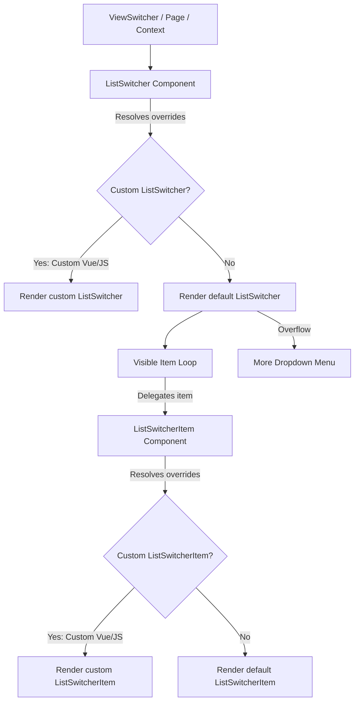

# AQL Frontend List Switcher Architecture

This document defines the architecture, options, and override criteria for the list switching system. It details the container-level (`ListSwitcher`) and item-level (`ListSwitcherItem`) components, their design guidelines, and rules for custom UI modifications.

---

## 1. Core Architecture

The AQL list switching system is modular, dividing the UI into:
1. **Container (`ListSwitcher`)**: The surrounding element containing the list of switchable items and managing the responsive layout (horizontal scroll on mobile vs. dropdown on desktop).
2. **Item (`ListSwitcherItem`)**: Individual clickable segments representing each state or view.

Both components support standard AQL page-level and resource-level overrides, custom template replacement (`.vue`), and custom property modifiers (`.js`).



---

## 2. Override & Customization Scenarios

Developers can customize the list switcher layout at different layers depending on their requirements:

### Scenario A: Overriding only the Container wrapper
To customize only the outer wrapper (e.g. adding custom wrappers, headers, or borders) while keeping the default pill design:
- Create `src/_ui/[UiName]/components/.../ListSwitcher.vue`.
- In your template, delegate the item rendering to `<Section section="ListSwitcherItem" />` rather than hardcoding the button layout:
  ```html
  <template>
    <div class="my-custom-container-wrapper">
      <Section
        v-for="item in visibleItems"
        :key="item.name"
        section="ListSwitcherItem"
        v-bind="buildItemProps(item)"
        @click="handleItemClick(item.name)"
      />
    </div>
  </template>
  ```
  *Benefit*: `Section` automatically resolves to the custom item override if it exists, or cleanly falls back to the default `ListSwitcherItem.vue` without extra code.

### Scenario B: Overriding only the Switcher Item
To change only the visual look of individual switcher buttons (e.g., adding loading states, specific icons, badges) without changing the container bar:
- Create `src/_ui/[UiName]/components/.../ListSwitcherItem.vue` (or `ListSwitcherItem.js`).
- The default `ListSwitcher.vue` uses `useSectionResolver` to dynamically resolve `'ListSwitcherItem'`. It will find your override and render it in place of the base item automatically.

### Scenario C: Customizing both Container and Items inline
To completely replace the layout with a bespoke HTML structure (e.g. vertical sidebar layout, custom grids):
- Create `src/_ui/[UiName]/components/.../ListSwitcher.vue`.
- Write your layout natively (e.g., `<div class="list-view-container"><div class="list-view-item">...</div></div>`), bypassing the item resolver entirely.

### Scenario D: Dynamic Property Modifiers (JS Modifiers)
To customize properties dynamically without overriding the templates:
- Create `ListSwitcher.js` (container properties) or `ListSwitcherItem.js` (item properties).
- Return an object with custom properties or functions (e.g., resolving color based on the current record). These will be merged automatically into `finalProps` by the resolver, which are then passed down as props/attrs into `ListSwitcher.vue`.
- The most common use of `ListSwitcher.js` is to fully replace the `items` array with bespoke views and their own `filter` trees, bypassing sheet-driven `ListViews` config and auto-generated views entirely. See `src/_ui/AQL/components/master/currencies/ListSwitcher.js` for a working example:
  ```javascript
  export default function() {
    return {
      maxVisibleItems: null, // disables the "More" overflow dropdown — all items render inline
      items: [
        {
          name: 'Inactive',
          default: true,
          color: 'positive',
          icon: 'check_circle',
          filter: {
            type: 'group',
            logic: 'AND',
            items: [{ type: 'condition', column: 'Status', operator: 'eq', value: 'Inactive' }]
          }
        },
        // ...additional items with their own name/color/icon/filter
      ]
    }
  }
  ```
  - `maxVisibleItems: null` is a deliberate override: it disables the desktop overflow dropdown (see [Section 3](#3-responsive-behavior-guidelines)) so every item in `items` renders inline regardless of screen size.
  - Each entry in `items` follows the same schema documented in [Section 4.3](#43-list-view-item-object-schema) below.

#### 2.1. Items Resolution Precedence
`ListSwitcher.vue` resolves its effective `items` array (`finalAttrs.value.items`, [ListSwitcher.vue#L97-L101](file:///f:/LITTLE%20LEAP/AQL/FRONTENT/src/components/sections/ListSwitcher.vue#L97-L101)) in this exact order — the first non-null/non-undefined source wins:
1. **Explicit `props.items`** — supplied either by a `ListSwitcher.js` JS modifier (merged into `finalProps` by the section resolver) or by an explicit `items` binding on `<ListSwitcher :items="...">` / `<Section section="ListSwitcher" :items="...">` from a parent template.
2. **Fallback: `resourceRecord.effectiveViews`** — the reactive views array computed by [`useListViews.js`](file:///f:/LITTLE%20LEAP/AQL/FRONTENT/src/composables/useListViews.js#L276-L309), which is itself either the sheet-configured `APP.Resources.ListViews` array or scope-aware auto-generated views (see [Section 5](#5-sheet-integration-appresourceslistviews)).

Because this is a full override (not a merge), a JS modifier that returns an `items` array replaces the sheet/auto-generated views entirely rather than appending to them.

---

## 3. Responsive Behavior Guidelines

The base container is built to handle item overflows responsively:
* **Mobile / Tablet Screen Sizes (`sm` and below)**:
  Items are kept in a single line. The container uses pure CSS horizontal scroll with hidden scrollbars to provide a smooth, app-like touch swipe experience.
* **Desktop Screen Sizes (`gt.sm` and above)**:
  Exceeding items are sliced and placed inside a **"More"** dropdown button using Quasar's `<q-menu>`.
  - **Dynamic states**: If an overflowed item is active, the "More" dropdown button inherits its label, icon, active background gradient, and bottom active dot.

---

## 4. Components Reference Catalog

### 4.1. `ListSwitcher` (Container)
* **Default Component File**: `FRONTENT/src/components/sections/ListSwitcher.vue`
* **Purpose**: Renders the container wrapper and handles responsive dropdown/scroll layouts.

#### Props
| Prop | Type | Default | Description |
| :--- | :--- | :--- | :--- |
| `items` | `Array` | `null` (falls back to effective views) | Array of view objects: `[{ name, label?, icon?, color?, ... }]`. |
| `activeItem` | `String` | `null` (falls back to active view) | The name of the currently active view. |
| `label` | `String \| Function` | `null` | Item label resolver. Functions receive `(item, items, config)`. |
| `icon` | `String \| Function` | `null` | Item icon resolver. Functions receive `(item, items, config)`. |
| `iconSize` | `String` | `""` | Icon font-size (e.g., `18px`, `1.2rem`). |
| `containerClass` | `String \| Function` | `""` | Custom classes applied to the container. |
| `containerStyle` | `Object \| String \| Function` | `""` | Custom inline styles applied to the container. |
| `itemClass` | `String \| Function` | `""` | Additional CSS classes applied to each switcher item. |
| `maxVisibleItems` | `Number` | `null` (defaults to `5` on desktop) | Maximum inline items before putting others in the dropdown. |

#### Emits
- `update:activeItem(itemName: String)`: Triggered when a visible item or dropdown item is clicked.

---

### 4.2. `ListSwitcherItem` (Item)
* **Default Component File**: `FRONTENT/src/components/sections/ListSwitcherItem.vue`
* **Purpose**: Encapsulates the visual segment button, color styling, and hover/active states.

#### Props
| Prop | Type | Default | Description |
| :--- | :--- | :--- | :--- |
| `item` | `Object` | *Required* | The raw view configuration object. |
| `active` | `Boolean` | `false` | True if the item is currently active. |
| `label` | `String \| Function` | `""` | Evaluated display label text. |
| `icon` | `String \| Function` | `""` | Evaluated display icon name. |
| `color` | `String \| Function` | `"primary"` | Any supported color string — see [Section 4.4](#44-dynamic-color-resolution). |

#### Attribute Fallthrough (`v-bind="$attrs"`)
All extra properties on the `item` object (e.g., `disabled`, custom metadata) are spread by the container and bound to the root button tag in `ListSwitcherItem` via `v-bind="$attrs"`.

---

### 4.3. List View Item Object Schema
Every entry inside the resolved `items` array — whether sourced from a `ListSwitcher.js` JS modifier, the `APP.Resources.ListViews` sheet cell, or auto-generated by `useListViews.js` — shares the same object shape:

| Attribute | Type | Required | Description |
| :--- | :--- | :--- | :--- |
| `name` | `String` | Yes | Unique identifier for the view. Used as the `activeItem` match key and passed to `setActiveView(name)`. |
| `label` | `String` | No | Display text. Falls back to `name` if omitted (see `resolvedLabel` in `ListSwitcherItem.vue`). |
| `icon` | `String` | No | Quasar icon name rendered before the label. `null`/omitted hides the icon. |
| `color` | `String` | No | Any brand name, Quasar palette color, or raw Hex/RGB value used for active-state styling — see [Section 4.4](#44-dynamic-color-resolution). Defaults to `'primary'` if omitted. |
| `default` | `Boolean` | No | Marks the view selected on initial load when no URL/query state is present (`defaultViewName` in `useListViews.js`). Only one item should set this `true`; if none do, the first item in the array wins. |
| `filter` | `Object` | No | A filter tree (**Group** or **Condition** object — see [Section 5.1.1](#511-filter-json-schema-reference)) evaluated against each row via `evaluateFilter()` to determine view membership and counts. Omitting it matches all rows. |

**How `ListSwitcher.vue` passes these down to `ListSwitcherItem.vue`:**
- For each visible item, `buildItemProps(item)` ([ListSwitcher.vue#L227-L236](file:///f:/LITTLE%20LEAP/AQL/FRONTENT/src/components/sections/ListSwitcher.vue#L227-L236)) spreads the raw `item` object as attrs, then explicitly sets:
  - `item`: the raw object itself (for `ListSwitcherItem` to read `item.count` or other custom metadata).
  - `active`: `true` when `finalAttrs.value.activeItem === item.name`.
  - `label` / `icon`: resolved via the container's own `label`/`icon` prop-resolver functions first (if `ListSwitcher` was given a `label`/`icon` prop or JS-modifier override), falling back to `item.label`/`item.icon`/`item.name`.
  - `color`: `item.color || 'primary'`.
- `ListSwitcherItem.vue` then re-resolves `label`/`icon`/`color` one more time through its own `evaluateProp` against `resourceRecord`/`resourceConfig` (in case an item-level JS modifier or Vue override further customizes them), falling back to the values passed in from the container.

---

### 4.4. Dynamic Color Resolution

The switcher has **no hardcoded per-color CSS variants**. Any color string configured on an item is resolved at runtime to a CSS color value and injected as the `--aql-switcher-color` custom property on the active element; `custom.scss` derives every visual layer from it with `color-mix()`.

#### Supported color formats
| Format | Examples | Resolves to |
| :--- | :--- | :--- |
| **Quasar brand name** | `primary`, `secondary`, `accent`, `positive`, `negative`, `info`, `warning`, `dark` | `var(--q-<name>)` — stays theme-aware, so tenant theme overrides apply automatically. |
| **Quasar palette color** | `red-10`, `light-blue-4`, `teal-8`, `indigo-6`, `purple-7`, `grey`, `white`, `black` | Concrete hex, resolved once via Quasar's `colors.getPaletteColor()` and cached. Families accept shades `-1`…`-10` and accents `-11`…`-14`. |
| **Raw CSS color** | `#e11d48`, `#0284c7`, `rgb(2 132 199)`, `var(--my-token)` | Passed through untouched. |
| **Unrecognised / blank** | `''`, `not-a-color` | Falls back to `var(--q-primary)`. |

* **Resolver**: `resolveCssColor(color, fallback)` in [`FRONTENT/src/utils/colorHelpers.js`](file:///f:/LITTLE%20LEAP/AQL/FRONTENT/src/utils/colorHelpers.js). It is DOM-safe (returns the fallback when `document` is unavailable) and memoises palette lookups.
* **Consumers**:
  * `ListSwitcherItem.vue` → `itemStyle` sets `--aql-switcher-color` on active items only.
  * `ListSwitcher.vue` → `moreButtonStyle` does the same for the "More" overflow button when the active view lives inside the dropdown; `menuItemStyle(item)` colors the active dropdown entry inline (no `text-<color>` class, so hex values work).

#### Derived styling (`.aql-list-switcher-item--active` in `custom.scss`)
| Layer | Rule |
| :--- | :--- |
| Background | `linear-gradient(135deg, color-mix(in srgb, var(--aql-switcher-color) 12%, white) 0%, color-mix(in srgb, var(--aql-switcher-color) 18%, white) 100%)` |
| Text & icon | `var(--aql-switcher-color)` |
| Box shadow | `0 2px 8px color-mix(in srgb, var(--aql-switcher-color) 18%, transparent)` |
| Indicator dot | `color-mix(in srgb, var(--aql-switcher-color) 85%, transparent)` |

The block declares its own `--aql-switcher-color: var(--q-primary)` default, so an active item renders correctly even if no inline property is set. A custom `ListSwitcherItem.vue` override only needs to set `--aql-switcher-color` (or reuse the base classes) to inherit the whole treatment.

> **Note**: `color-mix()` requires a modern browser (Chrome/Edge 111+, Safari 16.2+, Firefox 113+). Older engines fall back to the flat `color` value with no gradient.

---

## 5. Sheet Integration (`App.Resources.ListViews`)

The list view items and filtering are derived dynamically from the Google Sheets database configurations.

### 5.1. Sheet Config Relationship
* **Spreadsheet Setup**: Managed under the `ListViews` column of the `APP.Resources` sheet. See the [AQL Menu Admin Guide](file:///f:/LITTLE%20LEAP/AQL/Documents/AQL_MENU_ADMIN_GUIDE.md#L201-L212).
* **JSON Array Structure**: The cell contains a JSON array of item objects:
  ```json
  [
    {
      "name": "Inactive",
      "default": true,
      "color": "positive",
      "icon": "check_circle",
      "filter": {
        "type": "group",
        "logic": "AND",
        "items": [
          { "type": "condition", "column": "Status", "operator": "eq", "value": "Inactive" }
        ]
      }
    }
  ]
  ```
* **Admin Dialog**: The `AQL 🚀 → Manage List Views` dialog ([`GAS/listViewsManager.html`](file:///f:/LITTLE%20LEAP/AQL/GAS/listViewsManager.html)) writes this JSON. Its **Chip Color** field is a free-text input backed by a `colorSuggestions` datalist — pick a brand/palette suggestion or type any Quasar palette name or Hex code. A live swatch previews brand names and raw CSS colors; palette names (`red-10`) show a neutral swatch because they can only be resolved by the frontend at runtime. See [Section 4.4](#44-dynamic-color-resolution) for accepted formats.

### 5.1.1. Filter JSON Schema Reference
The `filter` property does not support a raw array at its root. It must be either a **Group Object** or a **Condition Object**:

#### A. Group Object (`type: "group"`)
Used to join multiple conditions with logical operators:
- `type`: Must be `"group"`.
- `logic`: Either `"AND"` or `"OR"` (defaults to `"AND"`).
- `items`: An array of filter objects (can recursively contain other groups or conditions).

#### B. Condition Object (`type: "condition"`)
Represents a single query comparison:
- `type`: Must be `"condition"`.
- `column`: String matching the exact Google Sheet header column name.
- `operator`: String operator mapping to comparison logic.
- `value`: The target comparison value. Can be a string, number, array (for `in`/`not_in`), or a **dynamic token** such as `"$startOfMonth"`, `"$daysIn:7"` or `"$userRoles"` — see [Section 5.2](#52-dynamic-tokens-date-time--current-user).

#### C. Supported Comparison Operators
The frontend evaluator supports the following operator keys:
- `eq`: Equal to (case-insensitive string comparison or numeric comparison).
- `neq`: Not equal to.
- `in`: Checks if the column value is inside a list of values (e.g. `"value": ["Active", "Draft"]`).
- `not_in`: Checks if the column value is NOT inside a list of values.
- `gt`: Greater than (coerces column and value to numbers).
- `gte`: Greater than or equal to.
- `lt`: Less than.
- `lte`: Less than or equal to.
- `contains`: Checks if the column value contains the search string (substring match).

For source code implementation, see `evaluateFilter` in [useListViews.js](file:///f:/LITTLE%20LEAP/AQL/FRONTENT/src/composables/useListViews.js).

---

### 5.2. Dynamic Tokens (Date/Time & Current User)

A condition `value` may be a **token string** instead of a literal. Tokens resolve at evaluation
time against the clock and the logged-in user, so one sheet-authored view stays correct as the
date rolls over or a different user signs in.

Registry: [`src/utils/tokenEvaluator.js`](file:///f:/LITTLE%20LEAP/AQL/FRONTENT/src/utils/tokenEvaluator.js).
Token names are **case-insensitive** (`$startofmonth` works). In the **Manage Lists** admin
dialog they appear in the grouped `Token...` dropdown next to each condition's value input.

The same registry backs an action's `visibleWhen` (**Manage Actions** → *Visible When*), which is
evaluated by the same module — so `Date` / `lte` / `$startOfDay:0` hides an action on
future-dated records and `OwnerCode` / `eq` / `$userCode` shows one only to its owner.

#### 5.2.1. Two-Sided Coercion

A token can only be compared against a sheet column when both sides sit in the same space. AQL
sheets store dates in two shapes — audit columns (`CreatedAt`/`UpdatedAt`) hold **epoch
milliseconds**, business date columns (`Date`, `DueDate`, `VisitDate`) hold **ISO strings**,
sometimes with a time component.

Each token therefore declares two pipelines of named primitives from `COERCES`:

| Field | Applies to | Default |
| :--- | :--- | :--- |
| `coerce` | the **column** value | — (required) |
| `coerceToken` | the **resolved token** value | falls back to `coerce` |

Most tokens are symmetric, so `coerce` alone covers both sides. The relative-day tokens are
deliberately asymmetric: the column is converted to *signed days from today* while the token
stays a plain number.

Because both pipelines run, **the same token works against either storage format** —
`gte $startOfMonth` behaves identically on `CreatedAt` (epoch ms) and `VisitDate` (ISO string).
A column value that cannot be parsed into the comparison space (blank, malformed) never matches,
including under `neq` / `not_in`.

> [!NOTE]
> **Calendar dates are read literally.** A trailing `Z` on a column value does not shift the day —
> `2026-08-02T20:00:00.000Z` buckets as 2 Aug regardless of the viewer's timezone. This matches
> the long-standing `.slice(0, 10)` behaviour in `useOutletVisits` and keeps day buckets stable
> across regions. Date arithmetic itself is delegated to `date-fns`; only the parse/dispatch step
> in [`dateHelpers.js`](file:///f:/LITTLE%20LEAP/AQL/FRONTENT/src/utils/dateHelpers.js) is AQL-specific.

#### 5.2.2. Date & Time Tokens

| Token | Resolves to | Column is compared as |
| :--- | :--- | :--- |
| `$now` | Current timestamp (13-digit ms) | epoch ms |
| `$dateTime` | Current instant as `YYYY-MM-DD HH:mm:ss` (24-hour) — the shape GAS stamps into `...At` / `RespondDate`. Takes **no** `:N` offset | `YYYY-MM-DD HH:mm:ss` |
| `$date[:N]` | Today as `YYYY-MM-DD` (or N-day offset: `$date:0` = today, `$date:1` = tomorrow, `$date:-1` = yesterday) | `YYYY-MM-DD` |
| `$day` | Day of year, `1`-`366` | day of year |
| `$month[:N]` | Current month as `"01"`-`"12"` (or N-month offset: `$month:0` = current, `$month:1` = next month, `$month:-1` = previous month) | zero-padded month |
| `$year` | Current year, `YYYY` | year |
| `$week` | Current ISO week, `1`-`53` | ISO week |
| `$startOfDay[:N]` | Day 00:00:00.000 ms with N-day offset (default N=0 for today) | epoch ms |
| `$endOfDay[:N]` | Day 23:59:59.999 ms with N-day offset (default N=0 for today) | epoch ms |
| `$startOfMonth[:N]` | 1st of month 00:00:00.000 ms with N-month offset (default N=0 for this month) | epoch ms |
| `$endOfMonth[:N]` | Last of month 23:59:59.999 ms with N-month offset (default N=0 for this month) | epoch ms |

> ISO weeks run 1-53, not 1-52 — week 53 exists in years whose first Thursday falls late
> (e.g. 2026-12-31 is week 53).

> [!NOTE]
> **`$dateTime` is a full instant, so `eq` against it effectively never matches** — the
> seconds have already moved on. The useful comparisons are the ordered ones, which work
> because the format sorts lexicographically: `lt $dateTime` means "already in the past".
> For day-granularity buckets use `$date:N` or `$daysIn:N` instead. Its real job is the
> **action expression** grammar — seeding a `...At` column from an `AdditionalActions`
> target (§7.4 of `AQL_ACTION_SYSTEM.md`), where `$now`'s epoch ms would land an
> unreadable number in a cell a human reads.
>
> Its coercion pipeline is **string-valued**, so it follows the `$date` family rather than
> the epoch family on a blank or unparseable column: the NaN guard does not fire, the
> column reads as `''`, and `lt`/`neq` therefore still match those rows. This is
> deliberate consistency with `$date` / `$month`, not an oversight — see invariant 4 in
> [list_view_tokens.md](file:///f:/LITTLE%20LEAP/AQL/References/Prompt%20Library/Initialization/list_view_tokens.md).
> Pair it with a `notEmpty` condition when blanks must be excluded.

#### 5.2.3. Relative-Day Tokens (Parameterised)

| Token | Resolves to |
| :--- | :--- |
| `$daysAgo:N` | `-N` (past) |
| `$daysIn:N` | `+N` (future) |

The column is converted to **signed whole days from today** — future positive, past negative,
today `0`. Both are floored to local midnight, so a time component on the column is ignored.

> [!WARNING]
> **Rolling windows need both edges.** A single `lte $daysIn:7` also matches every overdue
> record, because an invoice due 90 days ago has an offset of `-90` and `-90 <= 7`. Always pair
> the bounds:
> ```json
> { "type": "group", "logic": "AND", "items": [
>   { "type": "condition", "column": "DueDate", "operator": "gte", "value": "$daysIn:0" },
>   { "type": "condition", "column": "DueDate", "operator": "lte", "value": "$daysIn:7" }
> ]}
> ```

Common single-sided patterns that are correct as-is:

| Intent | Condition |
| :--- | :--- |
| Overdue | `DueDate` `lt` `$daysIn:0` |
| Due today | `DueDate` `eq` `$daysIn:0` |
| Aged 30+ days | `DueDate` `lt` `$daysAgo:30` |

#### 5.2.4. Current-User Tokens

| Token | Resolves to |
| :--- | :--- |
| `$userCode` | `user.code ?? user.id` (GAS maps `UserID` → `id`) |
| `$userEmail` | `user.email` |
| `$userName` | `user.name` |
| `$userDesignation` | `user.designation.name` |
| `$userRole` | `user.role` (primary role) |
| `$userRoles` | **Array** of all role names |
| `$userRegion` | `user.accessRegion.code` |
| `$userRegions` | **Array** of `user.accessRegion.accessibleCodes` |

All are compared case-insensitively and trimmed. Array-valued tokens are intended for the
`in` / `not_in` operators, where each element is matched individually:

```json
{ "type": "condition", "column": "Role", "operator": "in", "value": "$userRoles" }
```

A literal list may mix tokens and plain values — `["Viewer", "$userRoles"]` flattens to
`["viewer", "auditor", "approver"]`.

#### 5.2.5. Worked Example — "My Open Visits This Week"

```json
{
  "name": "My Week",
  "color": "primary",
  "filter": {
    "type": "group",
    "logic": "AND",
    "items": [
      { "type": "condition", "column": "AssignedTo", "operator": "eq",  "value": "$userCode" },
      { "type": "condition", "column": "Progress",   "operator": "in",  "value": ["PLANNED", "IN_PROGRESS"] },
      { "type": "condition", "column": "VisitDate",  "operator": "gte", "value": "$daysIn:0" },
      { "type": "condition", "column": "VisitDate",  "operator": "lte", "value": "$daysIn:7" }
    ]
  }
}
```

#### 5.2.6. Adding a Token

1. Add the entry to `TOKENS` in [`tokenEvaluator.js`](file:///f:/LITTLE%20LEAP/AQL/FRONTENT/src/utils/tokenEvaluator.js), with `value(params, ctx)` as a plain extractor plus its `coerce` / `coerceToken` pipelines. Add a new primitive to `COERCES` only if no composition of the existing ones fits.
2. Mirror it in the `TOKENS` array in [`GAS/listViewsManager.html`](file:///f:/LITTLE%20LEAP/AQL/GAS/listViewsManager.html) so admins can pick it from the dropdown. Parameterised tokens set `param` to the seeded default.
3. Document it in the tables above.

Pipeline names are validated at module load — an unknown `COERCES` key throws immediately
rather than silently producing an empty tab.

#### 5.2.7. Runtime Notes

- **Filters are compiled once per pass.** `prepareFilter(filter, ctx)` walks the tree once and resolves every token (`spec.value` + the `coerceToken` pipeline) plus the normalised forms of literal values into a prepared node; `evaluatePreparedFilter(prepared, row)` then runs per row and does no token parsing at all. `viewCounts` / `viewFilteredItems` use this pair, so token cost is O(conditions) rather than O(conditions × rows). `evaluateFilter(filter, row, ctx)` remains as the single-row entry point and simply prepares-then-evaluates.
- **Date tokens resolve when the view recomputes**, not on a timer. `viewCounts` / `viewFilteredItems` re-run when the records or the view set change, which covers normal navigation and refresh. A session left open across local midnight keeps the previous day's buckets until the next reload or data refresh. All rows in one pass therefore see the *same* token values — a pass can no longer straddle a midnight rollover.
- **Filtering is client-side.** Tokens evaluate against the rows already loaded, so counts reflect the fetched set, not the whole sheet.
- **Non-token conditions are unchanged** — literals still use the original numeric-then-string coercion.

---

### 5.3. Conditional Overriding Criteria
The views switcher respects sheet-driven constraints explicitly inside the base views switcher. Whether custom JS modifiers (`ListSwitcher.js` / `ViewSwitcher.js`) or Vue overrides (`ListSwitcher.vue` / `ViewSwitcher.vue`) are applied depends on the exact value of the `ListViews` cell:

1. **Empty String (Blank Cell)**: 
   - **Behavior**: Custom UI JS modifiers and Vue overrides are **ALLOWED**. 
   - **Details**: The resource defaults to the standard Active/Inactive fallback tab views, and the section resolver is permitted to merge JS modifier props and resolve custom templates.
2. **`[]` (Explicit Switch-Off Array)**: 
   - **Behavior**: Custom UI JS modifiers and Vue overrides are **DISABLED / IGNORED**. 
   - **Details**: The resource has explicitly turned off list views. The views switcher is completely hidden/ignored.
3. **JSON Array with Values (Custom Views, e.g. `[{"name": "Paid"}, ...])`**: 
   - **Behavior**: Custom UI JS modifiers and Vue overrides are **DISABLED / IGNORED**. 
   - **Details**: The list views are fully configured via sheet filters. Custom UI templates and JS modifiers are bypassed to enforce standard sheet-driven tabs.

This conditional bypass logic is implemented inside [ViewSwitcher.vue](file:///f:/LITTLE%20LEAP/AQL/FRONTENT/src/components/sections/ViewSwitcher.vue) by evaluating the `isOverrideAllowed` computed property.

