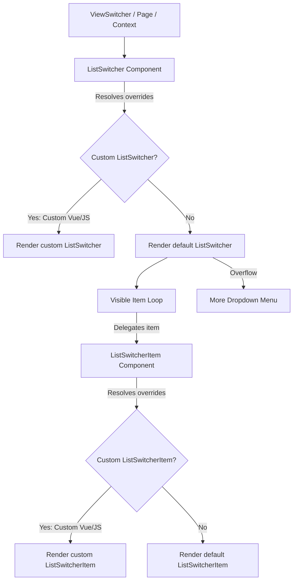

# AQL Frontend List Switcher Architecture

This document defines the architecture, options, and override criteria for the list switching system. It details the container-level (`ListSwitcher`) and item-level (`ListSwitcherItem`) components, their design guidelines, and rules for custom UI modifications.

---

## 1. Core Architecture

The AQL list switching system is modular, dividing the UI into:
1. **Container (`ListSwitcher`)**: The surrounding element containing the list of switchable items and managing the responsive layout (horizontal scroll on mobile vs. dropdown on desktop).
2. **Item (`ListSwitcherItem`)**: Individual clickable segments representing each state or view.

Both components support standard AQL page-level and resource-level overrides, custom template replacement (`.vue`), and custom property modifiers (`.js`).



---

## 2. Override & Customization Scenarios

Developers can customize the list switcher layout at different layers depending on their requirements:

### Scenario A: Overriding only the Container wrapper
To customize only the outer wrapper (e.g. adding custom wrappers, headers, or borders) while keeping the default pill design:
- Create `src/_ui/[UiName]/components/.../ListSwitcher.vue`.
- In your template, delegate the item rendering to `<Section section="ListSwitcherItem" />` rather than hardcoding the button layout:
  ```html
  <template>
    <div class="my-custom-container-wrapper">
      <Section
        v-for="item in visibleItems"
        :key="item.name"
        section="ListSwitcherItem"
        v-bind="buildItemProps(item)"
        @click="handleItemClick(item.name)"
      />
    </div>
  </template>
  ```
  *Benefit*: `Section` automatically resolves to the custom item override if it exists, or cleanly falls back to the default `ListSwitcherItem.vue` without extra code.

### Scenario B: Overriding only the Switcher Item
To change only the visual look of individual switcher buttons (e.g., adding loading states, specific icons, badges) without changing the container bar:
- Create `src/_ui/[UiName]/components/.../ListSwitcherItem.vue` (or `ListSwitcherItem.js`).
- The default `ListSwitcher.vue` uses `useSectionResolver` to dynamically resolve `'ListSwitcherItem'`. It will find your override and render it in place of the base item automatically.

### Scenario C: Customizing both Container and Items inline
To completely replace the layout with a bespoke HTML structure (e.g. vertical sidebar layout, custom grids):
- Create `src/_ui/[UiName]/components/.../ListSwitcher.vue`.
- Write your layout natively (e.g., `<div class="list-view-container"><div class="list-view-item">...</div></div>`), bypassing the item resolver entirely.

### Scenario D: Dynamic Property Modifiers (JS Modifiers)
To customize properties dynamically without overriding the templates:
- Create `ListSwitcher.js` (container properties) or `ListSwitcherItem.js` (item properties).
- Return an object with custom properties or functions (e.g., resolving color based on the current record). These will be merged automatically into `finalProps` by the resolver, which are then passed down as props/attrs into `ListSwitcher.vue`.
- The most common use of `ListSwitcher.js` is to fully replace the `items` array with bespoke views and their own `filter` trees, bypassing sheet-driven `ListViews` config and auto-generated views entirely. See `src/_ui/AQL/components/master/currencies/ListSwitcher.js` for a working example:
  ```javascript
  export default function() {
    return {
      maxVisibleItems: null, // disables the "More" overflow dropdown — all items render inline
      items: [
        {
          name: 'Inactive',
          default: true,
          color: 'positive',
          icon: 'check_circle',
          filter: {
            type: 'group',
            logic: 'AND',
            items: [{ type: 'condition', column: 'Status', operator: 'eq', value: 'Inactive' }]
          }
        },
        // ...additional items with their own name/color/icon/filter
      ]
    }
  }
  ```
  - `maxVisibleItems: null` is a deliberate override: it disables the desktop overflow dropdown (see [Section 3](#3-responsive-behavior-guidelines)) so every item in `items` renders inline regardless of screen size.
  - Each entry in `items` follows the same schema documented in [Section 4.3](#43-list-view-item-object-schema) below.

#### 2.1. Items Resolution Precedence
`ListSwitcher.vue` resolves its effective `items` array (`finalAttrs.value.items`, [ListSwitcher.vue#L97-L101](file:///f:/LITTLE%20LEAP/AQL/FRONTENT/src/components/sections/ListSwitcher.vue#L97-L101)) in this exact order — the first non-null/non-undefined source wins:
1. **Explicit `props.items`** — supplied either by a `ListSwitcher.js` JS modifier (merged into `finalProps` by the section resolver) or by an explicit `items` binding on `<ListSwitcher :items="...">` / `<Section section="ListSwitcher" :items="...">` from a parent template.
2. **Fallback: `resourceRecord.effectiveViews`** — the reactive views array computed by [`useListViews.js`](file:///f:/LITTLE%20LEAP/AQL/FRONTENT/src/composables/useListViews.js#L276-L309), which is itself either the sheet-configured `APP.Resources.ListViews` array or scope-aware auto-generated views (see [Section 5](#5-sheet-integration-appresourceslistviews)).

Because this is a full override (not a merge), a JS modifier that returns an `items` array replaces the sheet/auto-generated views entirely rather than appending to them.

---

## 3. Responsive Behavior Guidelines

The base container is built to handle item overflows responsively:
* **Mobile / Tablet Screen Sizes (`sm` and below)**:
  Items are kept in a single line. The container uses pure CSS horizontal scroll with hidden scrollbars to provide a smooth, app-like touch swipe experience.
* **Desktop Screen Sizes (`gt.sm` and above)**:
  Exceeding items are sliced and placed inside a **"More"** dropdown button using Quasar's `<q-menu>`.
  - **Dynamic states**: If an overflowed item is active, the "More" dropdown button inherits its label, icon, active background gradient, and bottom active dot.

---

## 4. Components Reference Catalog

### 4.1. `ListSwitcher` (Container)
* **Default Component File**: `FRONTENT/src/components/sections/ListSwitcher.vue`
* **Purpose**: Renders the container wrapper and handles responsive dropdown/scroll layouts.

#### Props
| Prop | Type | Default | Description |
| :--- | :--- | :--- | :--- |
| `items` | `Array` | `null` (falls back to effective views) | Array of view objects: `[{ name, label?, icon?, color?, ... }]`. |
| `activeItem` | `String` | `null` (falls back to active view) | The name of the currently active view. |
| `label` | `String \| Function` | `null` | Item label resolver. Functions receive `(item, items, config)`. |
| `icon` | `String \| Function` | `null` | Item icon resolver. Functions receive `(item, items, config)`. |
| `iconSize` | `String` | `""` | Icon font-size (e.g., `18px`, `1.2rem`). |
| `containerClass` | `String \| Function` | `""` | Custom classes applied to the container. |
| `containerStyle` | `Object \| String \| Function` | `""` | Custom inline styles applied to the container. |
| `itemClass` | `String \| Function` | `""` | Additional CSS classes applied to each switcher item. |
| `maxVisibleItems` | `Number` | `null` (defaults to `5` on desktop) | Maximum inline items before putting others in the dropdown. |

#### Emits
- `update:activeItem(itemName: String)`: Triggered when a visible item or dropdown item is clicked.

---

### 4.2. `ListSwitcherItem` (Item)
* **Default Component File**: `FRONTENT/src/components/sections/ListSwitcherItem.vue`
* **Purpose**: Encapsulates the visual segment button, color styling, and hover/active states.

#### Props
| Prop | Type | Default | Description |
| :--- | :--- | :--- | :--- |
| `item` | `Object` | *Required* | The raw view configuration object. |
| `active` | `Boolean` | `false` | True if the item is currently active. |
| `label` | `String \| Function` | `""` | Evaluated display label text. |
| `icon` | `String \| Function` | `""` | Evaluated display icon name. |
| `color` | `String \| Function` | `"primary"` | Color keyword matching CSS state mappings. |

#### Attribute Fallthrough (`v-bind="$attrs"`)
All extra properties on the `item` object (e.g., `disabled`, custom metadata) are spread by the container and bound to the root button tag in `ListSwitcherItem` via `v-bind="$attrs"`.

---

### 4.3. List View Item Object Schema
Every entry inside the resolved `items` array — whether sourced from a `ListSwitcher.js` JS modifier, the `APP.Resources.ListViews` sheet cell, or auto-generated by `useListViews.js` — shares the same object shape:

| Attribute | Type | Required | Description |
| :--- | :--- | :--- | :--- |
| `name` | `String` | Yes | Unique identifier for the view. Used as the `activeItem` match key and passed to `setActiveView(name)`. |
| `label` | `String` | No | Display text. Falls back to `name` if omitted (see `resolvedLabel` in `ListSwitcherItem.vue`). |
| `icon` | `String` | No | Quasar icon name rendered before the label. `null`/omitted hides the icon. |
| `color` | `String` | No | Color keyword (e.g. `positive`, `negative`, `primary`, `warning`, `grey`) mapped to CSS custom properties for active-state styling. Defaults to `'primary'` if omitted. |
| `default` | `Boolean` | No | Marks the view selected on initial load when no URL/query state is present (`defaultViewName` in `useListViews.js`). Only one item should set this `true`; if none do, the first item in the array wins. |
| `filter` | `Object` | No | A filter tree (**Group** or **Condition** object — see [Section 5.1.1](#511-filter-json-schema-reference)) evaluated against each row via `evaluateFilter()` to determine view membership and counts. Omitting it matches all rows. |

**How `ListSwitcher.vue` passes these down to `ListSwitcherItem.vue`:**
- For each visible item, `buildItemProps(item)` ([ListSwitcher.vue#L227-L236](file:///f:/LITTLE%20LEAP/AQL/FRONTENT/src/components/sections/ListSwitcher.vue#L227-L236)) spreads the raw `item` object as attrs, then explicitly sets:
  - `item`: the raw object itself (for `ListSwitcherItem` to read `item.count` or other custom metadata).
  - `active`: `true` when `finalAttrs.value.activeItem === item.name`.
  - `label` / `icon`: resolved via the container's own `label`/`icon` prop-resolver functions first (if `ListSwitcher` was given a `label`/`icon` prop or JS-modifier override), falling back to `item.label`/`item.icon`/`item.name`.
  - `color`: `item.color || 'primary'`.
- `ListSwitcherItem.vue` then re-resolves `label`/`icon`/`color` one more time through its own `evaluateProp` against `resourceRecord`/`resourceConfig` (in case an item-level JS modifier or Vue override further customizes them), falling back to the values passed in from the container.

---

## 5. Sheet Integration (`App.Resources.ListViews`)

The list view items and filtering are derived dynamically from the Google Sheets database configurations.

### 5.1. Sheet Config Relationship
* **Spreadsheet Setup**: Managed under the `ListViews` column of the `APP.Resources` sheet. See the [AQL Menu Admin Guide](file:///f:/LITTLE%20LEAP/AQL/Documents/AQL_MENU_ADMIN_GUIDE.md#L201-L212).
* **JSON Array Structure**: The cell contains a JSON array of item objects:
  ```json
  [
    {
      "name": "Inactive",
      "default": true,
      "color": "positive",
      "icon": "check_circle",
      "filter": {
        "type": "group",
        "logic": "AND",
        "items": [
          { "type": "condition", "column": "Status", "operator": "eq", "value": "Inactive" }
        ]
      }
    }
  ]
  ```

### 5.1.1. Filter JSON Schema Reference
The `filter` property does not support a raw array at its root. It must be either a **Group Object** or a **Condition Object**:

#### A. Group Object (`type: "group"`)
Used to join multiple conditions with logical operators:
- `type`: Must be `"group"`.
- `logic`: Either `"AND"` or `"OR"` (defaults to `"AND"`).
- `items`: An array of filter objects (can recursively contain other groups or conditions).

#### B. Condition Object (`type: "condition"`)
Represents a single query comparison:
- `type`: Must be `"condition"`.
- `column`: String matching the exact Google Sheet header column name.
- `operator`: String operator mapping to comparison logic.
- `value`: The target comparison value. Can be a string, number, array (for `in`/`not_in`), or a dynamic token like `"$now"` (evaluated as `Date.now()`).

#### C. Supported Comparison Operators
The frontend evaluator supports the following operator keys:
- `eq`: Equal to (case-insensitive string comparison or numeric comparison).
- `neq`: Not equal to.
- `in`: Checks if the column value is inside a list of values (e.g. `"value": ["Active", "Draft"]`).
- `not_in`: Checks if the column value is NOT inside a list of values.
- `gt`: Greater than (coerces column and value to numbers).
- `gte`: Greater than or equal to.
- `lt`: Less than.
- `lte`: Less than or equal to.
- `contains`: Checks if the column value contains the search string (substring match).

For source code implementation, see `evaluateFilter` in [useListViews.js](file:///f:/LITTLE%20LEAP/AQL/FRONTENT/src/composables/useListViews.js#L86-L99).


### 5.2. Conditional Overriding Criteria
The views switcher respects sheet-driven constraints explicitly inside the base views switcher. Whether custom JS modifiers (`ListSwitcher.js` / `ViewSwitcher.js`) or Vue overrides (`ListSwitcher.vue` / `ViewSwitcher.vue`) are applied depends on the exact value of the `ListViews` cell:

1. **Empty String (Blank Cell)**: 
   - **Behavior**: Custom UI JS modifiers and Vue overrides are **ALLOWED**. 
   - **Details**: The resource defaults to the standard Active/Inactive fallback tab views, and the section resolver is permitted to merge JS modifier props and resolve custom templates.
2. **`[]` (Explicit Switch-Off Array)**: 
   - **Behavior**: Custom UI JS modifiers and Vue overrides are **DISABLED / IGNORED**. 
   - **Details**: The resource has explicitly turned off list views. The views switcher is completely hidden/ignored.
3. **JSON Array with Values (Custom Views, e.g. `[{"name": "Paid"}, ...])`**: 
   - **Behavior**: Custom UI JS modifiers and Vue overrides are **DISABLED / IGNORED**. 
   - **Details**: The list views are fully configured via sheet filters. Custom UI templates and JS modifiers are bypassed to enforce standard sheet-driven tabs.

This conditional bypass logic is implemented inside [ViewSwitcher.vue](file:///f:/LITTLE%20LEAP/AQL/FRONTENT/src/components/sections/ViewSwitcher.vue) by evaluating the `isOverrideAllowed` computed property.

