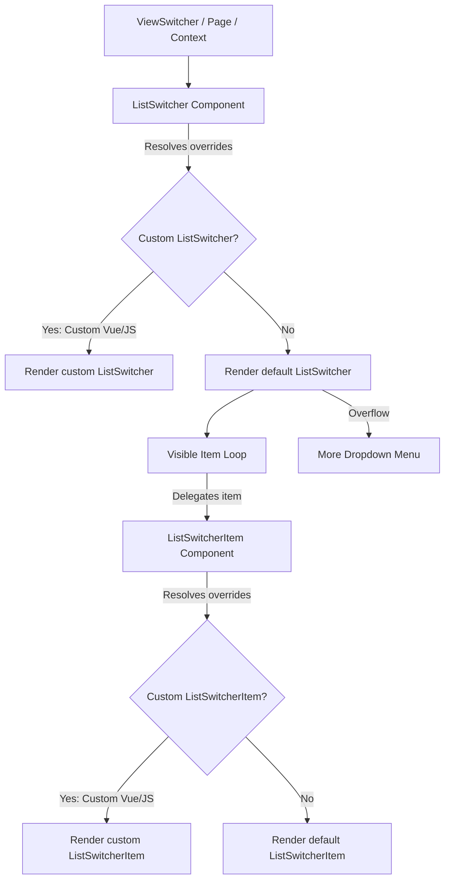

# AQL Frontend List Switcher Architecture

This document defines the architecture, options, and override criteria for the list switching system. It details the container-level (`ListSwitcher`) and item-level (`ListSwitcherItem`) components, their design guidelines, and rules for custom UI modifications.

---

## 1. Core Architecture

The AQL list switching system is modular, dividing the UI into:
1. **Container (`ListSwitcher`)**: The surrounding element containing the list of switchable items and managing the responsive layout (horizontal scroll on mobile vs. dropdown on desktop).
2. **Item (`ListSwitcherItem`)**: Individual clickable segments representing each state or view.

Both components support standard AQL page-level and resource-level overrides, custom template replacement (`.vue`), and custom property modifiers (`.js`).



---

## 2. Override & Customization Scenarios

Developers can customize the list switcher layout at different layers depending on their requirements:

### Scenario A: Overriding only the Container wrapper
To customize only the outer wrapper (e.g. adding custom wrappers, headers, or borders) while keeping the default pill design:
- Create `src/_ui/[UiName]/components/.../ListSwitcher.vue`.
- In your template, delegate the item rendering to `<Section section="ListSwitcherItem" />` rather than hardcoding the button layout:
  ```html
  <template>
    <div class="my-custom-container-wrapper">
      <Section
        v-for="item in visibleItems"
        :key="item.name"
        section="ListSwitcherItem"
        v-bind="buildItemProps(item)"
        @click="handleItemClick(item.name)"
      />
    </div>
  </template>
  ```
  *Benefit*: `Section` automatically resolves to the custom item override if it exists, or cleanly falls back to the default `ListSwitcherItem.vue` without extra code.

### Scenario B: Overriding only the Switcher Item
To change only the visual look of individual switcher buttons (e.g., adding loading states, specific icons, badges) without changing the container bar:
- Create `src/_ui/[UiName]/components/.../ListSwitcherItem.vue` (or `ListSwitcherItem.js`).
- The default `ListSwitcher.vue` uses `useSectionResolver` to dynamically resolve `'ListSwitcherItem'`. It will find your override and render it in place of the base item automatically.

### Scenario C: Customizing both Container and Items inline
To completely replace the layout with a bespoke HTML structure (e.g. vertical sidebar layout, custom grids):
- Create `src/_ui/[UiName]/components/.../ListSwitcher.vue`.
- Write your layout natively (e.g., `<div class="list-view-container"><div class="list-view-item">...</div></div>`), bypassing the item resolver entirely.

### Scenario D: Dynamic Property Modifiers (JS Modifiers)
To customize properties dynamically without overriding the templates:
- Create `ListSwitcher.js` (container properties) or `ListSwitcherItem.js` (item properties).
- Return an object with custom properties or functions (e.g., resolving color based on the current record). These will be merged automatically into `finalProps` by the resolver.

---

## 3. Responsive Behavior Guidelines

The base container is built to handle item overflows responsively:
* **Mobile / Tablet Screen Sizes (`sm` and below)**:
  Items are kept in a single line. The container uses pure CSS horizontal scroll with hidden scrollbars to provide a smooth, app-like touch swipe experience.
* **Desktop Screen Sizes (`gt.sm` and above)**:
  Exceeding items are sliced and placed inside a **"More"** dropdown button using Quasar's `<q-menu>`.
  - **Dynamic states**: If an overflowed item is active, the "More" dropdown button inherits its label, icon, active background gradient, and bottom active dot.

---

## 4. Components Reference Catalog

### 4.1. `ListSwitcher` (Container)
* **Default Component File**: `FRONTENT/src/components/sections/ListSwitcher.vue`
* **Purpose**: Renders the container wrapper and handles responsive dropdown/scroll layouts.

#### Props
| Prop | Type | Default | Description |
| :--- | :--- | :--- | :--- |
| `items` | `Array` | `null` (falls back to effective views) | Array of view objects: `[{ name, label?, icon?, color?, ... }]`. |
| `activeItem` | `String` | `null` (falls back to active view) | The name of the currently active view. |
| `label` | `String \| Function` | `null` | Item label resolver. Functions receive `(item, items, config)`. |
| `icon` | `String \| Function` | `null` | Item icon resolver. Functions receive `(item, items, config)`. |
| `iconSize` | `String` | `""` | Icon font-size (e.g., `18px`, `1.2rem`). |
| `containerClass` | `String \| Function` | `""` | Custom classes applied to the container. |
| `containerStyle` | `Object \| String \| Function` | `""` | Custom inline styles applied to the container. |
| `itemClass` | `String \| Function` | `""` | Additional CSS classes applied to each switcher item. |
| `maxVisibleItems` | `Number` | `null` (defaults to `5` on desktop) | Maximum inline items before putting others in the dropdown. |

#### Emits
- `update:activeItem(itemName: String)`: Triggered when a visible item or dropdown item is clicked.

---

### 4.2. `ListSwitcherItem` (Item)
* **Default Component File**: `FRONTENT/src/components/sections/ListSwitcherItem.vue`
* **Purpose**: Encapsulates the visual segment button, color styling, and hover/active states.

#### Props
| Prop | Type | Default | Description |
| :--- | :--- | :--- | :--- |
| `item` | `Object` | *Required* | The raw view configuration object. |
| `active` | `Boolean` | `false` | True if the item is currently active. |
| `label` | `String \| Function` | `""` | Evaluated display label text. |
| `icon` | `String \| Function` | `""` | Evaluated display icon name. |
| `color` | `String \| Function` | `"primary"` | Color keyword matching CSS state mappings. |

#### Attribute Fallthrough (`v-bind="$attrs"`)
All extra properties on the `item` object (e.g., `disabled`, custom metadata) are spread by the container and bound to the root button tag in `ListSwitcherItem` via `v-bind="$attrs"`.

---

## 5. Sheet Integration (`App.Resources.ListViews`)

The list view items and filtering are derived dynamically from the Google Sheets database configurations.

### 5.1. Sheet Config Relationship
* **Spreadsheet setup**: Managed under the `ListViews` column of the `APP.Resources` sheet.
* **JSON Schema**: Each non-empty cell contains a JSON array defining the states, icons, colors, and operators:
  ```json
  [
    { "name": "Active", "color": "primary", "icon": "check" },
    { "name": "Inactive", "color": "grey", "icon": "block", "filter": { "column": "Status", "operator": "eq", "value": "Inactive" } }
  ]
  ```
* **For detailed schema parameters & operators**, read the canonical [Resource Columns Guide](file:///f:/LITTLE%20LEAP/AQL/Documents/RESOURCE_COLUMNS_GUIDE.md).
* **For admin UI tools & spreadsheet configurations**, read the canonical [AQL Menu Admin Guide](file:///f:/LITTLE%20LEAP/AQL/Documents/AQL_MENU_ADMIN_GUIDE.md#L201-L212).

### 5.2. Conditional Overriding Criteria
The views switcher respects sheet-driven constraints explicitly inside the base views switcher. Whether custom JS modifiers (`ListSwitcher.js` / `ViewSwitcher.js`) or Vue overrides (`ListSwitcher.vue` / `ViewSwitcher.vue`) are applied depends on the exact value of the `ListViews` cell:

1. **Empty String (Blank Cell)**: 
   - **Behavior**: Custom UI JS modifiers and Vue overrides are **ALLOWED**. 
   - **Details**: The resource defaults to the standard Active/Inactive fallback tab views, and the section resolver is permitted to merge JS modifier props and resolve custom templates.
2. **`[]` (Explicit Switch-Off Array)**: 
   - **Behavior**: Custom UI JS modifiers and Vue overrides are **DISABLED / IGNORED**. 
   - **Details**: The resource has explicitly turned off list views. The views switcher is completely hidden/ignored.
3. **JSON Array with Values (Custom Views, e.g. `[{"name": "Paid"}, ...])`**: 
   - **Behavior**: Custom UI JS modifiers and Vue overrides are **DISABLED / IGNORED**. 
   - **Details**: The list views are fully configured via sheet filters. Custom UI templates and JS modifiers are bypassed to enforce standard sheet-driven tabs.

This conditional bypass logic is implemented inside [ViewSwitcher.vue](file:///f:/LITTLE%20LEAP/AQL/FRONTENT/src/components/_common/sections/ViewSwitcher.vue) by evaluating the `isOverrideAllowed` computed property.
