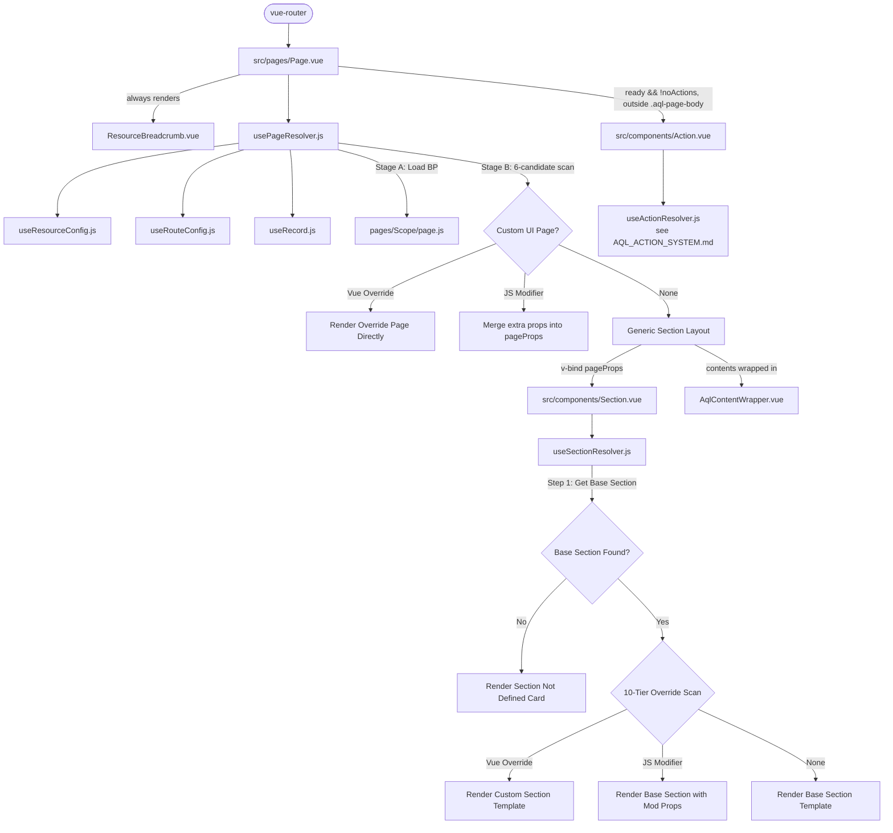

# AQL Page and Section System Guide

This is the canonical reference document for developers and AI agents on AQL's dynamic page orchestration and layout section customization.

> [!IMPORTANT]
> **Subsystem boundary.** AQL has three placeholder paradigms, each with its own resolver,
> base folder, and identity prop — but one shared 10-tier `_ui/` override model:
>
> | Paradigm | Placeholder | Resolver | Base folder | Canonical doc |
> |----------|-------------|----------|-------------|---------------|
> | Section | `Section.vue` (`AqlSection`) | `useSectionResolver.js` | `components/sections/` | **this document** |
> | Content | `Content.vue` (`AqlContent`) | `useContentResolver.js` | `components/contents/` | [AQL_CONTENT_CUSTOMIZATION_SYSTEM.md](file:///f:/LITTLE%20LEAP/AQL/Documents/AQL_CONTENT_CUSTOMIZATION_SYSTEM.md) |
> | Action | `Action.vue` (`AqlAction`) | `useActionResolver.js` | `components/actions/` | [AQL_ACTION_SYSTEM.md](file:///f:/LITTLE%20LEAP/AQL/Documents/AQL_ACTION_SYSTEM.md) |
>
> **`PageAction` is no longer a Section.** It is mounted by `Page.vue` as
> `<Action action="PageAction" />` through the Action subsystem. Everything about the
> sticky form bar, the CRUD FABs, the individual form buttons, and their override paths
> lives in `AQL_ACTION_SYSTEM.md` — not here.

---

## 1. Architectural Overview

AQL's frontend architecture is built on a dynamic, tiered, and metadata-driven resolution model. Instead of hardcoding layout views, pages are dynamically assembled at runtime based on the requested resource and active route.



### 1.1 The Orchestrator Page (`src/pages/Page.vue`)
`Page.vue` acts as the single top-level entry point for all resource CRUD operations and custom actions. It does not contain static HTML elements except for `<ResourceBreadcrumb />`, which is **always rendered unconditionally** — outside the section system — regardless of whether a custom page override or generic sections are used. It resolves layout states dynamically:
1. **Full Page Custom Override (`resolvedPageComponent`)**: If a custom Vue component matches the current resource page under `src/_ui/`, it renders it directly, short-circuiting the generic layout.
2. **Generic Section Layout**: If no custom page component is found, it renders placeholding `<Section>` components sequentially:
   - Sections in `visibleSectionsBeforeAction` (such as `Header`, `Toolbar`).
   - Content wrapper (`<AqlContentWrapper>`) wrapping the `contents` sections (e.g. list, details, or forms).
   - Bottom page actions via `<Action action="PageAction" />` — the **Action subsystem**, not a Section. Mounted on every resource page outside `.aql-page-body`, gated only by `pageProps.noActions !== true` (see the callout in §1.1). Full spec: [AQL_ACTION_SYSTEM.md](file:///f:/LITTLE%20LEAP/AQL/Documents/AQL_ACTION_SYSTEM.md).
3. **Context Provider**:
   - Provides `'resourceConfig'` (metadata configuration).
   - Provides `'resourceRecord'` (active record reference and loading state).
   - Provides `'pageState'` (centralized page-level reactive form state).

#### `AqlContentWrapper` States
`<AqlContentWrapper>` is the gate component wrapping all `contents` sections. It handles four states and must never be bypassed:

| State | Condition | What Renders |
|-------|-----------|--------------|
| Blocking spinner | `loading && !hasData` | Centered `q-spinner-dots` |
| Non-blocking progress bar | `loading && hasData` | Thin bar at top (background sync) |
| Record not found | `requiresRecord && !recordExists` | Card with "Record not found" and Back to List |
| Empty dataset | `empty` | Card with configurable icon/title/message |
| Normal | none of the above | `<slot />` (the sections render) |

Independently of those five states, `AqlContentWrapper` also renders a **submission overlay**: a `<q-inner-loading>` + `q-spinner-dots` covering the whole content area whenever `pageState.meta.submitting`/`.saving` is true. It injects `pageState` directly, so no page wiring is needed; the `submitting` prop (default `false`) is an opt-in force flag and `submittingLabel` (default `'Saving…'`) sets the caption. This is the **single** blocking indicator during a dispatch — form action buttons are disabled rather than spinner-loaded. See [AQL_ACTION_SYSTEM.md §5](file:///f:/LITTLE%20LEAP/AQL/Documents/AQL_ACTION_SYSTEM.md).

The `contentWrapperProps` computed in `usePageResolver.js` automatically derives these values per page type:

| `page` value | Key Props Set |
|--------------|---------------|
| `'index'` | `loading`, `empty`, `hasData` |
| `'view'` | `loading`, `requiresRecord`, `recordExists` |
| `'add'` | `loading: false`, `empty: false` |
| `'edit'` | `loading`, `requiresRecord`, `recordExists` |
| `'action'` | `loading`, `requiresRecord`, `recordExists`, custom `emptyIcon/Title/Message` |

#### Centralized Entrance Transition
`Page.vue` wraps its three top-level states (loading spinner, resolved `.aql-page-body` section/content layout, and `PageFallback`) in a single Vue `<Transition name="aql-page-fade" mode="out-in" appear>`. This cross-fades the loading spinner into the resolved layout as soon as `ready` flips true — no per-section edits are needed. The resolved layout lives inside one `.aql-page-body` wrapper whose **direct children** (each pre-action `<Section>` such as `Header`/`Toolbar`, and the `<AqlContentWrapper>`) receive a subtle staggered micro-slide reveal (`aql-section-rise`). All timing/animation lives in `src/css/transitions.scss` (`.aql-page-fade-*`, `.aql-page-body`) and honours `prefers-reduced-motion`.

> [!IMPORTANT]
> **The `PageAction` `<Action>` placeholder (floating FAB / sticky action bar) is rendered as a sibling of the `<Transition>`, *outside* `.aql-page-body`, gated by `ready && pageProps.noActions !== true`.** This is deliberate: `aql-section-rise` applies a CSS `transform` to body children, and a transformed ancestor becomes the containing block for `position: fixed` descendants — which would trap the `q-page-sticky` FAB at the end of the content flow instead of floating it at the viewport boundary. There is no CSS escape hatch for a fixed element inside a transformed subtree, so the FAB must live outside the animated wrapper. It correctly anchors to the viewport (only opacity-animated `.aql-page-container` sits above it) and is intentionally excluded from the entrance animation (a fixed FAB should not slide in). The full-page override branch (`resolvedPageComponent`), `ResourceBreadcrumb`, and `ActionDialog` are likewise kept **outside** the transition so overrides and workflow dialogs are never wrapped.

### 1.2 The Section Placeholder (`src/components/Section.vue`)
`Section.vue` is a single generic placeholder component that represents a logical area of the screen (e.g. `Header`, `Toolbar`, `Content`, `Action`).
* It accepts a `section` string prop and captures additional attributes via `useAttrs()`.
* It calls `useSectionResolver(preparedProps)` and handles three states:
  1. **Loading (`!ready`)**: Displays a Quasar `q-spinner-dots`.
  2. **Resolved (`resolvedComponent`)**: Mounts the matched component via `<component :is="resolvedComponent" v-bind="finalProps" />`.
  3. **Undefined (`!resolvedComponent`)**: Displays a warning card informing the developer that the requested section has no fallback or override.

### 1.3 The Page Resolver (`src/composables/resources/usePageResolver.js`)
Handles page-level route resolution and loading, and owns record loading (see §1.3.3). Form state and submission are **not** its concern — those belong to `usePageState` (see [PAGE_STATE.md](file:///f:/LITTLE%20LEAP/AQL/Documents/PAGE_STATE.md)), which `Page.vue` provides alongside it.

#### 1.3.1 Stage A — Base Page Contract (BP)
Loads `src/pages/[Scope]/[page].js`. This JS file sets the default sections and contents layout for the page.

**Special page key mapping** (route `meta.page` → BP filename):

| `meta.page` value | BP file loaded |
|-------------------|----------------|
| `'resource-page'` | `resource.js` |
| `'record-page'` | `record.js` |
| anything else | `[page].js` as-is |

**BP export shape**: The BP can export either a plain object or a function. If it's a function, it receives the full `rcProps` (same shape as `pageProps` below) and must return an object of extra props to merge in:

```javascript
// Plain object (most common):
export default {
  sections: ['Header', 'Toolbar', 'Content', 'Action'],
  contents: []  // optional — sections rendered inside <AqlContentWrapper>
}

// Function form (dynamic, receives rcProps):
export default (rcProps) => ({
  sections: ['Header', rcProps.page === 'index' ? 'Toolbar' : 'Content', 'Action']
})
```

**`sections` vs `contents`**: `sections` drives the full rendering sequence. `visibleSectionsBeforeAction` is everything in `sections` except `'PageAction'`. The `contents` array (if provided) defines content names rendered *inside* `<AqlContentWrapper>`. If `contents` is empty or absent, the wrapper is skipped.

**`PageAction` and `sections`**: the Action subsystem is fully decoupled from the `sections` array. `Page.vue` mounts `<Action action="PageAction" />` on every resource page, gated only by `pageProps.noActions !== true`, so base contracts do **not** need to declare `'PageAction'`. `usePageResolver` still filters the name out of `visibleSectionsBeforeAction` so a contract that does list it (legacy or otherwise) never double-renders.

**Existing base contracts**:

| Scope | File | `sections` |
|-------|------|------------|
| `Master` | `index.js` | `['Header']` |
| `Master` | `record.js` / `view.js` / `add.js` / `edit.js` / `action.js` / `resource.js` | `['Header', 'Toolbar', 'Content', 'Action']` |
| `Operation` | `index.js` | `['Header', 'Toolbar']` |

#### 1.3.2 Stage B — Custom Page Override Scan (6 Candidates)
After loading the BP, `usePageResolver` scans `src/_ui/[UiName]/pages/` for custom overrides in this order (first match wins):

| Priority | Path | Type |
|----------|------|------|
| 1 (CC) | `_ui/{uiName}/pages/{scope}/{slug}/{page}.vue` | Full Vue override |
| 2 (CP) | `_ui/{uiName}/pages/{scope}/{slug}/{page}.js` | JS modifier |
| 3 (O2) | `_ui/{uiName}/pages/{scope}/{page}.vue` | Scope-wide Vue override |
| 4 (O3) | `_ui/{uiName}/pages/{scope}/{page}.js` | Scope-wide JS modifier |
| 5 (O4) | `_ui/{uiName}/pages/{page}.vue` | UI-wide Vue override |
| 6 (O5) | `_ui/{uiName}/pages/{page}.js` | UI-wide JS modifier |

- `{slug}` is normalized as **`toPascalCase(slug).toLowerCase()`** — the single rule every other resolver (`useContentResolver`, `useSectionResolver`, `useActionResolver`, `useViewColumnResolver`, `FormRecord.vue`, `ViewRecord.vue`) applies. A resource slug of `outlet-visits` becomes the key `outletvisits`, which matches a PascalCase folder `_ui/{uiName}/pages/{scope}/OutletVisits/` because the Vite glob registry lowercases every path at build time. **`_ui/` override folders must be named in PascalCase** — a raw hyphenated folder (`outlet-visits/`) will NOT resolve.
- A **Vue override** (`isVue: true`) replaces the entire page; the section layout is bypassed.
- A **JS modifier** (`isVue: false`) receives the merged `baseProps` and returns additional props to merge. The section layout still runs with the modified `pageProps`.

#### 1.3.3 Record Loading
`usePageResolver` calls `useRecord()` once and exposes it as `resourceRecord` (which `Page.vue` then `provide`s). A single watch, keyed on the primitive `resourceName|code|canonicalPage`, drives the reload strategy per page:

| Page | What loads |
|------|------------|
| `index` | `reload()` — the resource list |
| `view` | `reload()`, then `loadRelations()` for parents/children |
| `edit` (with a `code`) | `reload()` |
| `add` | nothing — no server read is needed |
| custom sub-route slug | nothing — the override page fetches what it needs itself |

The watch key is a template string, never an array literal: `watch` compares a getter's result with `Object.is`, so a fresh array would re-fire on every re-evaluation and re-request on each background sync.

##### The Enriched Record (and why you must never spread one)

Neither `resourceRecord.record` nor `resourceRecord.records` hands out raw sheet rows. Both run every row through `enrichRecord(resourceName, code, dataStore)` (`useRecord.js`), which returns a **cached, reactive object built entirely out of `Object.defineProperty` getters** — there are no own data properties on it at all:

| Key shape | Example | `enumerable` | Resolves to |
|-----------|---------|--------------|-------------|
| Sheet header | `Code`, `OutletCode`, `Progress` | `true` | Live value from the data store |
| `$<parentSingular>` | `$outlet`, `$warehouse` | **`false`** | The enriched parent record |
| `$<ChildResource>` | `$OutletVisitItems` | **`false`** | Array of enriched child records |
| `_Parents` / `_Parent` | — | **`false`** | Relation key list / keyed map |
| `_Children` / `_Child` | — | **`false`** | Relation key list / keyed map |
| `_relation` | — | **`false`** | Raw relation metadata |

> [!IMPORTANT]
> **Preserve the record reference. Never `{ ...record }`.**
>
> Object spread, `Object.assign({}, record)`, and `JSON.parse(JSON.stringify(record))` copy **enumerable own properties only**. Every relation getter in the table above is non-enumerable, so a spread silently produces an object with the header fields and **no `$outlet`, no `$parent`, no `$children`, no `_Parents`** — and `item.$outlet?.Name` quietly degrades to `undefined` with no error to trace. The spread also *snapshots* the header getters into plain values, so the copy stops tracking store updates and goes stale after a background sync.
>
> When a content or section component filters, sorts, or attaches a derived property, it must operate on the original references:
>
> ```javascript
> // ✗ Strips every relation getter and freezes the values
> out.push({ ...row, overdueDays: days })
>
> // ✓ Keeps the enriched reference intact
> row.overdueDays = days
> out.push(row)
> ```
>
> Filtering and sorting are safe as-is — `Array.prototype.filter`/`sort` carry references through. Only *copying* breaks the contract. Note that a derived property assigned this way lands on the shared cached record, so keep such keys namespaced to the feature and treat them as display-only.

> [!NOTE]
> This was previously split into a `usePageOrchestrator.js` middle layer, which also carried an action-page form (`actionForm`, `selectedOutcome`, `resolvedActionFields`, …). That path became unreachable once `canonicalPage` started resolving the `_action/:action` route to its **slug** rather than to `'action'`, and workflow actions moved to `ActionDialog` (see [AQL_ACTION_SYSTEM.md](file:///f:/LITTLE%20LEAP/AQL/Documents/AQL_ACTION_SYSTEM.md)). The orchestrator has been removed; nothing replaced the action-form half because `ActionDialog` already owns it.

#### 1.3.4 The `pageProps` Contract
`pageProps` is the computed object assembled by `usePageResolver` and `v-bind`-ed onto every `<Section>` placeholder and any full page override. **Section authors must understand every prop in this object.**

| Prop | Type | Description |
|------|------|-------------|
| `page` | `String` | Canonical page name: `'index'`, `'view'`, `'add'`, `'edit'`, `'action'`, or custom action slug |
| `scope` | `String` | Route scope: `'master'`, `'operation'`, `'accounts'`, etc. |
| `resource` | `String` | Resource slug from route (e.g. `'currencies'`, `'purchase-orders'`) |
| `uiName` | `String` | Resolved `customUIName` from `APP.Resources` (defaults to `'AQL'`) |
| `gutter` | `String` | Quasar spacing token for the page's vertical gutter (default `'xs'`) |
| `pageClass` | `String` | Extra classes on the `q-page` root |
| `contentPadding` | `String` | Quasar padding token applied to `<AqlContentWrapper>` (default `'sm'`) |
| `contentClass` | `String` | Extra classes on `<AqlContentWrapper>` |
| `loading` | `Boolean` | Whether the resource record/list is loading (unwrapped — passing the ref itself trips Boolean prop validation downstream) |

> [!IMPORTANT]
> **`pageProps` carries no form state.** Form values, validation, saving/submitting flags and every save/submit handler live in `usePageState`, injected as `'pageState'` by the sections and content components that need them. Sections must not expect `parentForm`, `childGroups`, `onSave`, `onSubmit`, or the action-form keys here — they were removed with `usePageOrchestrator`.

> [!NOTE]
> **BP props are merged last.** The BP's exported object (or function return) is merged on top of the base `rcProps` above. This means a BP can add additional props (e.g. `sections`, `contents`, custom config keys) that sections can then access via `attrs`.

### 1.4 The Section Resolver (`src/composables/resources/useSectionResolver.js`)
Resolves section-level components and options using a two-step lookup.

#### Registry Architecture
The resolver maintains **two Vite glob registries** built once at module load (before any component mounts):

| Registry | Source Glob | Key Format |
|----------|-------------|------------|
| `frameworkRegistry` | `../../components/**/*.{vue,js}` | `components/...` (lowercased) |
| `customUiRegistry` | `../../_ui/**/*.{vue,js}` | `_ui/...` (lowercased) |

Both registries lowercase all path keys on build. Lookup paths are also constructed in lowercase. **This means section file names are case-insensitive on any OS.** `Header.vue`, `header.vue`, and `HEADER.vue` all resolve to the same registry key.

#### Contexts Injected Internally
`useSectionResolver` **itself injects all three page contexts** (`resourceConfig`, `resourceRecord`, `pageState`) internally — so it can pass them to JS modifier functions. Sections that don't need these contexts in their template do not have to inject them again, though they should inject them for their own use when needed.

#### Step 1 — Base Section Resolution
Lookup order (first match wins):
1. `_ui/{uiName}/components/sections/{section}.vue` — client-specific generic base.
2. `components/sections/{section}.vue` — framework default base.

If neither exists, `Section.vue` renders the "Section Not Defined" card.

#### Step 2 — 10-Tier Override Scan (see §3)

### 1.5 The Page State (`src/composables/resources/usePageState.js`)
Centralizes the reactive form state shared across the Header, Content, and Action sections. It is the single source of truth for input collection, request building, and submission on a resource page.

> For the complete API reference (node mutations, strategy contract, request builders, triggers, and validation), see the canonical document: [PAGE_STATE.md](file:///f:/LITTLE%20LEAP/AQL/Documents/PAGE_STATE.md).

**Key points for section authors:**
- `inject('pageState')` gives access to the full `usePageState` return value.
- Use `pageState.useNode(resourceName)` to get a per-section reactive `{ node, options, validation }` accessor.
- Call `pageState.submit()` from Action sections to validate, build, send, and notify.
- Standalone request builders (`compositeSaveRequest`, `resourceBulkRequest`, etc.) and response helpers (`responseFailed`, `failureMessage`, `batchResultCode`) are exported directly from `usePageState.js` and can be imported independently.

---

## 2. Developing Section Components

When creating a new Section component (e.g., adding `src/components/sections/Toolbar.vue`), follow this strict recipe:

### 2.1 Component Signature Checklist
1. **Disable Attribute Fallthrough**: Add `inheritAttrs: false` to options. This is essential to prevent parent properties from colliding with computed final values on the root element.
   ```javascript
   defineOptions({ name: 'Sections[SectionName]', inheritAttrs: false })
   ```
2. **Inject Contexts**: Ingest the provided contexts so that the section stays reactive to page states:
   ```javascript
   const resourceConfig = inject('resourceConfig', null)
   const resourceRecord = inject('resourceRecord', null)
   const pageState      = inject('pageState', null)
   ```
3. **Expose Custom Props Supporting Closures**: Props must accept `Function` as a valid type in addition to raw types:
   ```javascript
   const props = defineProps({
     label: { type: [String, Function], default: '' },
     visible: { type: [Boolean, Function], default: true }
   })
   ```
4. **Evaluate Props via `evaluateProp`**: Map all attributes to a computed `finalAttrs` object using `evaluateProp` before binding them to the inner presenter element:
   ```javascript
   import { evaluateProp } from 'src/composables/resources/useSectionResolver'

   const finalAttrs = computed(() => ({
     ...attrs, // pass through un-declared parent attributes
     label: evaluateProp(props.label, resourceRecord, resourceConfig),
     visible: evaluateProp(props.visible, resourceRecord, resourceConfig) ?? true
   }))
   ```

   > [!IMPORTANT]
   > **`evaluateProp` unwraps refs before calling closures.** When a prop value is a function, `evaluateProp` calls it with `(resourceRecord?.record?.value, resourceConfig?.config?.value)` — plain unwrapped objects, not Vue refs. Write closures accordingly:
   > ```javascript
   > // In a JS modifier or BP — closure receives plain objects:
   > title: (record, config) => `Product: ${record?.Name ?? config?.name}`
   > ```
   > Do **not** attempt to call `.value` inside the closure.

5. **Standard Actions / Emits**: Route actions back using appropriate helpers (e.g., using `useResourceNav` instead of raw `router.push`).

### 2.2 Base Section Component Boilerplate (Modelled after Header.vue)
Use this standard code template as the starting point for any new base section component under `src/components/sections/`:

```html
<template>
  <!-- Render the visual/presenter component binding the finalAttrs -->
  <PresenterComponent v-bind="finalAttrs" @click="handleAction" />
</template>

<script setup>
import { computed, inject, useAttrs } from 'vue'
import { evaluateProp } from 'src/composables/resources/useSectionResolver'
import PresenterComponent from 'components/app/PresenterComponent.vue'

// 1. Disable Attribute Fallthrough to prevent parent properties from overwriting local values
defineOptions({ name: 'Sections[SectionName]', inheritAttrs: false })

// 2. Define props supporting both static types and dynamic closure functions
const props = defineProps({
  label: { type: [String, Function], default: undefined },
  back: { type: [Boolean, String, Function], default: undefined }
})

const attrs = useAttrs()

// 3. Inject provided page contexts (reactivity sources of truth)
const resourceConfig = inject('resourceConfig', null)
const resourceRecord = inject('resourceRecord', null)
const pageState      = inject('pageState', null)

// 4. Compute local fallbacks if props are undefined
const derivedLabel = computed(() => {
  return resourceConfig?.config?.value?.name || 'Default Label'
})

// 5. Build finalAttrs evaluating any closures via evaluateProp
const finalAttrs = computed(() => ({
  ...attrs, // pass through un-declared parent attributes
  label: evaluateProp(props.label, resourceRecord, resourceConfig) ?? derivedLabel.value,
  back: props.back ?? true
}))

// 6. Handle local actions and custom callback functions
function handleAction() {
  const backProp = props.back ?? attrs.back
  if (typeof backProp === 'function') {
    return backProp()
  }
  // Fallback to default page/routing navigations
}
</script>
```

### 2.3 Documenting Your Section Component
Once a new Section component is created, you **MUST** update this file to document its parameters and behavior. Provide:
* The props catalog, including data types and default values.
* The arguments passed to closure-based props (by default, `evaluateProp` provides `(record, config)`).
* Example overrides (both JS logic modifiers and Vue overrides).

#### Current Sections Catalog
* **[Header.vue](file:///f:/LITTLE%20LEAP/AQL/FRONTENT/src/components/sections/Header.vue)**: Renders the top branding panel, back arrows, status chips, and reload buttons.
  * *Props*: `title`, `subtitle`, `chip`, `chipColor`, `chipTextColor`, `back`, `reload`, `backIcon`, `reloadIcon`, `leftIconColor`, `icon`, `iconColor`.
  * *Defaults*: Derived automatically from routing metadata and `resourceConfig.ui.menus`.
* **[FilterInput.vue](file:///f:/LITTLE%20LEAP/AQL/FRONTENT/src/components/sections/FilterInput.vue)**: Renders a text input for filtering or searching record datasets, supporting debounce and custom icons.
  * *Props*: `outlined`, `debounce`, `placeholder`, `icon`, `iconColor`, `clearable`, `clearIcon`, `label`.
  * *Defaults*: Binds dynamically to `filterTerm` or `searchTerm` inside `resourceRecord` (falls back to local state). Default icon is `'filter_list'`.
* **[ListSwitcher.vue](file:///f:/LITTLE%20LEAP/AQL/FRONTENT/src/components/sections/ListSwitcher.vue)**: Renders a premium pill/segment-style switcher bar for switching between named list views or states.
  * For full catalog specification, customization scenarios, dynamic modifiers, and responsive overflow logic, refer to the canonical [AQL Frontend List Switcher Guide](file:///f:/LITTLE%20LEAP/AQL/Documents/AQL_FRONTEND_LIST_SWITCHER.md).
* **[MetricCards.vue](file:///f:/LITTLE%20LEAP/AQL/FRONTENT/src/components/sections/MetricCards.vue)**: Renders a horizontal row of dashboard stat counters — "12 overdue visits", "8 due today", and similar key operational metrics. See §2.4 below.
* **[LinearProgress.vue](file:///f:/LITTLE%20LEAP/AQL/FRONTENT/src/components/sections/LinearProgress.vue)**: Renders graphical linear progress bars for completion tracking — "14 / 25 completed visits (56%)". See §2.5 below.

### 2.4 `MetricCards` — Dashboard Stat Counters

```html
<Section section="MetricCards" :items="[...]" />
```

**Props catalog** — every prop accepts `Function`, evaluated through `evaluateProp`, so closures receive plain `(record, config)` objects (never refs).

| Prop | Type | Default | Purpose |
|---|---|---|---|
| `title` | `[String, Function]` | `''` | Divider label above the row, rendered via `shared/SectionDividerLabel.vue`. Omitted when empty. |
| `items` | `[Array, Function]` | `null` | Metric array: `{ label, number, unit, color }`. **Each field may itself be a closure** and is evaluated with the same `(record, config)` signature. |
| `label` | `[String, Function]` | `''` | Single-metric fallback (see below). |
| `number` | `[Number, String, Function]` | `null` | Single-metric fallback. |
| `unit` | `[String, Function]` | `''` | Single-metric fallback. |
| `color` | `[String, Function]` | `'primary'` | Single-metric fallback. |

**Normalization & the strict hide rule.** The component computes one internal `metrics` array:
1. If `items` resolves to a non-empty array, each entry is normalized and entries carrying **neither** a `number` nor a `label` are dropped.
2. Otherwise the single-item props are normalized into a one-element array — but only if `number` or `label` produced a value.
3. If nothing survives, `metrics.length === 0` and the root `v-if` renders **nothing** — no empty shell, no divider. A page can therefore declare the section unconditionally and let data decide.

**Colour.** `color` accepts Quasar brand names (`negative`, `warning`, `primary`), Material palette names (`teal-7`), or raw CSS values (`#e11d48`, `rgb(...)`). It is resolved by `resolveCssColor()` from `src/utils/colorHelpers.js` and written to the card as the inline custom property `--aql-metric-color`; the gradient, border, accent rail, number, unit and shadow all derive from it via `color-mix()`. No per-colour class variants exist.

**Styling.** All rules are `.aql-metrics*` in [custom.scss](file:///f:/LITTLE%20LEAP/AQL/FRONTENT/src/css/custom.scss) — the component carries no `<style>` block (ARCHITECTURE RULES §7). Cards are `flex: 1 1 0` so the row divides evenly across `items.length`, with `min-width: 104px` and horizontal scroll rather than squashing on narrow screens. The hover lift honours `prefers-reduced-motion`.

**Spacing.** The row carries a horizontal inset (`q-px-sm`) only. Vertical rhythm belongs to `.aql-page-body`, which `Page.vue` renders with `q-gutter-y-{pageProps.gutter}` — so the section adds no `q-py-*` of its own and its root carries no `full-width`, letting it stack flush with neighbouring sections at the page's own gutter.

**`$attrs` is deliberately not spread onto the root** — `Page.vue` passes 20+ `pageProps` (including `onSubmit`/`onReset`) into every Section, and binding those to a plain `div` would register meaningless DOM listeners. The section exposes no class/style escape hatches either: restyling is a `.vue` override or a `custom.scss` rule, not a prop.

*Example — JS modifier (`_ui/AQL/components/operation/outletvisits/index/metriccards.js`)*:
```javascript
export default (currentProps, { resourceRecord }) => ({
  title: 'Today at a glance',
  items: (record, config) => [
    { label: 'Overdue',   number: resourceRecord?.items?.value?.filter(v => v.Overdue).length ?? 0, unit: 'visits', color: 'negative' },
    { label: 'Due today', number: resourceRecord?.items?.value?.filter(v => v.DueToday).length ?? 0, unit: 'visits', color: 'warning' },
    { label: 'Completed', number: config?.name ? 0 : 0, unit: 'visits', color: 'positive' }
  ]
})
```

*Example — single-metric form, hidden automatically when the record has no count*:
```html
<Section section="MetricCards" :number="(record) => record?.PendingCount" label="Pending" unit="items" color="warning" />
```

### 2.5 `LinearProgress` — Completion Progress Bars

```html
<Section section="LinearProgress" :items="[...]" />
```

Where `MetricCards` answers "how many?", `LinearProgress` answers "how far along?" — a labelled bar with a bold percentage readout above it, and the progress figure (`14 visits`) and its target (`25 visits`) sitting at either end of the row below it.

**Props catalog** — every prop accepts `Function`, evaluated through `evaluateProp`, so closures receive plain `(record, config)` objects (never refs).

| Prop | Type | Default | Purpose |
|---|---|---|---|
| `title` | `[String, Function]` | `''` | Divider label above the row, rendered via `shared/SectionDividerLabel.vue`. Omitted when empty. |
| `items` | `[Array, Function]` | `null` | Progress array: `{ label, value, max, color, unit }`. **Each field may itself be a closure** and is evaluated with the same `(record, config)` signature. |
| `label` | `[String, Function]` | `''` | Single-item fallback — e.g. `"Today's Visit Completion"`. |
| `value` | `[Number, String, Function]` | `null` | Single-item fallback — the count when `max` is set, otherwise the percentage itself. Rendered below the bar, left. |
| `max` | `[Number, String, Function]` | `null` | Single-item fallback — the denominator, e.g. `25`. Omit to feed a percentage straight through `value`. Rendered below the bar, right. |
| `unit` | `[String, Function]` | `''` | Noun appended to both below-bar readouts, e.g. `'visits'`. |
| `color` | `[String, Function]` | `'primary'` | Bar/accent colour. |

**Percentage resolution.** `max` is what decides how `value` is read. Numeric inputs are coerced loosely (`'14'` and `14` behave identically — sheet-backed counts arrive as both):
1. `max` resolves to a number `> 0` → the bar uses `(value / max) * 100`, clamped to `0..100`.
2. No usable `max` → `value` **is** the percentage. A figure in `(0..1]` is read as a fraction and scaled (`0.56` → 56%, `1` → 100%); anything above `1` is already on the 0..100 scale. Clamped to `0..100`.
3. No numeric `value` at all → there is no percentage: the bold readout is omitted and the bar renders empty.

The displayed percent is rounded to at most one decimal (`1 / 3` → `33.3%`, never `33.33333%`).

**Below-bar readouts.** A `justify-between` row under the bar, derived — not configurable. There is no `caption` prop:
* **Left (`value`)** — `` `${value} ${unit}`.trim() `` with a usable `max` (`14 visits`, or `14` with no unit). Without a usable `max` the value is itself a percentage: a named unit still prints the raw figure (`56 visits`), while an unnamed one appends `%` directly — `56%`, never `56 %`. Omitted when `value` is absent.
  * In that unitless `%` case the readout prints the **resolved** percent, not the raw value, so it always agrees with the bar and the bold readout above: `value: 0.72` is scaled to `72%` and `value: 140` is clamped to `100%`.
* **Right (`max`)** — `` `${max} ${unit}`.trim() `` (`25 visits`, or `25`). `null` when `max` is absent or unusable, so nothing renders on the right.
* When only `max` renders, an empty `<span>` placeholder holds the left slot so the target stays hard right.
* Neither present → the whole row is skipped.

**Strict hide rule.** An item survives only if it carries a `label` **or** at least one of `value` / `max`. If nothing survives, the root `v-if` renders **nothing** — no empty shell, no divider. A page can therefore declare the section unconditionally and let data decide.

**Colour.** `color` accepts Quasar brand names (`positive`, `warning`, `primary`), Material palette names (`teal-7`), or raw CSS values (`#e11d48`, `rgb(...)`). It is resolved by `resolveCssColor()` from `src/utils/colorHelpers.js` and written to the card as the inline custom property `--aql-progress-color`. Because `QLinearProgress` paints its track and model from `currentColor`, `.aql-linear-progress__bar { color: var(--aql-progress-color) }` themes the whole bar — which is how the section accepts raw hex values that the component's own `color` prop could never take.

**Styling.** All rules are `.aql-linear-progress*` in [custom.scss](file:///f:/LITTLE%20LEAP/AQL/FRONTENT/src/css/custom.scss) — the component carries no `<style>` block (ARCHITECTURE RULES §7). Cards are `col-12 col-sm`, so they stack full-width on mobile and sit side by side from the `sm` breakpoint up. The gradient, border, accent rail and percent readout all derive from `--aql-progress-color` via `color-mix()`; there is no hover transform, so nothing to gate behind `prefers-reduced-motion`. The below-bar row is pure Quasar (`row no-wrap items-center justify-between text-caption q-mt-xs`) — only the shared `tabular-nums` + muted-ink treatment on `.aql-linear-progress__val` / `__max` lives in SCSS, so both ends align digit-for-digit.

**Spacing.** Same contract as §2.4 — horizontal inset (`q-px-sm`) only, no `q-py-*`, no `full-width` on the root. Vertical rhythm comes from `.aql-page-body`'s `q-gutter-y-{pageProps.gutter}`.

**`$attrs` is deliberately not spread onto the root** — same reasoning as §2.4, and likewise no class/style props: restyle with a `.vue` override or a `custom.scss` rule.

*Example — single bar driven off the record*:
```html
<Section
  section="LinearProgress"
  label="Today's Visit Completion"
  :value="(record) => record?.CompletedVisits"
  :max="(record) => record?.PlannedVisits"
  unit="visits"
  color="positive"
/>
```

*Example — JS modifier producing a row of bars (`_ui/AQL/components/operation/outletvisits/index/linearprogress.js`)*:
```javascript
export default (currentProps, { resourceRecord }) => ({
  title: 'Completion',
  items: () => {
    const visits = resourceRecord?.items?.value ?? []
    return [
      { label: 'Today',     value: visits.filter(v => v.DueToday && v.Done).length, max: visits.filter(v => v.DueToday).length, unit: 'visits', color: 'positive' },
      // No `max` — `value` is the percentage itself (0.72 → 72%), and only the
      // left readout renders, as `72%`
      { label: 'This week', value: 0.72, color: '#6366f1' }
    ]
  }
})
```

---

## 3. Section Customization & Overrides

Section customization is handled cleanly using client-specific overrides under `src/_ui/[UiName]/components/`.

### 3.1 The 10-Tier Lookup Priority
When `Section.vue` calls `useSectionResolver(preparedProps)`, it scans for overrides in this order (first match wins):
1. **Vue override** (resource + page specific): `.../[scope]/[Resource]/[page]/[Section].vue`
2. **JS modifier** (resource + page specific): `.../[scope]/[Resource]/[page]/[Section].js`
3. **Vue override** (resource specific): `.../[scope]/[Resource]/[Section].vue`
4. **JS modifier** (resource specific): `.../[scope]/[Resource]/[Section].js`
5. **Vue override** (page specific): `.../[scope]/[page]/[Section].vue`
6. **JS modifier** (page specific): `.../[scope]/[page]/[Section].js`
7. **Vue override** (scope-wide): `.../[scope]/[Section].vue`
8. **JS modifier** (scope-wide): `.../[scope]/[Section].js`
9. **Vue override** (ui-wide fallback): `.../[Section].vue`
10. **JS modifier** (ui-wide fallback): `.../[Section].js`

**Path segment transformation rules** (critical — get this wrong and nothing resolves):

| Segment | Input | Transformation | Example |
|---------|-------|----------------|---------|
| `[scope]` | Route scope | Lowercased as-is | `master` |
| `[Resource]` | Resource slug | `toPascalCase` → then lowercased | `'purchase-orders'` → `PurchaseOrders` → `purchaseorders` |
| `[page]` | Canonical page | Lowercased as-is | `view` |
| `[Section]` | Section name | Lowercased as-is | `header` |
| `[UiName]` | `customUIName` | Lowercased as-is | `aql` |

> [!IMPORTANT]
> The `[Resource]` path segment is **not** the raw slug. It goes through `toPascalCase` first (joining hyphenated words, capitalising each), then gets lowercased for the registry key. This means `'purchase-orders'` maps to the directory `purchaseorders`, not `purchase-orders` or `PurchaseOrders`. Use this to name your override files/folders.
>
> `customUIName` defaults to `'AQL'` when not configured in `APP.Resources`. This means `src/_ui/AQL/components/` is always scanned — it is the framework's default client, not a special-case tenant.

### 3.2 Vue Overrides vs. JS Modifiers
* **JS Modifiers (`.js`)**: Keep the base template but alter or computed the props passed to it. It can export a static object or a function receiving the current state.
  * *Function signature*:
    ```javascript
    // src/_ui/AQL/components/master/products/PageHeader.js
    // Note: all path segments are lowercased; 'Products' → 'products'
    export default (currentProps, { pageState, resourceRecord, resourceConfig }) => {
      // currentProps = the full pageProps object (page, scope, resource, uiName, loading, ...)
      // resourceRecord and resourceConfig here are the raw injected objects (with .record.value etc.)
      return {
        title: (record) => `Product: ${record?.Name || 'Unnamed'}`
      }
    }
    ```
* **Vue Overrides (`.vue`)**: Replaces the base template completely. Write standard SFC files containing a `<template>` block.

### 3.3 Overlapping Attribute Conflicts (The Div-Wrap Trap)
When implementing a `.vue` template override that still wraps the framework's presentation element, you must handle attribute fallthrough carefully. If you do not disable fallthrough, the parent orchestrator attributes will overwrite your local variables.

#### **Avoid the Div-Wrap Trap**
Do not wrap your override inside a `<div>` simply to stop attribute fallthrough:
```html
<!-- BAD: Swallows back/reload actions, permission controls, and status badges -->
<template>
  <div>
    <GenericHeaderPanel title="Custom Title" />
  </div>
</template>
```

#### **Correct Pattern: Disable Fallthrough & Explicitly Bind `$attrs`**
Set `inheritAttrs: false` in the component script and bind `$attrs` **before** writing your custom properties:
```html
<!-- GOOD: Preserves all common behaviors while applying your specific title override -->
<template>
  <GenericHeaderPanel v-bind="$attrs" title="Custom Title" />
</template>

<script setup>
import GenericHeaderPanel from "../../../shared/GenericHeaderPanel.vue"
defineOptions({ inheritAttrs: false })
</script>
```

---

## 4. Strict Maintenance Rule

> [!IMPORTANT]
> **Documentation Sync Requirement**: Any modifications, refactoring, or additions to the Page/Section system structure (such as expanding page overrides, adding custom Vue-based page customization logic, or rewriting record/resource page flows) MUST be accompanied by updates to:
> 1. This document: [AQL_PAGE_AND_SECTION_SYSTEM.md](file:///f:/LITTLE%20LEAP/AQL/Documents/AQL_PAGE_AND_SECTION_SYSTEM.md)
> 2. The initialization prompt: [page_and_section_system.md](file:///f:/LITTLE%20LEAP/AQL/References/Prompt%20Library/Initialization/page_and_section_system.md)
