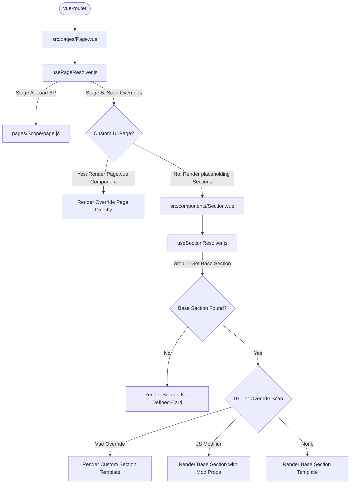

# AQL Page and Section System Guide

This is the canonical reference document for developers and AI agents on AQL's dynamic page orchestration and layout section customization.

---

## 1. Architectural Overview

AQL's frontend architecture is built on a dynamic, tiered, and metadata-driven resolution model. Instead of hardcoding layout views, pages are dynamically assembled at runtime based on the requested resource and active route.



### 1.1 The Orchestrator Page (`src/pages/Page.vue`)
`Page.vue` acts as the single top-level entry point for all resource CRUD operations and custom actions. It does not contain static HTML elements except for breadcrumbs. It resolves layout states dynamically:
1. **Full Page Custom Override (`resolvedPageComponent`)**: If a custom Vue component matches the current resource page under `src/_ui/`, it renders it directly, short-circuiting the generic layout.
2. **Generic Section Layout**: If no custom page component is found, it renders placeholding `<Section>` components sequentially:
   - Sections in `visibleSectionsBeforeAction` (such as `Header`, `Toolbar`).
   - Content wrapper (`<AqlContentWrapper>`) wrapping the `contents` sections (e.g. list, details, or forms).
   - Bottom page actions (`Action` section).
3. **Context Provider**:
   - Provides `'resourceConfig'` (metadata configuration).
   - Provides `'resourceRecord'` (active record reference and loading state).
   - Provides `'pageState'` (centralized page-level reactive form state).

### 1.2 The Section Placeholder (`src/components/Section.vue`)
`Section.vue` is a single generic placeholder component that represents a logical area of the screen (e.g. `Header`, `Toolbar`, `Content`, `Action`).
* It accepts a `section` string prop and captures additional attributes via `useAttrs()`.
* It calls `useSectionResolver(preparedProps)` and handles three states:
  1. **Loading (`!ready`)**: Displays a Quasar `q-spinner-dots`.
  2. **Resolved (`resolvedComponent`)**: Mounts the matched component via `<component :is="resolvedComponent" v-bind="finalProps" />`.
  3. **Undefined (`!resolvedComponent`)**: Displays a warning card informing the developer that the requested section has no fallback or override.

### 1.3 The Page Resolver (`src/composables/resources/usePageResolver.js`)
Handles page-level route resolution and loading:
* **Stage A (Base Contract / BP)**: Loads the page-level configuration contract from `src/pages/[scope]/[page].js` (e.g., `pages/Master/record.js` or `pages/Operation/index.js`). This contract sets default configurations for layout parts, lists, or custom actions.
* **Stage B (Custom Page Override)**: Searches for custom client-specific page components (`.vue`) or JS modifiers (`.js`) under `src/_ui/[UiName]/pages/` in a prioritized sequence. If a Vue page override is found, it mounts it, bypassing the section layout.

### 1.4 The Section Resolver (`src/composables/resources/useSectionResolver.js`)
Resolves section-level components and options using a two-step lookup:
1. **Base Section Resolution**: Looks up generic fallbacks:
   * First: `src/_ui/[UiName]/components/sections/[SectionName].vue` (Client-specific generic fallback).
   * Second: `src/components/sections/[SectionName].vue` (Framework default fallback).
2. **10-Tier Override Scan**: Scans custom client components under `src/_ui/[UiName]/components/` matching specific resources or pages (first match wins). It supports both complete Vue overrides (`.vue` files) and JS logic modifiers (`.js` files).

### 1.5 The Page State (`src/composables/resources/usePageState.js`)
* Centralizes the reactive form state shared across the Header, Content, and Action sections.
* Exposes resource-agnostic canonical request builders (e.g. `compositeSaveRequest`, `resourceBulkRequest`) and response failure checkers.

---

## 2. Developing Section Components

When creating a new Section component (e.g., adding `src/components/sections/Toolbar.vue`), follow this strict recipe:

### 2.1 Component Signature Checklist
1. **Disable Attribute Fallthrough**: Add `inheritAttrs: false` to options. This is essential to prevent parent properties from colliding with computed final values on the root element.
   ```javascript
   defineOptions({ name: 'Sections[SectionName]', inheritAttrs: false })
   ```
2. **Inject Contexts**: Ingest the provided contexts so that the section stays reactive to page states:
   ```javascript
   const resourceConfig = inject('resourceConfig', null)
   const resourceRecord = inject('resourceRecord', null)
   const pageState      = inject('pageState', null)
   ```
3. **Expose Custom Props Supporting Closures**: Props must accept `Function` as a valid type in addition to raw types:
   ```javascript
   const props = defineProps({
     label: { type: [String, Function], default: '' },
     visible: { type: [Boolean, Function], default: true }
   })
   ```
4. **Evaluate Props via `evaluateProp`**: Map all attributes to a computed `finalAttrs` object using `evaluateProp` before binding them to the inner presenter element:
   ```javascript
   import { evaluateProp } from 'src/composables/resources/useSectionResolver'

   const finalAttrs = computed(() => ({
     ...attrs, // pass through un-declared parent attributes
     label: evaluateProp(props.label, resourceRecord, resourceConfig),
     visible: evaluateProp(props.visible, resourceRecord, resourceConfig) ?? true
   }))
   ```
5. **Standard Actions / Emits**: Route actions back using appropriate helpers (e.g., using `useResourceNav` instead of raw `router.push`).

### 2.2 Documenting Your Section Component
Once a new Section component is created, you **MUST** update this file to document its parameters and behavior. Provide:
* The props catalog, including data types and default values.
* The arguments passed to closure-based props (by default, `evaluateProp` provides `(record, config)`).
* Example overrides (both JS logic modifiers and Vue overrides).

#### Current Sections Catalog
* **[Header.vue](file:///f:/LITTLE%20LEAP/AQL/FRONTENT/src/components/sections/Header.vue)**: Renders the top branding panel, back arrows, status chips, and reload buttons.
  * *Props*: `title`, `subtitle`, `chip`, `chipColor`, `chipTextColor`, `back`, `reload`, `backIcon`, `reloadIcon`, `leftIconColor`, `icon`, `iconColor`.
  * *Defaults*: Derived automatically from routing metadata and `resourceConfig.ui.menus`.

---

## 3. Section Customization & Overrides

Section customization is handled cleanly using client-specific overrides under `src/_ui/[UiName]/components/`. 

### 3.1 The 10-Tier Lookup Priority
When `Section.vue` calls `useSectionResolver(preparedProps)`, it scans for overrides in this order (first match wins):
1. **Vue override** (resource + page specific): `.../[scope]/[Resource]/[page]/[Section].vue`
2. **JS modifier** (resource + page specific): `.../[scope]/[Resource]/[page]/[Section].js`
3. **Vue override** (resource specific): `.../[scope]/[Resource]/[Section].vue`
4. **JS modifier** (resource specific): `.../[scope]/[Resource]/[Section].js`
5. **Vue override** (page specific): `.../[scope]/[page]/[Section].vue`
6. **JS modifier** (page specific): `.../[scope]/[page]/[Section].js`
7. **Vue override** (scope-wide): `.../[scope]/[Section].vue`
8. **JS modifier** (scope-wide): `.../[scope]/[Section].js`
9. **Vue override** (ui-wide fallback): `.../[Section].vue`
10. **JS modifier** (ui-wide fallback): `.../[Section].js`

*Note: `[Resource]` is derived by converting the resource slug to PascalCase.*

### 3.2 Vue Overrides vs. JS Modifiers
* **JS Modifiers (`.js`)**: Keep the base template but alter or computed the props passed to it. It can export a static object or a function receiving the current state.
  * *Function signature*:
    ```javascript
    // src/_ui/AQL/components/master/Products/Header.js
    export default (currentProps, { pageState, resourceRecord, resourceConfig }) => {
      return {
        title: (record) => `Product: ${record?.Name || 'Unnamed'}`
      }
    }
    ```
* **Vue Overrides (`.vue`)**: Replaces the base template completely. Write standard SFC files containing a `<template>` block.

### 3.3 Overlapping Attribute Conflicts (The Div-Wrap Trap)
When implementing a `.vue` template override that still wraps the framework's presentation element, you must handle attribute fallthrough carefully. If you do not disable fallthrough, the parent orchestrator attributes will overwrite your local variables.

#### **Avoid the Div-Wrap Trap**
Do not wrap your override inside a `<div>` simply to stop attribute fallthrough:
```html
<!-- BAD: Swallows back/reload actions, permission controls, and status badges -->
<template>
  <div>
    <GenericHeaderPanel title="Custom Title" />
  </div>
</template>
```

#### **Correct Pattern: Disable Fallthrough & Explicitly Bind `$attrs`**
Set `inheritAttrs: false` in the component script and bind `$attrs` **before** writing your custom properties:
```html
<!-- GOOD: Preserves all common behaviors while applying your specific title override -->
<template>
  <GenericHeaderPanel v-bind="$attrs" title="Custom Title" />
</template>

<script setup>
import GenericHeaderPanel from "../../../shared/GenericHeaderPanel.vue"
defineOptions({ inheritAttrs: false })
</script>
```

---

## 4. Strict Maintenance Rule

> [!IMPORTANT]
> **Documentation Sync Requirement**: Any modifications, refactoring, or additions to the Page/Section system structure (such as expanding page overrides, adding custom Vue-based page customization logic, or rewriting record/resource page flows) MUST be accompanied by updates to:
> 1. This document: [AQL_PAGE_AND_SECTION_SYSTEM.md](file:///f:/LITTLE%20LEAP/AQL/Documents/AQL_PAGE_AND_SECTION_SYSTEM.md)
> 2. The initialization prompt: [page_and_section_system.md](file:///f:/LITTLE%20LEAP/AQL/References/Prompt%20Library/Initialization/page_and_section_system.md)
