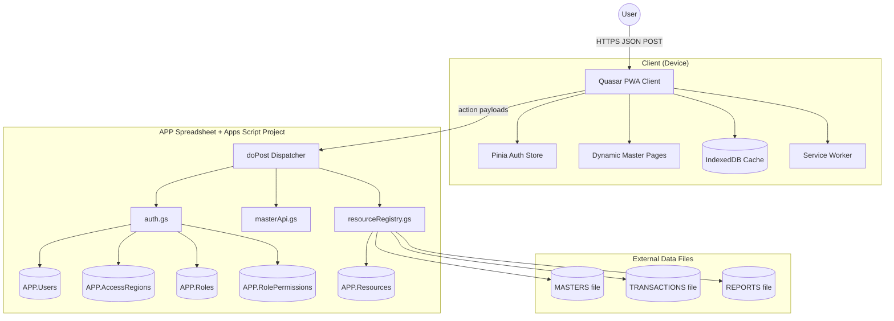

# System Architecture

## System Context Diagram



## Core Architecture Principles
- Single Apps Script project lives in APP file.
- `APP.Resources` is the runtime registry for both backend behavior and frontend metadata.
- Resource routing is dynamic through `FileID` + `SheetName`; no hardcoded per-file script projects.
- Role-based, record-level, and access-region-level controls are metadata-driven.

## Backend Components (Apps Script)
- `GAS/apiDispatcher.gs`
  - Hosts `doPost`.
  - Performs request parsing/response shaping.
  - Routes protected actions across auth and master scopes.
- `GAS/auth.gs`
  - Handles `login`, `getProfile`, profile update actions.
  - Validates token and user context.
  - Returns role-authorized `resources` and user `accessRegion` scope in login payload.
- `GAS/accessRegion.gs`
  - Resolves `APP.AccessRegions` hierarchy.
  - Expands user scope to assigned region + descendants.
  - Validates region codes and universe-access behavior.
- `GAS/sheetHelpers.gs`
  - Shared helpers for header/index/row access patterns across auth/resource/master modules.
- `GAS/resourceRegistry.gs`
  - Resolves resource config from `APP.Resources`.
  - Builds permissioned resource list from `RolePermissions.Actions`.
  - Provides `ui`, `headers`, and permission metadata used by frontend.
  - Isolates per-resource failures so one bad sheet config does not break whole authorization payload.
- `GAS/masterApi.gs`
  - Generic master CRUD (`get/create/update`) with `scope=master`.
  - Resource-driven schema validation/defaults/uniqueness checks.
  - Enforces `AccessRegion` row filtering and write boundaries.
  - Supports incremental sync payloads (`lastUpdatedAt` -> `meta.lastSyncAt`).

## Frontend Components
- `FRONTENT/src/stores/auth.js`
  - Stores `token`, `user`, and `resources` from login response.
  - Persists auth data to local storage.
- `FRONTENT/src/layouts/MainLayout/MainLayout.vue`
  - Builds sidebar from `resources[].ui`.
  - Shows only resources with `permissions.canRead === true`.
- `FRONTENT/src/router/index.js`
  - Guards auth routes.
  - Enforces resource-level route access using `resources[].ui.routePath` + permissions.
- `FRONTENT/src/pages/Masters/MasterEntityPage.vue`
  - Generic master page driven by authorized resource metadata.
- `FRONTENT/src/services/masterRecords.js`
  - Uses cached headers and incremental sync for master resources.
- `FRONTENT/src/utils/db.js`
  - IDB stores: `resource-meta`, `resource-records`, API cache and sync queue.

## Auth Login Payload Contract

Frontend expects this shape from `action=login`:

```json
{
  "success": true,
  "token": "uuid",
  "user": {
    "id": "U0001",
    "name": "User Name",
    "email": "user@example.com",
    "avatar": "",
    "accessRegion": { "code": "UAE001", "isUniverse": false, "accessibleCodes": ["UAE001", "UAE002"] },
    "designation": { "id": "D0001", "name": "Manager", "hierarchyLevel": 2 },
    "roles": [{ "id": "R0001", "name": "Administrator" }],
    "role": "Administrator"
  },
  "resources": [
    {
      "name": "Products",
      "scope": "master",
      "fileId": "...",
      "sheetName": "Products",
      "codePrefix": "LLMP",
      "codeSequenceLength": 5,
      "headers": ["Code", "Name", "SKU", "AccessRegion", "Status", "CreatedAt", "UpdatedAt", "CreatedBy", "UpdatedBy"],
      "permissions": {
        "canRead": true,
        "canWrite": true,
        "canUpdate": true,
        "canDelete": false
      },
      "ui": {
        "menuGroup": "Masters",
        "menuOrder": 10,
        "menuLabel": "Products",
        "menuIcon": "inventory_2",
        "routePath": "/masters/products",
        "pageTitle": "Products",
        "pageDescription": "Manage product master records",
        "fields": [],
        "showInMenu": true
      },
      "actions": ["Approve"],
      "allowedActions": ["READ", "WRITE", "UPDATE", "APPROVE"]
    }
  ]
}
```

`getProfile` remains user-only, while `getAuthorizedResources` is the protected refresh endpoint for resource catalog updates.

## Request Flow (Login)
1. Frontend posts `{ action: "login", email, password }`.
2. `apiDispatcher.gs` routes `login` to auth handlers.
3. `auth.gs` validates credentials from `APP.Users`, writes new UUID to `Users.ApiKey`.
4. `auth.gs` resolves user roles, designation, and access-region scope.
5. `resourceRegistry.gs` aggregates resource permissions from `RolePermissions` and resource metadata from `Resources`.
6. Login response returns `token`, `user`, and role-authorized `resources`.

## Request Flow (Master Read)
1. Frontend posts `{ action: "get", scope: "master", resource, lastUpdatedAt }`.
2. `apiDispatcher.gs` validates token via `auth.gs` and routes to master handlers.
3. `masterApi.gs` checks resource-level permission + record-level policy + access-region scope.
4. Target file/sheet is resolved dynamically via `resourceRegistry.gs`.
5. Response returns compact `rows` and `meta.lastSyncAt` for incremental merge.
