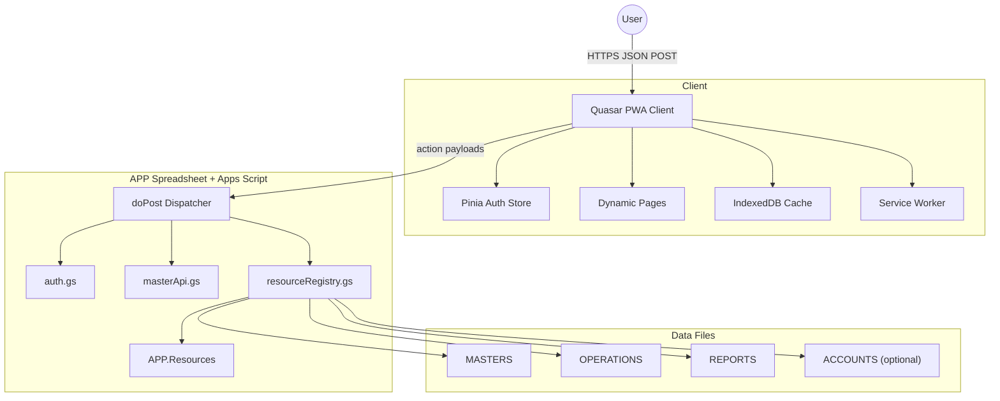

# System Architecture

## Purpose
This document owns system boundaries, component responsibilities, and interaction flows. It should not be the canonical source for detailed payload contracts or step-by-step operational setup.

## System Context

```mermaid
graph TD
    User((User)) -->|HTTPS JSON POST| PWA["Quasar PWA Client"]

    subgraph "Client"
        PWA --> AuthStore["Pinia Auth Store"]
        PWA --> MasterPages["Dynamic Pages"]
        PWA --> IDB["IndexedDB Cache"]
        PWA --> SW["Service Worker"]
    end

    subgraph "APP Spreadsheet + Apps Script"
        PWA -->|action payloads| GAS["doPost Dispatcher"]
        GAS --> AUTH["auth.gs"]
        GAS --> MASTER["masterApi.gs"]
        GAS --> REGISTRY["resourceRegistry.gs"]
        REGISTRY --> APPRES["APP.Resources"]
    end

    subgraph "Data Files"
        REGISTRY --> MASTERS["MASTERS"]
        REGISTRY --> OPERATIONS["OPERATIONS"]
        REGISTRY --> REPORTS["REPORTS"]
        REGISTRY --> ACCOUNTS["ACCOUNTS (optional)"]
    end
```

## Core Principles
- One APP Apps Script project is preferred for runtime behavior.
- `APP.Resources` is the control plane for routing, permissions, and UI metadata.
- Frontend reads from IndexedDB first where cache-first flows are implemented.
- Service Worker manages cache/network boundaries, not UI state or business logic.
- Role, record, and region access rules are metadata-driven.

## Backend Boundaries
- `apiDispatcher.gs`
  - request parsing, routing, and response shaping
- `auth.gs`
  - login, token validation, profile-related behavior
- `resourceRegistry.gs`
  - resource config lookup, scope normalization, permission assembly
- `masterApi.gs`
  - generic CRUD and hook dispatching
- `sheetHelpers.gs`
  - low-level helpers for file, sheet, header, and config access

## Frontend Boundaries
- `stores/auth.js`
  - session, user, resource catalog, app config/options
- `layouts/MainLayout`
  - menu rendering from authorized resource metadata
- `router`
  - route guards based on auth/resource access
- `services/gasApi.js`
  - single frontend entry point for backend requests
- `services/masterRecords.js`
  - cache-aware master data sync/read helpers

## Key Interaction Flows

### Login
1. Frontend posts `action=login`.
2. Backend validates user/token context.
3. Backend returns user identity, authorized resources, app config, and app options.
4. Frontend persists auth state and may begin background sync.

Detailed login contract: [LOGIN_RESPONSE.md](F:/LITTLE%20LEAP/AQL/Documents/LOGIN_RESPONSE.md)

### Generic Resource Read/Write
1. Frontend calls `callGasApi(...)`.
2. `apiDispatcher.gs` validates auth and routes by action/scope.
3. `resourceRegistry.gs` resolves resource metadata and target file/sheet.
4. `masterApi.gs` applies permission, region, validation, and hook logic.

### Cache-First Master Experience
1. Frontend reads cached rows from IndexedDB.
2. If needed, frontend sends an incremental sync request using the stored cursor.
3. Response rows are merged back into IndexedDB and UI state.

## Canonical Detail Owners
- Login payload: [LOGIN_RESPONSE.md](F:/LITTLE%20LEAP/AQL/Documents/LOGIN_RESPONSE.md)
- Backend capability inventory: [GAS_API_CAPABILITIES.md](F:/LITTLE%20LEAP/AQL/Documents/GAS_API_CAPABILITIES.md)
- Backend implementation patterns: [GAS_PATTERNS.md](F:/LITTLE%20LEAP/AQL/Documents/GAS_PATTERNS.md)
- Resource column semantics: [RESOURCE_COLUMNS_GUIDE.md](F:/LITTLE%20LEAP/AQL/Documents/RESOURCE_COLUMNS_GUIDE.md)

## Maintenance Rule
Update this file when:
- major system boundaries change
- a component's core responsibility changes
- a major interaction flow changes materially
- canonical detail-owner references change
