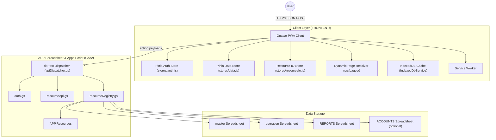

# System Overview & Architecture

## Purpose
This is the master orientation and technical baseline document for AQL. It defines the business operating model, system architecture, core runtime principles, cross-layer boundaries, and technical contracts.

---

## 1. What AQL Is

AQL is the operating system for Little Leap's UAE baby-product distribution business. The primary operational heartbeat is:
1. **Distribute products** to retail outlets.
2. **Track outlet sales & visits** on recurring cycles.
3. **Collect payments** on strict intervals.
4. **Approve & execute refills** based on stock health.
5. **Raise supplier purchase orders** before stock-out risk.

Inbound logistics, warehouse intake, and internal stock control support this commercial cycle.

---

## 2. Technology Stack & Runtime Direction

- **Frontend**: Quasar v2 (Vue 3, Pinia, Axios, Vite) as a responsive PWA.
  - Development: `npm run dev` inside `FRONTENT/`
  - Production Build: `npm run build` inside `FRONTENT/`
- **Backend**: Google Apps Script (GAS) Web App with a unified `doPost` dispatcher and JSON-based action routing.
  - Deployment: `npm run gas:push` from root or `cd GAS && clasp push`.
- **Data Layer**: Google Sheets partitioned by domain:
  - `APP`: Central control plane, user auth, roles, and resource definitions (`APP.Resources`).
  - `master`: Core reference entities (Products, Outlets, Suppliers, Accounts, etc.).
  - `operation`: Transactional records (Visits, Orders, Invoices, Payments, Movements).
  - `REPORTS`: Aggregation and printable report templates.
  - `ACCOUNTS` *(optional)*: Extended accounting and financial ledgers.
- **Local Persistence & Caching**: IndexedDB via `ResourceIoService` for cache-first reads and offline readiness.

---

## 3. System Architecture & Context

---

## 4. Core Principles & Boundaries

### 4.1 Metadata-Driven Control Plane
- `APP.Resources` is the single source of truth for routing, permissions, field metadata, validation rules, and sheet mapping.
- Role, record, and regional data access permissions are dynamically evaluated from metadata.

### 4.2 Backend Boundaries (`GAS/`)
- `apiDispatcher.gs`: Request parsing, auth verification, routing, and response envelope shaping.
- `auth.gs`: Login, token validation, user profile resolution.
- `resourceRegistry.gs`: Resource metadata resolution, sheet target lookup, scope normalization.
- `resourceApi.gs`: Generic CRUD, composite saves, batch operations, and post-write hook dispatching.
- `sheetHelpers.gs`: Low-level spreadsheet helpers, header mapping, and cached access.

### 4.3 Frontend Boundaries (`FRONTENT/src/`)
- `pages/`: Thin orchestration layer hosting the dynamic page structure (`Page.vue`).
- `components/`: Reusable UI building blocks (`abstract/`, `app/`, `contents/`, `sections/`, `actions/`, `_fields/`).
- `composables/`: Stateful business logic, resolvers, and lifecycle management.
- `services/`: Transport and persistence services (`GasApiService.js`, `IndexedDbService.js`, `ResourceIoService.js`).
- `stores/`: Shared application state (`auth.js`, `data.js`, `resourceIo.js`, `resourceStatus.js`).
- `_ui/`: Tenant-specific and branded UI overrides resolved through the shared 10-tier resolution engine.
- `_resource/`: Pure domain logic layer completely decoupled from presentation.

---

## 5. Technical Contracts

### 5.1 Identity & Access Model
- Authentication occurs via `APP.Users`.
- Users possess a designation, one or more assigned roles (`APP.RolePermissions`), and optional regional scopes.
- Detailed auth payload contract: [API_LOGIN_RESPONSE.md](file:///f:/LITTLE%20LEAP/AQL/Documents/API_LOGIN_RESPONSE.md).

### 5.2 API Communication & Payload Standards
- All frontend backend calls route through `GasApiService` via `callGasApi`.
- Single canonical transport envelope with `requestId` tracking.
- Canonical response data contract:
  - `data.resources`: Resource row payloads.
  - `data.result`: Action-specific returned data.
  - `data.artifacts`: Non-row outputs (e.g., generated PDF/Report files).

### 5.3 Cache & Sync Conventions
- Cache-first flows read from IndexedDB first.
- Incremental background syncing uses stored timestamp cursors without blocking the UI.

---

## 6. Where To Read Next

- **Task-Based Document Router**: [CORE_DOC_ROUTING.md](file:///f:/LITTLE%20LEAP/AQL/Documents/CORE_DOC_ROUTING.md)
- **Agent Collaboration Protocol**: [MAP.md](file:///f:/LITTLE%20LEAP/AQL/References/Prompt%20Library/MAP.md)
- **Frontend Architecture Rules**: [CORE_ARCHITECTURE_RULES.md](file:///f:/LITTLE%20LEAP/AQL/Documents/CORE_ARCHITECTURE_RULES.md)
- **Commercial & Outlet Operations**: [WORKFLOW_OUTLET_OPERATIONS.md](file:///f:/LITTLE%20LEAP/AQL/Documents/WORKFLOW_OUTLET_OPERATIONS.md)
- **Procurement & Warehouse Inventory**: [WORKFLOW_PROCUREMENT.md](file:///f:/LITTLE%20LEAP/AQL/Documents/WORKFLOW_PROCUREMENT.md)
- **Backend API & Patterns**: [GAS_API_CAPABILITIES.md](file:///f:/LITTLE%20LEAP/AQL/Documents/GAS_API_CAPABILITIES.md) & [GAS_PATTERNS.md](file:///f:/LITTLE%20LEAP/AQL/Documents/GAS_PATTERNS.md)
- **Resource UI Module Generation**: [UI_MODULE_DEVELOPER_GUIDE.md](file:///f:/LITTLE%20LEAP/AQL/Documents/UI_MODULE_DEVELOPER_GUIDE.md)

---

## Maintenance Rule
Update this document when the system architecture, technology stack, backend/frontend boundaries, or primary business operational model changes.
