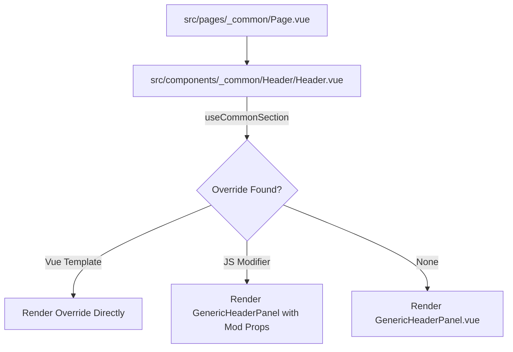
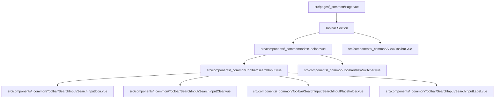
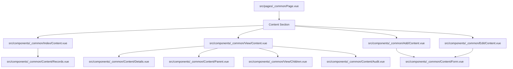

# Custom Page and Page Sections Customizations

## 1. Overview

AQL's frontend architecture is designed for deep, tiered customization of pages and layout sections. This is achieved through a decentralized layout system:
1. **Top-Level Orchestrators**: Standard page wrapper definitions (like [IndexPage.vue](file:///f:/LITTLE%20LEAP/AQL/FRONTENT/src/pages/_common/IndexPage.vue) and [ViewPage.vue](file:///f:/LITTLE%20LEAP/AQL/FRONTENT/src/pages/_common/master/ViewPage.vue)) delegate rendering to a unified [Page.vue](file:///f:/LITTLE%20LEAP/AQL/FRONTENT/src/pages/_common/Page.vue) component.
2. **Static Layout Fallbacks**: The unified `Page.vue` statically imports and mounts the core layout section components (`Header`, `Toolbar`, `Content`, `Action`).
3. **Decentralized Overriding**: Each layout component (and their child sub-sections) uses [useSectionResolver.js](file:///f:/LITTLE%20LEAP/AQL/FRONTENT/src/composables/resources/useSectionResolver.js) (or the [useCommonSection.js](file:///f:/LITTLE%20LEAP/AQL/FRONTENT/src/composables/resources/useCommonSection.js) wrapper composable) to resolve their own overrides independently.

This document serves as the master reference for developers to understand the nested directory structure, page flows, dynamic sub-sections, and override boundaries in the AQL codebase.

---

## 2. Directory Structure & Naming Consistency

To maintain absolute architectural consistency, AQL enforces a **Directory-Matching-Parent** pattern for nested components:

1. **Parent Component Placement**: A parent component resides directly in its page flow directory or root section folder (e.g., `src/components/_common/Index/Toolbar.vue` or `src/components/_common/Toolbar/SearchInput.vue`).
2. **Sub-component Subdirectory**: All sub-sections resolved *exclusively* by that parent component reside inside a subdirectory named exactly after the parent component (e.g., `src/components/_common/Toolbar/SearchInput/SearchInputIcon.vue` and `src/components/_common/Toolbar/SearchInput/SearchInputClear.vue`).
3. **No File-Name Page Prefixes**: File names do not use top-level page name prefixes (like `Index`, `View`, `Add`, `Edit`, `Action`) on files. Page context is established by the directory path (e.g., `_common/Index/Content.vue` instead of `IndexContent.vue`).

---

## 3. The Four Top-Level Sections

Every page target in AQL (Index, View, Add, Edit, and Action) orchestrates exactly four top-level sections, executed in this strict sequence:

1. **`Header`**: Placed first, at the top. Handles page branding, context, back actions, and synchronization states. Leverages the shared [GenericHeaderPanel.vue](file:///f:/LITTLE%20LEAP/AQL/FRONTENT/src/components/shared/GenericHeaderPanel.vue).
2. **`Toolbar`**: Placed second. Handles search, view switcher tabs, or record action controls.
3. **`Content`**: Placed third. Handles the main body payload of the page (wrapped in `<AqlContentWrapper>`). For `Add` and `Edit` pages, **Form** is a sub-section of `Content`.
4. **`Action`**: Placed fourth. Handles bottom form actions, footers, or floating action buttons (FABs).

---

## 4. Visual Layout Hierarchies

The following diagrams illustrate the exact component nesting structure from the top-level section down to the leaf sub-sections, showing their file locations under `src/components/_common/`.

### 4.1 Header Section Hierarchy
The Header represents page branding and synchronization.
1. **Header Fallback (`src/components/_common/Header/Header.vue`)**:
   - Central entry point loaded by `Page.vue`.
   - Calls the [useCommonSection.js](file:///f:/LITTLE%20LEAP/AQL/FRONTENT/src/composables/resources/useCommonSection.js) wrapper (which resolves the section, injects context, and evaluates functions) to check for a custom header template (`Header.vue`) or JS logic modifier (`Header.js`).
   - If a custom template is found, renders it. If a JS modifier is found, uses it to adapt the props. Otherwise, falls back to `GenericHeaderPanel.vue`.



---

### 4.2 Toolbar Section Hierarchy
The Toolbar coordinates search, view switchers, and record controls.



---

### 4.3 Content Section Hierarchy
The Content section renders the main body of the page.



---

### 4.4 Action Section Hierarchy
The Action section handles footers and floating action buttons (FABs).

```mermaid
graph TD
    PageVue[src/pages/_common/Page.vue] --> ActionFallback[Action Section]
    
    %% Index Page Actions
    ActionFallback --> IndexActions[src/components/_common/Index/Actions.vue]
    IndexActions --> Downloads[src/components/_common/Action/Downloads.vue]
    IndexActions --> CrudActionsIndex[src/components/_common/Action/CrudActions.vue]
    
    %% View Page Actions
    ActionFallback --> ViewActions[src/components/_common/View/Actions.vue]
    ViewActions --> Downloads
    ViewActions --> CrudActionsView[src/components/_common/Action/CrudActions.vue]
    ViewActions --> AdditionalActionSingle[src/components/_common/Action/AdditionalActionSingle.vue]
    ViewActions --> AdditionalActionMultiple[src/components/_common/Action/AdditionalActionMultiple.vue]
    ViewActions --> ActionDialog[src/components/_common/Action/ActionDialog.vue]
    
    %% Add/Edit Page Actions
    ActionFallback --> AddActions[src/components/_common/Add/Actions.vue]
    ActionFallback --> EditActions[src/components/_common/Edit/Actions.vue]
    AddActions --> FormActions[src/components/_common/Action/FormActions.vue]
    EditActions --> FormActions
    EditActions --> CrudActionsEdit[src/components/_common/Action/CrudActions.vue]
    FormActions --> FormSubmit[src/components/_common/Action/FormSubmit.vue]
    FormActions --> FormCancel[src/components/_common/Action/FormCancel.vue]
```



---

## 5. Customization Layers & Standard Override Candidates

AQL enforces a strict lookup hierarchy in [useSectionResolver.js](file:///f:/LITTLE%20LEAP/AQL/FRONTENT/src/composables/resources/useSectionResolver.js) (which is wrapped by [useCommonSection.js](file:///f:/LITTLE%20LEAP/AQL/FRONTENT/src/composables/resources/useCommonSection.js) in layout-level orchestrator components to handle context injection and dynamic function evaluation).

### 5.1 The Two-Step Lookup Process

#### Step 1: Base Component Resolution
First, the system tries to find the default base rendering template for the section in this priority:
1. **Custom UI base section**: `_ui/${uiName}/components/sections/${section}.vue`
2. **Framework base section**: `components/sections/${section}.vue`

#### Step 2: Customization & Override Candidate Scan
If a custom UI name is configured, the system scans up to 10 candidates in order under `_ui/${uiName}/components/` (first match wins):
1. **Vue override** (resource + page specific): `_ui/${uiName}/components/${scope}/${resource}/${page}/${section}.vue`
2. **JS modifier** (resource + page specific): `_ui/${uiName}/components/${scope}/${resource}/${page}/${section}.js`
3. **Vue override** (resource specific): `_ui/${uiName}/components/${scope}/${resource}/${section}.vue`
4. **JS modifier** (resource specific): `_ui/${uiName}/components/${scope}/${resource}/${section}.js`
5. **Vue override** (page specific): `_ui/${uiName}/components/${scope}/${page}/${section}.vue`
6. **JS modifier** (page specific): `_ui/${uiName}/components/${scope}/${page}/${section}.js`
7. **Vue override** (scope-wide): `_ui/${uiName}/components/${scope}/${section}.vue`
8. **JS modifier** (scope-wide): `_ui/${uiName}/components/${scope}/${section}.js`
9. **Vue override** (ui-wide fallback): `_ui/${uiName}/components/${section}.vue`
10. **JS modifier** (ui-wide fallback): `_ui/${uiName}/components/${section}.js`

*Note: `${resource}` is derived by converting the resource slug to PascalCase.*

### 5.2 Vue Templates vs. JS Logic Modifiers
Overrides are divided into two types:
1. **Vue templates (`.vue` files)**: Standard Vue files containing a `<template>` block. These act as complete layout overrides. Components without templates are **strictly forbidden**.
2. **JS logic modifiers (`.js` files)**: Functions of the form `(props) => modifiedProps` that intercept and adjust the properties fed to the base section template. JS modifiers are scanned alongside Vue templates under custom UI candidates.

---

## 6. Architectural Implementation Rules

1. **Strict Composable Segregation**: Components must act strictly as rendering templates. State management must live in Pinia stores, and business logic, validations, or routing triggers must be encapsulated in composables.
2. **Dynamic Section Gating**: All interactive elements in form actions, action bars, or detail grids must verify user permissions using `allowed()` from `useResourceConfig`.
3. **No Direct Routing**: Transitions between pages or child views must use the `goTo` helper from the `useResourceNav` composable. Direct usage of `router.push()` in components is prohibited.
4. **Style Restraint**: Styling must utilize standard Quasar utility classes or variables defined in `custom.scss`. Custom `<style>` blocks in custom component files are not permitted.

---

## 7. Attribute Fallthrough, Overlapping Props & JS Modifiers

When customizing sections, you must handle parent-to-child attribute fallthrough carefully to avoid property collisions:

### 7.1 Same Component Wrapper Conflict
When a local template overrides a section but still renders the standard presentation element (e.g., `GenericHeaderPanel`), Vue 3's attribute fallthrough will automatically apply the parent orchestrator's attributes (like `label`, `caption`, `reload`) onto the root child node, overriding the static values defined in your custom template.

To solve this, use one of the two patterns:

#### Pattern A: JS Logic Modifier (Preferred for property-only overrides)
If you only need to change properties, use a `.js` modifier instead of a `.vue` template. Thanks to the automatic property merging and evaluation in [useCommonSection.js](file:///f:/LITTLE%20LEAP/AQL/FRONTENT/src/composables/resources/useCommonSection.js) (which wraps [useSectionResolver.js](file:///f:/LITTLE%20LEAP/AQL/FRONTENT/src/composables/resources/useSectionResolver.js)), you only return the fields you want to change:
```javascript
// src/components/master/Currencies/Index/Header.js
export default {
  label: 'Than podo'
}
```

#### Pattern B: inheritAttrs: false + Explicit v-bind (Preferred when custom slots are needed)
If you must use a `.vue` template (e.g., to override slots), you must disable Vue's automatic attribute fallthrough and explicitly bind `$attrs` **before** your overrides:
```html
<template>
  <GenericHeaderPanel v-bind="$attrs" label="Than podo" />
</template>

<script setup>
import GenericHeaderPanel from "../../../shared/GenericHeaderPanel.vue";
defineOptions({ inheritAttrs: false })
</script>
```

### 7.2 The Div-Wrapping Workaround (Side Effects Warning)
Wrapping the child component in a `<div>` (e.g., `<div><GenericHeaderPanel label="Than podo" /></div>`) stops the parent's properties from overriding the local template properties because the `<div>` intercepts them.

> [!WARNING]
> While this preserves the custom label, **all other common page-level features (such as dynamic back/reload actions, permission-gated controls, or status badges) are swallowed by the `<div>` and never reach the panel**. Avoid this unless you intentionally want to isolate the child component from all orchestrator-computed attributes.

