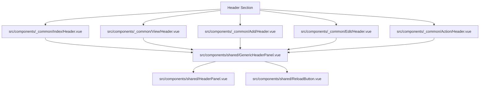

# Custom Page and Page Sections Customizations

## 1. Overview

AQL's frontend architecture is designed for deep, tiered customization of pages and layout sections. This is achieved through a unified, multi-tiered component resolution system powered by `useSectionResolver.js` (for layout sections) and `usePageResolver.js` (for top-level pages).

This document serves as the master reference for developers to understand the nested directory structure, page flows, dynamic sub-sections, and override boundaries in the AQL codebase.

---

## 2. Directory Structure & Naming Consistency

To maintain absolute architectural consistency, AQL enforces a **Directory-Matching-Parent** pattern for nested components:

1. **Parent Component Placement**: A parent component resides directly in its page flow directory or root (e.g., `src/components/_common/Index/Toolbar.vue` or `src/components/_common/SearchInput.vue`).
2. **Sub-component Subdirectory**: All sub-sections resolved *exclusively* by that parent component reside inside a subdirectory named exactly after the parent component (e.g., `src/components/_common/SearchInput/SearchInputIcon.vue` and `src/components/_common/SearchInput/SearchInputClear.vue`).
3. **No File-Name Page Prefixes**: File names do not use top-level page name prefixes (like `Index`, `View`, `Add`, `Edit`, `Action`) on files. Page context is established by the directory path (e.g., `_common/Index/Content.vue` instead of `IndexContent.vue`).

---

## 3. The Four Top-Level Sections

Every page target in AQL (Index, View, Add, Edit, and Action) orchestrates exactly four top-level sections, executed in this strict sequence:

1. **`Header`**: Placed first, at the top. Handles page branding, context, back actions, and synchronization states. Leverages the shared [GenericHeaderPanel.vue](file:///f:/LITTLE%20LEAP/AQL/FRONTENT/src/components/shared/GenericHeaderPanel.vue).
2. **`ToolBar`**: Placed second. Handles search, view switcher tabs, or record action controls.
3. **`Content`**: Placed third. Handles the main body payload of the page (wrapped in `<AqlContentWrapper>`). For `Add` and `Edit` pages, **Form** is a sub-section of `Content`.
4. **`Action`**: Placed fourth. Handles bottom form actions, footers, or floating action buttons (FABs).

---

## 4. Visual Layout Hierarchies

The following Mermaid diagrams illustrate the exact component nesting structure from the top-level section down to the leaf sub-sections, showing their file locations under `src/components/_common/`.

### 4.1 Header Section Hierarchy
The Header represents page branding and synchronization. Every page resolves its own page-scoped `Header.vue` component, which imports and wraps the shared `GenericHeaderPanel.vue`.



---

### 4.2 ToolBar Section Hierarchy
The ToolBar coordinates search, view switchers, and record controls (like the ActionBar).

```mermaid
graph TD
    ToolBar[ToolBar Section]
    
    %% Index Page Toolbar
    ToolBar --> IndexToolbar[src/components/_common/Index/Toolbar.vue]
    IndexToolbar --> SearchInput[src/components/_common/SearchInput.vue]
    SearchInput --> SearchInputIcon[src/components/_common/SearchInput/SearchInputIcon.vue]
    SearchInput --> SearchInputClear[src/components/_common/SearchInput/SearchInputClear.vue]
    IndexToolbar --> ViewSwitcher[src/components/_common/ViewSwitcher.vue]
    ViewSwitcher --> ViewSwitcherTab[src/components/_common/ViewSwitcher/ViewSwitcherTab.vue]
    ViewSwitcherTab --> ViewSwitcherTabCount[src/components/_common/ViewSwitcher/ViewSwitcherTab/ViewSwitcherTabCount.vue]
    
    %% View Page Toolbar
    ToolBar --> ViewToolbar[src/components/_common/View/Toolbar.vue]
    ViewToolbar --> ActionBar[src/components/_common/ActionBar.vue]
    ActionBar --> ActionBarEdit[src/components/_common/ActionBar/ActionBarEdit.vue]
    ActionBar --> ActionBarDelete[src/components/_common/ActionBar/ActionBarDelete.vue]
    ActionBar --> ActionBarCustom[src/components/_common/ActionBar/ActionBarCustom.vue]
    ActionBarCustom --> ActionBarCustomButton[src/components/_common/ActionBar/ActionBarCustom/ActionBarCustomButton.vue]
    ActionBarCustom --> AdditionalActions[src/components/_common/ActionBar/ActionBarCustom/AdditionalActions.vue]
```



---

### 4.3 Content Section Hierarchy
The Content section renders the main body of the page. For Add/Edit pages, **Form** is a sub-section of Content.

```mermaid
graph TD
    Content[Content Section]
    
    %% Index Page Content
    Content --> IndexContent[src/components/_common/Index/Content.vue]
    IndexContent --> Records[src/components/_common/Records.vue]
    Records --> RecordsListItem[src/components/_common/Records/RecordsListItem.vue]
    RecordsListItem --> RecordsListItemHeader[src/components/_common/Records/RecordsListItem/RecordsListItemHeader.vue]
    RecordsListItemHeader --> RecordsListItemTitle[src/components/_common/Records/RecordsListItem/RecordsListItemHeader/RecordsListItemTitle.vue]
    RecordsListItemHeader --> RecordsListItemStatus[src/components/_common/Records/RecordsListItem/RecordsListItemHeader/RecordsListItemStatus.vue]
    RecordsListItem --> RecordsListItemBody[src/components/_common/Records/RecordsListItem/RecordsListItemBody.vue]
    RecordsListItemBody --> RecordsListItemField[src/components/_common/Records/RecordsListItem/RecordsListItemBody/RecordsListItemField.vue]
    RecordsListItem --> RecordsListItemFooter[src/components/_common/Records/RecordsListItem/RecordsListItemFooter.vue]
    
    %% View Page Content
    Content --> ViewContent[src/components/_common/View/Content.vue]
    ViewContent --> Details[src/components/_common/Details.vue]
    Details --> DetailsGroup[src/components/_common/Details/DetailsGroup.vue]
    DetailsGroup --> DetailItem[src/components/_common/Details/DetailsGroup/DetailItem.vue]
    DetailItem --> DetailItemLabel[src/components/_common/Details/DetailsGroup/DetailItem/DetailItemLabel.vue]
    DetailItem --> DetailItemValue[src/components/_common/Details/DetailsGroup/DetailItem/DetailItemValue.vue]
    ViewContent --> Parent[src/components/_common/Parent.vue]
    Parent --> ParentHeader[src/components/_common/Parent/ParentHeader.vue]
    Parent --> ParentBody[src/components/_common/Parent/ParentBody.vue]
    Parent --> ParentLink[src/components/_common/Parent/ParentLink.vue]
    ViewContent --> Children[src/components/_common/Children.vue]
    Children --> ChildGroup[src/components/_common/Children/ChildGroup.vue]
    ChildGroup --> ChildGroupHeader[src/components/_common/Children/ChildGroup/ChildGroupHeader.vue]
    ChildGroup --> ChildGroupList[src/components/_common/Children/ChildGroup/ChildGroupList.vue]
    ChildGroupList --> ChildItem[src/components/_common/Children/ChildGroup/ChildGroupList/ChildItem.vue]
    ChildItem --> ChildItemField[src/components/_common/Children/ChildGroup/ChildGroupList/ChildItem/ChildItemField.vue]
    ViewContent --> Audit[src/components/_common/Audit.vue]
    Audit --> AuditGroup[src/components/_common/Audit/AuditGroup.vue]
    AuditGroup --> AuditItem[src/components/_common/Audit/AuditGroup/AuditItem.vue]

    %% Add Page Content
    Content --> AddContent[src/components/_common/Add/Content.vue]
    AddContent --> Form[src/components/_common/Form.vue]
    
    %% Edit Page Content
    Content --> EditContent[src/components/_common/Edit/Content.vue]
    EditContent --> Form
    
    %% Form Sub-section Details
    Form --> FormFields[src/components/_common/Form/FormFields.vue]
    FormFields --> FormFieldsGroup[src/components/_common/Form/FormFields/FormFieldsGroup.vue]
    FormFieldsGroup --> FormField[src/components/_common/Form/FormFields/FormFieldsGroup/FormField.vue]
    FormField --> FormFieldLabel[src/components/_common/Form/FormFields/FormFieldsGroup/FormField/FormFieldLabel.vue]
    FormField --> FormFieldControl[src/components/_common/Form/FormFields/FormFieldsGroup/FormField/FormFieldControl.vue]
    FormField --> FormFieldError[src/components/_common/Form/FormFields/FormFieldsGroup/FormField/FormFieldError.vue]
    Form --> FormChildren[src/components/_common/Form/FormChildren.vue]
    FormChildren --> FormChildrenGroup[src/components/_common/Form/FormChildren/FormChildrenGroup.vue]
    FormChildrenGroup --> FormChildrenHeader[src/components/_common/Form/FormChildren/FormChildrenGroup/FormChildrenHeader.vue]
    FormChildrenGroup --> FormChildrenList[src/components/_common/Form/FormChildren/FormChildrenGroup/FormChildrenList.vue]
    FormChildrenList --> FormChildrenItem[src/components/_common/Form/FormChildren/FormChildrenGroup/FormChildrenList/FormChildrenItem.vue]
    FormChildrenItem --> FormChildrenItemField[src/components/_common/Form/FormChildren/FormChildrenGroup/FormChildrenList/FormChildrenItem/FormChildrenItemField.vue]
    FormChildrenItem --> FormChildrenItemDelete[src/components/_common/Form/FormChildren/FormChildrenGroup/FormChildrenList/FormChildrenItem/FormChildrenItemDelete.vue]

    %% Action Page Content
    Content --> ActionContent[src/components/_common/Action/Content.vue]
    ActionContent --> ActionFields[src/components/_common/ActionFields.vue]
    ActionFields --> ActionOutcomeSelect[src/components/_common/ActionFields/ActionOutcomeSelect.vue]
    ActionFields --> ActionFormField[src/components/_common/ActionFields/ActionFormField.vue]
```



---

### 4.4 Action Section Hierarchy
The Action section handles page-level creation triggers, report panels, and form cancel/submit footer buttons.

```mermaid
graph TD
    Action[Action Section]
    
    %% Index Page Action
    Action --> IndexActions[src/components/_common/Index/Actions.vue]
    IndexActions --> AddFAB[src/components/_common/AddFAB.vue]
    AddFAB --> AddFABIcon[src/components/_common/AddFAB/AddFABIcon.vue]
    AddFAB --> AddFABTooltip[src/components/_common/AddFAB/AddFABTooltip.vue]
    IndexActions --> ResourceReports[src/components/_common/ResourceReports.vue]
    
    %% Add Page Action
    Action --> AddActions[src/components/_common/Add/Actions.vue]
    AddActions --> FormSubmit[src/components/_common/FormSubmit.vue]
    AddActions --> FormCancel[src/components/_common/FormCancel.vue]
    AddActions --> ClearButton[src/components/_common/ClearButton.vue]
    
    %% Edit Page Action
    Action --> EditActions[src/components/_common/Edit/Actions.vue]
    EditActions --> FormSubmit
    EditActions --> FormCancel
    EditActions --> ClearButton

    %% Action Page Action
    Action --> ActionActions[src/components/_common/Action/Actions.vue]
    ActionActions --> ActionSubmit[src/components/_common/ActionSubmit.vue]
    ActionActions --> ActionCancel[src/components/_common/ActionCancel.vue]
```



---

## 5. Customization Layers & Standard Override Paths

AQL's customization hierarchy is divided into two active development layers and one future multi-tenant layer:

```
┌─────────────────────────────────────────────────────────────┐
│ 1. Tenant-Custom Layer (components/_custom/)                 │ ◄── FUTURE USE ONLY (Tenant-specific)
├─────────────────────────────────────────────────────────────┤
│ 2. Entity-Custom Layer (components/{Scope}/{ResourceName}/) │ ◄── STANDARD DEVELOPMENT (Resource-specific)
├─────────────────────────────────────────────────────────────┤
│ 3. Framework Layer (components/_common/)                    │ ◄── SYSTEM FALLBACKS (Global templates)
└─────────────────────────────────────────────────────────────┘
```

### 5.1 How to Write Standard Resource Overrides
When you need to customize a specific resource in the codebase (e.g., adding custom rendering for an `Outlet` list row, or placing a customized signature picker inside a `WarehouseTransfer` form field), create the custom component at the matching **Entity-Custom** path.

The 12-tier resolver naturally intercepts the call, loading your custom component while keeping everything else common.

### Common Override File Map

For standard overrides, AQL enforces a strict, flat structure with **no other custom folders** (such as `Records/`, `Forms/`, etc.) allowed. You must place your overrides in one of the following two styles:

1. **Page-Generic Override**:
   `src/components/[Scope]/[ResourceName]/[Section].vue`
   - *Example*: `src/components/Masters/Products/RecordsListItem.vue`
2. **Page-Specific Override**:
   `src/components/[Scope]/[ResourceName]/[Page]/[Section].vue`
   - *Where `[Page]` is one of: `Index`, `View`, `Add`, `Edit`, `Action`*
   - *Example*: `src/components/Masters/Products/Index/Header.vue` (overriding just the Index page header)

---

## 6. Architectural Implementation Rules

1. **Strict Composable Segregation**: Components must act strictly as rendering templates. State management must live in Pinia stores, and business logic, validations, or routing triggers must be encapsulated in composables.
2. **Dynamic Section Gating**: All interactive elements in form actions, action bars, or detail grids must verify user permissions using `allowed()` from `useResourceConfig`.
3. **No Direct Routing**: Transitions between pages or child views must use the `goTo` helper from the `useResourceNav` composable. Direct usage of `router.push()` in components is prohibited.
4. **Style Restraint**: Styling must utilize standard Quasar utility classes or variables defined in `custom.scss`. Custom `<style>` blocks in custom component files are not permitted.
