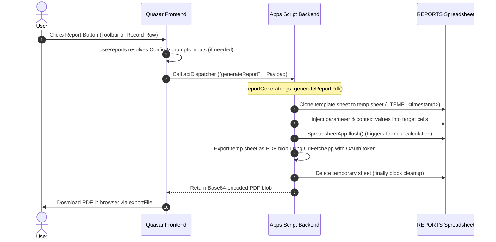

# AQL Reports System

## 1. End-to-End Report Architecture

The AQL report generation system is a hybrid process combining a Quasar web frontend, a Google Apps Script (GAS) API backend, and Google Sheets templates to generate, render, and export high-premium PDF reports.



---

## 2. Sheet Layout & Grid Sizing Constraints

To maintain a consistent, high-premium printable visual structure, every reporting sheet template must adhere to the following rules:

### A. Grid Layout
*   **Grid Sizing**: Every cell is configured to a width and height of exactly **20 pixels**.
*   **Row 1 to 8**: Dedicated corporate header containing logos, document title, and meta information.
*   **Marginal Boundaries**:
    *   **Outer Border**: Column A (1) and Column AM (39) are left empty.
    *   **Left Margin**: Column B (2) and Column C (3) are left empty.
    *   **Right Margin**: Column AK (37) and Column AL (38) are left empty.
*   **Data Zone**: All printable tables, titles, details, and totals must occupy exactly **Columns D through AJ (indices 4 to 36)**.

### B. Column Intent & Conditional Formatting
Report layouts are formatted into visual tables, sections, and cards using conditional formatting. 
*   **Anchor Columns**: Place key labels, section headers, or type identifiers in dedicated columns (typically Column D / index 4) to act as formatting anchors.
*   **Heading Anchors**: Place section headings in Column D (index 4) and leave other columns in that row blank. A conditional formatting rule such as `=($D10<>"")` can then automatically apply bold styles and background colors to the entire row range (e.g., `$B10:$AL`).
*   **Specific Patterns**: Prefix or suffix text in anchor columns with identifiable values (e.g., starting with `"Date:"`) to trigger formatting rules like `=LEFT($D10,5)="Date:"` for italicizing details.
*   **Consistency**: Design stacked report data to align similar fields (e.g. dates, quantities, actions) under the same column coordinates so conditional formatting ranges apply uniformly across all dynamic rows.

---

## 3. Shape-Safety & Formula Patterns

Google Sheets formula calculations will fail with `#REF!` or dimension mismatches unless these rules are strictly enforced:

### A. Dynamic 39-column Row Generator (`RowFn`)
Define and use a `RowFn` helper via `LAMBDA` at the beginning of the report's `LET` block to generate exactly 39 columns per row. Do not generate rows in any other way:
```excel
RowFn, LAMBDA(idx_val_pairs, MAP(SEQUENCE(1, 39), LAMBDA(col_idx, IFERROR(VLOOKUP(col_idx, idx_val_pairs, 2, FALSE), "")))),
```
*   **Spacer row**: `RowFn({0, ""})`
*   **Data row**: `RowFn({4, "Field 1"; 20, "Field 2"; 36, "Field 3"})`

### B. Virtual Array Manipulation
*   **CHOOSECOLS/CHOOSEROWS**: Never use `INDEX(array, 0, col)` or `INDEX(array, row, 0)` on in-memory/virtual arrays (which returns `#REF!`). Always use `CHOOSECOLS(array, col)` or `CHOOSEROWS(array, row)`.
*   **TOCOL**: Wrap extracted column vectors in `TOCOL()` (e.g., `TOCOL(CHOOSECOLS(array, 1))`) before passing them to matching functions like `MAP` to prevent size-mismatch errors.
*   **Variable Collisions**: Do not name variables inside `LET` blocks using words that can resolve to cell coordinates (e.g., `Row1`, `R1`, `C1`). Use names with underscores (e.g., `Row_1`, `Row_2`).

### C. Aggregating Memory Arrays
`SUMIF`, `SUMIFS`, `COUNTIF`, and `COUNTIFS` only work on physical spreadsheet ranges. They fail on virtual arrays.
*   To sum or count virtual arrays, always use `SUM` / `FILTER` wrapped in `IFERROR`:
    *   Summing: `SUM(IFERROR(FILTER(qtys, (codes = target_code)), 0))`
    *   Counting: `SUM(IFERROR(FILTER(OnesVector, (codes = target_code)), 0))`

### D. External Spreadsheet ID Lookups
Retrieve external spreadsheet IDs dynamically from the local `Config` sheet (columns Key, Value):
`VLOOKUP("TargetFileID", Config!A:B, 2, 0)`

---

## 4. Metadata Registry (`APP.Resources.Reports`)

Each resource in the `APP.Resources` database contains a `Reports` column storing a JSON array of report definitions.

```json
[
  {
    "id": "rep_1711234567890",
    "name": "product-list",
    "label": "Product List",
    "templateSheet": "Report.ProductList",
    "isRecordLevel": false,
    "inputs": [
      {
        "field": "Code",
        "targetCell": "B2"
      },
      {
        "label": "Date Range",
        "type": "date",
        "targetCell": "B3",
        "required": true
      },
      {
        "label": "User",
        "type": "select",
        "source": { "resource": "OutletRestocks", "field": "RequestedUser" },
        "default": "Any User",
        "targetCell": "J11"
      },
      {
        "default": "Company Name",
        "targetCell": "A1"
      }
    ],
    "pdfOptions": {
      "topMargin": 0,
      "bottomMargin": 0.25,
      "leftMargin": 0,
      "rightMargin": 0,
      "size": "A4",
      "portrait": true
    }
  }
]
```

### Report Fields Reference
*   `id`: String. Unique ID auto-generated by the Report Manager (`rep_<timestamp>`).
*   `name`: String. Slug identifier auto-derived from the label.
*   `label`: String. User-facing display name shown on action buttons.
*   `templateSheet`: String. The exact tab name in the REPORTS spreadsheet file to clone.
*   `isRecordLevel`: Boolean. If `true`, the report is shown inside the record detail/row dialog and is context-dependent. If `false` (default), it renders on the main page action toolbar.
*   `inputs`: Array. Defines parameters mapped to target cells in the template.
*   `pdfOptions`: Object. Layout override options for PDF generation.

### Input Mapping Patterns
| Source Type | Configuration Fields | Description |
|---|---|---|
| **Context (Record)** | `field`, `targetCell` | Sourced from the active record's field (e.g. record Code). |
| **User Input (Standard)** | `label`, `type`, `targetCell`, `required`, `default` | Prompts user via dialog. Types: `text`, `number`, `date`, `boolean`. |
| **User Input (Select - Static)**| `label`, `type`, `targetCell`, `options`, `default` | Dropdown containing a hardcoded list of strings. |
| **User Input (Select - Dynamic)**| `label`, `type`, `targetCell`, `source`, `default` | Dropdown sourced from a resource column: `{ "resource": "TableName", "field": "FieldName" }`. Frontend preloads the resource. |
| **Static Value** | `default`, `targetCell` | Fixed value injected into the target cell without prompt. |

### PDF Overrides (`pdfOptions`)
*   `topMargin` (default: `0`): Top margin in inches.
*   `bottomMargin` (default: `0.25`): Bottom margin in inches.
*   `leftMargin` (default: `0`): Left margin in inches.
*   `rightMargin` (default: `0`): Right margin in inches.
*   `size` (default: `"A4"`): Paper size (`A4`, `Letter`, `Legal`).
*   `portrait` (default: `true`): Orientation (`true` = portrait, `false` = landscape).

---

## 5. Apps Script Backend Implementation

### A. API Routing
The `apiDispatcher.gs` file routes the frontend action `generateReport` to the core generator function:
```javascript
case 'generateReport':
  return generateReportPdf(auth, data);
```

### B. Core Generator (`GAS/reportGenerator.gs`)
The `generateReportPdf(auth, data)` handles the processing flow:
1.  **Resolve Spreadsheet**: Finds the REPORTS spreadsheet file ID using `resolveFileIdForScope('report', '')`.
2.  **Clone Template**: Copies the sheet specified by `templateSheet` and renames it to `_TEMP_<timestamp>`.
3.  **Inject Cells**: Loops over `cellData` and calls `tempSheet.getRange(cell).setValue(value)` for each parameter.
4.  **Recalculate**: Calls `SpreadsheetApp.flush()` to force recalculation of all formulas.
5.  **Export to PDF**: Calls `_exportSheetAsPdf(spreadsheet, tempSheet, pdfOptions)` to build the Google Sheets export URL and fetch the PDF blob.
6.  **Cleanup**: In a `finally` block, deletes the temporary sheet using `reportsFile.deleteSheet(tempSheet)`.
7.  **Return Base64**: Encodes the PDF bytes and sends them back to the frontend.

### C. PDF Export Request
The export request is constructed by fetching a Google Sheets export URL:
`https://docs.google.com/spreadsheets/d/{ssId}/export?exportFormat=pdf&format=pdf&size={size}&portrait={portrait}&fitw=true&gridlines=false&printtitle=false&sheetnames=false&pagenum=UNDEFINED&fzr=true&top_margin={top}&bottom_margin={bottom}&left_margin={left}&right_margin={right}&gid={sheetId}`

*Note: `fitw=true` (fit to width) and `fzr=true` (repeat frozen rows on every page) are hardcoded and non-overrideable.*

---

## 6. Frontend Quasar Integration

There are **two** report UI containers. Both are presentation-only shells over the same
`useReports` composable; they differ in how they obtain record context and whether they
are overridable.

### A1. ResourceReports Action (`FRONTENT/src/components/actions/ResourceReports.vue`) — preferred
A first-class member of the **Action subsystem**, so it resolves through
`useActionResolver` and is overridable at all 10 `_ui/` tiers as `resourcereports.(vue|js)`.
Canonical spec: [UI_ACTION_SYSTEM.md](file:///f:/LITTLE%20LEAP/AQL/Documents/UI_ACTION_SYSTEM.md) §3.5.
*   **Mount points**: `PageAction` mounts it automatically on every non-form page; or
    mount it directly as `<Action action="ResourceReports" mode="toolbar" />`. The
    sticky form bar (`FormActions`) does **not** host it — it renders `FormAction*`
    buttons only.
*   **Context**: record from the `record` prop, else the injected `resourceRecord` —
    a record in context selects `isRecordLevel` reports, no record selects page-level ones.
*   **Modes**: `fab` (default floating FAB), `toolbar` (dropdown), `card` (bordered bar),
    `inline` (bare buttons, used inside the sticky form bar).
*   **Declarative control**: `noReports: true` (page-contract gate — drops only the
    report cluster, unlike `noActions` which drops every page action) or
    `reports: { mode: 'toolbar' }` on `PageAction`; a `reports` array/function prop
    to pin an explicit report list.
*   **Styling**: `push glossy` throughout, sharing the CRUD cluster's motion and
    elevation (`.aql-report-action-fab` `@extend`s `.aql-crud-action-fab`) but taking a
    horizontal **pill** footprint — icon + short `label` (default `'Reports'`) — in
    `teal-7` with white text. `card`/`inline` buttons carry `.aql-form-action-btn` +
    `.aql-report-action-btn`.
*   **Input dialog**: [`app/ReportInputDialog.vue`](file:///f:/LITTLE%20LEAP/AQL/FRONTENT/src/components/app/ReportInputDialog.vue)
    is a thin body over the shared
    [`shared/AqlDialog.vue`](file:///f:/LITTLE%20LEAP/AQL/FRONTENT/src/components/shared/AqlDialog.vue)
    shell — it supplies only the field list; header, banner, footer and transitions
    come from the shell. Fields render at Quasar's standard (non-`dense`) height for
    comfortable touch targets, per the mobile-first contract (ARCHITECTURE RULES §7).
*   **Dialog Integration**: Hosts the `ReportInputDialog` modal to display dynamic inputs.

### A2. ResourceReports Component (`FRONTENT/src/components/Reports/ResourceReports.vue`) — legacy
Retained unchanged for the custom views and pages that import it directly.
*   **Auto-Derivation**: Uses `useResourceConfig()` to resolve the active resource context, scope, name, and current code, and `useDataStore` to look the record up by route code.
*   **Modes**:
    *   *Toolbar Mode*: Renders a list of flat, bordered buttons at the top of the resource grid.
    *   *Inline Mode*: Renders buttons inline when context (record row) is present.
*   **Dialog Integration**: Hosts the `ReportInputDialog` modal to display dynamic inputs.

### B. Reports Composable (`FRONTENT/src/composables/reports/useReports.js`)
Handles state orchestration:
*   **State Refs**: `isGenerating`, `showReportDialog`, `activeReport`, `reportInputs`, `activeRecord`.
*   **`initiateReport(report, record)`**: Resolves if user inputs are required. If so, it pre-seeds defaults. If a select input uses a dynamic resource `source`, it triggers `dataStore.loadResource` to seed option lists.
*   **`executeReport(report, userValues, record)`**: Builds the payload array of `{ cell, value }` by joining context fields, static defaults, and user form inputs, triggers the store action `resourceIoStore.generateReportFile`, parses the Base64 response, and downloads the PDF via Quasar's `exportFile` helper.

---

## 7. AQL Sheet Menu Admin Dialog

Accessed via **AQL 🚀 > Manage Reports** in the spreadsheet menu.

*   **Menu Handler (`GAS/appMenu.gs`)**:
    *   `app_showReportManagerDialog()`: Opens `reportManager.html` as a modal dialog ($900 \times 600$).
    *   `app_getReportManagerData()`: Returns all resource configurations, active reports list, and available template sheets.
    *   `app_saveResourceReports(resourceName, reportsJson)`: Writes the updated JSON config directly to the `Reports` column of the specified resource row in the `APP.Resources` spreadsheet and triggers `clearResourceConfigCache()`.

*   **Caching Flow**:
    Resource configurations (including reports) are cached across 3 tiers:
    1.  **Tier 1**: Execution-level in-memory cache (`_resource_config_map_cache`).
    2.  **Tier 2**: CacheService (`AQL_RESOURCE_CONFIG_MAP_V2`) with a 5-minute TTL.
    3.  **Tier 3**: `APP.Metadata` sheet row (permanent fallback).
    *Saving a report configuration automatically clears all three tiers via `clearResourceConfigCache()` to ensure instant activation.*
