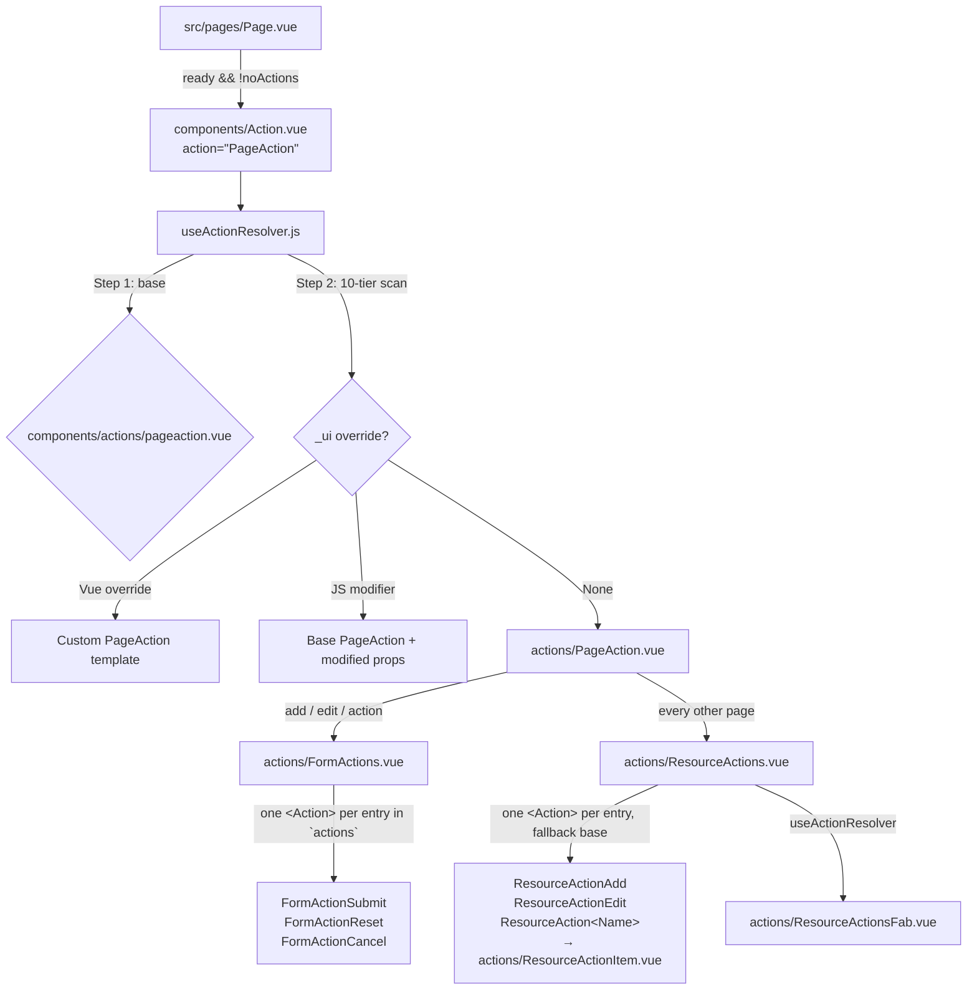

# AQL Action System Guide

This is the canonical reference for AQL's **Action Subsystem** — the third first-class
placeholder paradigm alongside `Section.vue` and `Content.vue`.

| Paradigm | Placeholder | Resolver | Base folder | Renders |
|----------|-------------|----------|-------------|---------|
| Section | `components/Section.vue` (`AqlSection`) | `useSectionResolver.js` | `components/sections/` | Page chrome (header, filter, switcher) |
| Content | `components/Content.vue` (`AqlContent`) | `useContentResolver.js` | `components/contents/` | Page body, inside `AqlContentWrapper` |
| **Action** | **`components/Action.vue` (`AqlAction`)** | **`useActionResolver.js`** | **`components/actions/`** | **Page-level actions: sticky form bar, unified resource-action FABs** |

All three share the identical 10-tier `_ui/` override model. Only the base folder and
the identity prop (`section` / `content` / `action`) differ.

---

## 1. Architectural Overview



### 1.1 Why a separate subsystem
Actions are structurally different from sections and contents:

* They are mounted **outside** `.aql-page-body`, as a direct `q-page` child, because the
  page entrance animation applies a CSS `transform` to body children — and a transformed
  ancestor becomes the containing block for `position: fixed` descendants, which would
  trap the `q-page-sticky` FAB at the end of the content flow instead of the viewport.
* They are the only components that **dispatch** (submit / execute / reset), so their
  override surface has to reach the submission lifecycle, not just presentation.
* They compose recursively — `PageAction` mounts `FormActions`, which mounts individual
  buttons — and every level must be independently overridable.

Giving them their own placeholder + resolver + folder makes each of those levels an
addressable override target instead of a hardcoded child.

### 1.2 Page integration (`src/pages/Page.vue`)
```html
<Action
  v-if="ready && pageProps.noActions !== true"
  action="PageAction"
  v-bind="pageProps"
/>
```
Mounted after `AqlContentWrapper`, as a **sibling of the `<Transition>`** — never inside
`.aql-page-body`.

> [!NOTE]
> The Action subsystem mounts on **every** resource page; it is not driven by the page
> contract's `sections` array at all. `PageAction` no longer needs to be declared in
> `sections` (and `usePageResolver` still filters it out of `visibleSectionsBeforeAction`
> if a contract lists it). The only opt-out is `noActions: true` in a page contract or JS
> modifier, which suppresses the `<Action>` mount. It does **not** affect the
> AdditionalActions dialog — that subsystem is independent of `<Action>` entirely (§7).

### 1.3 The Action Placeholder (`src/components/Action.vue`)
`AqlAction` mirrors `Section.vue` / `Content.vue` exactly:
* Accepts a required `action: String` prop; captures everything else via `useAttrs()`.
* Builds `preparedProps = { ...attrs, action }` and calls `useActionResolver(preparedProps)`.
* Handles three states:
  1. **Loading (`!ready`)** — `q-spinner-dots`.
  2. **Resolved** — `<component :is="resolvedComponent" v-bind="finalProps" />`.
  3. **Undefined** — an "Action Not Defined" warning card naming the action, page,
     resource, and scope.
* `inheritAttrs: false`, so nothing leaks onto the DOM.
* Accepts an optional **`fallback`** prop (a component, excluded from the resolved
  props) forwarded to `useActionResolver` as `defaultComponent`. This is what lets
  a container mount *dynamically named* actions — e.g. `ResourceActions`' per-item
  `ResourceActionApprove` — against a generic base (`ResourceActionItem`) instead
  of the warning card, while keeping every `_ui/` tier able to override that name.

### 1.4 The Action Resolver (`src/composables/resources/useActionResolver.js`)
Two Vite glob registries built once at module load, both lowercasing every path key
(so **all file names are case-insensitive on every OS**):

| Registry | Source Glob | Key Format |
|----------|-------------|------------|
| `frameworkRegistry` | `../../components/**/*.{vue,js}` | `components/…` (lowercased) |
| `customUiRegistry` | `../../_ui/**/*.{vue,js}` | `_ui/…` (lowercased) |

It injects `resourceConfig`, `resourceRecord`, and `pageState` internally so it can hand
them to JS modifier functions, and re-exports `evaluateProp` so action components get the
same closure-prop semantics as sections without importing the section resolver.

Signature: `useActionResolver(preparedProps, defaultComponent = null) => { ready, resolvedComponent, finalProps }`

> [!IMPORTANT]
> **`finalProps` is reactive, not a snapshot.** `useSectionResolver` / `useContentResolver`
> assign their merged props *inside* the watch callback, which only re-runs when one of the
> five lookup keys (`action`/`section`/`content`, `page`, `scope`, `resource`, `uiName`)
> changes — so any other prop is frozen at first resolve. Action props change without
> touching a lookup key constantly: a submit button enabling once an outcome is selected, a
> label switching on record status, `disabled` flipping mid-form. `useActionResolver`
> therefore exposes `finalProps` as a **computed** over the live `preparedProps`, caching
> only the JS-modifier result (the one thing the async scan actually produced):
> ```javascript
> const finalProps = computed(() => {
>   const current = preparedProps.value || {}
>   return modifierProps.value ? { ...current, ...modifierProps.value } : current
> })
> ```
> Practical consequence: a JS modifier's returned object always wins over live props, and it
> is evaluated **once** per resolve. Use function-valued props (evaluated per render by the
> receiving component through `evaluateProp`) when a modifier needs to react to record state.

---

## 2. Resolution Sequence

### 2.1 Step 1 — Base action component
First match wins:
1. `_ui/{uiName}/components/actions/{action}.vue` — tenant-wide generic base.
2. `components/actions/{action}.vue` — framework default base.
3. Otherwise, the first `.vue` candidate from the 10-tier list below is promoted to base.
4. Otherwise, the caller-supplied `defaultComponent` (used by `PageAction.vue` when it
   resolves `FormActions` / `ResourceActions`).
5. Otherwise, `Action.vue` renders the "Action Not Defined" card.

### 2.2 Step 2 — The 10-Tier Override Scan
Identical in shape to the Section and Content resolvers (first match wins):

| # | Tier | Path | Type |
|---|------|------|------|
| 1 | resource + page | `_ui/{ui}/components/{scope}/{Resource}/{page}/{Action}.vue` | Vue override |
| 2 | resource + page | `_ui/{ui}/components/{scope}/{Resource}/{page}/{Action}.js` | JS modifier |
| 3 | resource | `_ui/{ui}/components/{scope}/{Resource}/{Action}.vue` | Vue override |
| 4 | resource | `_ui/{ui}/components/{scope}/{Resource}/{Action}.js` | JS modifier |
| 5 | page | `_ui/{ui}/components/{scope}/{page}/{Action}.vue` | Vue override |
| 6 | page | `_ui/{ui}/components/{scope}/{page}/{Action}.js` | JS modifier |
| 7 | scope-wide | `_ui/{ui}/components/{scope}/{Action}.vue` | Vue override |
| 8 | scope-wide | `_ui/{ui}/components/{scope}/{Action}.js` | JS modifier |
| 9 | ui-wide | `_ui/{ui}/components/{Action}.vue` | Vue override |
| 10 | ui-wide | `_ui/{ui}/components/{Action}.js` | JS modifier |

**Path segment transformation rules** (get these wrong and nothing resolves):

| Segment | Input | Transformation | Example |
|---------|-------|----------------|---------|
| `{ui}` | `customUIName` | Lowercased as-is (defaults to `AQL`) | `aql` |
| `{scope}` | Route scope | Lowercased as-is | `master` |
| `{Resource}` | Resource slug | `toPascalCase` → then lowercased | `'purchase-orders'` → `PurchaseOrders` → `purchaseorders` |
| `{page}` | Canonical page | Lowercased as-is | `add` |
| `{Action}` | Action name | Lowercased as-is | `formactionsubmit` |

### 2.3 Vue Overrides vs JS Modifiers
* **Vue override (`.vue`)** — replaces the base action entirely. `finalProps` flows through
  unmodified so the override can use `$attrs`.
* **JS modifier (`.js`)** — keeps the base action and adjusts its props:
  ```javascript
  // _ui/AQL/components/master/products/add/formactionsubmit.js
  export default (currentProps, { pageState, resourceRecord, resourceConfig }) => ({
    label: (record) => record?.Status === 'Draft' ? 'Save Draft' : 'Create Product',
    color: 'accent',
    icon: 'cloud_upload'
  })
  ```
  A plain object export works too. Function-valued props are evaluated by the receiving
  component through `evaluateProp(val, resourceRecord, resourceConfig)`, which calls the
  closure with **plain unwrapped objects** `(record, config)` — never call `.value` inside.

### 2.4 Targeted props from an ancestor (`Props<Identity>`)

`useActionResolver` participates in the shared `Props<Identity>` system, so a page contract or JS modifier can address one action directly instead of spraying props at every placeholder:

```javascript
// _ui/AQL/pages/Master/Products/Add.js
export default {
  PropsAction:             { dense: true },              // broadcast: every action
  PropsFormActionSubmit:   { label: 'Create Product' },  // just the submit button
  PropsPageAction:         { noFab: true }               // just the page FAB
}
```

The matching block is spread **flat** onto the action (`props.label`, not `props.PropsFormActionSubmit.label`), and a JS modifier still wins over it. Precedence: `drilled attrs → PropsAction → Props<Identity> → JS modifier`.

Full contract, including the case-insensitivity, function-block and `inheritAttrs` rules: [UI_PAGE_AND_SECTION_SYSTEM.md](file:///f:/LITTLE%20LEAP/AQL/Documents/UI_PAGE_AND_SECTION_SYSTEM.md) §1.4.1.

---

## 3. The `components/actions/` Directory

| Component | Role |
|-----------|------|
| `PageAction.vue` | Root action container. Owns the submission lifecycle and picks the live cluster per route. |
| `FormActions.vue` | Sticky bottom bar. Renders a configurable list of buttons, each through `<Action>`. |
| `FormActionSubmit.vue` | Base submit button. |
| `FormActionReset.vue` | Base reset button. |
| `FormActionCancel.vue` | Base cancel button — self-navigates via `nav.goBack()`. |
| `FormActionNext.vue` | Base wizard "advance a step" button — dispatcher default `currentStep + 1`. |
| `FormActionBack.vue` | Base wizard "go back a step" button — dispatcher default `max(1, currentStep - 1)`. |
| `ResourceActions.vue` | **Unified bottom-right FAB cluster** (CRUD + AdditionalActions) with the 750ms-delayed `bounceIn` entrance. |
| `ResourceActionItem.vue` | Generic per-item base — round FAB standalone, `q-fab-action` inside the menu. |
| `ResourceActionsFab.vue` | Expandable menu trigger hosting the items via its default slot. |
| `ResourceReports.vue` | Report downloads as an action — pill FAB, toolbar dropdown, card bar, or inline buttons. |

> [!IMPORTANT]
> **Action components carry no `<style>` block.** Every rule lives in
> `src/css/custom.scss` under `.aql-form-actions-*` / `.aql-resource-action-*` /
> `.aql-report-action-*` (ARCHITECTURE RULES §7).

### 3.1 `PageAction.vue`
Mounted by `Page.vue`. Decides which cluster is live:
* `add` / `edit` / `action` → `FormActions` (the sticky bar owns these pages entirely).
* everything else → `ResourceActions` (which applies its own permission/record/
  `visibleWhen` gating per item) **and** `ResourceReports` (which applies its own
  reports-exist gating).

**The two halves of the `FormActions` gate.** Route intent alone is not enough:

| Computed | Meaning | Gates |
|---|---|---|
| `isFormRoute` | `isAdd \|\| isEdit \|\| isAction` — this URL is a form page | `ResourceActions`, `ResourceReports` (both `!isFormRoute`) |
| `hasFormNodes` | `pageState.hasNodes` — the form state is initialized | — |
| `showFormActions` | **both** of the above | `FormActions` |

`showFormActions` and `!isFormRoute` are deliberately **not** inverses.
* `FormActions` needs BOTH halves, so the sticky bar cannot render over a form
  whose nodes have not been created yet — Submit there would build an empty batch.
* The two FAB clusters gate on `isFormRoute` only. Keying them off
  `!showFormActions` would flash Add/Edit FABs on top of an uninitialized form
  page, and would let anything that clears `pageState` on a browse page (a popup
  modal, for instance) suppress the background clusters. On an add/edit route with
  no nodes yet, **no** cluster renders.
* `hasFormNodes` falls back to `true` when `pageState` is not injected, or when the
  injected object predates `hasNodes` — a full `pageaction.vue` override or a
  non-standard provider keeps its previous behaviour.

`hasNodes` is exported by `usePageState` (`state.nodes.size > 0`); see
[UI_PAGE_STATE.md](file:///f:/LITTLE%20LEAP/AQL/Documents/UI_PAGE_STATE.md) §6.4. It is
node-count only — for a specific node use `useNode(resource).exists`.

All three clusters are mounted through `useActionResolver` (with the framework component as
`defaultComponent`), so each is independently overridable at any of the 10 tiers.

**Props** — every one is settable from a `pageaction.js` JS modifier:

| Prop | Type | Default | Description |
|------|------|---------|-------------|
| `page` | `String` (required) | — | Canonical page name |
| `scope` / `resource` / `uiName` | `String` | `null` | Resolver context; falls back to injected `resourceConfig` |
| `actions` | `Array` | `null` | Forwarded to `FormActions`; `null` lets `FormActions`' own default apply |
| `reports` | `Boolean\|Object` | `true` | Report cluster on non-form pages. `false` suppresses it; an object is spread onto `ResourceReports` (e.g. `{ mode: 'toolbar' }`) |
| `noReports` | `Boolean` | `false` | Page-contract gate — suppresses only the report cluster, leaving the CRUD FABs (cf. `noActions`, which suppresses everything) |
| `submit` / `reset` / `cancel` | `Function` | `null` | Unified action handlers — see §3.1.1 |
| `modifyPayload` | `Function` | `null` | `(requests, ctx) => requests` payload interceptor |
| `successRoute` | `String\|Function` | `null` | `'view'` \| `'index'` \| `(code, ctx) => target` |
| `successMessage` | `String\|Function` | `''` | Notification text on success |
| `onSubmitSuccess` | `Function` | `null` | `({ response, code }, ctx) => void` — replaces default navigation |
| `onSubmitError` | `Function` | `null` | `(result, ctx) => void` |
| `submitLabel` | `String\|Function` | `null` | Overrides the derived label (`Create` / `Save` / action label) |

`ctx` is `{ pageState, resourceConfig, resourceRecord, nav }`.

#### 3.1.1 The unified action dispatcher

Every button in the bar — built-in or custom — routes through one function,
`handleAction(actionName, extraPayload)`. There is no per-action prop pipeline and no
`beforeSubmit`: a handler is simply looked up **by the action's own name**.

```
button click
   │
   ├─ resolveHandler(actionName)
   │     built-in key ('submit'|'reset'|'cancel') → props[actionName]
   │     custom key   ('nextStep', …)             → $attrs[actionName]
   │
   ├─ no handler AND not built-in → console.warn('[PageAction] No action handler supplied for:', name) → stop
   │
   ├─ handler? → result = await handler(actionName, ctx)      ctx = { pageState, resourceConfig, resourceRecord, nav, payload }
   │      result === false          → abort
   │      result.valid === false    → abort (notify result.message if present)
   │      Array                     → { requests: [...] }
   │      Object                    → merged into the pageState call options
   │      undefined | true          → continue with defaults
   │
   └─ built-in default
         submit → pageState.submit(options)  (or pageState.run() on an action page)
         reset  → onReset()
         cancel → nav.goBack()
         custom → pageState.run(options), but only when the handler returned
                  `requests` or `build`; otherwise the handler is assumed to have
                  done its own work
```

Handlers are `async`-aware — a returned promise is awaited before the built-in runs.
Returned options are merged **over** the defaults, except `onSuccess`, which is only
filled in when the handler did not supply one.

```javascript
// _ui/AQL/components/operation/purchaseorders/add/pageaction.js
export default {
  // Veto — the built-in pageState.submit() never runs
  submit: (name, { pageState }) => {
    const node = pageState.state.nodes.get('PurchaseOrders')
    if (!node?.children?.length) return { valid: false, message: 'Add at least one item.' }
  },

  // Confirm before discarding; returning false leaves the form untouched
  reset: () => window.confirm('Discard all changes?'),

  // Custom key — requires `actions: [..., 'nextStep', ...]` on FormActions.
  // Returning requests dispatches them through pageState.run().
  nextStep: (name, { pageState }) => [ /* …request objects… */ ]
}
```

A custom key listed in `actions` with **no** handler is a no-op plus a console warning —
the button still renders, so the misconfiguration is visible rather than silent.

> [!NOTE]
> A custom action key must be listed in `FormActions`' `actions` array to render a
> button, and its handler must be exported from a `pageaction.js` modifier (it reaches
> `PageAction` via `$attrs`, since only `submit`/`reset`/`cancel` are declared props).

**Wizard step actions (`next` / `back`).** Both have a dispatcher default —
`currentStep + 1` and `Math.max(1, currentStep - 1)` — so `actions: ['back', 'next']`
drives a multi-step page with no handler at all, and neither key warns when unhandled.
They are *not* declared props, so a page overrides them from a `pageaction.js` modifier
exactly like a custom key:

```javascript
next: (name, { pageState }) => {
  if (!pageState.getControlField('Orders', 'OutletCode')) {
    return { valid: false, message: 'Select an outlet to continue.' }   // veto: step does not move
  }
  // return nothing → the built-in increment performs the move
}
```

> [!IMPORTANT]
> The step change lives in the **dispatcher**, not in `FormActionNext`/`FormActionBack`.
> A button that moved the step on click would have already advanced by the time an async
> handler's `{ valid: false }` resolved, making the veto useless — the same reason
> `FormActionCancel` reports intent instead of navigating. A handler that moves the step
> itself must therefore return `false` to suppress the built-in, or it will double-step.

**Reset semantics (`onReset`)** — a silent discard, no navigation and no notification:
* On `add`: `pageState.initResource(resource, { isPrimaryKey: true, reset: true })` swaps in
  a fresh record object. `FormRecord.vue` keys its default-seeding watch on that object's
  identity, so the resource's configured default values are re-seeded rather than leaving
  a blank form.
* On `edit` / `action`: additionally `pageState.load(resource, original)` re-hydrates the
  pristine server record (`resourceRecord` is never mutated by form input — only
  `pageState.node.record` is), so unsaved edits are discarded without losing originals.

> [!NOTE]
> `FormActions` deliberately does **not** receive `...attrs`. `pageProps` carries an
> `onCancel` (navigateBack) handler that Vue would bind as a `cancel` emit listener,
> double-navigating on top of `FormActionCancel`'s own `goBack()`.

### 3.2 `FormActions.vue` — the configurable action array
Renders the sticky bar chrome and one `<Action>` per entry in `actions`:

```html
<div class="aql-form-actions-spacer">
  <div class="aql-form-actions-bar shadow-up-3">
    <div class="aql-form-actions-content row items-center justify-end q-gutter-sm">
      <Action v-for="entry in resolvedActions" :key="entry.id" :action="entry.action" v-bind="entry.props" />
    </div>
  </div>
</div>
```

**Name mapping**: a short key is prefixed with `FormAction` and capitalised; an
already-qualified name passes through.

| `actions` entry | Resolved action name | Base component |
|-----------------|----------------------|----------------|
| `'submit'` | `FormActionSubmit` | `actions/FormActionSubmit.vue` |
| `'reset'` | `FormActionReset` | `actions/FormActionReset.vue` |
| `'cancel'` | `FormActionCancel` | `actions/FormActionCancel.vue` |
| `'next'` | `FormActionNext` | `actions/FormActionNext.vue` |
| `'back'` | `FormActionBack` | `actions/FormActionBack.vue` |
| `'FormActionNext'` | `FormActionNext` | same as above |

> [!NOTE]
> The bar hosts `FormAction*` buttons only — there are no non-`FormAction` aliases.
> In particular `ResourceReports` is **not** mountable from `actions`; reports are a
> browse/view-page affordance (see §3.5). Mount it directly with
> `<Action action="ResourceReports" … />` if a form page genuinely needs one.

**Props**:

| Prop | Type | Default | Description |
|------|------|---------|-------------|
| `actions` | `Array` | `['reset', 'submit']` | Ordered button list, left → right. Entries are strings or `{ name, ...props }` objects |
| `page` / `scope` / `resource` / `uiName` | `String` | `null` | Resolver context passed to every button `<Action>` |
| `submitLabel` / `resetLabel` / `cancelLabel` | `String\|Function` | `'Save'` / `'Reset'` / `'Cancel'` | |
| `submitIcon` / `resetIcon` / `cancelIcon` | `String\|Function` | `'check'` / `'restart_alt'` / `'close'` | |
| `submitColor` / `resetColor` / `cancelColor` | `String\|Function` | `'primary'` / `'grey-7'` / `'grey-7'` | |
| `disabled` | `Boolean\|Function` | `false` | Submit-only gate (e.g. an action page awaiting an outcome) |
| `actionProps` | `Object` | `{}` | Extra props merged per key, e.g. `{ submit: { icon: 'send' } }` |

**Emits**: `submit`, `reset`, `cancel`, and `action(key)` for any unrecognised key.

**Prop merge order per button** (later wins):
`resolverContext` → per-key defaults → `actionProps[key]` → object-entry extras.

Common configurations:
```javascript
// Default — in-place reset next to submit
actions: ['reset', 'submit']

// Discard-and-leave instead of in-place reset
actions: ['cancel', 'submit']

// Multi-step wizard, driven by pageState.meta.currentStep. With no `next`/`back`
// handler the dispatcher's built-in step move runs, so this works as-is.
actions: ['back', 'next']

// Custom key, with a tenant-supplied FormActionDraft under _ui/
actions: ['cancel', 'draft', 'submit']

// Object entries for one-off prop tweaks
actions: ['reset', { name: 'submit', label: 'Publish', icon: 'send' }]
```

### 3.3 The button components
All three share the same shape: `inheritAttrs: false`, `[String, Function]` prop types
evaluated through `evaluateProp`, and `pageState` injected for the in-flight state.

| Prop | Type | `FormActionSubmit` | `FormActionReset` | `FormActionCancel` |
|------|------|--------------------|-------------------|--------------------|
| `label` | `String\|Function` | `'Save'` | `'Reset'` | `'Cancel'` |
| `icon` | `String\|Function` | `'check'` | `'restart_alt'` | `'close'` |
| `color` | `String\|Function` | `'primary'` | `'grey-7'` | `'grey-7'` |
| `disabled` | `Boolean\|Function` | `false` | `false` | `false` |
| `flat` / `unelevated` | `Boolean` | `false` / `false` | `false` / `false` | `false` / `false` |
| `cancelHandler` | `Function` | — | — | `null` (local escape hatch, see below) |

**Emits**: `click`. **All three report intent upward** — `PageAction.handleAction()` owns
every behaviour, including `cancel` → `nav.goBack()`. A button must never navigate or
dispatch on its own: `cancel` doing so would pop two history entries per click and would
make a `cancel` handler returning `false` unable to veto the navigation.

`cancelHandler` exists only for standalone use outside `PageAction`. When supplied it
**replaces** the emit entirely, so the container never also navigates.

> [!IMPORTANT]
> The cancel override prop is named `cancelHandler`, **not** `onCancel`. Vue treats any
> `onXxx` prop as an emit listener, which would silently bind `pageProps.onCancel`.

#### Styling
All three render as `push glossy` Quasar buttons carrying `.aql-form-action-btn`
(`padding: 6px 18px`, `font-weight: 600`, `min-height: 40px`, `border-radius: 8px`,
`.q-icon { font-size: 20px }` — defined in `custom.scss`, scoped as `.q-btn.aql-form-action-btn`
so it outranks Quasar's equal-specificity rules regardless of load order).

> [!IMPORTANT]
> `flat` and `unelevated` both default to **`false`** on all three buttons. Quasar's
> `flat` and `unelevated` each suppress the shadow that `push glossy` renders, so leaving
> either one on would make the styling inert. Visual subordination of Reset/Cancel to
> Submit comes from `color` (`grey-7` vs `primary`), not from flatness. Setting
> `flat: true` via a modifier is still supported — it just opts that button out of the
> push/glossy treatment.

### 3.4 `ResourceActions.vue` — the unified FAB cluster
The single bottom-right action cluster on every non-form page (evolution of the former
`CrudActions.vue`, which it replaces along with `AddFab`/`EditFab`/`CrudActionsFab`).
It unifies **two action sources** into one responsive cluster, so resource pages never
grow multiple competing right-side FABs:

| Source | Entry | Gate | Default click behaviour |
|--------|-------|------|-------------------------|
| Permissions | `ResourceActionAdd` | `permissions.canWrite` | `nav.goTo('add')` |
| Permissions | `ResourceActionEdit` | `permissions.canUpdate` **and** a record in context | `nav.goTo('edit')` |
| `useAdditionalActions().entriesFor(record)` | `ResourceAction<Name>` (e.g. `ResourceActionPostpone`) | applied by the composable — record in context, `can<Action>` not explicitly `false`, `visibleWhen` satisfied | the entry's bound `run()` — `navigate` routes, `mutate` opens the shared dialog |

> [!IMPORTANT]
> **`ResourceActions` owns no workflow logic.** It calls `entriesFor(record)` and merges
> its resolver context into each returned entry's props — nothing more. Permission
> gating, `visibleWhen`, and navigate-vs-mutate dispatch live in
> `composables/resources/useAdditionalActions.js` (§7), shared with the embeddable
> `components/app/AdditionalActionsButtons.vue`. A component that re-derives eligibility
> will drift from the config contract.

**Layout** — driven by the number of visible entries:

| Entries | Renders |
|---------|---------|
| 0 | Nothing (no empty FAB ever floats) |
| 1 | One standalone round FAB (`push glossy`, the entry's own color) |
| ≥ 2 | One expandable `ResourceActionsFab` menu (`push glossy` three-dot trigger) hosting every entry as a staggered `q-fab-action` with an external pill label |

Never rendered on `add` / `edit` / `action` pages — `FormActions` owns those. `PageAction`
gates the mount, and the component re-checks internally so a direct
`<Action action="ResourceActions" />` mount obeys the same rule.

**Per-item 10-tier overridability.** Every entry is mounted through `<Action>` under its
own action name with `ResourceActionItem` as the `fallback` base (§1.3). Because the name
flows through the normal resolver, each item's icon, color, label, visibility, and click
behaviour is overridable at all 10 `_ui/` tiers as `resourceaction<name>.(vue|js)` —
e.g. `_ui/AQL/components/operation/purchaseorders/view/resourceactionapprove.js`.
A JS modifier can return presentation props (`icon`, `color`, `label`, `tooltip`,
function-valued via `evaluateProp`), self-hide the item (`show: false` / `hide: true`),
or replace its click behaviour outright with `handler: (ctx) => …`,
`ctx = { record, config, pageState, nav }` — `handler` REPLACES the `click` emit, the
per-item counterpart of `FormActionCancel`'s `cancelHandler`.

The menu trigger resolves the same way as `ResourceActionsFab`
(`resourceactionsfab.(vue|js)`), and the whole cluster as `ResourceActions`
(`resourceactions.(vue|js)`); a container modifier returning `show: false` / `hide: true`
(plain boolean or function) suppresses everything.

**Workflow dispatch.** `ResourceActions` never opens a dialog itself — it invokes the
`run()` the composable bound to each entry, which routes a `navigate` action or opens
the single dialog mounted in `MainLayout.vue`. `noActions: true` suppresses the whole
`<Action>` mount (and with it these FAB triggers), but the dialog is independent of
`<Action>`, so an `AdditionalActionsButtons` trigger elsewhere on the page keeps working.

The `.aql-resource-action-container` entrance animation is applied to an **inner wrapper**,
never to the `q-page-sticky` root — a CSS transform on a `position: fixed` ancestor turns
it into the containing block for its fixed descendants and breaks FAB positioning.

> [!NOTE]
> **Migration from `CrudActions`.** Override names moved: `crudactions.(vue|js)` →
> `resourceactions.(vue|js)`, `addfab`/`editfab` → `resourceactionadd`/`resourceactionedit`,
> `crudactionsfab` → `resourceactionsfab`. No tenant override under any of the old names
> exists in the repo, so the rename is behaviour-preserving. CSS classes renamed in step:
> `.aql-crud-action-*` → `.aql-resource-action-*`.

### 3.5 `ResourceReports.vue`
Report downloads as a first-class action. `PageAction` mounts it on every **non-form**
page next to `ResourceActions`. The sticky form bar does **not** host it — `FormActions`
resolves `FormAction*` buttons only. It is directly mountable anywhere as
`<Action action="ResourceReports" mode="toolbar" />`.

**Context adaptation** — the record context decides which half of the registry shows:

| Record context | Reports shown |
|----------------|---------------|
| `record` prop, else injected `resourceRecord` is set (View page) | `isRecordLevel === true` |
| No record (Index / browse page) | `isRecordLevel !== true` |

**Modes**:

| `mode` | Renders |
|--------|---------|
| `'fab'` *(default)* | `q-page-sticky` + a **pill** `q-fab` (icon + `label`) with one `q-fab-action` per report |
| `'toolbar'` | Flat round `q-btn` opening a `q-menu` list — for a header/toolbar slot |
| `'card'` | Flat bordered card wrapping a row of buttons — for embedding in a page body |
| `'inline'` | Bare `push glossy` buttons, used when mounted inside the `FormActions` bar |

**Props** — all `[Type, Function]` and evaluated through `evaluateProp`:

| Prop | Type | Default | Description |
|------|------|---------|-------------|
| `mode` | `String\|Function` | `'fab'` | See the mode table above |
| `label` | `String\|Function` | `'Reports'` | Short label beside the icon — this is what gives the FAB its pill footprint |
| `record` | `Object\|Function` | `null` | Explicit record context; falls back to injected `resourceRecord` |
| `reports` | `Array\|Function` | `null` | Replaces the config-derived list, so a page action config can declare exactly which reports appear |
| `color` / `itemColor` | `String\|Function` | `'teal-7'` / `'teal-7'` | Distinct from the navy CRUD cluster without competing with it |
| `textColor` | `String\|Function` | `'white'` | Content colour on those solid surfaces |
| `icon` / `activeIcon` | `String\|Function` | `'picture_as_pdf'` / `'close'` | |
| `tooltip` | `String\|Function` | `'Download Reports'` | |
| `position` / `offset` | `String\|Function` / `Array\|Function` | `'bottom-left'` / `[18, 18]` | `q-page-sticky` placement in `fab` mode — bottom-**left** so it never collides with the bottom-right CRUD cluster |
| `show` / `hide` | `Boolean\|Function` | `true` / `false` | Same suppression contract as `ResourceActions` |
| `noReports` | `Boolean\|Function` | `false` | Page-contract gate, mirroring `noActions` — see below |
| `page` / `scope` / `resource` / `uiName` | `String` | `null` | Resolver context |

**The `noReports` gate.** `noActions: true` in a page contract or JS modifier suppresses
the entire `<Action>` mount from `Page.vue`. `noReports: true` is the narrower switch:
it drops only the report cluster and leaves the CRUD FABs in place. It is declared on
**both** `PageAction` (which also checks `$attrs.noReports`, so a full `pageaction.vue`
override or an intermediate wrapper cannot lose the gate) and `ResourceReports` itself
(so a direct `<Action action="ResourceReports" no-reports />` mount obeys it too).

```javascript
// _ui/AQL/pages/index.js — CRUD FABs stay, report FAB goes
export default { noReports: true }
```

> [!IMPORTANT]
> **`ResourceReports` is self-dispatching** — the one deliberate exception to
> "buttons never act on their own" (§3.3). Submit/Reset/Cancel emit intent because
> `PageAction.handleAction()` dispatches them through `pageState`; a report download
> never touches `pageState`. Routing it through the dispatcher would push report
> knowledge into the submission lifecycle, so it calls `useReports` directly. It
> therefore emits nothing and takes no `@`-handler from its container.

**Layer boundary**: the component is presentation only. Input-dialog state, dynamic
select preloading (`dataStore.loadResource` for `type: 'select'` inputs with a
`source`), progress notifications, and the Base64 → Blob download all live in
`useReports` (`src/composables/reports/useReports.js`) — see
[FEATURE_REPORTS_SYSTEM.md](file:///f:/LITTLE%20LEAP/AQL/Documents/FEATURE_REPORTS_SYSTEM.md).

**Styling**: `push glossy` throughout, matching the `ResourceActions` cluster and the
`FormActions` bar buttons. `.aql-report-action-fab` `@extend`s `.aql-resource-action-fab`,
so both floating clusters share one shadow, hover-lift and press-scale — but the report
FAB takes a **horizontal pill** footprint — Quasar's own geometry for a labelled QFab,
not a CSS override (icon + short `label`)
rather than the CRUD cluster's round FAB, because reports are a utility affordance and
the label makes that legible without a hover. The `card`/`inline` buttons carry
`.aql-form-action-btn` for sticky-bar padding and weight, plus `.aql-report-action-btn`
for the same pill radius. Report-specific rules in `custom.scss` are
`.aql-report-action-{container,fab,item,btn,label,card,card-inner}`. No `<style>` block,
per §7 of ARCHITECTURE RULES.

> [!IMPORTANT]
> The pill treatment is **exclusive to `ResourceReports`**. `ResourceActions` and its FABs
> keep their round footprint and navy palette unchanged — the two clusters share motion
> and elevation, not shape or colour.

> [!NOTE]
> The legacy `components/Reports/ResourceReports.vue` is untouched and still works for
> every direct import in custom views and pages (`<ResourceReports :record="…" />`).
> It resolves its record from the route code via `useDataStore`; the action version
> uses the injected `resourceRecord` instead, which is what a resolver-backed
> component is supposed to do. New work should use the action.

---

## 4. Tenant Override Cookbook

All paths are under `FRONTENT/src/_ui/[UiName]/components/`. Remember `{Resource}` is the
**PascalCased-then-lowercased** slug.

**Swap Reset for Cancel on one resource's add page** — JS modifier on the container:
```javascript
// _ui/AQL/components/master/products/add/pageaction.js
export default {
  actions: ['cancel', 'submit']
}
```

**Rebrand the submit button across a whole scope**:
```javascript
// _ui/AQL/components/operation/formactionsubmit.js
export default {
  label: (record) => record?.Progress === 'Draft' ? 'Submit for Approval' : 'Save',
  color: 'accent',
  icon: 'send'
}
```

**Replace one button's template entirely**:
```html
<!-- _ui/AQL/components/master/products/add/formactionreset.vue -->
<template>
  <q-btn v-bind="$attrs" flat color="negative" label="Discard" icon="delete" @click="$emit('click')" />
</template>

<script setup>
defineOptions({ inheritAttrs: false })
defineEmits(['click'])
</script>
```

**Replace the whole bar** — `_ui/AQL/components/master/products/formactions.vue`. Your
override receives `page`/`scope`/`resource`/`uiName`/`submitLabel`/`disabled`/`actions`
and must emit `submit` / `reset` / `cancel` / `action(key)` for `PageAction` to dispatch.

**Add a custom action** — the key needs a button *and* a handler:
```javascript
// _ui/AQL/components/operation/purchaserequisitions/add/pageaction.js
export default {
  actions: ['cancel', 'saveDraft', 'submit'],           // renders FormActionSaveDraft
  saveDraft: (name, { pageState }) => {                  // dispatched via pageState.run()
    pageState.setField('PurchaseRequisitions', 'Progress', 'DRAFT')
    return { requests: pageState.build({ mode: 'draft' }), successMsg: 'Draft saved.' }
  }
}
```
Supply the button itself as `_ui/AQL/components/.../formactionsavedraft.vue` (or `.js` to
modify a base). Without a handler the button renders but only logs
`[PageAction] No action handler supplied for: saveDraft`.

**Hide the whole FAB cluster on a resource**:
```javascript
// _ui/AQL/components/operation/outletvisits/resourceactions.js
export default { show: false }
```

**Restyle one workflow action's FAB item** — the item resolves under its own name:
```javascript
// _ui/AQL/components/operation/purchaseorders/view/resourceactionapprove.js
export default {
  icon: 'verified',
  color: 'positive',
  label: (record) => record?.Progress === 'Resubmitted' ? 'Re-Approve' : 'Approve'
}
```

**Repoint one item's click behaviour** — `handler` replaces the container's default:
```javascript
// _ui/AQL/components/operation/outletrestocks/resourceactionedit.js
export default {
  handler: ({ nav }) => nav.goTo('record', { pageSlug: 'draft' })
}
```

**Replace one item's template entirely** — supply
`_ui/AQL/components/operation/purchaseorders/view/resourceactionapprove.vue` with
`inheritAttrs: false`, bind `$attrs`, and emit `click` (or honour the `handler` attr) so
the container's dispatch keeps working.

**Move report downloads into the page header instead of the floating FAB**:
```javascript
// _ui/AQL/components/operation/outletpayments/resourcereports.js
export default { mode: 'toolbar' }
```

**Show only one report, relabelled, on a resource's View page**:
```javascript
// _ui/AQL/components/operation/outletreturns/view/resourcereports.js
export default {
  reports: (record, config) =>
    (config?.reports || []).filter((r) => r.name === 'ReturnNote')
}
```

**Suppress reports on a page without touching `_ui/`** — a page contract or page JS
modifier prop, since `PageAction` declares both `reports` and `noReports`:
```javascript
// _ui/AQL/pages/index.js
export default { noReports: true }
// …or steer it instead of dropping it: { reports: { mode: 'toolbar' } }
```

**Intercept the submission lifecycle without touching any template**:
```javascript
// _ui/AQL/components/operation/purchaseorders/add/pageaction.js
export default {
  submit: (name, { pageState }) => {
    const node = pageState.state.nodes.get('PurchaseOrders')
    if (!node?.children?.length) return { valid: false, message: 'Add at least one item.' }
  },
  successRoute: 'view',
  successMessage: 'Purchase order created.'
}
```

> [!IMPORTANT]
> **Attribute fallthrough (the div-wrap trap).** Never wrap a `.vue` override in a bare
> `<div>` to stop fallthrough — it swallows clicks, badges, and permission props. Set
> `inheritAttrs: false` and bind `$attrs` **before** your custom properties.

---

## 5. Submission Loading UX

The Action subsystem uses **one** blocking indicator per page, not per button.

| Element | Behaviour while `pageState.meta.submitting` is true |
|---------|----------------------------------------------------|
| `AqlContentWrapper` | Renders `<q-inner-loading>` with a `q-spinner-dots` overlay across the whole content area |
| `FormActionSubmit` | `:disable="true"` — **no** `:loading` spinner |
| `FormActionReset` | `:disable="true"` — **no** `:loading` spinner |
| `FormActionCancel` | `:disable="true"` |

`pageState.meta.submitting` / `.saving` are flipped by `usePageState.run()` around every
dispatch, so this needs no wiring at the page level. `AqlContentWrapper` injects
`pageState` directly; the `submitting` prop (default `false`) is an opt-in force flag, and
`submittingLabel` (default `'Saving…'`) sets the overlay caption.

**Rationale**: a per-button spinner communicates "this button is busy" while the rest of
the form still looks editable. The overlay communicates the truth — the whole page is
mid-dispatch — and prevents edits landing in a payload that has already been sent.

---

## 6. Preserved Aesthetics & Behaviour

The subsystem migration is behaviour-preserving. These are contractual:

* **Breeze gradient** on the sticky bar — 135° swapped direction, tinted on the left/empty
  side, fading to soft white beneath the right-aligned buttons.
* **Backdrop blur** (`blur(8px)`, with `-webkit-` prefix) behind the bar.
* **750ms entrance delay** on both the bar (`form-actions-slide-up`, 380ms) and the FABs
  (`fab-bounce-in`, 750ms) so page content settles first.
* **`bounceIn` FAB animation** on an inner wrapper only, never on `q-page-sticky`.
* **`prefers-reduced-motion`** disables both animations.
* **80px spacer** in flow so the fixed bar never covers the last form field, against a
  `min-height: 64px` bar.
* **Strict vertical centering** — the bar and `.aql-form-actions-content` are both
  `display: flex; align-items: center`, with a `gap: 10px` between buttons. Quasar's
  `q-gutter-*` is deliberately not used: its negative top margin on the container fights
  that centering.
* **Preserved-default Reset** — silent reset, re-seeding defaults on `add`, re-hydrating
  the server record on `edit`/`action`. `app/Date.vue` watches `modelValue` and re-seeds
  today (`YYYY-MM-DD`) whenever it goes empty, so a Reset leaves date fields pre-filled
  rather than blank. The emit is deferred to `nextTick` — emitting synchronously on the
  watcher's immediate run re-enters Quasar's mask handling before the inner `<input>`
  mounts, throwing `Cannot read properties of null (reading 'selectionEnd')`. The empty
  check is repeated inside the tick so a value arriving meanwhile is never clobbered.
  `abstract/Date.vue`'s picker offers one-click today via an explicit **Today** footer
  button (Quasar's `today-btn` lives in the header that `minimal` removes).
* **API submission lifecycles** — handler → `build`/`modifyPayload` → `pageState.submit()`
  or `pageState.run()` → `onSuccess` → navigation. Only the entry point changed: the
  `beforeSubmit` prop was replaced by the `submit` handler of the unified dispatcher (§3.1.1).

---

## 7. Multi-Record Actions (`AdditionalActions.targets[]`)

An action may write **more than one record** in a single request. A "Postpone" stamps
the current visit *and* schedules its replacement; a "Reject" comments on the request
*and* reopens the originating task. This is the `targets[]` array, a sibling of the
action's own `fields[]`.

> [!IMPORTANT]
> **Two modules, one contract.** `composables/resources/useAdditionalActions.js` owns
> *eligibility* (permission gating, `visibleWhen`, `only`/`exclude` filtering) and
> *dispatch intent* (navigate vs. open the dialog).
> `composables/resources/additionalActionsPipeline.js` owns *mechanics* — everything
> between an action name and an `executeAction` envelope. Every consumer — the
> embeddable `components/app/AdditionalActionsButtons.vue`, the `ResourceActions` FAB
> cluster, any custom list row, and `usePageState` — asks them and hands clicks back.
> **Never re-derive eligibility, or re-hand-roll an envelope, in a component.**
>
> Naming is uniform across the subsystem: `useAdditionalActions.js`,
> `additionalActionsPipeline.js`, `additionalActionsSchema.js`,
> `AdditionalActionsButtons.vue`, `AdditionalActionsDialog.vue`. Server side:
> `GAS/actionTargets.gs`.
>
> Neither uses the 10-tier resolver (though items rendered *through* `ResourceActions`
> still resolve per-item as `ResourceAction<Name>`, since that is the FAB cluster's own
> mechanism). The **popup** path does not use `usePageState` either — see §7.0.2.

### 7.0 Composable API

```javascript
const {
  additionalActions,   // raw config array for the resource
  actionsFor,          // (record, { only, exclude }) -> gated action configs
  entriesFor,          // (record, { only, exclude }) -> [{ key, name, actionName, action, props, run }]
  runAction,           // (action, record) -> navigate routes | mutate opens the dialog
  openAction           // (action, record) -> force the dialog, skipping the kind check
} = useAdditionalActions(resourceName?)   // omit the name to follow the active route
```

| Consumer | Uses | Why |
|---|---|---|
| `AdditionalActionsButtons` | `actionsFor` + `runAction` | renders its own buttons from the raw configs |
| `ResourceActions` | `entriesFor` | needs resolver names + presentation props to fold into its cluster |
| A custom list row | either | e.g. `ListToday.vue` uses `actionsFor({ only })` and sorts locally |

#### 7.0.1a `kind: 'navigate'` — targets and params

A `navigate` action collects nothing: `runAction` maps its `navigate` block straight onto
`useResourceNav().goTo()` and returns. `navigate.target` uses the **route-name vocabulary**
(the route names in `router/routes.js` are the nav targets are the `meta.page` values):

| `navigate.target` | Resolves to | Params sent |
|---|---|---|
| `index` | `/{scope}/{resourceSlug}` | — |
| `add` | `/{scope}/{resourceSlug}/_add` | — |
| `view` | `/{scope}/{resourceSlug}/{code}/_view` | `code` |
| `edit` | `/{scope}/{resourceSlug}/{code}/_edit` | `code` |
| `action` | `/{scope}/{resourceSlug}/{code}/_action/{action}` | `code`, `action` |
| `resource` | `/{scope}/{resourceSlug}/{pageSlug}` | `pageSlug` |
| `record` (default) | `/{scope}/{resourceSlug}/{code}/{pageSlug}` | `code`, `pageSlug` |

* `code` defaults to the clicked record's `Code`; `scope` / `resourceSlug` default to the
  active resource, and are set only for cross-resource navigation.
* `target: 'action'` takes its `:action` segment from `navigate.action`, falling back to
  `navigate.pageSlug` — the authoring UI writes a single slug field, and forwarding it as
  `pageSlug` alone would push an empty `:action` param.
* The target list above is **exhaustive**. There are no aliases: a `navigate.target` that is
  not a route name is rejected by `useResourceNav.goTo()` with a console error, and the action
  does not navigate. Config predating the `resource-page` / `record-page` rename must be
  re-saved through the **Manage Actions** dialog.

Ordering is the one thing a consumer may legitimately decide locally — it is presentation,
not eligibility. `ListToday.vue` sorts its three actions into escalation order while still
taking the gate from `actionsFor`.

The dialog half is `useAdditionalActionsDialog()`, consumed **only** by the single
`AdditionalActionsDialog` instance in `MainLayout.vue`.

### 7.0.1 The request pipeline (`additionalActionsPipeline.js`)

One workflow action, taken apart into single-responsibility steps. Every step resolves
the resource config, the sheet headers, the select-option records, the signed-in user and
the transport **internally**, so a caller supplies only an action name and its data:

```javascript
const {
  resolveAction,          // (nameOrConfig, { resource }) -> { resource, action }
  actionTitle,            // (nameOrConfig, record)       -> dialog heading
  actionSubtitle,         // (nameOrConfig, record)       -> dialog subheading
  actionFieldGroups,      // (nameOrConfig, { record, outcome }) -> render-ready groups + seeds
  createActionForm,       // (nameOrConfig, { record, values })  -> reactive flat form, seeded
  validateActionForm,     // (nameOrConfig, { record, form })    -> '' | first error message
  extractActionPayload,   // (nameOrConfig, { form })            -> { fields, targetFields }
  buildActionRequest,     // (nameOrConfig, { record, code, data }) -> executeAction envelope
  dispatchActionRequests, // (envelope | envelope[])   -> { success, error, response }
  executeAdditionalAction // build + dispatch in one call
} = useAdditionalActionsPipeline(resourceName?)   // omit to follow the active route
```

Alongside it, four pure named exports for callers that already hold groups:
`actionLabelOf`, `pickSuppliedValue`, `seedActionValues`, `extractActionPayload`,
`actionFailureMessage`.

**Every step takes an action *name* or an already-normalized *config***. Passing a config
through untouched is what lets the dialog — which already holds the entry the user
clicked — reuse each step without a second config lookup. A name is resolved through
`normalizeAdditionalActions` (exported from `useResourceConfig.js`, module-scope so an
arbitrary resource can be resolved, not just the active one).

**Value addressing (`data`).** `buildActionRequest` accepts user values under whichever
address a developer naturally reaches for, resolved in this order per field:

| Field family | Accepted |
|---|---|
| Source (`fields[]`) | the flat address / derived header (`ProgressPostponedComment`), or the **short authored name** (`Comment`) |
| Target (`targets[].fields[]`) | the flat address (`'newVisit.Date'`), or a nested bag (`{ newVisit: { Date } }`) |

A target field deliberately does **not** answer to a bare column name — two targets may
both carry a `Date`. Anything omitted falls back to the field's own `from`/`value` seed,
then `''`.

> [!NOTE]
> **Source fields are seeded too.** `buildSourceFieldGroup` now resolves `from`/`value`
> through `prefillExpression` exactly as the target groups do, so a source field carrying
> `from` + `type` renders as an editable prefill (§7.2) rather than blank. Absent
> `from`/`value` still seeds `''`, so every existing config renders unchanged.

**Codes and `$ref`.** `buildActionRequest`'s `code` passes through `textOrRef`: a concrete
string is trimmed, and a `batchRef('OutletVisits.latest.code')` `$ref` object survives
untouched. That is what lets an action address a record created **earlier in the same
batch** (§7.0.2). Omit `code` and it falls back to `record.Code`.

A `navigate`-kind action has no envelope — `buildActionRequest` returns `null` and warns,
because a navigate action writes nothing.

### 7.0.2 Two dispatch paths, deliberately

| | Popup path | Batched path |
|---|---|---|
| Entry point | `useAdditionalActions().runAction()` → `AdditionalActionsDialog` | `pageState.includeAdditionalAction(name, data)` |
| When | the record already exists and the user fills the inputs | the action must travel **with** the page's own submission |
| `usePageState` | not used | it *is* `usePageState` |
| Target record | `record.Code` | a concrete code, or a `$ref` to a record this batch creates |
| Dispatch | `resourceIoStore.runBatchRequests([envelope])` immediately | appended to `defaultBuild()`, sent by `submit()` |

The popup path stays out of `usePageState` for two reasons that have not changed:
`pageState.run()` gates on `validationErrors`, which validates the **host page's** nodes —
a dialog action would be blocked by a form error that has nothing to do with it; and
`ensureNode()` keys nodes by resource name, so an action targeting the same resource as
its page would collide with the page's own node.

The batched path exists for the case the popup cannot express: *create a record **and**
run a workflow action on it, atomically, in one batch*. Full contract in
[UI_PAGE_STATE.md](file:///f:/LITTLE%20LEAP/AQL/Documents/UI_PAGE_STATE.md) §6.4 / §7.

```javascript
// A page that creates a visit and immediately stamps it Postponed.
pageState.initResource('OutletVisits', { fields: { OutletCode, Date } })
pageState.includeAdditionalAction('Postpone', { Comment: 'Rescheduled by planner' })
await pageState.submit()
// -> [ create OutletVisits, executeAction Postpone { code: { $ref: 'OutletVisits.latest.code' } } ]
```

### 7.1 Config shape

```json
{
  "action": "Postpone", "label": "Postpone", "icon": "event_repeat",
  "color": "warning", "kind": "mutate",
  "column": "Progress", "columnValue": "Postponed",
  "visibleWhen": { "column": "Progress", "op": "eq", "value": "PLANNED" },

  "fields": [
    { "name": "Comment", "label": "Reason", "type": "textarea", "required": true }
  ],

  "targets": [{
    "resource": "OutletVisits",
    "mode": "create",
    "key": "newVisit",
    "label": "New Visit",
    "fields": [
      { "name": "OutletCode",             "from": "$record.OutletCode" },
      { "name": "Progress",               "value": "PLANNED" },
      { "name": "Date",                   "label": "New Date", "type": "date", "required": true },
      { "name": "ProgressPlannedComment", "label": "Planned Comment", "type": "textarea",
        "from": "$record.ProgressPlannedComment" }
    ]
  }]
}
```

### 7.1.0 `visibleWhen`

An object or an array of objects, ANDed. Absent or empty ⇒ always visible. Evaluated
**client-side only**, by `isActionVisible` (`useResourceConfig.js`) through
[`src/utils/tokenEvaluator.js`](file:///f:/LITTLE%20LEAP/AQL/FRONTENT/src/utils/tokenEvaluator.js)
— it decides what is OFFERED, never what is permitted. Permission is `can<Action>`, enforced
server-side.

| | |
|---|---|
| Shape | `{ "column": "Progress", "op": "eq", "value": "PLANNED" }` |
| Ops | `eq`, `neq`, `in`, `not_in`, `gt`, `gte`, `lt`, `lte`, `contains`, `empty`, `notEmpty` |
| Legacy ops | `ne` → `neq` and `nin` → `not_in` are aliased on load, so every config already in a sheet keeps working. The **Manage Actions** dialog rewrites them canonically on the next save. |
| `value` | A literal, an array (for `in`/`not_in`), or a **dynamic token** — the same registry list views use (§5.2 of `UI_LIST_SWITCHER.md`). `{ "column": "Date", "op": "lte", "value": "$startOfDay:0" }` hides an action on future-dated records; `$userCode` / `$userRoles` gate one on the signed-in user. |
| Comparison | Case-insensitive for literals. A date column that cannot be parsed never matches. A column absent from the record reads as blank. |
| Malformed row | Dropped, exactly as a malformed target `when` is — a dropped condition does not constrain. |

### 7.1.1 Dialog headings (`title` / `subtitle`)

Both are optional **template strings** resolved against the record:

```json
"title":    "Postpone {$outlet.Name}",
"subtitle": "{Code} • {Date}"
```

| | Behaviour |
|---|---|
| Placeholder syntax | `{Column}` — a dot path on the record, so `{$outlet.Name}` reads the relation getter |
| Context | The **record only**. No `$userName` / `$today` tokens — `$outlet` (a record property) and `$userName` (a token) would collide in one namespace, and a heading describes the record. |
| Unresolved placeholder | Renders empty, then stranded separators (`•`, `-`, `|`, `,`) are collapsed and trimmed, so `"{$outlet.Name} • {Code}"` on an un-enriched record gives `"OV26000018"`, not `" • OV26000018"` |
| `title` absent/blank | Falls back to `label`, then `action` |
| `subtitle` absent | Falls back to the record `Code` |
| `subtitle: ""` | Deliberate **no subtitle** — an explicit empty string does not fall back |

> [!NOTE]
> These are **presentational and client-side only** — GAS never renders the dialog, so
> `actionTargets.gs` is not involved. The confirm BUTTON always reads as the action
> (`label` / `action`), never the title: a custom heading must not change what the user
> is agreeing to.

Deliberately NOT the `from`/`value` expression grammar (§7.4): a heading is usually
several fields plus literal text, which a single-value expression cannot express, and
`$outlet.Name` would parse there as an unknown token and throw.

### 7.2 The one field rule

`type` decides **visibility**; `from` / `value` decide **seeding**. There is no separate
`editable` flag.

| Field carries | Behaviour |
|---|---|
| `type` only | Renders blank, user fills it |
| `from` only | Copied silently server-side, never shown |
| `value` only | Constant or token, silent |
| `from` + `type` | Copied as a **prefill**, rendered, user may edit |
| `value` + `type` | Token prefill, editable |

### 7.3 Two field families, deliberately asymmetric

| | Keyed by | Derivation |
|---|---|---|
| `fields[]` (source record) | Derived header | `{column}{PascalCase(columnValue)}{name}` — `Comment` → `ProgressPostponedComment` |
| `targets[].fields[]` | **Literal** column name | None. A target's columns have no relationship to the source's outcome. |

> [!WARNING]
> The suffix helper is `actionHeaderSuffix` in `additionalActionsSchema.js`, **not**
> `appHelpers.toPascalCase`. `toPascalCase` splits on `[- ]` only, so `REVISION_REQUIRED`
> becomes `Revision_required` there but `RevisionRequired` in GAS's `toActionHeaderSuffix`.
> The derived header must match the column the backend writes. `toPascalCase` is
> load-bearing for the section/column resolvers and is deliberately left alone.

### 7.4 Expression grammar (server-authoritative)

| Expression | Resolves to |
|---|---|
| `$record.<Column>` | Source record, **as it was before** this action mutated it |
| `$field.<Name>` | A value typed into the action's own `fields[]` (short name or derived header) |
| `$target.<key>.<Column>` | A column on an **earlier** target in the same run |
| `$userName` `$userCode` `$userEmail` `$userRole` `$userDesignation` `$userRegion` | Identity tokens. `$userName` is `user.Name || user.UserID` |
| `$now` | Epoch milliseconds (`Date.now()`) |
| `$dateTime` | `YYYY-MM-DD HH:mm:ss`, 24-hour, script timezone — the shape the `...At` stamps and `RespondDate` use. Takes **no** `:N` offset despite sitting next to `$date:N`; `$dateTime:7` silently ignores the `7` |
| `$today` `$date:N` | `YYYY-MM-DD`, today ± N days |
| `$$anything` | Escape — yields the literal `$anything` |
| anything else | Literal |

An unrecognised `$token` **throws**, so a config typo fails the action instead of writing
the string `$usrName` into a cell. The frontend's `prefillExpression` resolves only
`$record.*` and the tokens, for display of prefilled values; the server always re-resolves.

### 7.4.1 Conditional targets (`when`)

A target may carry a `when` gate. When it evaluates false the target is **skipped
entirely** — no expression resolution, no sheet read, no validation, no write. This is what
lets one action express an **optional** follow-up record instead of splitting into two
near-duplicate config entries:

```json
{
  "resource": "OutletVisits", "mode": "create", "key": "replacementVisit",
  "label": "Replacement Visit (optional)",
  "when": { "field": "Date", "op": "notEmpty" },
  "fields": [
    { "name": "OutletCode", "from": "$record.OutletCode" },
    { "name": "Progress",   "value": "PLANNED" },
    { "name": "Status",     "value": "Active" },
    { "name": "Date",       "label": "Replacement Date", "type": "date" }
  ]
}
```

`when` accepts a **single object or an array**; an array is ANDed.

**Grammar.** Exactly one left-operand key per condition, in this precedence:

| Key | Resolves to |
|---|---|
| `field` | a value the user typed into **this target's own** inputs — a **literal column name** (`"Date"`), read from `targetFields[<key>][<field>]` |
| `column` | a column on the **source record**, as it was before this action mutated it |
| `expression` | any `from`/`value` expression — `$record.X`, `$field.X`, `$target.k.C`, `$today`, … (§7.4) |

Ops are `eq`, `ne`, `in`, `nin`, `empty`, `notEmpty`. This is deliberately NARROWER than
`visibleWhen`'s set: a target's gate is decided **server-side** by
`evaluateActionTargetCondition` (GAS), which understands only these six and no dynamic
tokens. `visibleWhen` is purely client-side and therefore free to offer the ordered
operators and the `$token` vocabulary; do not copy them here without adding the server half.

**Forgiving, in one direction only.** A condition carrying none of the three operand keys,
or an op outside the set, is **dropped** — not an error, exactly as `normalizeVisibleWhen`
discards a malformed `visibleWhen` row. A dropped condition does not constrain, so a
malformed `when` **runs** the target rather than silently suppressing it. An unrecognised
`$token` inside an `expression` still throws, like any other expression typo.

**Backward compatibility.** Absent or empty `when` ⇒ the target always runs. Every config
authored before this feature keeps its exact behaviour, and `cleanTarget` in
`actionManager.html` omits the key entirely when nothing was authored, so an untouched
action re-serializes byte-identically.

**Required fields inside a conditional target.** `useAdditionalActions.validate()` skips
`required` checks for fields belonging to an **inactive** target. That is the whole point of
the gate: `{ "field": "Date", "op": "notEmpty" }` plus a `required` sibling means *"if you
start filling this block, finish it"* — not *"you must fill this block"*. Marking the gating
field `required` instead would force the branch to always happen, which is the workaround
this feature replaces.

**A skipped target is not addressable.** `$target.<key>.<Column>` pointing at a target that
was skipped **fails the whole action** with an explicit message naming the skip — nothing is
written. A conditional target can therefore never be a dependency; make the dependent
expression conditional too, or drop the `when`.

```
Action expression "$target.replacementVisit.Code" refers to target "replacementVisit",
which was SKIPPED by its "when" condition on this run, so it produced no record. …
```

This is deliberately distinct from the "refers to a target that has not run yet" message: the
first is an *ordering* mistake (move the target earlier), the second a *design* mistake.

**Where it is decided.** The server is authoritative — `isActionTargetActive` /
`evaluateActionTargetCondition` in `GAS/actionTargets.gs`, checked in `executeActionTargets`
pass 1 **before** `prepareActionTarget`, so a skipped target never opens a sheet context.
Skipped targets are not registered in `ctx.targets`, and
`summarizeActionTargetResults` reports them as `{ key, mode, resource, skipped: true }` (no
`code`) so a caller can tell "not created" from "created".

The client mirror is `isTargetActive` in `additionalActionsSchema.js`. It is
**presentation and validation only** and exists solely so the dialog does not demand a
`required` field inside a block the user chose not to fill. `buildTargetFieldGroups` still
renders **every** target's inputs — a `field`-keyed condition is satisfied by typing into
that very group, so hiding it would make the condition unsatisfiable — and tags the group
`hasCondition` so the dialog can label it optional. `buildPayloadFields()` keeps sending all
typed target values; the server ignores those belonging to a skipped target.

> [!WARNING]
> `evaluateActionTargetCondition` (GAS) and `evaluateConditionOp`
> (`useResourceConfig.js`, consumed by `isTargetActive`) are a
> **matched pair**. Change one, change the other. Note `visibleWhen` no longer routes
> through `evaluateConditionOp` — it evaluates via `src/utils/tokenEvaluator.js`. The client can only ever be *more*
> lenient — `prefillExpression` cannot resolve `$field.*` / `$target.*`, so a gate on either
> validates loosely in the browser and is decided for real on the server.

### 7.5 Execution & security model

The target list is read from the **trusted `APP.Resources` config**, never from the client.
The client sends only `fields` (values the user typed on the source record) and
`targetFields` (values typed into target inputs) — everything copied or defaulted is
resolved server-side. A client therefore cannot inject a target, nor write a column the
config does not declare.

That is what authorizes a target write under the action's **own** permission on the
**source** resource, rather than `canWrite`/`canUpdate` on the target resource.
`executeActionTargets` deliberately does not call `enforceMasterPermission` per target.

Execution is two-pass:

0. **Gate.** Each target's `when` (§7.4.1) is evaluated first; a false gate skips the target
   before pass 1 touches it at all.
1. **Resolve + validate every target.** Expressions resolved, `required` enforced,
   `validateRequiredFields` and `validateMasterUniqueness` run. Nothing is written.
2. **Write.** Updates row-by-row, creates batched into one `setValues` per resource.

Ordering: targets land **before** the source record's column is stamped, so a failure
leaves the record in its original state rather than flipped to an outcome whose follow-up
records never materialized.

Two creates against the same resource in one action are safe: each prepared row is pushed
onto the in-memory `values` snapshot, so the next generated code and the next uniqueness
check both see it.

> [!NOTE]
> **Known residual risk.** Sheets has no transactions. If write 2 of 3 fails (lock
> contention, quota), write 1 has already landed and a retry would duplicate it. The
> validate-first pass makes this rare but not impossible. If it ever bites, the fix is an
> idempotency key on the action run.

### 7.6 Response & reactivity

GAS returns direct-write payloads for **every** resource the action touched, merged into
the response. `resourceIoStore.runBatchRequests` hydrates them via `hydrateResourcePayload`,
so the dialog closes on success and the page updates through normal reactivity — **no
refetch**. A target writing back to the source resource merges into one payload rather than
clobbering it.

### 7.7 Embedding a trigger

```html
<AdditionalActionsButtons resource="OutletVisits" :record="visit" mode="inline" />
<AdditionalActionsButtons resource="OutletVisits" :record="visit" mode="menu" :only="['Postpone']" />
```

Or supply your own buttons while keeping the gating:

```html
<AdditionalActionsButtons resource="OutletVisits" :record="visit">
  <template #default="{ actions, open }">
    <q-btn v-for="a in actions" :key="a.action" :label="a.label" @click="open(a)" />
  </template>
</AdditionalActionsButtons>
```

---

## 8. Strict Maintenance Rule

> [!IMPORTANT]
> **Documentation Sync Requirement**: Any modification to the Action subsystem — adding a
> component under `components/actions/`, changing the resolver's scan order, altering the
> `actions` array contract, or changing the loading UX — MUST be accompanied by updates to:
> 1. This document: [UI_ACTION_SYSTEM.md](file:///f:/LITTLE%20LEAP/AQL/Documents/UI_ACTION_SYSTEM.md)
> 2. The initialization prompt: [action_customization.md](file:///f:/LITTLE%20LEAP/AQL/References/Prompt%20Library/Initialization/action_customization.md)
> 3. The component registry: [components/REGISTRY.md](file:///f:/LITTLE%20LEAP/AQL/FRONTENT/src/components/REGISTRY.md)
>
> If the change also touches the Page/Section boundary, update
> [UI_PAGE_AND_SECTION_SYSTEM.md](file:///f:/LITTLE%20LEAP/AQL/Documents/UI_PAGE_AND_SECTION_SYSTEM.md)
> and [page_and_section_system.md](file:///f:/LITTLE%20LEAP/AQL/References/Prompt%20Library/Initialization/page_and_section_system.md).
