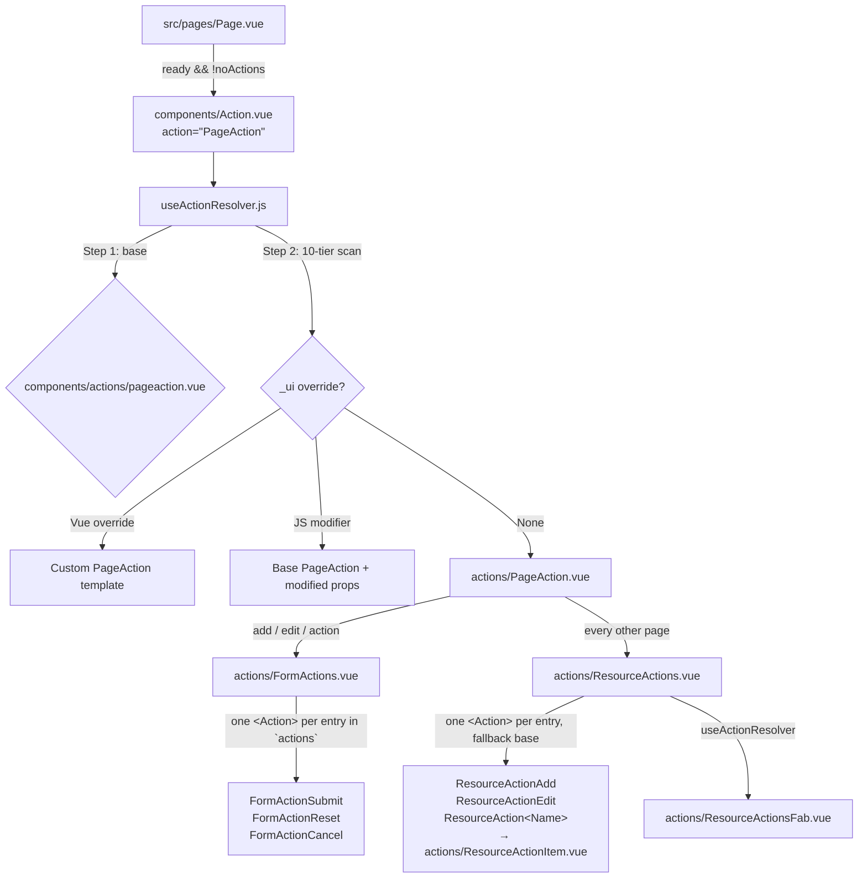

# AQL Action System Guide

This is the canonical reference for AQL's **Action Subsystem** — the third first-class
placeholder paradigm alongside `Section.vue` and `Content.vue`.

| Paradigm | Placeholder | Resolver | Base folder | Renders |
|----------|-------------|----------|-------------|---------|
| Section | `components/Section.vue` (`AqlSection`) | `useSectionResolver.js` | `components/sections/` | Page chrome (header, filter, switcher) |
| Content | `components/Content.vue` (`AqlContent`) | `useContentResolver.js` | `components/contents/` | Page body, inside `AqlContentWrapper` |
| **Action** | **`components/Action.vue` (`AqlAction`)** | **`useActionResolver.js`** | **`components/actions/`** | **Page-level actions: sticky form bar, unified resource-action FABs** |

All three share the identical 10-tier `_ui/` override model. Only the base folder and
the identity prop (`section` / `content` / `action`) differ.

---

---

## Parts of this document

This document is split so each part stays readable on its own. The parts are canonical — this hub does not restate them.

| Part | Covers |
|---|---|
| [Action Subsystem — `PageAction.vue` & `FormActions.vue`](UI_ACTION_PAGE_ACTION.md) | The submission lifecycle component and the configurable action array. |
| [Action Subsystem — Buttons, FAB Cluster & Reports](UI_ACTION_FAB_AND_BUTTONS.md) | The button components, the unified `ResourceActions` FAB cluster, `ResourceReports`, and the tenant override cookbook. |
| [Action Subsystem — Multi-Record Action Config & Grammar](UI_ACTION_MULTI_RECORD.md) | The `AdditionalActions.targets[]` composable API, request pipeline, config shape and expression grammar. |
| [Action Subsystem — Execution, Security & Embedding](UI_ACTION_EXECUTION.md) | The execution and security model, response reactivity, and embedding a trigger. |


### Where each section lives

Section numbers are unchanged, so an existing `§N` reference still resolves — find it here.

| § | Section | File |
|---|---|---|
| §7.5 | Execution & security model | [UI_ACTION_EXECUTION.md](UI_ACTION_EXECUTION.md) |
| §7.6 | Response & reactivity | [UI_ACTION_EXECUTION.md](UI_ACTION_EXECUTION.md) |
| §7.7 | Embedding a trigger | [UI_ACTION_EXECUTION.md](UI_ACTION_EXECUTION.md) |
| §4 | Tenant Override Cookbook | [UI_ACTION_FAB_AND_BUTTONS.md](UI_ACTION_FAB_AND_BUTTONS.md) |
| §7.0 | Composable API | [UI_ACTION_MULTI_RECORD.md](UI_ACTION_MULTI_RECORD.md) |
| §7.0.1 | The request pipeline (`additionalActionsPipeline.js`) | [UI_ACTION_MULTI_RECORD.md](UI_ACTION_MULTI_RECORD.md) |
| §7.0.2 | Two dispatch paths, deliberately | [UI_ACTION_MULTI_RECORD.md](UI_ACTION_MULTI_RECORD.md) |
| §7.1 | Config shape | [UI_ACTION_MULTI_RECORD.md](UI_ACTION_MULTI_RECORD.md) |
| §7.1.-1 | `resourceLevel` | [UI_ACTION_MULTI_RECORD.md](UI_ACTION_MULTI_RECORD.md) |
| §7.1.-0.5 | `fields[]` — `type` decides visibility | [UI_ACTION_MULTI_RECORD.md](UI_ACTION_MULTI_RECORD.md) |
| §7.1.0 | `visibleWhen` | [UI_ACTION_MULTI_RECORD.md](UI_ACTION_MULTI_RECORD.md) |
| §7.1.1 | Dialog headings (`title` / `subtitle`) | [UI_ACTION_MULTI_RECORD.md](UI_ACTION_MULTI_RECORD.md) |
| §7.2 | The one field rule | [UI_ACTION_MULTI_RECORD.md](UI_ACTION_MULTI_RECORD.md) |
| §7.3 | Two field families, deliberately asymmetric | [UI_ACTION_MULTI_RECORD.md](UI_ACTION_MULTI_RECORD.md) |
| §7.4 | Expression grammar (server-authoritative) | [UI_ACTION_MULTI_RECORD.md](UI_ACTION_MULTI_RECORD.md) |
| §7.4.1 | Conditional targets (`when`) | [UI_ACTION_MULTI_RECORD.md](UI_ACTION_MULTI_RECORD.md) |
| §3.1 | `PageAction.vue` | [UI_ACTION_PAGE_ACTION.md](UI_ACTION_PAGE_ACTION.md) |
| §3.2 | `FormActions.vue` — the configurable action array | [UI_ACTION_PAGE_ACTION.md](UI_ACTION_PAGE_ACTION.md) |
| §3.3 | The button components | [UI_ACTION_FAB_AND_BUTTONS.md](UI_ACTION_FAB_AND_BUTTONS.md) |
| §3.4 | `ResourceActions.vue` — the unified FAB cluster | [UI_ACTION_FAB_AND_BUTTONS.md](UI_ACTION_FAB_AND_BUTTONS.md) |
| §3.4.1 | Local action auto-discovery (`ResourceAction*.{vue,js}` under `_ui/`) | [UI_ACTION_FAB_AND_BUTTONS.md](UI_ACTION_FAB_AND_BUTTONS.md) |
| §3.5 | `ResourceReports.vue` | [UI_ACTION_FAB_AND_BUTTONS.md](UI_ACTION_FAB_AND_BUTTONS.md) |

## 1. Architectural Overview



### 1.1 Why a separate subsystem
Actions are structurally different from sections and contents:

* They are mounted **outside** `.aql-page-body`, as a direct `q-page` child, because the
  page entrance animation applies a CSS `transform` to body children — and a transformed
  ancestor becomes the containing block for `position: fixed` descendants, which would
  trap the `q-page-sticky` FAB at the end of the content flow instead of the viewport.
* They are the only components that **dispatch** (submit / execute / reset), so their
  override surface has to reach the submission lifecycle, not just presentation.
* They compose recursively — `PageAction` mounts `FormActions`, which mounts individual
  buttons — and every level must be independently overridable.

Giving them their own placeholder + resolver + folder makes each of those levels an
addressable override target instead of a hardcoded child.

### 1.2 Page integration (`src/pages/Page.vue`)
```html
<Action
  v-if="ready && pageProps.noActions !== true"
  action="PageAction"
  v-bind="pageProps"
/>
```
Mounted after `AqlContentWrapper`, as a **sibling of the `<Transition>`** — never inside
`.aql-page-body`.

> [!NOTE]
> The Action subsystem mounts on **every** resource page; it is not driven by the page
> contract's `sections` array at all. `PageAction` no longer needs to be declared in
> `sections` (and `usePageResolver` still filters it out of `visibleSectionsBeforeAction`
> if a contract lists it). The only opt-out is `noActions: true` in a page contract or JS
> modifier, which suppresses the `<Action>` mount. It does **not** affect the
> AdditionalActions dialog — that subsystem is independent of `<Action>` entirely (§7).

### 1.3 The Action Placeholder (`src/components/Action.vue`)
`AqlAction` mirrors `Section.vue` / `Content.vue` exactly:
* Accepts a required `action: String` prop; captures everything else via `useAttrs()`.
* Builds `preparedProps = { ...attrs, action }` and calls `useActionResolver(preparedProps)`.
* Handles three states:
  1. **Loading (`!ready`)** — `q-spinner-dots`.
  2. **Resolved** — `<component :is="resolvedComponent" v-bind="finalProps" />`.
  3. **Undefined** — an "Action Not Defined" warning card naming the action, page,
     resource, and scope.
* `inheritAttrs: false`, so nothing leaks onto the DOM.
* Accepts an optional **`fallback`** prop (a component, excluded from the resolved
  props) forwarded to `useActionResolver` as `defaultComponent`. This is what lets
  a container mount *dynamically named* actions — e.g. `ResourceActions`' per-item
  `ResourceActionApprove` — against a generic base (`ResourceActionItem`) instead
  of the warning card, while keeping every `_ui/` tier able to override that name.

### 1.4 The Action Resolver (`src/composables/resources/useActionResolver.js`)
Two Vite glob registries built once at module load, both lowercasing every path key
(so **all file names are case-insensitive on every OS**):

| Registry | Source Glob | Key Format |
|----------|-------------|------------|
| `frameworkRegistry` | `../../components/**/*.{vue,js}` | `components/…` (lowercased) |
| `customUiRegistry` | `../../_ui/**/*.{vue,js}` | `_ui/…` (lowercased) |

It injects `resourceConfig`, `resourceRecord`, and `pageState` internally so it can hand
them to JS modifier functions, and re-exports `evaluateProp` so action components get the
same closure-prop semantics as sections without importing the section resolver.

Signature: `useActionResolver(preparedProps, defaultComponent = null) => { ready, resolvedComponent, finalProps }`

> [!IMPORTANT]
> **`finalProps` is reactive, not a snapshot.** `useSectionResolver` / `useContentResolver`
> assign their merged props *inside* the watch callback, which only re-runs when one of the
> five lookup keys (`action`/`section`/`content`, `page`, `scope`, `resource`, `uiName`)
> changes — so any other prop is frozen at first resolve. Action props change without
> touching a lookup key constantly: a submit button enabling once an outcome is selected, a
> label switching on record status, `disabled` flipping mid-form. `useActionResolver`
> therefore exposes `finalProps` as a **computed** over the live `preparedProps`, caching
> only the JS-modifier result (the one thing the async scan actually produced):
> ```javascript
> const finalProps = computed(() => {
>   const current = preparedProps.value || {}
>   return modifierProps.value ? { ...current, ...modifierProps.value } : current
> })
> ```
> Practical consequence: a JS modifier's returned object always wins over live props, and it
> is evaluated **once** per resolve. Use function-valued props (evaluated per render by the
> receiving component through `evaluateProp`) when a modifier needs to react to record state.

---

## 2. Resolution Sequence

### 2.1 Step 1 — Base action component
First match wins:
1. `_ui/{uiName}/components/actions/{action}.vue` — tenant-wide generic base.
2. `components/actions/{action}.vue` — framework default base.
3. Otherwise, the first `.vue` candidate from the 10-tier list below is promoted to base.
4. Otherwise, the caller-supplied `defaultComponent` (used by `PageAction.vue` when it
   resolves `FormActions` / `ResourceActions`).
5. Otherwise, `Action.vue` renders the "Action Not Defined" card.

### 2.2 Step 2 — The 10-Tier Override Scan
Identical in shape to the Section and Content resolvers (first match wins):

| # | Tier | Path | Type |
|---|------|------|------|
| 1 | resource + page | `_ui/{ui}/components/{scope}/{Resource}/{page}/{Action}.vue` | Vue override |
| 2 | resource + page | `_ui/{ui}/components/{scope}/{Resource}/{page}/{Action}.js` | JS modifier |
| 3 | resource | `_ui/{ui}/components/{scope}/{Resource}/{Action}.vue` | Vue override |
| 4 | resource | `_ui/{ui}/components/{scope}/{Resource}/{Action}.js` | JS modifier |
| 5 | page | `_ui/{ui}/components/{scope}/{page}/{Action}.vue` | Vue override |
| 6 | page | `_ui/{ui}/components/{scope}/{page}/{Action}.js` | JS modifier |
| 7 | scope-wide | `_ui/{ui}/components/{scope}/{Action}.vue` | Vue override |
| 8 | scope-wide | `_ui/{ui}/components/{scope}/{Action}.js` | JS modifier |
| 9 | ui-wide | `_ui/{ui}/components/{Action}.vue` | Vue override |
| 10 | ui-wide | `_ui/{ui}/components/{Action}.js` | JS modifier |

**Path segment transformation rules** (get these wrong and nothing resolves):

| Segment | Input | Transformation | Example |
|---------|-------|----------------|---------|
| `{ui}` | `customUIName` | Lowercased as-is (defaults to `AQL`) | `aql` |
| `{scope}` | Route scope | Lowercased as-is | `master` |
| `{Resource}` | Resource slug | `toPascalCase` → then lowercased | `'purchase-orders'` → `PurchaseOrders` → `purchaseorders` |
| `{page}` | Canonical page | Lowercased as-is | `add` |
| `{Action}` | Action name | Lowercased as-is | `formactionsubmit` |

### 2.3 Vue Overrides vs JS Modifiers
* **Vue override (`.vue`)** — replaces the base action entirely. `finalProps` flows through
  unmodified so the override can use `$attrs`.
* **JS modifier (`.js`)** — keeps the base action and adjusts its props:
  ```javascript
  // _ui/AQL/components/master/products/add/formactionsubmit.js
  export default (currentProps, { pageState, resourceRecord, resourceConfig }) => ({
    label: (record) => record?.Status === 'Draft' ? 'Save Draft' : 'Create Product',
    color: 'accent',
    icon: 'cloud_upload'
  })
  ```
  A plain object export works too. Function-valued props are evaluated by the receiving
  component through `evaluateProp(val, resourceRecord, resourceConfig)`, which calls the
  closure with **plain unwrapped objects** `(record, config)` — never call `.value` inside.

### 2.4 Targeted props from an ancestor (`Props<Identity>`)

`useActionResolver` participates in the shared `Props<Identity>` system, so a page contract or JS modifier can address one action directly instead of spraying props at every placeholder:

```javascript
// _ui/AQL/pages/Master/Products/Add.js
export default {
  PropsAction:             { dense: true },              // broadcast: every action
  PropsFormActionSubmit:   { label: 'Create Product' },  // just the submit button
  PropsPageAction:         { noFab: true }               // just the page FAB
}
```

The matching block is spread **flat** onto the action (`props.label`, not `props.PropsFormActionSubmit.label`), and a JS modifier still wins over it. Precedence: `drilled attrs → PropsAction → Props<Identity> → JS modifier`.

Full contract, including the case-insensitivity, function-block and `inheritAttrs` rules: [UI_PAGE_AND_SECTION_SYSTEM.md](file:///f:/LITTLE%20LEAP/AQL/Documents/UI_PAGE_AND_SECTION_SYSTEM.md) §1.4.1.

---

## 8. Strict Maintenance Rule

> [!IMPORTANT]
> **Documentation Sync Requirement**: Any modification to the Action subsystem — adding a
> component under `components/actions/`, changing the resolver's scan order, altering the
> `actions` array contract, or changing the loading UX — MUST be accompanied by updates to:
> 1. This document: [UI_ACTION_SYSTEM.md](file:///f:/LITTLE%20LEAP/AQL/Documents/UI_ACTION_SYSTEM.md)
> 2. The initialization prompt: [action_customization.md](file:///f:/LITTLE%20LEAP/AQL/References/Prompt%20Library/Initialization/action_customization.md)
> 3. The component registry: [components/REGISTRY.md](file:///f:/LITTLE%20LEAP/AQL/FRONTENT/src/components/REGISTRY.md)
>
> If the change also touches the Page/Section boundary, update
> [UI_PAGE_AND_SECTION_SYSTEM.md](file:///f:/LITTLE%20LEAP/AQL/Documents/UI_PAGE_AND_SECTION_SYSTEM.md)
> and [page_and_section_system.md](file:///f:/LITTLE%20LEAP/AQL/References/Prompt%20Library/Initialization/page_and_section_system.md).