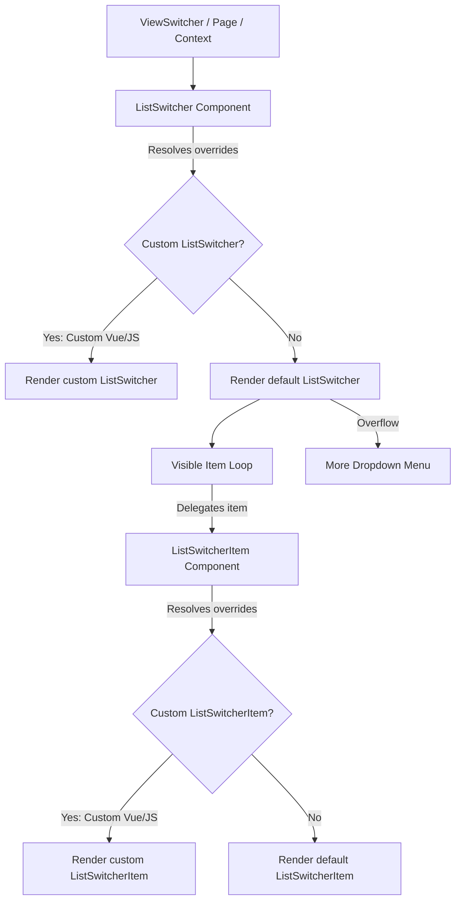

# AQL Frontend List Switcher Architecture

This document defines the architecture, options, and override criteria for the list switching system. It details the container-level (`ListSwitcher`) and item-level (`ListSwitcherItem`) components, their design guidelines, and rules for custom UI modifications.

---

---

## Parts of this document

This document is split so each part stays readable on its own. The parts are canonical — this hub does not restate them.

| Part | Covers |
|---|---|
| [List Switcher — Components Reference Catalog](UI_LIST_SWITCHER_COMPONENTS.md) | Every switcher component and its props. |
| [List Switcher — Sheet Integration](UI_LIST_SWITCHER_SHEET.md) | `App.Resources.ListViews`: schema, filters and tokens. |


### Where each section lives

Section numbers are unchanged, so an existing `§N` reference still resolves — find it here.

| § | Section | File |
|---|---|---|
| §4 | Components Reference Catalog | [UI_LIST_SWITCHER_COMPONENTS.md](UI_LIST_SWITCHER_COMPONENTS.md) |
| §5 | Sheet Integration (`App.Resources.ListViews`) | [UI_LIST_SWITCHER_SHEET.md](UI_LIST_SWITCHER_SHEET.md) |

## 1. Core Architecture

The AQL list switching system is modular, dividing the UI into:
1. **Container (`ListSwitcher`)**: The surrounding element containing the list of switchable items and managing the responsive layout (horizontal scroll on mobile vs. dropdown on desktop).
2. **Item (`ListSwitcherItem`)**: Individual clickable segments representing each state or view.

Both components support standard AQL page-level and resource-level overrides, custom template replacement (`.vue`), and custom property modifiers (`.js`).



---

## 2. Override & Customization Scenarios

Developers can customize the list switcher layout at different layers depending on their requirements:

### Scenario A: Overriding only the Container wrapper
To customize only the outer wrapper (e.g. adding custom wrappers, headers, or borders) while keeping the default pill design:
- Create `src/_ui/[UiName]/components/.../ListSwitcher.vue`.
- In your template, delegate the item rendering to `<Section section="ListSwitcherItem" />` rather than hardcoding the button layout:
  ```html
  <template>
    <div class="my-custom-container-wrapper">
      <Section
        v-for="item in visibleItems"
        :key="item.name"
        section="ListSwitcherItem"
        v-bind="buildItemProps(item)"
        @click="handleItemClick(item.name)"
      />
    </div>
  </template>
  ```
  *Benefit*: `Section` automatically resolves to the custom item override if it exists, or cleanly falls back to the default `ListSwitcherItem.vue` without extra code.

### Scenario B: Overriding only the Switcher Item
To change only the visual look of individual switcher buttons (e.g., adding loading states, specific icons, badges) without changing the container bar:
- Create `src/_ui/[UiName]/components/.../ListSwitcherItem.vue` (or `ListSwitcherItem.js`).
- The default `ListSwitcher.vue` uses `useSectionResolver` to dynamically resolve `'ListSwitcherItem'`. It will find your override and render it in place of the base item automatically.

### Scenario C: Customizing both Container and Items inline
To completely replace the layout with a bespoke HTML structure (e.g. vertical sidebar layout, custom grids):
- Create `src/_ui/[UiName]/components/.../ListSwitcher.vue`.
- Write your layout natively (e.g., `<div class="list-view-container"><div class="list-view-item">...</div></div>`), bypassing the item resolver entirely.

### Scenario D: Dynamic Property Modifiers (JS Modifiers)
To customize properties dynamically without overriding the templates:
- Create `ListSwitcher.js` (container properties) or `ListSwitcherItem.js` (item properties).
- Return an object with custom properties or functions (e.g., resolving color based on the current record). These will be merged automatically into `finalProps` by the resolver, which are then passed down as props/attrs into `ListSwitcher.vue`.
- The most common use of `ListSwitcher.js` is to fully replace the `items` array with bespoke views and their own `filter` trees, bypassing sheet-driven `ListViews` config and auto-generated views entirely. See `src/_ui/AQL/components/master/currencies/ListSwitcher.js` for a working example:
  ```javascript
  export default function() {
    return {
      maxVisibleItems: null, // disables the "More" overflow dropdown — all items render inline
      items: [
        {
          name: 'Inactive',
          default: true,
          color: 'positive',
          icon: 'check_circle',
          filter: {
            type: 'group',
            logic: 'AND',
            items: [{ type: 'condition', column: 'Status', operator: 'eq', value: 'Inactive' }]
          }
        },
        // ...additional items with their own name/color/icon/filter
      ]
    }
  }
  ```
  - `maxVisibleItems: null` is a deliberate override: it disables the desktop overflow dropdown (see [Section 3](#3-responsive-behavior-guidelines)) so every item in `items` renders inline regardless of screen size.
  - Each entry in `items` follows the same schema documented in [Section 4.3](#43-list-view-item-object-schema) below.

#### 2.1. Items Resolution Precedence
`ListSwitcher.vue` resolves its effective `items` array (`finalAttrs.value.items`, [ListSwitcher.vue#L97-L101](file:///f:/LITTLE%20LEAP/AQL/FRONTENT/src/components/sections/ListSwitcher.vue#L97-L101)) in this exact order — the first non-null/non-undefined source wins:
1. **Explicit `props.items`** — supplied either by a `ListSwitcher.js` JS modifier (merged into `finalProps` by the section resolver) or by an explicit `items` binding on `<ListSwitcher :items="...">` / `<Section section="ListSwitcher" :items="...">` from a parent template.
2. **Fallback: `resourceRecord.effectiveViews`** — the reactive views array computed by [`useListViews.js`](file:///f:/LITTLE%20LEAP/AQL/FRONTENT/src/composables/useListViews.js#L276-L309), which is itself either the sheet-configured `APP.Resources.ListViews` array or scope-aware auto-generated views (see [Section 5](#5-sheet-integration-appresourceslistviews)).

Because this is a full override (not a merge), a JS modifier that returns an `items` array replaces the sheet/auto-generated views entirely rather than appending to them.

---

## 3. Responsive Behavior Guidelines

The base container is built to handle item overflows responsively:
* **Mobile / Tablet Screen Sizes (`sm` and below)**:
  Items are kept in a single line. The container uses pure CSS horizontal scroll with hidden scrollbars to provide a smooth, app-like touch swipe experience.
* **Desktop Screen Sizes (`gt.sm` and above)**:
  Exceeding items are sliced and placed inside a **"More"** dropdown button using Quasar's `<q-menu>`.
  - **Dynamic states**: If an overflowed item is active, the "More" dropdown button inherits its label, icon, active background gradient, and bottom active dot.

---
