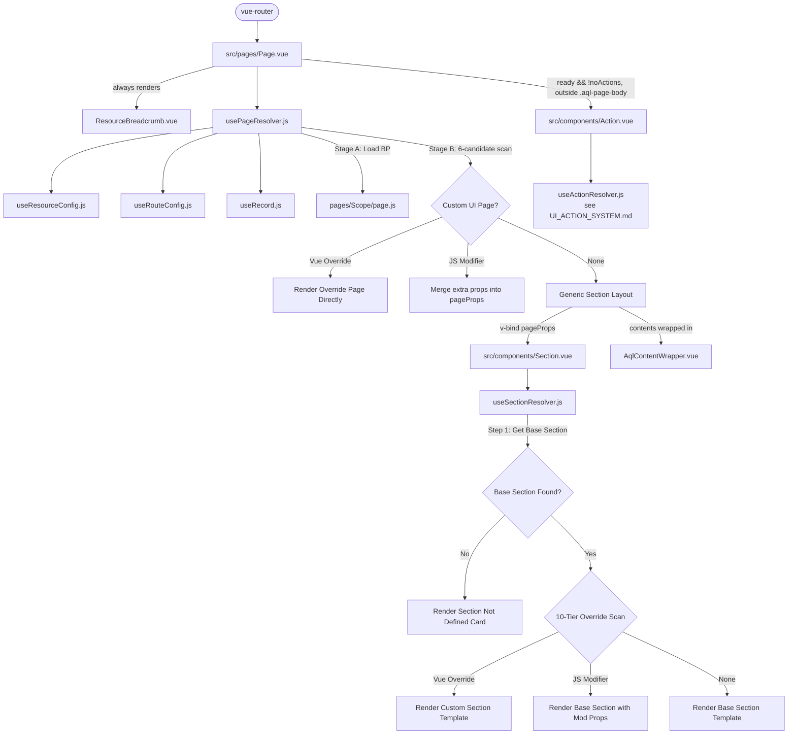

# AQL Page and Section System Guide

This is the canonical reference document for developers and AI agents on AQL's dynamic page orchestration and layout section customization.

> [!IMPORTANT]
> **Subsystem boundary.** AQL has three placeholder paradigms, each with its own resolver,
> base folder, and identity prop — but one shared 10-tier `_ui/` override model:
>
> | Paradigm | Placeholder | Resolver | Base folder | Canonical doc |
> |----------|-------------|----------|-------------|---------------|
> | Section | `Section.vue` (`AqlSection`) | `useSectionResolver.js` | `components/sections/` | **this document** |
> | Content | `Content.vue` (`AqlContent`) | `useContentResolver.js` | `components/contents/` | [UI_CONTENT_SYSTEM.md](file:///f:/LITTLE%20LEAP/AQL/Documents/UI_CONTENT_SYSTEM.md) |
> | Action | `Action.vue` (`AqlAction`) | `useActionResolver.js` | `components/actions/` | [UI_ACTION_SYSTEM.md](file:///f:/LITTLE%20LEAP/AQL/Documents/UI_ACTION_SYSTEM.md) |
>
> **`PageAction` is no longer a Section.** It is mounted by `Page.vue` as
> `<Action action="PageAction" />` through the Action subsystem. Everything about the
> sticky form bar, the CRUD FABs, the individual form buttons, and their override paths
> lives in `UI_ACTION_SYSTEM.md` — not here.

---

---

## Parts of this document

This document is split so each part stays readable on its own. The parts are canonical — this hub does not restate them.

| Part | Covers |
|---|---|
| [Page & Section — The Resolvers](UI_PAGE_AND_SECTION_RESOLVERS.md) | The page resolver, the section resolver, `Props<Identity>` targeted props, and page state. |
| [Page & Section — Authoring a Section Component](UI_SECTION_AUTHORING.md) | Signature checklist, boilerplate and documentation rules for a new Section. |
| [Page & Section — The Built-In Metric Sections](UI_SECTION_WIDGETS.md) | MetricCards, LinearProgress, WorkflowFunnel, AgeingBuckets and DistributionBars. |
| [Page & Section — Customization & Overrides](UI_PAGE_AND_SECTION_OVERRIDES.md) | Per-tenant and per-page section overrides. |

### Where each section lives

Section numbers are unchanged, so an existing `§N` reference still resolves — find it here.

| § | Section | File |
|---|---|---|
| §3 | Section Customization & Overrides | [UI_PAGE_AND_SECTION_OVERRIDES.md](UI_PAGE_AND_SECTION_OVERRIDES.md) |
| §1.3 | The Page Resolver (`src/composables/resources/usePageResolver.js`) | [UI_PAGE_AND_SECTION_RESOLVERS.md](UI_PAGE_AND_SECTION_RESOLVERS.md) |
| §1.4 | The Section Resolver (`src/composables/resources/useSectionResolver.js`) | [UI_PAGE_AND_SECTION_RESOLVERS.md](UI_PAGE_AND_SECTION_RESOLVERS.md) |
| §1.4.1 | Targeted Props — `Props<Identity>` Blocks | [UI_PAGE_AND_SECTION_RESOLVERS.md](UI_PAGE_AND_SECTION_RESOLVERS.md) |
| §1.5 | The Page State (`src/composables/resources/usePageState.js`) | [UI_PAGE_AND_SECTION_RESOLVERS.md](UI_PAGE_AND_SECTION_RESOLVERS.md) |
| §2 | Developing Section Components | [UI_SECTION_AUTHORING.md](UI_SECTION_AUTHORING.md) |
| §2.4 | `MetricCards` — Dashboard Stat Counters | [UI_SECTION_WIDGETS.md](UI_SECTION_WIDGETS.md) |
| §2.5 | `LinearProgress` — Completion Progress Bars | [UI_SECTION_WIDGETS.md](UI_SECTION_WIDGETS.md) |
| §2.6 | `WorkflowFunnel` — Proportional Pipeline Bar | [UI_SECTION_WIDGETS.md](UI_SECTION_WIDGETS.md) |
| §2.7 | `AgeingBuckets` — Backlog Age Bands | [UI_SECTION_WIDGETS.md](UI_SECTION_WIDGETS.md) |
| §2.8 | `DistributionBars` — Ranked Categorical Breakdown | [UI_SECTION_WIDGETS.md](UI_SECTION_WIDGETS.md) |

## 1. Architectural Overview

AQL's frontend architecture is built on a dynamic, tiered, and metadata-driven resolution model. Instead of hardcoding layout views, pages are dynamically assembled at runtime based on the requested resource and active route.

### 1.1 The Orchestrator Page (`src/pages/Page.vue`)
`Page.vue` acts as the single top-level entry point for all resource CRUD operations and custom actions. It does not contain static HTML elements except for `<ResourceBreadcrumb />`, which is **always rendered unconditionally** — outside the section system — regardless of whether a custom page override or generic sections are used. It resolves layout states dynamically:
1. **Full Page Custom Override (`resolvedPageComponent`)**: If a custom Vue component matches the current resource page under `src/_ui/`, it renders it directly, short-circuiting the generic layout.
2. **Generic Section Layout**: If no custom page component is found, it renders placeholding `<Section>` components sequentially:
   - Sections in `visibleSectionsBeforeAction` (such as `Header`, `Toolbar`).
   - Content wrapper (`<AqlContentWrapper>`) wrapping the `contents` sections (e.g. list, details, or forms).
   - Bottom page actions via `<Action action="PageAction" />` — the **Action subsystem**, not a Section. Mounted on every resource page outside `.aql-page-body`, gated only by `pageProps.noActions !== true` (see the callout in §1.1). Full spec: [UI_ACTION_SYSTEM.md](file:///f:/LITTLE%20LEAP/AQL/Documents/UI_ACTION_SYSTEM.md).
3. **Context Provider**:
   - Provides `'resourceConfig'` (metadata configuration).
   - Provides `'resourceRecord'` (active record reference and loading state).
   - Provides `'pageState'` (centralized page-level reactive form state).

#### `AqlContentWrapper` States
`<AqlContentWrapper>` is the gate component wrapping all `contents` sections. It handles four states and must never be bypassed:

| State | Condition | What Renders |
|-------|-----------|--------------|
| Blocking spinner | `loading && !hasData` | Centered `q-spinner-dots` |
| Non-blocking progress bar | `loading && hasData` | Thin bar at top (background sync) |
| Record not found | `requiresRecord && !recordExists` | Card with "Record not found" and Back to List |
| Empty dataset | `empty` | Card with configurable icon/title/message |
| Normal | none of the above | `<slot />` (the sections render) |

Independently of those five states, `AqlContentWrapper` also renders a **submission overlay**: a `<q-inner-loading>` + `q-spinner-dots` covering the whole content area whenever `pageState.meta.submitting`/`.saving` is true. It injects `pageState` directly, so no page wiring is needed; the `submitting` prop (default `false`) is an opt-in force flag and `submittingLabel` (default `'Saving…'`) sets the caption. This is the **single** blocking indicator during a dispatch — form action buttons are disabled rather than spinner-loaded. See [UI_ACTION_SYSTEM.md §5](file:///f:/LITTLE%20LEAP/AQL/Documents/UI_ACTION_SYSTEM.md).

The `contentWrapperProps` computed in `usePageResolver.js` automatically derives these values per page type:

| `page` value | Key Props Set |
|--------------|---------------|
| `'index'` | `loading`, `empty`, `hasData` |
| `'view'` | `loading`, `requiresRecord`, `recordExists` |
| `'add'` | `loading: false`, `empty: false` |
| `'edit'` | `loading`, `requiresRecord`, `recordExists` |
| `'action'` | `loading`, `requiresRecord`, `recordExists`, custom `emptyIcon/Title/Message` |

#### Centralized Entrance Transition
`Page.vue` wraps its three top-level states (loading spinner, resolved `.aql-page-body` section/content layout, and `PageFallback`) in a single Vue `<Transition name="aql-page-fade" mode="out-in" appear>`. This cross-fades the loading spinner into the resolved layout as soon as `ready` flips true — no per-section edits are needed. The resolved layout lives inside one `.aql-page-body` wrapper whose **direct children** (each pre-action `<Section>` such as `Header`/`Toolbar`, and the `<AqlContentWrapper>`) receive a subtle staggered micro-slide reveal (`aql-section-rise`). All timing/animation lives in `src/css/transitions.scss` (`.aql-page-fade-*`, `.aql-page-body`) and honours `prefers-reduced-motion`.

> [!IMPORTANT]
> **The `PageAction` `<Action>` placeholder (floating FAB / sticky action bar) is rendered as a sibling of the `<Transition>`, *outside* `.aql-page-body`, gated by `ready && pageProps.noActions !== true`.** This is deliberate: `aql-section-rise` applies a CSS `transform` to body children, and a transformed ancestor becomes the containing block for `position: fixed` descendants — which would trap the `q-page-sticky` FAB at the end of the content flow instead of floating it at the viewport boundary. There is no CSS escape hatch for a fixed element inside a transformed subtree, so the FAB must live outside the animated wrapper. It correctly anchors to the viewport (only opacity-animated `.aql-page-container` sits above it) and is intentionally excluded from the entrance animation (a fixed FAB should not slide in). The full-page override branch (`resolvedPageComponent`), `ResourceBreadcrumb`, and `ActionDialog` are likewise kept **outside** the transition so overrides and workflow dialogs are never wrapped.

### 1.2 The Section Placeholder (`src/components/Section.vue`)
`Section.vue` is a single generic placeholder component that represents a logical area of the screen (e.g. `Header`, `Toolbar`, `Content`, `Action`).
* It accepts a `section` string prop and captures additional attributes via `useAttrs()`.
* It calls `useSectionResolver(preparedProps)` and handles three states:
  1. **Loading (`!ready`)**: Displays a Quasar `q-spinner-dots`.
  2. **Resolved (`resolvedComponent`)**: Mounts the matched component via `<component :is="resolvedComponent" v-bind="finalProps" />`.
  3. **Undefined (`!resolvedComponent`)**: Displays a warning card informing the developer that the requested section has no fallback or override.

## 4. Strict Maintenance Rule

> [!IMPORTANT]
> **Documentation Sync Requirement**: Any modifications, refactoring, or additions to the Page/Section system structure (such as expanding page overrides, adding custom Vue-based page customization logic, or rewriting record/resource page flows) MUST be accompanied by updates to:
> 1. This document: [UI_PAGE_AND_SECTION_SYSTEM.md](file:///f:/LITTLE%20LEAP/AQL/Documents/UI_PAGE_AND_SECTION_SYSTEM.md)
> 2. The initialization prompt: [page_and_section_system.md](file:///f:/LITTLE%20LEAP/AQL/References/Prompt%20Library/Initialization/page_and_section_system.md)