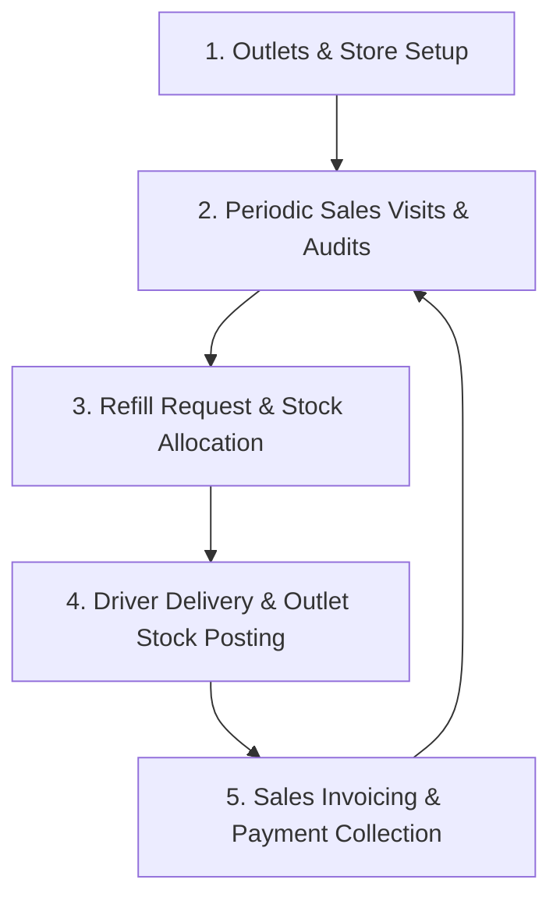

# 🏪 Outlet Operations Workflow

## Purpose
This document is the canonical business and software workflow specification for all customer-facing commercial operations in AQL. It details the real-world operating model and the technical lifecycles across retail stores, sales visits, restock refills, deliveries, invoicing, and payment collections.

---

## 1. Commercial Heartbeat & Operating Loop

The core commercial heartbeat of the UAE distribution business revolves around a continuous 5-step operational cycle:

1. **Distribute Products**: Place product displays and consignments in partner retail outlets.
2. **Track Sales & Visits**: Field sales representatives visit outlets on assigned weekly schedules to audit shelf stock and identify refill needs.
3. **Approve & Allocate Refills**: Store managers review refill requests and allocate warehouse inventory.
4. **Schedule & Deliver**: Drivers execute multi-outlet deliveries, transferring stock into live outlet inventory.
5. **Invoice & Collect**: Record outlet consumption sales, generate VAT invoices, and collect payments on agreed credit intervals.

---

## 2. Core Entities & Data Architecture

| Entity | Role & Scope | Key State Column & Allowed Values |
|---|---|---|
| `Outlets` | Retail store master records (location, terms, assigned visit days) | `Status` (`Active`, `Inactive`) |
| `OutletVisits` | Field check-in logs and visual stock audits | `Status` (`Draft`, `Completed`, `Cancelled`) |
| `OutletRestocks` | Refill request headers | `Progress` (`Draft`, `Pending Approval`, `Approved`, `Allocated`, `Completed`, `Cancelled`) |
| `OutletRestockItems` | Line items for refill requests with storage allocation | `Progress` (`Draft`, `Allocated`, `In Transit`, `Delivered`, `Cancelled`) |
| `OutletDeliveries` | Multi-outlet driver delivery dispatch headers | `Progress` (`DRAFT`, `IN_TRANSIT`, `COMPLETED`, `CANCELLED`) |
| `OutletStorages` | Derived live SKU stock balances per outlet (`OutletCode + SKU`) | `Quantity` (integer balance) |
| `OutletMovements` | Ledger of stock additions/deductions at the outlet | `ReferenceType` (`RestockDelivery`, `Consumption`, `Adjustment`) |
| `OutletConsumptions` | Outlet sales consumption records | `Status` (`Draft`, `Invoiced`, `Cancelled`) |
| `OutletConsumptionInvoices` | Official billing VAT invoices generated from consumptions | `Status` (`Draft`, `Issued`, `Paid`, `Cancelled`) |
| `OutletPayments` | Payment receipts and invoice settlement records | `Status` (`Draft`, `Confirmed`, `Cancelled`) |

---

## 3. Detailed Operational Lifecycles

### 3.1 Store Profiles & Visit Scheduling (`Outlets`)
- Stores are registered with credit limits, payment terms (e.g. 7 days, 15 days, 30 days), and assigned visit days (e.g. `Monday, Thursday`).
- The system groups outlets into route territories to optimize sales representative and driver travel.

### 3.2 Sales Visits & Shelf Audits (`OutletVisits`)
1. **Check-in**: Field representative checks in at the retail outlet via the PWA.
2. **Visual Stock Audit**: Checks physical display quantity for each active SKU.
3. **Refill Recommendation**: If stock is low or nearing stock-out, the visit automatically drafts an `OutletRestocks` request with suggested quantities.
4. **Visit Completion**: Records visit notes, photo verification, and completes the visit record.

### 3.3 Refill Requests & Warehouse Allocation (`OutletRestocks`)
1. **Creation**: Drafted from an outlet visit or created manually by sales operations.
2. **Approval**: Operations manager reviews requested quantities against outlet sales velocity and credit status.
3. **Stock Allocation**: Operations assigns specific warehouse storage bins (`WarehouseCode`, `StorageName`) for each SKU in `OutletRestockItems`.
4. **Stock Reservation**: Warehouse inventory is reserved through negative `StockMovements` (`ReferenceType = OutletRestock`), preventing double-allocation.

### 3.4 Multi-Outlet Deliveries (`OutletDeliveries`)
1. **Delivery Header Creation**: Logistics coordinator creates an `OutletDeliveries` header (`Progress = DRAFT`) and selects eligible, allocated `OutletRestockItems` (stored as CSV in `OutletDeliveries.OutletRestockItemCodes`).
2. **Dispatch (`IN_TRANSIT`)**: Driver accepts the delivery manifest and begins the delivery route.
3. **Item-Level Delivery Handoff (`DELIVERED`)**:
   - As the driver delivers items to each outlet, individual `OutletRestockItems` are marked `DELIVERED`.
   - Positive `OutletMovements` records (`ReferenceType = RestockDelivery`, `ReferenceCode = OutletDeliveries.Code`) are posted into the target outlet.
   - `OutletStorages` automatically updates the live SKU balance for that outlet.
4. **Completion (`COMPLETED`)**: When all linked items are marked delivered, the `OutletDeliveries` header transitions to `COMPLETED`.

### 3.5 Sales Consumptions & Invoicing (`OutletConsumptionInvoices`)
1. **Consumption Tracking**: Recorded during regular audit cycles by comparing opening balance + deliveries vs. ending shelf stock.
2. **Invoice Generation**: Consumed items generate an `OutletConsumptionInvoices` record calculating wholesale price, discounts, and applicable UAE VAT (5%).
3. **Invoice Issuance**: Invoice PDF is generated via the Reports system and dispatched to the outlet's accounting department.

### 3.6 Payment Collections & Settlement (`OutletPayments`)
1. **Collection**: Representative collects payment (cheque, bank transfer, or cash) on due date.
2. **Receipting**: An `OutletPayments` record is created linking to the unpaid `OutletConsumptionInvoices`.
3. **Settlement**: The invoice balance is settled (`Status = Paid`), restoring the outlet's credit limit.

---

## 4. Frontend & Backend Architecture

- **Domain Logic Layer**: Pure business logic, progress helpers, and payload builders live under `FRONTENT/src/_resource/Operation/{OutletResource}/`.
- **Presentation Layer**: Custom UI overrides, multi-step wizards, and action handlers live under `FRONTENT/src/_ui/AQL/components/Operation/{OutletResource}/`.
- **Form State**: Add, Edit, and workflow pages manage dirty state and submission via `UI_PAGE_STATE.md`.
- **Batch Operations**: Multi-record write actions (e.g. delivery creation and item handoffs) execute atomically via `useResourceIoStore.runBatchRequests`.

---

## Maintenance Rule
Update this document whenever retail outlet operations, delivery handoff states, payment cycles, or commercial data models change.
