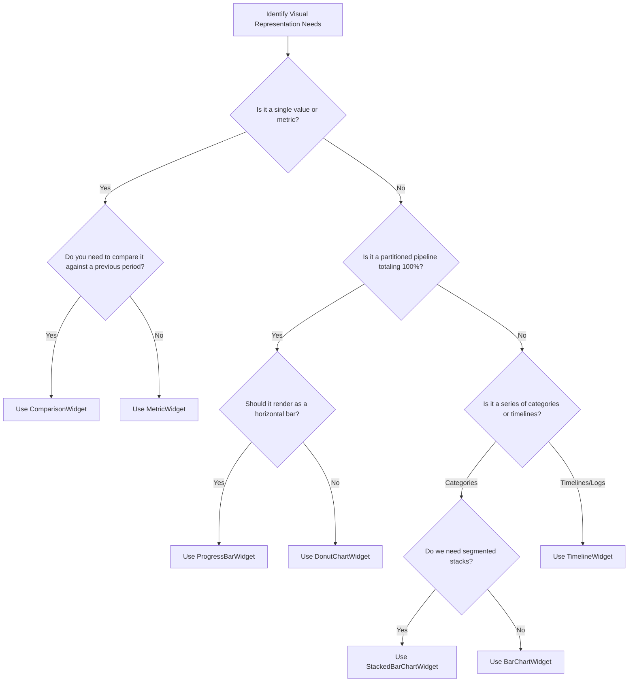

# Dashboard Widget Registry & Extensibility Guide

This registry is the **canonical source of truth** for discovering, configuring, and extending reusable dashboard widgets under `FRONTENT/src/dashboard/_widgets/`.

> [!IMPORTANT]
> **Strict Anti-Duplication Rule**: Before writing a single line of a new visual widget component (`.vue`), you **MUST** exhaustively verify if the requirement can be fulfilled by configuring an existing widget. Creating redundant widgets that mimic existing visual formats is a serious architecture violation.

---

## 1. Zero Resource-Specific Hardcoding (STRICT)

All widgets under `FRONTENT/src/dashboard/_widgets/` are **pure presentation layers**.
* **NEVER** hardcode specific resource names, database columns, status keys, empty-state messages, colors, or legend labels inside a widget component.
* **ALWAYS** parameterize all text, templates, threshold colors, and icons inside the declarative JS widget `.js` configuration file (under `metadata.config`), and pass them in reactively as Vue props.

---

## 2. Reusable Common Widgets Catalog

Use this catalog to select the correct visual model for your data pipeline:

| Widget Type | Best Used For | Input Value Format (resolved by `evaluate`) | Level of Flexibility & Configuration Options | Component Path |
|---|---|---|---|---|
| `MetricWidget` | Displaying a single focal counter or currency volume (e.g. pending items, total sales). | `Number` or `String` | **High**: Supports custom icons, theme-gradient shifts (`primary`, `orange`, `blue`, `green`, `teal`, `purple`). | `src/dashboard/_widgets/MetricWidget.vue` |
| `ComparisonWidget` | Period-over-period comparisons (e.g. MoM, WoW) with arrows and narrative explanations. | `Object` (containing `current`, `previous`, `difference`, `percentage`) | **Extreme**: Dynamic description template with placeholders, custom trend labels (up/down/equal), custom color indicators, and inversed trend colors. | `src/dashboard/_widgets/ComparisonWidget.vue` |
| `ProgressBarWidget` | Visualizing partitioned progress pipelines (e.g. total planned vs. completed vs. postponed vs. remaining). | `Object` (containing `total` and custom segment-specific counters) | **Extreme**: Customizable segment counts, titles, gradients, custom legend dots, hover tooltips, and automatic empty-state handling. | `src/dashboard/_widgets/ProgressBarWidget.vue` |
| `BarChartWidget` | Categorical comparisons (e.g. sales by vendor, requisitions by department). | `Array<{ label: String, value: Number }>` | **High**: Reactive bar scaling, glowing hover tooltips, HSL visual themes, parameterizable empty states. | `src/dashboard/_widgets/BarChartWidget.vue` |
| `DonutChartWidget` | Proportional split ratios summing up to a whole (e.g. status composition splits). | `Array<{ label: String, value: Number, color?: String }>` | **High**: Dynamic segment angles, reactive scale effects on hover, central total summary rendering, parameterizable empty states. | `src/dashboard/_widgets/DonutChartWidget.vue` |
| `StackedBarChartWidget` | Multi-variable stacked comparisons grouped chronologically (e.g. status tracking over last 7 days). | `Array<{ label: String, [key: String]: Number }>` | **Extreme**: Multi-series mapping contracts, instance-scoped shadows, interactive compound tooltips, parameterizable empty states. | `src/dashboard/_widgets/StackedBarChartWidget.vue` |
| `TimelineWidget` | Interactive chronological activity feeds, alerts, or status audit trails. | `Array<{ title: String, subtitle: String, timestamp: String, status: String }>` | **High**: Auto-dates formatting (Today vs specific dates), reactive color-gated badges, parameterizable empty states. | `src/dashboard/_widgets/TimelineWidget.vue` |

---

## 3. Widget Choice Decision Tree (Follow Closely)

Follow this decision tree to identify the correct component:



---

## 4. In-Depth Configuration Specifications

### A. MetricWidget (The Focal Metric Card)
* **Purpose**: Renders a large, striking single numerical or text counter with glowing card-level background gradients and blurred glassmorphism visual highlights.
* **Superpowers**: 
  - Dynamic avatar badges reflecting status contexts.
  - Automatically formats large numbers using system locale conversions.
* **Config Contract**:
  ```javascript
  config: {
    type: 'MetricWidget',
    title: 'Awaiting Approvals',
    icon: 'pending_actions',
    color: 'orange', // 'primary' | 'orange' | 'blue' | 'purple' | 'teal' | 'green'
    weight: 100,
    layout: { xs: 12, sm: 6, md: 4, lg: 3 }
  }
  ```

---

### B. ComparisonWidget (The Metric Comparison Engine)
* **Purpose**: Compares any two numbers (e.g. this month vs last month, today vs yesterday, target vs actual) and outputs a premium animated card.
* **Superpowers**: 
  - **Inverse Trend Logic**: For metrics where an *increase* is negative (like `Errors` or `Cancellations`), configure `inverseTrendColor: true` to automatically turn positive deltas red and negative deltas green.
  - **Dynamic Text Generation**: Specify a custom template string using placeholders. It reactively replaces `{currentLabel}`, `{previousLabel}`, `{current}`, `{previous}`, `{unit}`, `{verb}`, `{absDifference}`, and `{trend}` with locale-formatted values.
* **Config Contract**:
  ```javascript
  config: {
    type: 'ComparisonWidget',
    title: 'Outlet Visit Completion',
    icon: 'check_circle',
    color: 'green',
    weight: 160,
    layout: { xs: 6, sm: 6, md: 6, lg: 6 },
    comparison: {
      unit: 'visits',
      verb: 'completed',
      currentLabel: 'This month',
      previousLabel: 'last month',
      inverseTrendColor: false,
      positiveColor: 'green-7',
      negativeColor: 'red-7',
      neutralColor: 'grey-7',
      descriptionTemplate: '{currentLabel} {current} {unit} {verb} which is {absDifference} {trend} than that of {previousLabel}\'s {previous}.',
      trendLabels: {
        up: 'more',
        down: 'less',
        equal: 'equal'
      }
    }
  }
  ```

---

### C. ProgressBarWidget (The Multi-Segment Progress Tracker)
* **Purpose**: Displays a capsule progress track composed of multiple side-by-side color segments summing to a total planned amount.
* **Superpowers**:
  - **Zero-Flicker Layout**: If `total` is 0, renders a neutral glassmorphic track to prevent division-by-zero layout bugs.
  - **Gradient & Glow Styling**: Define precise start/end HSL gradient colors per segment.
  - **Smart Legends**: Legend details percentages reactively while maintaining a consistent visual layout.
* **Config Contract**:
  ```javascript
  config: {
    type: 'ProgressBarWidget',
    title: 'Outlet Visit Execution Progress',
    icon: 'playlist_add_check',
    color: 'primary',
    weight: 170,
    layout: { xs: 12, sm: 12, md: 12, lg: 12 },
    chart: {
      segments: [
        {
          key: 'completed',
          label: 'Completed',
          color: 'green',
          gradientStart: 'hsl(142, 70%, 45%)',
          gradientEnd: 'hsl(142, 60%, 35%)'
        },
        {
          key: 'postponed',
          label: 'Postponed',
          color: 'orange',
          gradientStart: 'hsl(25, 100%, 50%)',
          gradientEnd: 'hsl(25, 75%, 40%)'
        },
        {
          key: 'remaining',
          label: 'Remaining',
          color: 'grey',
          gradientStart: 'rgba(255, 255, 255, 0.25)',
          gradientEnd: 'rgba(255, 255, 255, 0.1)'
        }
      ]
    }
  }
  ```

---

### D. BarChartWidget (The Categorical Visualizer)
* **Purpose**: Dynamic Pure SVG vertical bar graph comparing scalar metrics across groupable categories.
* **Superpowers**:
  - Automatically calculates responsive height/width ratios and scale vectors dynamically.
  - Floating high-contrast tooltip displaying detailed category metadata on hover.
  - Auto-truncates long category names to preserve axis alignment (`truncateLabel`).
* **Config Contract**:
  ```javascript
  config: {
    type: 'BarChartWidget',
    title: 'Purchase Orders by Vendor',
    icon: 'storefront',
    color: 'purple',
    badge: 'Top Vendors',
    weight: 80,
    layout: { xs: 12, sm: 12, md: 8, lg: 8 },
    chart: {
      emptyMessage: 'No vendor transaction history available'
    }
  }
  ```

---

### E. DonutChartWidget (The Composition Segmenter)
* **Purpose**: Concentric percentage segment donut visualizing proportion ratios summing to a whole.
* **Superpowers**:
  - Concentric circle math using reactive `stroke-dasharray` and offset calculations.
  - Hovering a slice dynamically expands its stroke width and renders its title/value at the absolute center of the donut.
  - Scrollable reactive legend sidebar mapping category color-dots.
* **Config Contract**:
  ```javascript
  config: {
    type: 'DonutChartWidget',
    title: 'Quotation Outcome Split',
    icon: 'pie_chart',
    color: 'primary',
    badge: 'Distribution',
    weight: 90,
    layout: { xs: 12, sm: 12, md: 4, lg: 4 },
    chart: {
      emptyMessage: 'No quotation distributions recorded'
    }
  }
  ```

---

### F. StackedBarChartWidget (The Chronological Multi-Series Matrix)
* **Purpose**: Sophisticated dynamic stacked SVG column graph plotting multi-variable categorical tracking over sequential periods (e.g. daily, monthly).
* **Superpowers**:
  - Dynamically constructs instance-scoped defs and dropshadow filters to prevent DOM element ID collisions.
  - Loops over a customized multi-series legend array to parse stacked coordinates from the bottom up.
  - Interactive Compound Tooltips detailing segmented series values alongside total summaries.
* **Config Contract**:
  ```javascript
  config: {
    type: 'StackedBarChartWidget',
    title: 'Outlet Visit Progress',
    icon: 'event_available',
    color: 'primary',
    weight: 60,
    layout: { xs: 12, sm: 12, md: 8, lg: 8 },
    chart: {
      series: [
        {
          key: 'completed',
          label: 'Completed Visits',
          gradientStart: 'hsl(142, 70%, 45%)',
          gradientEnd: 'hsl(142, 60%, 35%)',
          shadowColor: 'hsl(142, 70%, 45%)'
        },
        {
          key: 'postponed',
          label: 'Postponed Visits',
          gradientStart: 'hsl(215, 16%, 65%)',
          gradientEnd: 'hsl(215, 12%, 50%)',
          shadowColor: 'hsl(215, 16%, 65%)'
        }
      ],
      emptyMessage: 'No visit activity recorded'
    }
  }
  ```

---

### G. TimelineWidget (The Sequential Feeds Stepper)
* **Purpose**: Vertical activity stepper timeline showing recent chronological log items or status movements.
* **Superpowers**:
  - Programmatic Status Badge Colors: Automatically gates status classes (`orange`, `green`, `red`) by parsing string keywords (e.g. `pending`/`draft` -> orange, `active`/`success`/`paid` -> green, `cancel`/`reject` -> red).
  - Smart Relative Dates: Formats timestamps relative to current viewport system clock (e.g. `"Today at 10:30 AM"`, `"Just now"`, or standard dates).
* **Config Contract**:
  ```javascript
  config: {
    type: 'TimelineWidget',
    title: 'Recent Pending Goods Receipts',
    icon: 'receipt',
    color: 'teal',
    badge: 'Timeline',
    weight: 70,
    layout: { xs: 12, sm: 12, md: 4, lg: 4 },
    chart: {
      emptyMessage: 'No recent transaction logs tracked'
    }
  }
  ```

---

## 5. Protocol for Creating a Brand New Widget Type

If and **ONLY** if a new visual representation requirement is completely distinct from the catalog above (e.g. a Geo-Heat Map, a Scatter Plot, or an interactive Calendaring Grid) and cannot be satisfied by parameters:

1. **Implement Component**: Create a pure-Vue presentation component under `FRONTENT/src/dashboard/_widgets/` (e.g. `HeatMapWidget.vue`). **Ensure absolutely zero hardcoded resource fields or strings.**
2. **Register in Assembler**: Add the component to [DashboardIndex.vue](file:///f:/LITTLE%20LEAP/AQL/FRONTENT/src/pages/Dashboard/DashboardIndex.vue)'s imports and `getWidgetComponent(type)` mapping.
3. **Register in this Registry**: Add the widget specification, expected data format, and config template block to this file.
