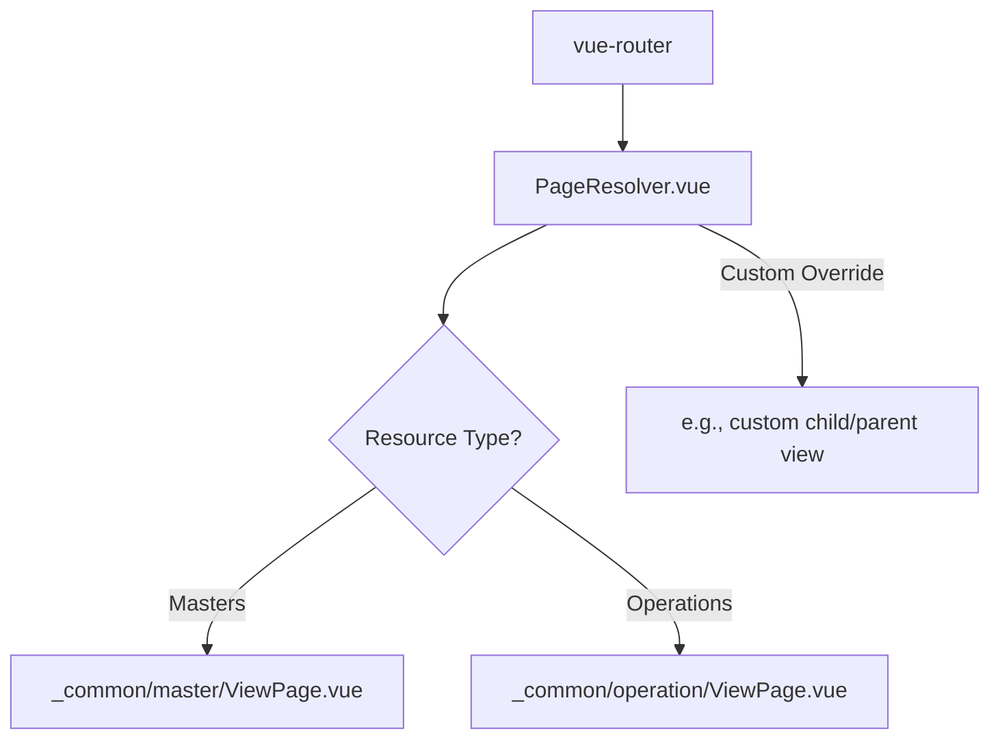
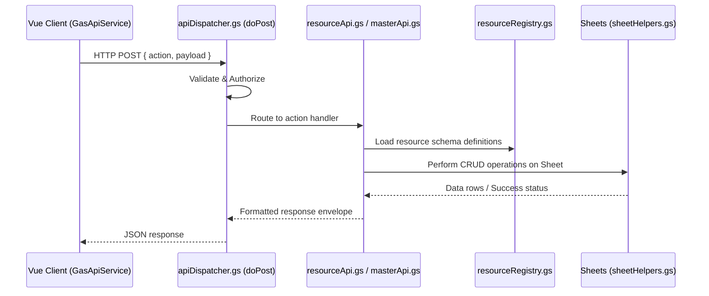

# AQL Codebase Tag & Concept Index

## Purpose
This index is the master semantic mapping of concepts, features, pages, and components in the AQL codebase. 
**AI Agents: Read this index first when handling general investigations, unclear tasks, or searching for specific codebase implementations.** Using this index prevents expensive recursive directory scanning and massive token overhead.

## Maintenance Rules
To keep this index accurate, comprehensive, and highly valuable for future AI chat sessions, follow these rules:
1. **Add New Tags**: If you discover new concepts, features, pages, components, or workflows in future chat sessions, you MUST add them as new rows in the tag index tables.
2. **Prune/Remove Obsolete Tags**: If new instructions, files, or code refactors are added that make existing tags or files irrelevant, remove those obsolete tags to avoid clutter.
3. **Verify Links**: Ensure all paths added use valid absolute `file:///` URLs matching the actual workspace path `file:///f:/LITTLE%20LEAP/AQL/...`.

---

## Alphabetical Tag Index (A-Z)

| Tag / Topic / Keyword | Target File or Directory (Click to Open) | Relevant Canonical Doc | Startup Init Prompt | Purpose / Description |
| :--- | :--- | :--- | :--- | :--- |
| **Accounts / Invoicing** | [FRONTENT/src/pages/_common/Accounts/](file:///f:/LITTLE%20LEAP/AQL/FRONTENT/src/pages/_common/Accounts/) | [ACCOUNTS_SHEET_STRUCTURE.md](file:///f:/LITTLE%20LEAP/AQL/Documents/ACCOUNTS_SHEET_STRUCTURE.md) | [api_related_query.md](file:///f:/LITTLE%20LEAP/AQL/References/Prompt%20Library/Initialization/api_related_query.md) | Customer and client accounts, invoice records, payments, and billing details. |
| **ActionPage** | [ActionPage.vue](file:///f:/LITTLE%20LEAP/AQL/FRONTENT/src/pages/_common/ActionPage.vue) | [FRONTENT_README.md](file:///f:/LITTLE%20LEAP/AQL/Documents/FRONTENT_README.md) | [frontend_modification.md](file:///f:/LITTLE%20LEAP/AQL/References/Prompt%20Library/Initialization/frontend_modification.md) | Shared layout for performing bulk operations or workflows on selected resources. |
| **AddPage** | [AddPage.vue](file:///f:/LITTLE%20LEAP/AQL/FRONTENT/src/pages/_common/AddPage.vue) | [FRONTENT_README.md](file:///f:/LITTLE%20LEAP/AQL/Documents/FRONTENT_README.md) | [frontend_modification.md](file:///f:/LITTLE%20LEAP/AQL/References/Prompt%20Library/Initialization/frontend_modification.md) | Shared layout form for adding/creating a new resource record. |
| **API Dispatcher** | [apiDispatcher.gs](file:///f:/LITTLE%20LEAP/AQL/GAS/apiDispatcher.gs) | [GAS_API_CAPABILITIES.md](file:///f:/LITTLE%20LEAP/AQL/Documents/GAS_API_CAPABILITIES.md) | [api_related_query.md](file:///f:/LITTLE%20LEAP/AQL/References/Prompt%20Library/Initialization/api_related_query.md) | Core backend router in GAS that receives, validates, and dispatches all frontend API requests. |
| **Apps Script Backend** | [GAS/](file:///f:/LITTLE%20LEAP/AQL/GAS/) | [GAS_PATTERNS.md](file:///f:/LITTLE%20LEAP/AQL/Documents/GAS_PATTERNS.md) | [backend_gas_implementation.md](file:///f:/LITTLE%20LEAP/AQL/References/Prompt%20Library/Initialization/backend_gas_implementation.md) | The entire backend logic folder running in Google Apps Script. |
| **AQL Menu (Sheet)** | [appMenu.gs](file:///f:/LITTLE%20LEAP/AQL/GAS/appMenu.gs) | [AQL_MENU_ADMIN_GUIDE.md](file:///f:/LITTLE%20LEAP/AQL/Documents/AQL_MENU_ADMIN_GUIDE.md) | [sheet_menu_actions.md](file:///f:/LITTLE%20LEAP/AQL/References/Prompt%20Library/Initialization/sheet_menu_actions.md) | Custom Google Sheets menu (`AQL 🚀`) configuration, actions, dialogs, and setup scripts. |
| **Architecture Rules** | [ARCHITECTURE RULES.md](file:///f:/LITTLE%20LEAP/AQL/Documents/ARCHITECTURE%20RULES.md) | [ARCHITECTURE RULES.md](file:///f:/LITTLE%20LEAP/AQL/Documents/ARCHITECTURE%20RULES.md) | [frontend_modification.md](file:///f:/LITTLE%20LEAP/AQL/References/Prompt%20Library/Initialization/frontend_modification.md) | **Mandatory Pre-Read for Frontend.** Holds reactivity contracts, layer rules, and Vue patterns. |
| **Auth / Login** | [auth.gs](file:///f:/LITTLE%20LEAP/AQL/GAS/auth.gs) / [auth.js (store)](file:///f:/LITTLE%20LEAP/AQL/FRONTENT/src/stores/auth.js) | [LOGIN_RESPONSE.md](file:///f:/LITTLE%20LEAP/AQL/Documents/LOGIN_RESPONSE.md) | [api_related_query.md](file:///f:/LITTLE%20LEAP/AQL/References/Prompt%20Library/Initialization/api_related_query.md) | Login authentication, session validation, user role verification, and login payload caching. |
| **Bulk Upload** | [resourceApi.gs](file:///f:/LITTLE%20LEAP/AQL/GAS/resourceApi.gs#L200) | [MODULE_WORKFLOWS.md](file:///f:/LITTLE%20LEAP/AQL/Documents/MODULE_WORKFLOWS.md) | [backend_gas_implementation.md](file:///f:/LITTLE%20LEAP/AQL/References/Prompt%20Library/Initialization/backend_gas_implementation.md) | Backend batch CRUD operations and resource import workflows. |
| **Caching (IndexedDB)** | [IndexedDbService.js](file:///f:/LITTLE%20LEAP/AQL/FRONTENT/src/services/IndexedDbService.js) | [ARCHITECTURE RULES.md](file:///f:/LITTLE%20LEAP/AQL/Documents/ARCHITECTURE%20RULES.md) | [frontend_modification.md](file:///f:/LITTLE%20LEAP/AQL/References/Prompt%20Library/Initialization/frontend_modification.md) | Client-side persistent cache using IndexedDB for offline support and fast loads. |
| **Common Pages** | [FRONTENT/src/pages/_common/](file:///f:/LITTLE%20LEAP/AQL/FRONTENT/src/pages/_common/) | [FRONTENT_README.md](file:///f:/LITTLE%20LEAP/AQL/Documents/FRONTENT_README.md) | [frontend_modification.md](file:///f:/LITTLE%20LEAP/AQL/References/Prompt%20Library/Initialization/frontend_modification.md) | Shared/reusable page layouts (`Page.vue`, `IndexPage.vue`, `AddPage.vue`, `EditPage.vue`, `ViewPage.vue`). |
| **Composables** | [FRONTENT/src/composables/](file:///f:/LITTLE%20LEAP/AQL/FRONTENT/src/composables/) | [REGISTRY.md](file:///f:/LITTLE%20LEAP/AQL/FRONTENT/src/composables/REGISTRY.md) | [frontend_modification.md](file:///f:/LITTLE%20LEAP/AQL/References/Prompt%20Library/Initialization/frontend_modification.md) | Reusable reactive business logic hooks. Refer to `REGISTRY.md` for a full list. |
| **Currency Helper** | [useCurrency.js](file:///f:/LITTLE%20LEAP/AQL/FRONTENT/src/composables/useCurrency.js) | [TAX_SYSTEM_DESIGN.md](file:///f:/LITTLE%20LEAP/AQL/Documents/TAX_SYSTEM_DESIGN.md) | [tax_currency_system.md](file:///f:/LITTLE%20LEAP/AQL/References/Prompt%20Library/Initialization/tax_currency_system.md) | Utility for formatting and converting currency values dynamically in UI templates. |
| **Dashboard / Widgets** | [FRONTENT/src/dashboard/](file:///f:/LITTLE%20LEAP/AQL/FRONTENT/src/dashboard/) | [DASHBOARD_DEVELOPMENT_GUIDE.md](file:///f:/LITTLE%20LEAP/AQL/Documents/DASHBOARD_DEVELOPMENT_GUIDE.md) | [dashboard_implementation.md](file:///f:/LITTLE%20LEAP/AQL/References/Prompt%20Library/Initialization/dashboard_implementation.md) | SVG widgets, layout grids, widget registry, and declarative dashboard building pipelines. |
| **Database Schema** | [resourceRegistry.gs](file:///f:/LITTLE%20LEAP/AQL/GAS/resourceRegistry.gs) | [RESOURCE_COLUMNS_GUIDE.md](file:///f:/LITTLE%20LEAP/AQL/Documents/RESOURCE_COLUMNS_GUIDE.md) | [database_schema_alteration.md](file:///f:/LITTLE%20LEAP/AQL/References/Prompt%20Library/Initialization/database_schema_alteration.md) | Resource definitions, metadata schemas, column configurations, and system registries. |
| **EditPage** | [EditPage.vue](file:///f:/LITTLE%20LEAP/AQL/FRONTENT/src/pages/_common/EditPage.vue) | [FRONTENT_README.md](file:///f:/LITTLE%20LEAP/AQL/Documents/FRONTENT_README.md) | [frontend_modification.md](file:///f:/LITTLE%20LEAP/AQL/References/Prompt%20Library/Initialization/frontend_modification.md) | Shared layout form for editing and updating an existing resource record. |
| **IndexPage** | [IndexPage.vue](file:///f:/LITTLE%20LEAP/AQL/FRONTENT/src/pages/_common/IndexPage.vue) | [FRONTENT_README.md](file:///f:/LITTLE%20LEAP/AQL/Documents/FRONTENT_README.md) | [frontend_modification.md](file:///f:/LITTLE%20LEAP/AQL/References/Prompt%20Library/Initialization/frontend_modification.md) | Shared layout displaying resource data tables, search, filters, and row actions. |
| **Inventory / Stock** | [stockMovements.gs](file:///f:/LITTLE%20LEAP/AQL/GAS/stockMovements.gs) / [outletMovements.gs](file:///f:/LITTLE%20LEAP/AQL/GAS/outletMovements.gs) | [MODULE_WORKFLOWS.md](file:///f:/LITTLE%20LEAP/AQL/Documents/MODULE_WORKFLOWS.md) | [backend_gas_implementation.md](file:///f:/LITTLE%20LEAP/AQL/References/Prompt%20Library/Initialization/backend_gas_implementation.md) | Inventory management, warehouse stock levels, stock adjustments, and outlet movements. |
| **List Views** | [useListViews.js](file:///f:/LITTLE%20LEAP/AQL/FRONTENT/src/composables/useListViews.js) / [listViewsManager.html](file:///f:/LITTLE%20LEAP/AQL/GAS/listViewsManager.html) | [RESOURCE_COLUMNS_GUIDE.md](file:///f:/LITTLE%20LEAP/AQL/Documents/RESOURCE_COLUMNS_GUIDE.md) | [frontend_modification.md](file:///f:/LITTLE%20LEAP/AQL/References/Prompt%20Library/Initialization/frontend_modification.md) | Saved filters, custom columns, and user-defined views for resource tables. |
| **Masters Resource** | [FRONTENT/src/pages/master/](file:///f:/LITTLE%20LEAP/AQL/FRONTENT/src/pages/master/) | [CUSTOM_PAGE_AND_PAGE_SECTIONS_CUSTOMIZATIONS.md](file:///f:/LITTLE%20LEAP/AQL/Documents/CUSTOM_PAGE_AND_PAGE_SECTIONS_CUSTOMIZATIONS.md) | [frontend_customization.md](file:///f:/LITTLE%20LEAP/AQL/References/Prompt%20Library/Initialization/frontend_customization.md) | Static reference datasets (e.g. Products, Outlets, SKU lists). |
| **Menu System** | [appMenu.gs](file:///f:/LITTLE%20LEAP/AQL/GAS/appMenu.gs) / [MenuTreeNode.vue](file:///f:/LITTLE%20LEAP/AQL/FRONTENT/src/components/MenuTreeNode.vue) | [AQL_FRONTEND_MENU_SYSTEM.md](file:///f:/LITTLE%20LEAP/AQL/Documents/AQL_FRONTEND_MENU_SYSTEM.md) | [frontend_menu_system.md](file:///f:/LITTLE%20LEAP/AQL/References/Prompt%20Library/Initialization/frontend_menu_system.md) | Sidebar navigation, Menu JSON schema, permission gating, and routing controls. |
| **Multi-Tenant System**| [Documents/MULTI_TENANT_SYSTEM.md](file:///f:/LITTLE%20LEAP/AQL/Documents/MULTI_TENANT_SYSTEM.md) | [MULTI_TENANT_SYSTEM.md](file:///f:/LITTLE%20LEAP/AQL/Documents/MULTI_TENANT_SYSTEM.md) | [multi_tenant_system.md](file:///f:/LITTLE%20LEAP/AQL/References/Prompt%20Library/Initialization/multi_tenant_system.md) | Central spreadsheet tenant routing, select tenant login flow, and client onboarding. |
| **New Client Setup** | [NEW_CLIENT_SETUP_GUIDE.md](file:///f:/LITTLE%20LEAP/AQL/Documents/NEW_CLIENT_SETUP_GUIDE.md) | [NEW_CLIENT_SETUP_GUIDE.md](file:///f:/LITTLE%20LEAP/AQL/Documents/NEW_CLIENT_SETUP_GUIDE.md) | [multi_tenant_system.md](file:///f:/LITTLE%20LEAP/AQL/References/Prompt%20Library/Initialization/multi_tenant_system.md) | Step-by-step instructions for initializing, cloning, and setting up a brand new tenant. |
| **Operations Resource**| [FRONTENT/src/pages/operation/](file:///f:/LITTLE%20LEAP/AQL/FRONTENT/src/pages/operation/) | [CUSTOM_PAGE_AND_PAGE_SECTIONS_CUSTOMIZATIONS.md](file:///f:/LITTLE%20LEAP/AQL/Documents/CUSTOM_PAGE_AND_PAGE_SECTIONS_CUSTOMIZATIONS.md) | [frontend_customization.md](file:///f:/LITTLE%20LEAP/AQL/References/Prompt%20Library/Initialization/frontend_customization.md) | Transactional data modules (e.g. Orders, Restocks, Payments, Visits). |
| **PageResolver** | [PageResolver.vue](file:///f:/LITTLE%20LEAP/AQL/FRONTENT/src/pages/PageResolver.vue) | [FRONTENT_README.md](file:///f:/LITTLE%20LEAP/AQL/Documents/FRONTENT_README.md) | [frontend_modification.md](file:///f:/LITTLE%20LEAP/AQL/References/Prompt%20Library/Initialization/frontend_modification.md) | Client router that resolves dynamic page routes and maps them to standard or custom layouts. |
| **Procurement** | [procurement.gs](file:///f:/LITTLE%20LEAP/AQL/GAS/procurement.gs) | [PROCUREMENT_SHEET_STRUCTURE.md](file:///f:/LITTLE%20LEAP/AQL/Documents/PROCUREMENT_SHEET_STRUCTURE.md) | [backend_gas_implementation.md](file:///f:/LITTLE%20LEAP/AQL/References/Prompt%20Library/Initialization/backend_gas_implementation.md) | Supplier procurement cycles, orders, sheet schemas, and receipt matching workflows. |
| **Profile** | [FRONTENT/src/pages/ProfilePage/](file:///f:/LITTLE%20LEAP/AQL/FRONTENT/src/pages/ProfilePage/) | [LOGIN_RESPONSE.md](file:///f:/LITTLE%20LEAP/AQL/Documents/LOGIN_RESPONSE.md) | [frontend_modification.md](file:///f:/LITTLE%20LEAP/AQL/References/Prompt%20Library/Initialization/frontend_modification.md) | User profile, preferences, and session role display settings. |
| **Registry** | [FRONTENT/src/components/REGISTRY.md](file:///f:/LITTLE%20LEAP/AQL/FRONTENT/src/components/REGISTRY.md) / [composables/REGISTRY.md](file:///f:/LITTLE%20LEAP/AQL/FRONTENT/src/composables/REGISTRY.md) | [FRONTENT_README.md](file:///f:/LITTLE%20LEAP/AQL/Documents/FRONTENT_README.md) | [frontend_modification.md](file:///f:/LITTLE%20LEAP/AQL/References/Prompt%20Library/Initialization/frontend_modification.md) | Registries detailing all custom UI components and reactive business composables. |
| **Reports & Formulas** | [reportGenerator.gs](file:///f:/LITTLE%20LEAP/AQL/GAS/reportGenerator.gs) / [Sheet Formulas/Reports/](file:///f:/LITTLE%20LEAP/AQL/Sheet%20Formulas/Reports/) | [REPORTS_SYSTEM.md](file:///f:/LITTLE%20LEAP/AQL/Documents/REPORTS_SYSTEM.md) | [report_formula_generation.md](file:///f:/LITTLE%20LEAP/AQL/References/Prompt%20Library/Initialization/report_formula_generation.md) | Printable report templates, sheet formulas, LAMBDA rows, and report UI integrations. |
| **Resource API / CRUD** | [resourceApi.gs](file:///f:/LITTLE%20LEAP/AQL/GAS/resourceApi.gs) | [GAS_API_CAPABILITIES.md](file:///f:/LITTLE%20LEAP/AQL/Documents/GAS_API_CAPABILITIES.md) | [backend_gas_implementation.md](file:///f:/LITTLE%20LEAP/AQL/References/Prompt%20Library/Initialization/backend_gas_implementation.md) | Generic backend read, write, update, delete, batch write, and filter logic in Apps Script. |
| **Resource IO** | [resourceIo.js (store)](file:///f:/LITTLE%20LEAP/AQL/FRONTENT/src/stores/resourceIo.js) / [ResourceIoService.js](file:///f:/LITTLE%20LEAP/AQL/FRONTENT/src/services/ResourceIoService.js) | [ARCHITECTURE RULES.md](file:///f:/LITTLE%20LEAP/AQL/Documents/ARCHITECTURE%20RULES.md) | [frontend_modification.md](file:///f:/LITTLE%20LEAP/AQL/References/Prompt%20Library/Initialization/frontend_modification.md) | State management and API transactions for loading, queuing, and uploading resource records. |
| **Sheet Setup Scripts** | [setupMasterSheets.gs](file:///f:/LITTLE%20LEAP/AQL/GAS/setupMasterSheets.gs) / [setupOperationSheets.gs](file:///f:/LITTLE%20LEAP/AQL/GAS/setupOperationSheets.gs) | [RESOURCE_COLUMNS_GUIDE.md](file:///f:/LITTLE%20LEAP/AQL/Documents/RESOURCE_COLUMNS_GUIDE.md) | [database_schema_alteration.md](file:///f:/LITTLE%20LEAP/AQL/References/Prompt%20Library/Initialization/database_schema_alteration.md) | Sheet initialization, migrations, schema updates, and sheet column metadata creation. |
| **Sheet Views** | [Sheet Formulas/Views/](file:///f:/LITTLE%20LEAP/AQL/Sheet%20Formulas/Views/) | [RESOURCE_COLUMNS_GUIDE.md](file:///f:/LITTLE%20LEAP/AQL/Documents/RESOURCE_COLUMNS_GUIDE.md) | [sheet_views_formulation.md](file:///f:/LITTLE%20LEAP/AQL/References/Prompt%20Library/Initialization/sheet_views_formulation.md) | Real-time virtual spreadsheet views, custom aggregations, and SKU/Stock calculations. |
| **Tax / VAT System** | [useTaxCalculator.js](file:///f:/LITTLE%20LEAP/AQL/FRONTENT/src/composables/useTaxCalculator.js) | [TAX_SYSTEM_DESIGN.md](file:///f:/LITTLE%20LEAP/AQL/Documents/TAX_SYSTEM_DESIGN.md) | [tax_currency_system.md](file:///f:/LITTLE%20LEAP/AQL/References/Prompt%20Library/Initialization/tax_currency_system.md) | Exclusive/inclusive pricing, wholesale pricing, compound tax logic, and tax column storage. |
| **ViewPage (Common)** | [Masters/ViewPage.vue](file:///f:/LITTLE%20LEAP/AQL/FRONTENT/src/pages/_common/master/ViewPage.vue) / [Operations/ViewPage.vue](file:///f:/LITTLE%20LEAP/AQL/FRONTENT/src/pages/_common/operation/ViewPage.vue) | [FRONTENT_README.md](file:///f:/LITTLE%20LEAP/AQL/Documents/FRONTENT_README.md) | [frontend_modification.md](file:///f:/LITTLE%20LEAP/AQL/References/Prompt%20Library/Initialization/frontend_modification.md) | Reusable layout for viewing detailed single records and nested child relations. |
| **Warehouse Transfers** | [warehouseTransfers.gs](file:///f:/LITTLE%20LEAP/AQL/GAS/warehouseTransfers.gs) | [MODULE_WORKFLOWS.md](file:///f:/LITTLE%20LEAP/AQL/Documents/MODULE_WORKFLOWS.md) | [backend_gas_implementation.md](file:///f:/LITTLE%20LEAP/AQL/References/Prompt%20Library/Initialization/backend_gas_implementation.md) | Warehouse stock transfers, dispatch, delivery states, and stock adjustment hooks. |

---

## Component & Page Directory (Frontend Routing Map)

Dynamic frontend routing maps resources to standard or custom page structures. 
- Dynamic pages are loaded via [PageResolver.vue](file:///f:/LITTLE%20LEAP/AQL/FRONTENT/src/pages/PageResolver.vue) which uses standard layouts from `_common/` unless overridden.

### Core Frontend Directories:
1. **Layouts**: [FRONTENT/src/layouts/](file:///f:/LITTLE%20LEAP/AQL/FRONTENT/src/layouts/) - Standard application header, sidebar shell, and navigation.
2. **Shared Pages (`_common/`)**: [FRONTENT/src/pages/_common/](file:///f:/LITTLE%20LEAP/AQL/FRONTENT/src/pages/_common/) - The reusable layouts for all CRUD/Action pages.
3. **Pinia Stores**: [FRONTENT/src/stores/](file:///f:/LITTLE%20LEAP/AQL/FRONTENT/src/stores/) - Global state modules:
   - [auth.js](file:///f:/LITTLE%20LEAP/AQL/FRONTENT/src/stores/auth.js): Login credentials and permission states.
   - [data.js](file:///f:/LITTLE%20LEAP/AQL/FRONTENT/src/stores/data.js): Primary local data caches.
   - [resourceIo.js](file:///f:/LITTLE%20LEAP/AQL/FRONTENT/src/stores/resourceIo.js): Transaction, queues, and sync states.
4. **API Services**: [FRONTENT/src/services/](file:///f:/LITTLE%20LEAP/AQL/FRONTENT/src/services/) - Backend connectors:
   - [GasApiService.js](file:///f:/LITTLE%20LEAP/AQL/FRONTENT/src/services/GasApiService.js): Primary service calling Google Apps Script backend.
   - [ResourceIoService.js](file:///f:/LITTLE%20LEAP/AQL/FRONTENT/src/services/ResourceIoService.js): Syncs local data with backend operations.

---

## Google Apps Script (GAS) API & Handler Directory

All client requests trigger a standard execution path through the backend.

### Key GAS Source Files:
1. **Router**: [apiDispatcher.gs](file:///f:/LITTLE%20LEAP/AQL/GAS/apiDispatcher.gs) - Entry point (`doPost`). Dispatches to appropriate sub-APIs.
2. **Resource Engine**: [resourceApi.gs](file:///f:/LITTLE%20LEAP/AQL/GAS/resourceApi.gs) - Core generic engine that reads and writes spreadsheet rows based on `APP.Resources` schemas.
3. **Resource Registry**: [resourceRegistry.gs](file:///f:/LITTLE%20LEAP/AQL/GAS/resourceRegistry.gs) - The registry of resource metadata, columns, types, and constraints.
4. **Sheet Initializers (Migrations)**:
   - [setupAppSheets.gs](file:///f:/LITTLE%20LEAP/AQL/GAS/setupAppSheets.gs): Base system configuration and resource sheet setup.
   - [setupMasterSheets.gs](file:///f:/LITTLE%20LEAP/AQL/GAS/setupMasterSheets.gs): Initializes product, pricing, and client registry sheets.
   - [setupOperationSheets.gs](file:///f:/LITTLE%20LEAP/AQL/GAS/setupOperationSheets.gs): Sets up transactional tables like Visits, Restocks, Payments.
   - [setupAccountSheets.gs](file:///f:/LITTLE%20LEAP/AQL/GAS/setupAccountSheets.gs): Sets up accounts, invoices, and billing tables.
5. **Spreadsheet Operations**: [sheetHelpers.gs](file:///f:/LITTLE%20LEAP/AQL/GAS/sheetHelpers.gs) - Low-level sheet reads, writes, appends, and cell formula insertions.

