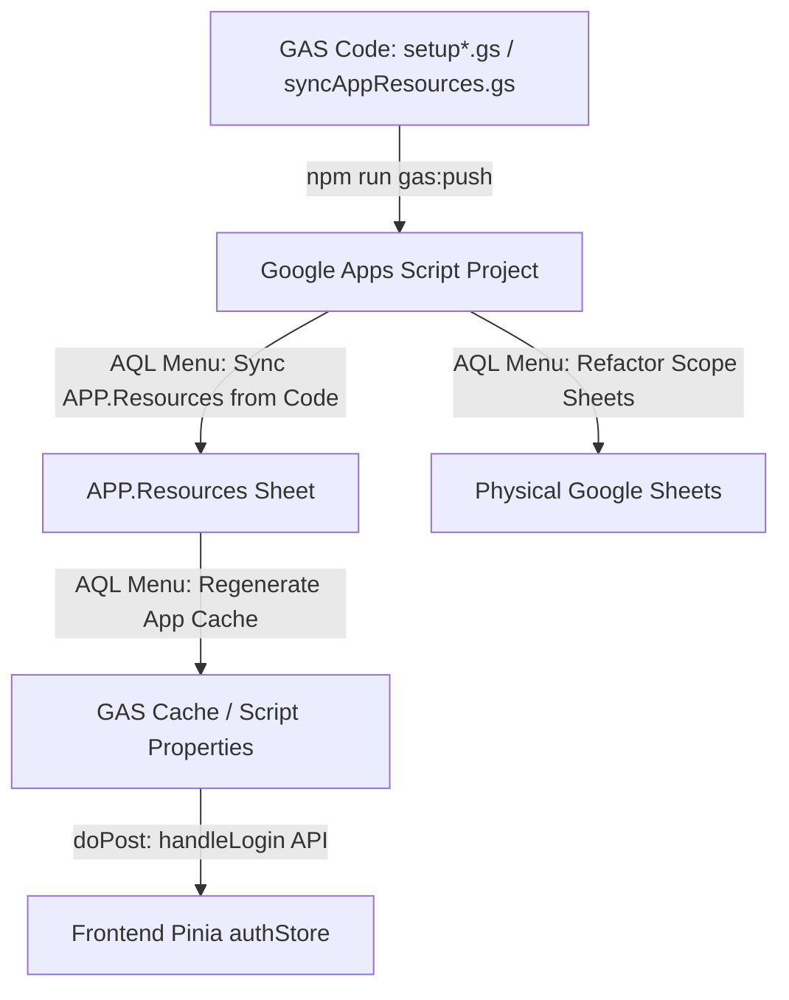

# AQL Database Schema Alteration & Sync Workflow

> **Scope boundary**: This document covers database schema changes only — sheet setups, metadata config, view/report scans, and clasp sync. Its blast-radius steps tell you to SEARCH frontend and backend files for column references — do NOT load the frontend_modification.md or backend_gas_implementation.md init prompts unless the task explicitly requires modifying that code. Read referenced files directly by path.

Use this document to initialize an AI agent session when the task requires modifying, adding, deleting, or altering the database schema (Google Sheets sheets, columns, constraints, or metadata definitions) in the AQL system.

---

## 1. Role Boundaries (Mandatory)

Before proceeding, read and follow the role boundaries defined in [References/Prompt Library/MAP.md](file:///f:/LITTLE%20LEAP/AQL/References/Prompt Library/MAP.md). Your default role is `Guide Agent`. To execute schema changes, you must be in the `Solo Agent` or `Build Agent` role — state the role switch briefly to the user.

---

## 2. System Architecture & Coordination

AQL's database schema is defined in code (Google Apps Script project) and synced/applied programmatically to Google Sheets. The runtime frontend application dynamically loads this metadata to build UI fields, validate inputs, and enforce permission access rules.

### A. The Schema Setup Surface (Apps Script)
Sheet structures are defined in the `GAS/` directory under separate files according to their scope:
* **App Scope**: Configured in [setupAppSheets.gs](file:///f:/LITTLE%20LEAP/AQL/GAS/setupAppSheets.gs)
* **Master Scope**: Configured in [setupMasterSheets.gs](file:///f:/LITTLE%20LEAP/AQL/GAS/setupMasterSheets.gs)
* **Operation Scope**: Configured in [setupOperationSheets.gs](file:///f:/LITTLE%20LEAP/AQL/GAS/setupOperationSheets.gs)
* **Accounts Scope**: Configured in [setupAccountSheets.gs](file:///f:/LITTLE%20LEAP/AQL/GAS/setupAccountSheets.gs)
* **Metadata Sync Config**: Configured in `initAppResourcesCodeConfig()` within [syncAppResources.gs](file:///f:/LITTLE%20LEAP/AQL/GAS/syncAppResources.gs). This config holds UI definitions, validations, default values, post-write hooks, and permission properties.
* **Shared Utilities**: [setupSheetUtils.gs](file:///f:/LITTLE%20LEAP/AQL/GAS/setupSheetUtils.gs) houses general spreadsheet-normalization helpers (e.g., `setup_normalizeSheetSchema` to dynamically insert columns, reorder headers, and apply formatting without losing historical row data).

### B. Core Data Flow & Propagation

---

## 3. Mandatory Pre-Reads (With Line-Level Links)

Before writing any code, you must read the following files:
* Core Schema Normalizer: [setup_normalizeSheetSchema in setupSheetUtils.gs](file:///f:/LITTLE%20LEAP/AQL/GAS/setupSheetUtils.gs#L15-L49)
* Core Code-to-Sheet Sync Config: [initAppResourcesCodeConfig in syncAppResources.gs](file:///f:/LITTLE%20LEAP/AQL/GAS/syncAppResources.gs#L11-L60)
* Canonical Refactoring Procedures: [SCHEMA_REFACTORING_GUIDE.md](file:///f:/LITTLE%20LEAP/AQL/Documents/SCHEMA_REFACTORING_GUIDE.md)
* Resource Column Definition Guide: [SCHEMA_RESOURCE_COLUMNS.md](file:///f:/LITTLE%20LEAP/AQL/Documents/SCHEMA_RESOURCE_COLUMNS.md)

Depending on the scope of the schema alteration, also read the corresponding sheet structure doc:
* [SHEET_APP_STRUCTURE.md](file:///f:/LITTLE%20LEAP/AQL/Documents/SHEET_APP_STRUCTURE.md)
* [SHEET_MASTER_STRUCTURE.md](file:///f:/LITTLE%20LEAP/AQL/Documents/SHEET_MASTER_STRUCTURE.md)
* [SHEET_OPERATION_STRUCTURE.md](file:///f:/LITTLE%20LEAP/AQL/Documents/SHEET_OPERATION_STRUCTURE.md)
* [SHEET_ACCOUNTS_STRUCTURE.md](file:///f:/LITTLE%20LEAP/AQL/Documents/SHEET_ACCOUNTS_STRUCTURE.md)
* [SHEET_PROCUREMENT_STRUCTURE.md](file:///f:/LITTLE%20LEAP/AQL/Documents/SHEET_PROCUREMENT_STRUCTURE.md)

---

## 4. Step-by-Step Implementation Checklist

Follow these steps sequentially to design, execute, and verify a schema change:

### Step 1: Pre-requisite Discovery & Blast Radius Scan (DO NOT SKIP)
Before changing any code, perform these scans to trace downstream dependencies:
1. **Sheet Views Scan**: Search `Sheet Formulas/Views/` using `grep_search` to find any views containing aggregation formulas that reference the target resource or modified columns.
2. **Sheet Reports Scan**: Search `Sheet Formulas/Reports/` using `grep_search` to check if target columns are injected or referenced in printable templates.
3. **Frontend Code Scan**: Search `FRONTENT/src/` to identify pages, components, and composables binding or posting to the target fields.
4. **Backend Hook & Logic Scan**: Search `GAS/` for file handlers (like `procurement.gs`, `stockMovements.gs`, or `outletMovements.gs`) that read or write fields of the altered resource.
5. **Report & Propose**: Inform the user of the blast radius. List:
   * Direct caller frontend files
   * Dependent sheet views and report templates
   * Potential risks (e.g., historical data format breaking)
   * Propose adjustments for the dependent views/reports.
   * Seek explicit clarification and user confirmation before moving to code edits.

### Step 2: Backend Code Modifications (GAS Setup & Sync)
Once approved by the user:
1. **Update Setup Script**: Modify the `schemaByResource` array in the appropriate `GAS/setup<Scope>Sheets.gs` script. Add, remove, or modify headers in the array. Adjust column widths or defaults.
2. **Ensure Audit Columns**: The setup script must append `CreatedAt`, `UpdatedAt`, `CreatedBy`, `UpdatedBy` to the header array of any primary resource sheet.
3. **Update Sync Config**: Locate the resource config within `initAppResourcesCodeConfig()` in `GAS/syncAppResources.gs`:
   * Update `RequiredHeaders` and `UniqueHeaders` if validation rules changed.
   * Update the `UIFields` JSON array to reflect the new form input fields, labels, hints, and types for the frontend rendering.
   * Verify that the column name string and casing match exactly between the setup headers and the sync metadata UIFields.

### Step 3: Frontend Code Modifications
1. Update any Vue pages or custom dialogs under `FRONTENT/src/pages/` binding to the altered fields.
2. Update feature workflows or input parsing in the corresponding composables under `FRONTENT/src/composables/`.
3. Adhere strictly to the [CORE_ARCHITECTURE_RULES.md](file:///f:/LITTLE%20LEAP/AQL/Documents/ARCHITECTURE%20RULES.md), specifically keeping Vue page templates thin and encapsulating business/payload adjustments inside composables.

### Step 4: Documentation Synchronization
1. Document the column additions, removals, or type changes in the relevant sheet structure document under `Documents/` (e.g., [SHEET_OPERATION_STRUCTURE.md](file:///f:/LITTLE%20LEAP/AQL/Documents/SHEET_OPERATION_STRUCTURE.md)).
2. If the change modifies schema options or metadata columns, update [SCHEMA_RESOURCE_COLUMNS.md](file:///f:/LITTLE%20LEAP/AQL/Documents/SCHEMA_RESOURCE_COLUMNS.md).
3. If dependent Sheet Views or Reports were modified, update their corresponding documentation in `Sheet Formulas/Views/` or `Sheet Formulas/Reports/` and record the change in their `INDEX.md` files.

---

## 5. Explicit Guardrails (DOs and DO NOTs)

* **DO NOT** delete columns physically in active sheets unless explicitly instructed by the user, as it may break historical records or third-party formulas. Prefer making columns obsolete in code first.
* **DO NOT** use mismatched header casings. Apps Script columns are case-sensitive.
* **DO** wrap any changes to dependent master/detail relationships in single composite payloads.
* **DO** verify that the setup code safely preserves existing data columns when inserting a new column using the `setup_normalizeSheetSchema` handler.

---

## 6. Targeted Verification Plan

### A. Deploy & Push GAS Changes
1. Run the clasp deployment command from the repository root:
   `npm run gas:push` (or `cd GAS && clasp push`)
2. **Redeployment Rule**: Ask the user for Web App redeployment only when the API contract changed (i.e. changing doPost request/response structure). Do not request redeployment for simple sheet setups, column changes, or metadata config syncs.

### B. Frontend Code Quality
If frontend pages or composables were modified, execute a production compilation check:
`npm --prefix FRONTENT run build`

### C. Manual Sheets Execution Order (Instruct the User)
Provide the user with clear instructions to run the following sheet operations from the Google Sheets menu `AQL 🚀` to apply the database schema changes:
1. **Sync Resources**: Run `AQL 🚀 > 🔄 Sync & Cache > Sync APP.Resources from Code` (pushes code-level UIFields, required headers, and configuration to the live `APP.Resources` sheet).
2. **Apply Setup**: Run `AQL 🚀 > 🛠️ Setup & Maintenance > Refactor <Scope> Sheets` (physically creates, updates, and formats the columns in the live spreadsheets for the affected scope).
3. **Warm Up Cache**: Run `AQL 🚀 > 🔄 Sync & Cache > Regenerate App Cache` (re-hydrates the application config and metadata cache).
4. **Login Verification**: Log out and log back into the web application to fetch the fresh resource schema metadata.
5. **CRUD Alignment Test**: Create a dummy record on the altered resource, update it, and verify that the columns align perfectly with no offset data.
