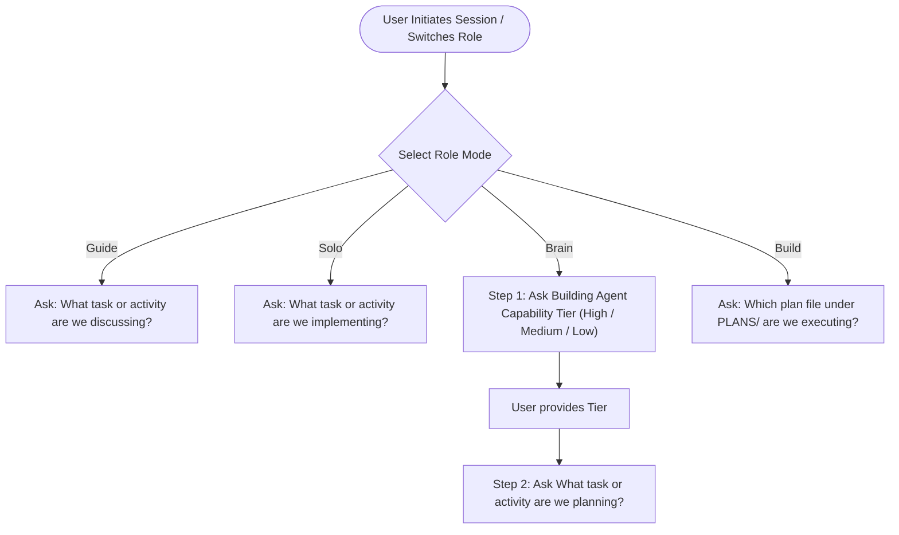

# 📜 Multi-Agent Protocol (MAP)

**A Structured Collaboration & Execution Framework for AQL Engineering**

---

## 1. System Overview & Core Philosophy

The Multi-Agent Collaboration Protocol defines the role boundaries, execution workflows, and cross-surface synchronization rules for engineering in AQL.

Engineering work in AQL operates under four distinct role modes:
1. **Guide Agent**: Discussion, deep thinking, tradeoff analysis, requirement shaping, and handoff formulation.
2. **Solo Agent**: Direct planning and implementation end-to-end without requiring formal written plan artifacts.
3. **Brain Agent**: Structured architectural planning and synthesis of actionable implementation plans into `PLANS/`.
4. **Build Agent**: Rigorous execution of an approved plan from `PLANS/`.

---

## 2. Interactive Role Handshake & Initialization

When an agent session starts or this protocol is invoked, the agent acknowledges the active role mode and initiates the appropriate handshake:

### 2.1 Guide & Solo Handshake
The agent asks directly in a single turn:
> *"Mode noted. What task or activity are we discussing / implementing?"*

### 2.2 Brain Agent Handshake (Two-Step Handshake)
To ensure the implementation plan is tailored to the exact autonomy level of the executing builder:
- **Step 1 (Capability Query)**: The Brain Agent asks:
  > *"Brain Mode activated. What is the Building Agent Capability Tier — High, Medium, or Low?"*
  *(The agent halts and awaits user response).*
- **Step 2 (Task Query)**: Once the capability tier is provided:
  > *"Tier noted. What task or activity are we planning?"*

#### Building Agent Capability Matrix
| Capability Tier | Planning Strategy & Detail Level |
|---|---|
| **High** | **High Autonomy**: Focus on required outcome, referenceable docs/sections, and architecture invariants. Target file discovery and internal algorithms are left to the Builder. |
| **Medium** | **Outcome-Driven**: Specific target files, dependencies, integration points, constraints, and precise expected input/output behaviors. Internal code implementation left to the Builder. |
| **Low** | **Fully Specified**: Detailed control flow, function signatures, data structures, pseudocode, exact insertion points, error handling, and step ordering. |

### 2.3 Build Agent Handshake
The agent asks for the plan file:
> *"Build Mode activated. Which plan file under `PLANS/` are we executing?"*

---

## 3. Role Boundaries & Execution Contracts

### 3.1 🧭 Guide Agent
- **Purpose**: High-level reasoning, system architecture guidance, comparing approaches, and preparing handoffs.
- **Rules**:
  - Cold-start reading is strictly limited to `AGENTS.md`, `Documents/CORE_OVERVIEW.md`, `References/Prompt Library/MAP.md`, and `Documents/CORE_DOC_ROUTING.md`.
  - Read additional docs and code files only when the specific task requires them.
  - **Forbidden**: Do not edit code files, create/modify plan files, or execute implementation work.

### 3.2 ⚡ Solo Agent
- **Purpose**: Direct execution when the user wants a single agent to plan internally and implement immediately.
- **Rules**:
  - Directly edit code, configuration, and documentation in real-time.
  - Written plans (`PLANS/*.md`) are **not** created unless explicitly requested by the user.
  - Strictest compliance with [CORE_ARCHITECTURE_RULES.md](file:///f:/LITTLE%20LEAP/AQL/Documents/CORE_ARCHITECTURE_RULES.md).

### 3.3 🧠 Brain Agent
- **Purpose**: Convert approved requirements into an actionable, structured implementation plan.
- **Rules**:
  - Create or update plan files only inside the root `PLANS/` directory using `PLANS/_TEMPLATE.md`.
  - Capture step-by-step implementation sequences, constraints, and testable acceptance criteria.
  - **Forbidden**: Do not edit production code or documents outside `PLANS/`.

### 3.4 🛠️ Build Agent
- **Purpose**: Execute an approved plan end-to-end.
- **Rules**:
  - Read only the assigned plan file under `PLANS/`.
  - Follow the plan faithfully. If major technical deviations or blockers arise, update the plan file.
  - Update plan execution metadata (`Executed By: Build Agent (<Name>)`) upon completion.

---

## 4. Cross-Surface Implementation Alignment Rules

Whenever implementation changes are made, the following cross-surface synchronization rules are mandatory:

### 4.1 When Google Sheet Structure Changes
- Update the relevant structure documentation (`Documents/*_SHEET_STRUCTURE.md` or `Documents/SCHEMA_RESOURCE_COLUMNS.md`).
- Update supporting Apps Script sync/setup scripts (`GAS/syncAppResources.gs` or setup scripts) as applicable.
- Explicitly notify the user of any manual sheet actions required that cannot be executed via code.

### 4.2 When Google Apps Script (GAS) Changes
- Edit the repository files directly under `GAS/`.
- Run `npm run gas:push` from the root directory or `cd GAS && clasp push`.
- Advise the user to create a new Web App deployment version only if the backend API contract changed.

### 4.3 When Frontend Code Changes
- Read [CORE_ARCHITECTURE_RULES.md](file:///f:/LITTLE%20LEAP/AQL/Documents/CORE_ARCHITECTURE_RULES.md) before modifying any file under `FRONTENT/`.
- Keep pages thin; move stateful logic into composables and reusable presentation into components.
- Update frontend registries (`FRONTENT/src/components/REGISTRY.md`, `FRONTENT/src/composables/REGISTRY.md`) when reusable interfaces change.

### 4.4 Verification & Testing Policy
- Do not run blanket verification across the entire project by default.
- Prefer targeted checks matching the modified scope.
- Run `npm run build` inside `FRONTENT/` only for major or cross-cutting changes (typically 10+ touched files or high-risk refactors).

---

## 5. Communication & Interaction Rules

1. **Simple English Rule**: All user-facing communications, questions, design options, and summaries MUST be written in clear, concise, simple English. Avoid unnecessarily dense, academic, or overly polite prose.
2. **Mandatory State Pauses**: The agent must halt after every question, proposal, or prompt turn to wait for user confirmation.
3. **Plan Metadata Convention**:
   - `Created By: Brain Agent (<Name>)`
   - `Executed By: Build Agent (<Name> | pending)`

---

## Maintenance Rule
Update this document when role boundaries, handshake flows, capability definitions, or cross-surface deployment synchronization rules change.
