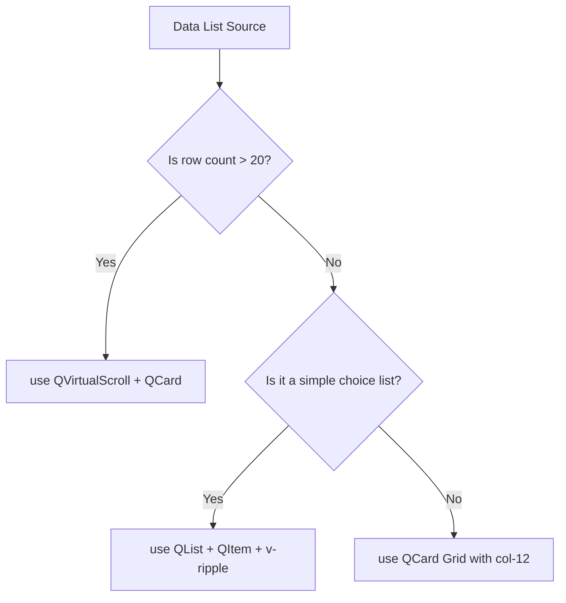

# 01_QUASAR_PHILOSOPHY.md - Core Mindset & Design Philosophy

This document defines the core architecture and UX philosophy of using Quasar in the AQL ecosystem. It establishes how AI agents must approach building, layout structuring, styling, and data rendering for a mobile-first ERP, procurement, and inventory application.

---

## 1. Purpose

The purpose of this philosophy document is to shift the AI agent's thinking from generic Vue desktop layouts (complex grids, wide tables, hover-based drop-downs) to high-performance, touch-friendly, mobile-first mobile Web App patterns (scroll-lists, cards, bottom sheets, tap triggers) using native Quasar layout blocks.

---

## 2. Core Philosophy

The AQL application type is a **Mobile-First ERP** (95% mobile usage, 5% desktop). Thus, design decisions must treat mobile as the primary environment:
*   **Mobile-First Grid Design:** Never layout page grids starting from desktop widths (e.g., `col-md-3`). Always build layouts starting with `col-12` (full-width mobile cards) and layer responsive columns (e.g., `col-sm-6 col-md-4`) as secondary adaptations.
*   **Touch UX over Mouse UX:** Touch-friendly interfaces cannot rely on hover effects (e.g., Tooltips or context menus triggered by mouse movement). Every interaction must be an explicit tap action with distinct visual feedback (e.g., `v-ripple`).
*   **Quasar-First Design System:** Quasar includes a mature utility design system (spacing, typography, color palettes, shadow levels, grid cells). Raw HTML tags (`div`, `p`, `span`) should only be styled with Quasar CSS utility classes (e.g., `q-pa-md`, `text-subtitle2`, `bg-grey-2`). Hand-rolled custom CSS styles or utility framework integrations (like Tailwind) are strictly prohibited.

---

## 3. Golden Rules

1.  **Mobile Priority Index:** If a feature looks perfect on desktop but overflows, has small text, or requires double-tapping on mobile, the feature is a failure. Optimize for mobile screen sizes (320px - 480px width) first.
2.  **No Naked Click Handlers:** Any button, list item, or card section that triggers an action must have the `v-ripple` directive and have a target height of at least `44px`.
3.  **Strict Layer Separation:** Vue templates and `<script setup>` code are presentation layers. They MUST NOT contain business rules, validation builders, or service gateways. They communicate exclusively through small, single-purpose composables.
4.  **Enforce Permission Gating:** Every interactive control that routes pages, opens dialogs, or mutates data must reactively bind to `v-if="allowed({ resource: 'action' })"` using the AQL resource config helper.

---

## 4. Component Usage Guidelines

When choosing how to display lists, metrics, and actions, prioritize components using this sequence:



*   **QCard:** The main structural container for inventory, CRM records, and detail views. Set `flat` and `bordered` for clean mobile layouts.
*   **QList & QItem:** Used for navigation menus, activity histories, and configuration choices.
*   **QVirtualScroll:** Mandatory for high-volume transactions, ledger items, or stock status views to prevent DOM lag on mobile browsers.
*   **QDialog:** Standard wrapper for actions, forms, or confirmations. Must render inside pages or slide as a bottom sheet rather than centered modal panels.

---

## 5. Best Practices

*   **Utility-Driven Layouts:** Always use Quasar's layout classes (`row`, `col-12`, `q-col-gutter-sm`, `q-gutter-y-md`) to align elements.
*   **Text Constraints:** Ensure text on cards uses text truncation helper classes (`ellipsis`, `ellipsis-2-lines`) to prevent line wrapping from breaking layouts on small screens.
*   **Color Token Usage:** Use semantic text/bg classes (e.g., `text-primary`, `bg-surface`, `text-grey-7`, `bg-negative`) instead of specific color hex values to ensure automated contrast adjustment.

---

## 6. Mobile First Rules

*   **Keyboard Management:** Always match input types with appropriate virtual keyboards (`type="number"`, `inputmode="numeric"`, `type="email"`, `type="tel"`).
*   **Scroll Boundaries:** Never nest scrollable blocks. Use Quasar's `QScrollArea` inside high-level layouts, and configure sub-containers to fit fully within viewport bounds.
*   **Target Padding:** Ensure touch surfaces have padding `q-py-md` or `q-pa-md` to provide comfortable margins of error for tap gestures.

---

## 7. Common Patterns

### Mobile Record Card Pattern

```html
<!-- FRONTENT/src/components/Operations/OutletItemCard.vue -->
<template>
  <q-card class="my-record-card q-mb-sm" flat bordered>
    <q-card-section class="q-pa-md">
      <div class="row items-center justify-between no-wrap">
        <div class="column">
          <span class="text-caption text-grey-7 uppercase">Item Code</span>
          <span class="text-subtitle1 text-weight-bold">{{ item.code }}</span>
        </div>
        <q-chip :color="statusColor" text-color="white" dense>
          {{ item.status }}
        </q-chip>
      </div>
      <q-separator class="q-my-sm" />
      <div class="row justify-between">
        <span class="text-body2 text-grey-8">Stock Qty:</span>
        <span class="text-body2 text-weight-medium">{{ item.qty }} pcs</span>
      </div>
    </q-card-section>
    
    <q-card-actions align="right" class="q-px-md q-pb-md" v-if="allowed({ inventory: 'update' })">
      <q-btn 
        v-ripple
        label="Edit Stock" 
        color="primary" 
        flat 
        dense
        icon="edit"
        @click="emit('edit', item.id)"
      />
    </q-card-actions>
  </q-card>
</template>

<script setup>
import { computed } from 'vue'
import { useResourceConfig } from 'src/composables/useResourceConfig'

const props = defineProps({
  item: { type: Object, required: true }
})
const emit = defineEmits(['edit'])

const { allowed } = useResourceConfig()

const statusColor = computed(() => {
  return props.item.status === 'Active' ? 'positive' : 'negative'
})
</script>
```

---

## 8. Reusable Component Suggestions

*   `AqlMobileHeader`: Custom sticky toolbar with inline navigation, search icon, dynamic back arrow, and permissions check.
*   `AqlStatusBadge`: Custom chip wrapper implementing standard semantic color maps for inventory/procurement workflows.

---

## 9. Accessibility Notes

*   **Dynamic Font Sizes:** Use CSS units like `em` or `rem` (Quasar's default classes use these scale tokens) to adjust when user system text size overrides are present.
*   **Icon Identifiers:** Always supply `aria-label` or nested `sr-only` details when rendering action-only buttons (like single-icon close/edit/delete buttons).

---

## 10. Dark Mode Notes

*   Avoid setting solid hardcoded white backgrounds (`bg-white`) on cards. Use Quasar's `bg-surface` or `card` classes which automatically shift to custom slate values in Dark Mode.
*   Use `text-grey-7` for secondary titles or labels rather than `#666` to preserve contrast.

---

## 11. Performance Notes

*   **Avoid Over-rendering:** Use `v-if` rather than `v-show` to strip hidden configurations out of the DOM on weak mobile CPUs.
*   **Virtual Scroll Height:** Always provide a fixed `item-size` in `QVirtualScroll` layouts to allow pre-calculations.

---

## 12. Anti-Patterns

*   **Anti-Pattern:** Using `QTable` inside mobile views without responsive card fallbacks, forcing horizontal scrolls.
    *   *Correction:* Always implement list rows as individual `QCard` elements stacked vertically on mobile viewports.
*   **Anti-Pattern:** Implementing raw inline CSS height/width calculations inside components.
    *   *Correction:* Use Quasar's layout helpers and breakpoints (`q-mx-auto`, `col-12`).

---

## 13. AI Agent Rules

1.  **Enforce JavaScript Composition:** Write logic using `<script setup>` with JS ES6+ standard. Reject TypeScript configurations unless explicitly instructed.
2.  **No Service Imports in Components:** Never import API services (`*Service.js`) or stores (`data.js`) inside Vue view templates. Access service states only via composables.
3.  **Audit Padding Sizes:** Inspect generated elements to confirm padding values on touch targets are not under `8px` (`q-pa-xs` or `q-pa-none` are prohibited on tap components).

---

## 14. Decision Matrix

| Screen Size | Data Volume | Recommended Component Selection | UX Interaction Pattern |
| :--- | :--- | :--- | :--- |
| **Mobile (<600px)** | < 15 records | `QCard` items list | Stacked vertical scroll with floating tap actions |
| **Mobile (<600px)** | > 20 records | `QVirtualScroll` wrapping custom card items | Page scroll with lazy-rendering list elements |
| **Mobile (<600px)** | Options list | `QBottomSheet` or `QDialog` slide | Overlay panel with standard `QItem` row buttons |
| **Desktop (>1024px)**| > 20 records | `QTable` with pagination | Horizontal grid view with inline actions |

---

## 15. Final Rule

Every layout built in this repository must begin as a mobile-first `col-12` card layout, using raw HTML styled strictly with Quasar CSS class tokens, and business workflow actions routed via permission-gated composables.
