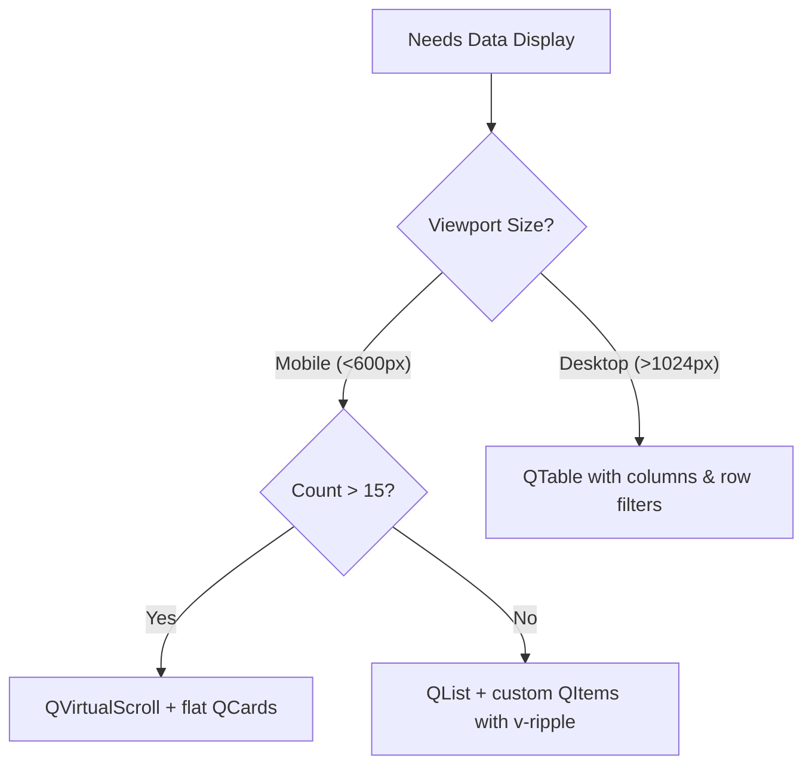
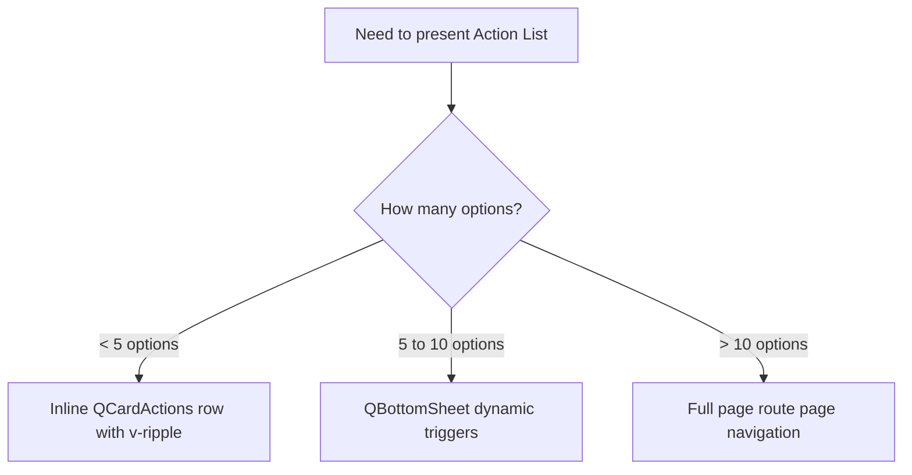
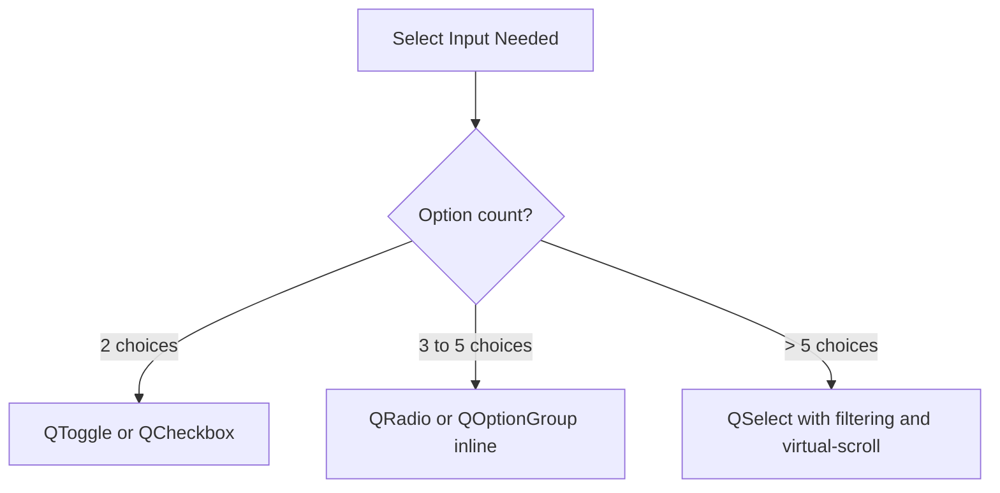

# 03_QUASAR_COMPONENT_SELECTION.md - Component Selection Guide

This document acts as the decision engine for AI agents when selecting Quasar components for building user interfaces. It details when to use lists, cards, tables, menus, bottom sheets, dialogs, and specific input types under the 95% mobile-first ERP context.

---

## 1. Purpose

The purpose of this guide is to establish a strict, repeatable framework for UI component selection. It prevents AI agents from choosing components that perform poorly on mobile viewports (like `QTable` or multi-level dropdown `QMenu` fields) and provides visual flow paths to identify optimal alternatives.

---

## 2. Core Philosophy

AQL components are selected for **Touch Accuracy, Screen Real Estate Conservation, and Processing Speed**. When developing:
*   **Default to Stacked Cards:** Large data grids are replaced by lists of `QCard` blocks containing key fields and action rows.
*   **Prefer Bottom Panels:** In place of large floating modal dialogs, use bottom-sheet components (`QBottomSheet`) that align naturally with mobile thumb touch zones.
*   **Conserve Visual Space:** Forms must remain dense and use clean collapsible sections to hide advanced parameters.

---

## 3. Golden Rules

1.  **The 15-Row Rule:** If a dataset displays or is expected to grow beyond 15 items, never use a basic list loop. Use `QVirtualScroll` wrapping card items.
2.  **No Multi-Column Desktop Pickers:** Dropdown selectors must remain simple, single-column elements. If multi-level properties are needed, slide a full screen route overlay page.
3.  **Confirm Mobile Dialog bounds:** Dialog cards on mobile screens must have `maximized` properties applied dynamically on widths under `sm` to ensure touch actions are within bounds.
4.  **No Complex Hover Popovers:** Never use tooltips or menus that require hover triggers. All helper details must mount as tap-dismiss overlays.

---

## 4. Component Selection Decision Trees

AI agents must consult the following decision structures before generating UI blocks:

### Data Grid / List Selection



### Action Panel Selector



### Selector Input Decision Matrix



---

## 5. Best Practices

*   **Page vs Dialog:** If a form contains more than 5 inputs, do not use `QDialog`. Route the user to a dedicated edit page instead. This gives the virtual keyboard enough room and prevents focus shifts from pushing the form layout out of the screen.
*   **Select Autocomplete:** Always enable `use-input` and filter options in `QSelect` when option lists exceed 10 records. This prevents the user from scrolling through long dropdowns on touchscreens.

---

## 6. Mobile First Rules

*   **Action Comfort:** Group primary buttons near the bottom-right of layouts to match comfortable thumb sweep motions on mobile devices.
*   **Dense Styling:** Enforce the `dense` prop on `QInput`, `QSelect`, and `QBtn` components when layouts present compact data sets (like inventory rows).

---

## 7. Common Patterns

### Responsive List/Card Layout

```html
<!-- FRONTENT/src/components/Operations/OutletItemFeed.vue -->
<template>
  <div class="outlet-item-feed">
    <!-- Desktop View (5% usage) -->
    <q-table
      v-if="$q.screen.gt.sm"
      :rows="items"
      :columns="columns"
      row-key="id"
      flat
      bordered
    />

    <!-- Mobile View (95% usage) -->
    <q-virtual-scroll
      v-else
      :items="items"
      item-size="110"
      v-slot="{ item }"
    >
      <q-card class="q-mb-sm flat bordered" :key="item.id">
        <q-card-section class="q-pa-sm">
          <div class="row justify-between items-center">
            <span class="text-subtitle2 text-weight-bold">{{ item.name }}</span>
            <span class="text-primary">{{ _C(item.price, true) }}</span>
          </div>
          <div class="text-caption text-grey-6">{{ item.description }}</div>
        </q-card-section>
        
        <q-card-actions align="right" class="q-py-xs">
          <q-btn 
            v-if="allowed({ inventory: 'create' })"
            v-ripple 
            label="Add" 
            color="primary" 
            dense 
            flat 
            @click="emit('add', item)" 
          />
        </q-card-actions>
      </q-card>
    </q-virtual-scroll>
  </div>
</template>

<script setup>
import { useCurrency } from 'src/composables/useCurrency'
import { useResourceConfig } from 'src/composables/useResourceConfig'

defineProps({
  items: { type: Array, required: true },
  columns: { type: Array, required: true }
})
const emit = defineEmits(['add'])

const { _C } = useCurrency()
const { allowed } = useResourceConfig()
</script>
```

---

## 8. Reusable Component Suggestions

*   `AqlActionSelector`: Standard wrapper that presents buttons on desktop and shifts to a `QBottomSheet` dynamic panel when rendered on mobile screens.

---

## 9. Accessibility Notes

*   Ensure that components like `QToggle` have descriptive aria labels when their state change triggers background operations.

---

## 10. Dark Mode Notes

*   Verify that `QCard` borders use subtle grey tokens (`q-mb-md border-grey-3` or basic `bordered` prop) to avoid high-contrast white boxes in dark mode.

---

## 11. Performance Notes

*   **Virtual Scroll Performance:** Avoid nested template operations inside `QVirtualScroll` loops. Keep card layouts simple and clean.

---

## 12. Anti-Patterns

*   **Anti-Pattern:** Using desktop-styled floating multi-level dropdowns (`QMenu` with anchor alignments) inside mobile lists.
    *   *Correction:* Replace with bottom sheet actions list.
*   **Anti-Pattern:** Putting massive search forms inside standard dialog modals.
    *   *Correction:* Open a full page search route with list outputs.

---

## 13. AI Agent Rules

1.  **Enforce Adaptive Overlays:** When writing modal dialog setups, verify if screen checks (`$q.screen.lt.sm`) are integrated to make the dialog maximize on mobile screens.
2.  **Audit Data Feeds:** Reject the usage of `QTable` inside any view file that lacks a corresponding mobile card layout alternative.

---

## 14. Decision Matrix

Use the matrix below to choose the correct layout strategy:

| User Target Requirement | Input Data Size | Output Component Selection | Layout Setup |
| :--- | :--- | :--- | :--- |
| **Select 1 supplier** | < 5 suppliers | `QOptionGroup` with radio options | Inline column block |
| **Select 1 supplier** | > 10 suppliers | `QSelect` with `use-input` (filtering) | Dense outlined popup |
| **Edit CRM Details** | 3 text fields | `QDialog` modal | Centered, lazy loaded |
| **Edit CRM Details** | > 8 inputs | New layout route page | Scrollable grid layout |
| **Batch approve items** | > 50 records | `QVirtualScroll` | Dynamic infinite loader |

---

## 15. Final Rule

AI agents must select cards and virtual scrolls over tables, bottom sheets and route pages over massive dialogs, and filter-enabled select controls over raw lists whenever developing AQL mobile modules.
