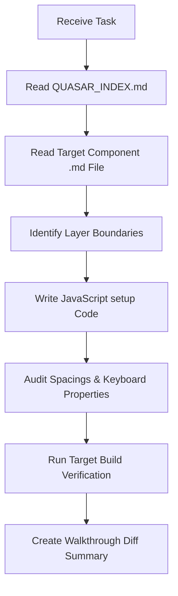

# 92_QUASAR_AI_IMPLEMENTATION_RULES.md - AI Coding Agent Directives

This document defines the prompt rules, automated checks, verification commands, and layout assertions that AI coding agents must execute when developing Quasar modules inside the AQL repository.

---

## 1. Purpose

The purpose of this guide is to define the exact prompt workflows for AI agents, establish verification procedures, and prevent sub-optimal coding configurations.

---

## 2. Core Philosophy

AI code generation is **Index-Driven, Audited, and Compliant**:
*   **Index-Driven Lookups:** Before writing code, the AI agent must read [QUASAR_INDEX.md](file:///f:/LITTLE%20LEAP/AQL/References/Quasar/QUASAR_INDEX.md) and open the relevant component file.
*   **Compliance Auditing:** AI agents must check layout files for layer boundaries (no database queries or Pinia stores in view files) and CSS violations (no raw inline styles or custom layouts).
*   **Targeted Verification:** Run focused checks rather than broad testing scripts.

---

## 3. Golden Rules

1.  **Read the Topic Doc First:** Locate and open the specific `.md` guide matching the component you are modifying before writing code.
2.  **Audit Layer Separations:** Verify that Axios calls and raw IndexedDB queries live strictly inside services, coordinated inside stores, and called in composables.
3.  **Validate Permission Gating:** Ensure all new clickable buttons verify resource permissions via the `allowed()` helper.
4.  **Run Targeted Linting Checks:** Verify that newly created components compile cleanly and follow JavaScript setup formatting rules.

---

## 4. AI Verification & Coding Checklist

AI agents must execute the following step-by-step procedure for every task:



### Required Verification Command
If major edits affect shared packages, run the targeted build verification command from the repository root:
`npm run build`

---

## 5. Best Practices

*   **Diff Formats:** Present code adjustments using clear Git-style markdown diff blocks to help the user review layout lines quickly.
*   **Generic Verbs:** Ensure store calls use generic resource verbs (`fetchRecord`, `createRecord`). Prohibit resource-specific functions names in stores.

---

## 6. Mobile First Rules

*   **Review Sizing Paddings:** Ensure mobile templates do not use sizing values under `8px` (`q-pa-xs`) on tap targets.
*   **Verify Inputs Keyboard:** Confirm numbers or pins inputs define correct keyboard mode tags.

---

## 7. Common Patterns

### Correct AI System Prompt Segment

Include the following directive segment inside system instructions to force compliance:

```markdown
You must comply with the AQL Quasar AI Knowledge Base guidelines.
1. Read References/Quasar/QUASAR_INDEX.md to find the target component guide.
2. Ensure components are logic-free presentation layers written in Vue 3 Composition Setup (JS).
3. Confirm all buttons use v-ripple and verify permissions via allowed().
4. Format currency outputs strictly via the dynamic polyvalent helper _C from useCurrency.
```

---

## 8. Reusable Component Suggestions

*   Verify if layout components can inherit properties from `AqlPage` or `AqlList`.

---

## 9. Accessibility Notes

*   Verify all button icon elements define explicit ARIA label descriptions.

---

## 10. Dark Mode Notes

*   Confirm backgrounds use CSS variables to support dynamic theme inversion.

---

## 11. Performance Notes

*   **Use Shallow Refs for Lists:** Ensure transaction feeds arrays declare shallow reactive references to optimize mobile CPU operations.

---

## 12. Anti-Patterns

*   **Anti-Pattern:** Writing Option API code blocks or using TypeScript setup tags.
    *   *Correction:* Write Composition API JavaScript ES6+ scripts.
*   **Anti-Pattern:** Hiding visual elements via custom hidden CSS classes without checking `Screen` plugin settings.
    *   *Correction:* Manage DOM nodes conditionally via `v-if` with screen width flags.

---

## 13. AI Agent Rules

1.  **Index Routing Assertions:** Verify you read the index map before modifying any Vue files.
2.  **Layer Audits:** Check that no store or service logic resides in view files.

---

## 14. Decision Matrix

| Coding Phase | Critical Check | Required Action | Target Outcome |
| :--- | :--- | :--- | :--- |
| **Research** | Component Lookup | Read specific `.md` guide | Align with guidelines |
| **Coding** | Layer Compliance | Decouple templates logic | Keep components thin |
| **Ergonomics** | Touch Targets Sizing | Audit spacings & keyboard properties| Large touch targets |
| **Verification**| Lint & Compile | Run targeted build commands | Build compiles cleanly |

---

## 15. Final Rule

All AI agents must locate component-specific guidelines in the Quasar AI Index, write logic-free views using Vue 3 Composition setup (JS), gate actions with permission checks, format money using dynamic helpers, and run targeted build verifications on updates.
