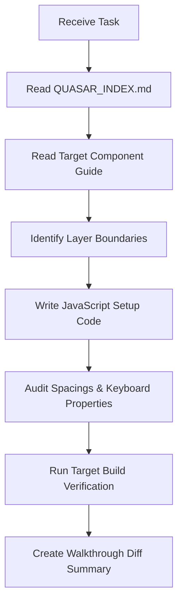

# Quasar AI Implementation Reference Guide

This reference guide describes the lookup workflows, architectural verification steps, layout assertions, and build checks designed to guide automated coding agents when modifying or developing Quasar modules inside the AQL repository.

---

## 1. Overview of AI Development Workflows

To maintain consistency and prevent regressions, coding agents utilize a structured review and verification process:

1.  **Index Research**: Refer to `QUASAR_INDEX.md` to identify the specific component reference documentation matching the target files.
2.  **Layer Audit**: Review proposed additions to ensure that UI components remain logic-free presentation templates, routing logic to composables, and data operations to services/stores.
3.  **Permission Gating**: Check that interactive elements (such as action buttons or route links) incorporate the `allowed()` helper from `useResourceConfig()` to enforce role permissions.
4.  **Targeted Compilation Checks**: Verify changes locally using selective tests or compilation steps rather than running general testing scripts unless broad changes are made.

---

## 2. Agent Implementation Workflow

### Build Verification
When major updates affect shared layout files, components, or router directories, run the compilation check from the repository root:
`npm run build`

---

## 3. Core Coding Patterns for Agents

*   **Diff Presentations**: Display changes using standard markdown diff blocks (with clear `+` and `-` markers) to highlight lines modified in existing templates.
*   **Separation of Concerns**: Confirm that network requests (Axios) do not reside inside the script setup of `.vue` components. Instead, ensure they are executed within services and Pinia store state handlers.
*   **Currency Formats**: Verify that all monetary values are formatted using the dynamic `_C` helper from `useCurrency` to support multiple regions and layouts.
*   **Touch Targets & Keyboard Settings**: Check that buttons and interactive tags maintain adequate mobile target dimensions (48px or more) and that numeric inputs declare matching keyboard settings (`inputmode="numeric"`).
*   **Reactivity Optimization**: Verify that arrays representing large database queries utilize `shallowRef` to bypass deep Vue reactivity checks.
*   **Theme Inversion Support**: Verify that CSS color classes rely on Quasar design tokens (e.g., `text-primary`, `bg-surface`) or CSS variables to allow proper theme transitions when dark mode is activated.
