# AQL — Field Executive User Manual

Welcome to your hands-on guide to AQL! This manual is designed to guide you through your daily activities as a Field Sales Executive. You will learn how to load inventory into your van, plan store visits, record sales, issue invoices, collect payments, and manage outlet stock balances.

---

## Getting Started

### Step 0.1: Log In to AQL

1. Open AQL.
2. Enter your **Email** and **Password**.
3. Click **Login**.
4. The system loads your personalized dashboard based on your role and permissions.

> [!NOTE]
> If you do not have login credentials, ask your system administrator to create a user account for you.

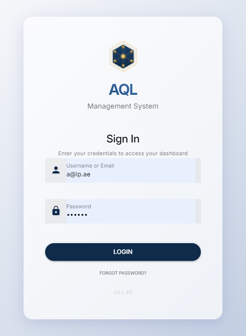

---

### Step 0.2: Understand the Sidebar Menu

After logging in, the **sidebar menu** on the left side of the screen is your primary navigation tool. The menu items you see depend on your role and permissions. For the Field Sales (Executive) role, most operational links are displayed directly at the root level of the sidebar for quick access on mobile screens, while master configurations are grouped under the **Manage** folder, and stock actions are under the **Stock** folder.

As a Field Sales Executive, you will typically see:

| Menu Item / Group | Description |
|---|---|
| **Dashboard** | Performance overview widgets (Visits, Collections, Daily Sales) |
| **Outlet Hub** | 360° store view (Stock Balance, Operating Rules, History) |
| **Outlet Visits** | Plan and track store visits (Overdue, Today, Future, History) |
| **Outlet Restocks** | Track approved outlet replenishment requests |
| **Outlet Deliveries** | Fulfill and complete stock deliveries to outlets |
| **Outlet Returns** | Log unsold, expired, or damaged stock returns from outlets |
| **Outlet Consumptions** | Record shelf stock counts and submit consumption data |
| **Consumption Invoices** | View sales invoices generated for consumed stock |
| **Outlet Payments** | Register and allocate collected payments against invoices |
| **Manage** (Group) | Dropdown containing master data view pages:  • **Outlets**: View/manage outlet records  • **Warehouses**: View/manage warehouse records  • **Operating Rules**: View pricing and credit rules |
| **Stock** (Group) | Dropdown containing inventory action pages:  • **Stock List**: View current stock list by warehouse  • **Transfers**: Create or complete van/warehouse stock transfers |

Throughout this manual, you will be directed to navigate to root-level items directly (e.g., **Outlet Visits**, **Outlet Hub**) or using patterns like **Manage** -> **Outlets** or **Stock** -> **Transfers** for grouped items.

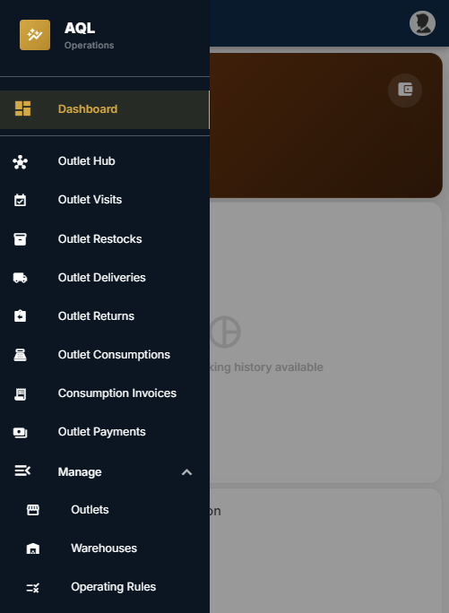

---

## Start of Day: Provisioning Stock (Loading the Van)

Before heading out, you must check if a transfer is required from the **Main Warehouse** into your **Van Warehouse**.

### Step 1.1: Check Stock in Warehouse
1. Open the sidebar menu and select **Stock** -> **Stock List**.
2. A list of active warehouses is displayed. Select the Main Warehouse or your designated Van Warehouse to view its stock details.

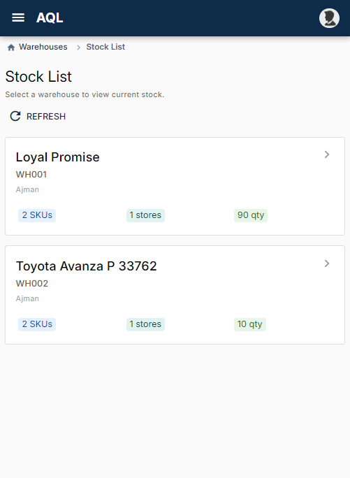

3. Inspect the current stock balance by SKU and storage location to determine what items need to be loaded.

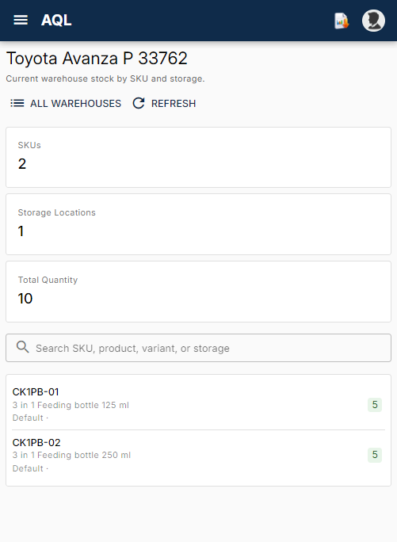

---

### Step 1.2: Obtain Stock via Transfers
If you need to transfer stock to your van, go to **Stock** -> **Transfers**. There are three ways to execute this:

#### Option A: Instant Transfer (Recommended Flow)
If you have access permissions to both the source (Main Warehouse) and destination (Van Warehouse), you can perform an instant transfer which applies immediately without waiting for approval.

1. Navigate to **Stock** -> **Transfers** and click **Add** (+).
2. Enter the transfer details:
   - **Source Warehouse**: Select the Main Warehouse.
   - **Destination Warehouse**: Select your Van Warehouse.
   - **Is Instant**: Set to `TRUE`.
   - **Instant Destination Storage Name**: Specify the storage area inside your van (e.g., `default`).
3. Click **Add Item** to select SKUs and enter quantities.
4. Click **Submit Transfer**. The stock is moved immediately. Physically load the items into your van and start the day.

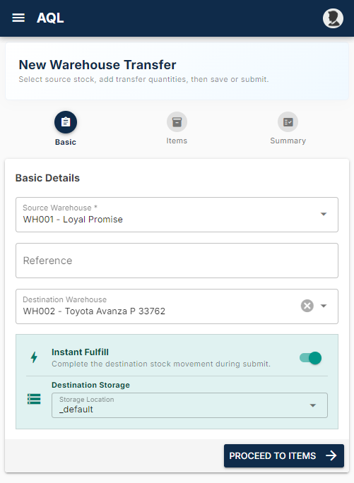

#### Option B: Standard Approval Flow (Manager Review)
If you do not have permission to execute instant transfers, or when transferring between restricted warehouses:

1. Navigate to **Stock** -> **Transfers** and click **Add** (+).
2. Enter details:
   - **Source Warehouse**: Main Warehouse.
   - **Destination Warehouse**: Your Van Warehouse.
   - **Is Instant**: Set to `FALSE`.
3. Select the SKUs and quantities to load.
4. Click **Send for Approval**. The transfer status becomes `PENDING_APPROVAL`.
5. Once your manager approves the request (status becomes `APPROVED`):
   - Open the approved transfer in your **Approved** tab.
   - Click the **Complete** (or **Claim & Complete**) button.
   - Assign the stock to your van's storage racks (e.g., `default`).
   - Click **Complete Warehouse Transfer**. The items are now logged in your van's ledger.

#### Option C: Instant Fulfillment by Warehouse Manager
Alternatively, you can request the warehouse manager to initiate and execute an instant transfer to your van warehouse on your behalf. Once they complete it in the system, you can physically load the items and begin your route.

---

## First-Time / On-Demand Tasks

Use these tasks when setting up a new outlet route for the first time, planning visits, restocking store shelves, or processing customer/internal stock returns.

### 1. Route Planning & Visits

Keep track of which outlets you must visit and organize your daily schedule. Depending on whether you are running a fresh setup or a regular route, the flow is as follows:

### First-Time Setup: Planning Initial Visits
If there are no visits planned yet (e.g., when starting fresh with no stock in outlets):

1. Open the sidebar menu and select **Outlet Visits**.
2. At the bottom of the page, locate the **Outlets without Planned Visits** section.
3. Expand this section to see a list of outlets that do not have any scheduled visits.

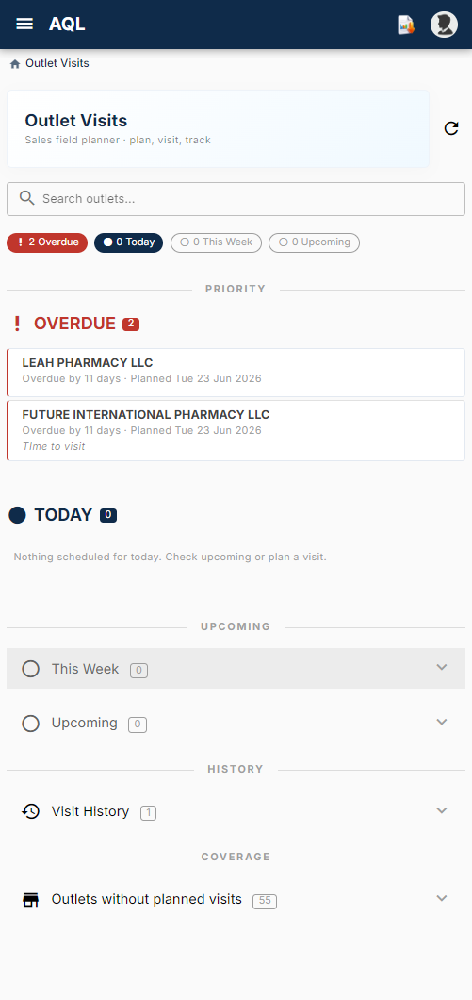

4. Tap on any outlet that you wish to plan a visit for. A planning popup will appear.
5. Set the planned **Date** and add a **Plan Comment** (optional) for anything to be considered (e.g., *"Must meet Manager"*, *"Introduce new product"*, *"Take out sipper cup completely"*).
6. Click **Plan Visit**.

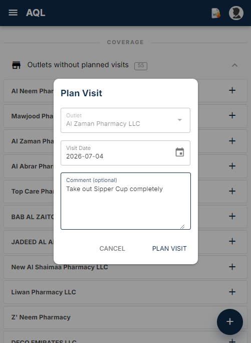

---

### Running Case: Postpone, Cancel, or Complete a Visit
Once your schedule is running, you will have planned visits appearing in your lists.

1. Navigate to **Outlet Visits** and select a visit from the list (**Today**, **Overdue**, or **Future**).
2. Tapping on a visit record will open the action popup screen.

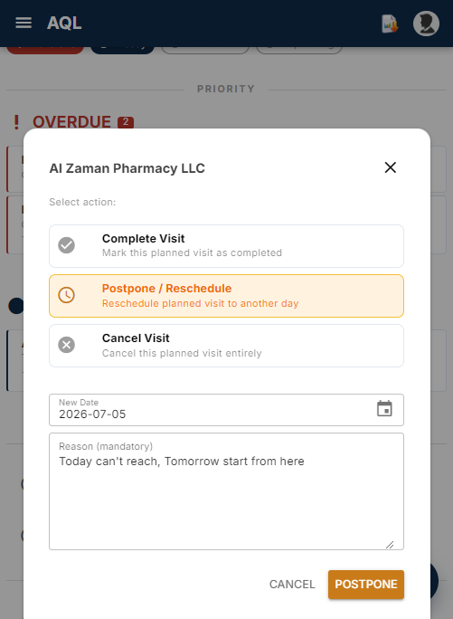

Choose from the following actions:
- **Complete**: Opens the checklist to mark the visit as done. Once submitted, the system will automatically schedule the next visit after 14 days (default) or based on the frequency defined in the outlet's operating rules.
- **Postpone**: Requires entering a new target date and a postponement comment.
- **Cancel**: Cancelling a visit requires a cancellation comment. You can also set an optional new date. If a new date is provided, the next schedule is automatically planned.

---

### 2. Restocks

When outlets run low on stock, you must replenish their shelves. You have two options when initiating a restock:
- **Standard Request**: The request must be approved by the warehouse manager, and then a delivery executive delivers it.
- **Direct Restock (Recommended for Field Executives)**: Since you are authorized with your own Van Warehouse, you can skip the manager-approval and separate delivery workflows by choosing this option.

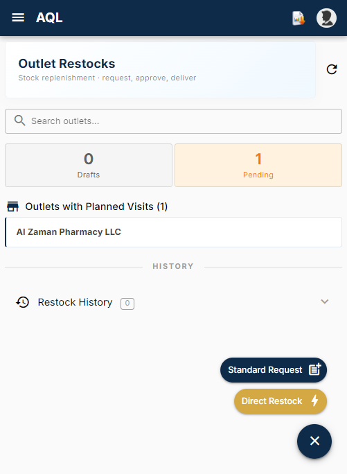

### Step: Create a Direct Restock
1. Go to **Outlet Restocks** in the sidebar and click **Add** (+).
2. Select the **Direct Restock** option.
3. Select the **Source Warehouse** (your van warehouse, which will auto-select by default after the first time).
4. Select the **Outlet** you are restocking, then proceed to the next step.
5. If there is a planned visit scheduled for today, you can check the box to complete the visit and reschedule it after the specified days from today (default is 14 days). Unchecking it will leave the visit as is.
6. Set the **Final Qty** for each product variant (SKU). The product list displays the available van warehouse quantity beneath each SKU. The **Final Qty** represents the total target stock the outlet should have on its shelves after replenishment.

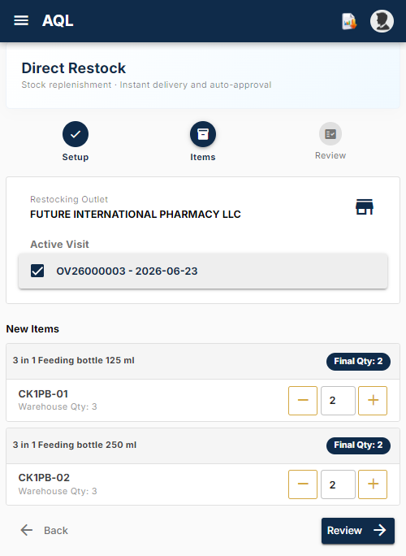

7. Click **Proceed to Review** to verify the details.

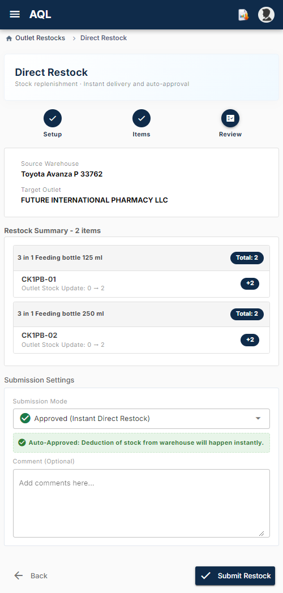

8. Under **Submission Mode**, choose **Approved**. This ensures the restock is approved instantly, avoiding the need for manager intervention. Add any comments if necessary and click **Submit**. The stock is now allocated for delivery.

---

### Step: Mark Deliveries as Completed
Once the restock is submitted, the system redirects you to the Restock View page. You must confirm that the items have been physically dropped off at the outlet.

1. On the Restock View page, tap the **Mark Delivered** button for the items to complete the flow.

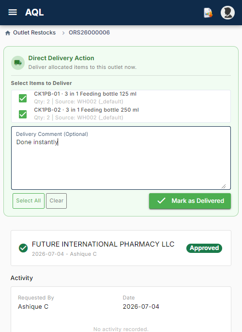

---

### Step: Track Restock History
You can monitor all your restocks (both completed and pending delivery) directly from the index page.

1. Go to **Outlet Restocks** and scroll to the **History** section at the bottom.
2. Filter the list to find specific records. Approved restocks that are not yet marked as delivered will be visible here. Open them to complete the delivery confirmations.

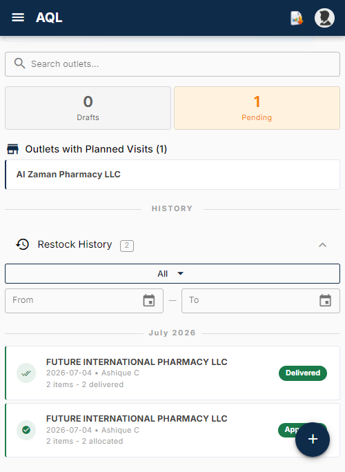

---

### 3. Outlet Returns

Return damaged, expired, or slow-moving items from an outlet. AQL supports multiple return scenarios:
1. **End-User Returns to Outlet**: If an end-user returns an item to the outlet after the outlet has already been invoiced, an invoice adjustment is required. If the item is damaged, it is physically removed from the outlet (stock leaving the outlet).
2. **Internal Outlet Returns**: Returns initiated directly within the outlet due to expiry, overstock, or recall. These do not require invoice adjustments, but stock may leave the outlet.

---

### Step: Log a Return
If you are visiting an outlet specifically to log a return, or if you are only performing a return during a scheduled visit:

1. Open the sidebar menu, select **Outlet Returns**, and click the **Add** (+) button.

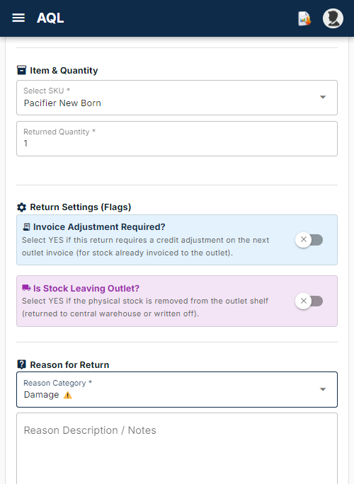

2. Choose the options based on your return scenario:
   - **Outlet & SKU**: Select the outlet and product variant.
   - **Invoice Adjustment Required**: Check this if the outlet needs a financial credit/refund. The credit will automatically apply to the outlet's next invoice generation.
   - **Warehouse Code**: If the stock is physically leaving the outlet, select the target destination warehouse (e.g., your van warehouse).

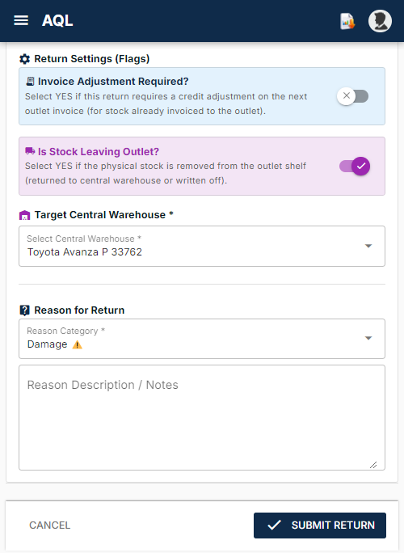

   - **Reason**: Choose a suitable reason code. If none of the predefined options match, select `OTHER`.

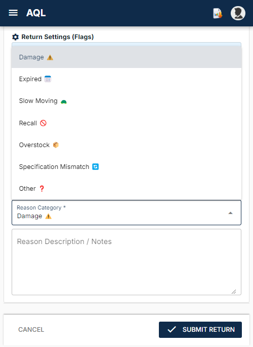

   - **Comment**: Add a descriptive explanation of the return.
3. Click **Submit**.

---

### Step: Process Warehouse Action
Once logged, the return appears in the returns index for further processing.

1. Go to **Outlet Returns** to see the list of active returns.

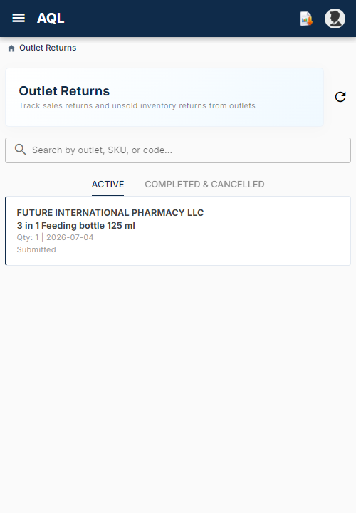

2. Tap on the return record to open its detail page.

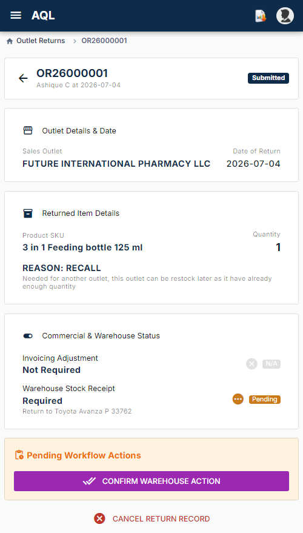

3. Tap **Confirm Warehouse Action** to process the stock. You will be prompted with two choices:
   - **Stocked**: Restocks the returned item back into warehouse inventory for future use.
   - **Dispose**: Disposes of the item permanently due to damage or expiration. A disposal reason is mandatory.
4. Submit the action to complete the flow. All completed or cancelled returns can be viewed in the **COMPLETED & CANCELLED** section of the index page.

---

## Outlet Hub (360° Store View)

Before starting your visits or logging transactions, you can view the complete operational status of any store in the **Outlet Hub** (accessible from the sidebar).

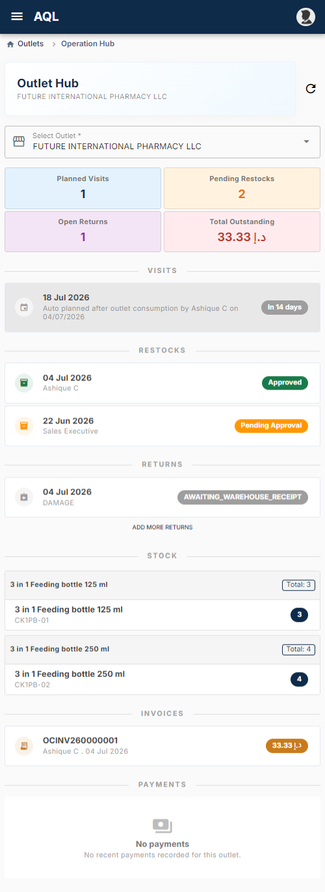

Use the Outlet Hub to view:
- **Summary Statistics**: Overall counters for planned visits, pending restocks, pending returns, and total outstanding payments.
- **Visits**: View scheduled visits or plan a new visit.
- **Restocks**: View pending restocks or initiate a new restock request.
- **Returns**: View open returns or log a new return.
- **Stock**: Current shelf stock quantities grouped by product variant (SKUs).

---

## Routine Workflow

Use these tasks during regular outlet visits to record sales consumption, generate invoices, collect payments, and manage end-of-day reconciliation.

### 1. Outlet Consumption

This is the core activity of your store visit. You will count the stock on the shelves and let the app calculate what was sold.

> [!NOTE]
> **The Consumption Sales Cycle**: As a part of your routine, you visit an outlet and record its current shelf stock. From this single activity, AQL automatically handles the entire sales cycle under the hood: it calculates sold quantities, generates the invoice, manages restocking (sold items or more), marks the visit as complete, schedules a new visit according to frequency operating rules, and processes any logged returns.

#### Step: Log a New Consumption
1. Open the sidebar menu, select **Outlet Consumptions**, and click the **Add** (+) button.
2. Choose the **Outlet**. Outlets with planned visits scheduled for today will be displayed initially. You can select one of these or choose any store from the **All Outlets** dropdown.

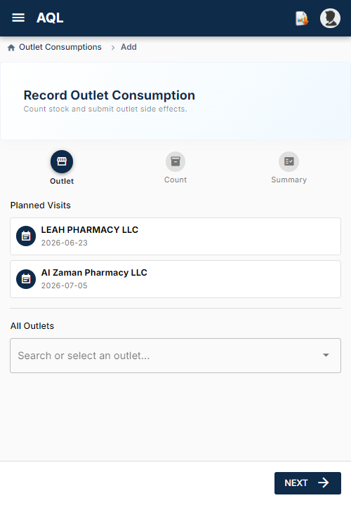

3. Click **Next** to proceed.
4. On the items page, you will see a list of SKUs currently assigned to the outlet.
5. The **System Qty** column shows the stock balance expected on the shelves based on system records. Note that this might differ from the actual physical shelf stock today.
   - A physical count lower than System Qty indicates items were sold.
   - A physical count higher than System Qty indicates items are being returned.
6. Count the physical shelf stock and enter it in the **Counted Stock** field. You can use the `+` and `-` buttons for quick adjustments.
7. **Add Returns**: If you have return items that are not currently in the stock list, click **Add Return** to add them separately.

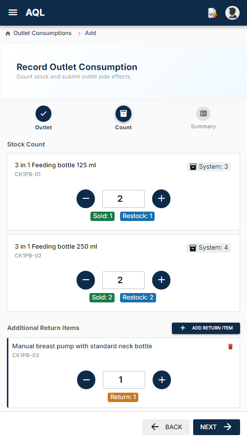

8. Proceed to the next page to view the summary of computed sales and returns.

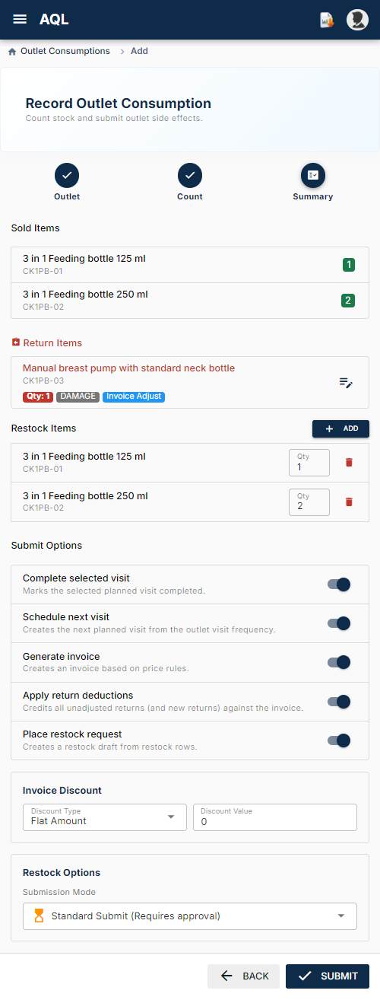

9. **Update Returns**: If return items were added, review their details on the summary page. Select the return reason, check whether invoice adjustment is required, specify if the stock is leaving the outlet, write a proper audit comment, and click **Save**.

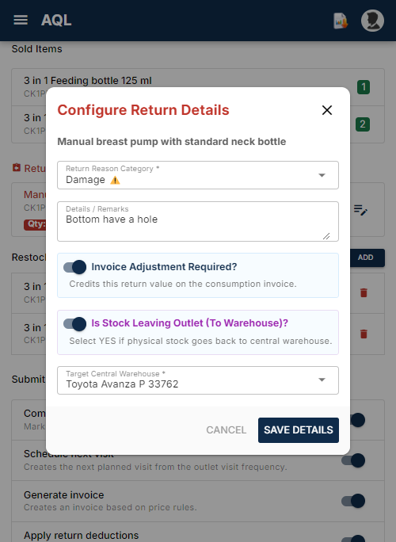

10. **Extra Restock Items**: If the outlet requires replenishment beyond the calculated sold items, you can add extra items to the restock request here.
11. **Discounts**: If you are planning a discount for this consumption, configure it using either Flat or Percentage-wise discount options.
12. **Configure Restock Submission Options**: Before submitting, choose the restock option carefully based on your authorization:

    - **Instant Delivery**: Select this option if you are authorized with your own Van Warehouse. This bypasses manager approval and deliveries workflows. You must select the source warehouse (your van) from which you are restocking the outlet shelves.

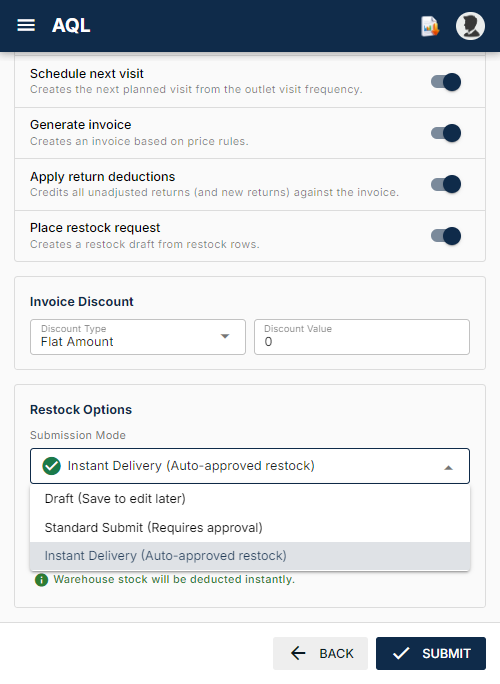

    - **Standard**: Submits the restock request for manager approval and separate delivery routing.
    - **Draft**: Saves the restock as a draft, allowing you to edit or add quantities later before submitting it.
13. Tap **Submit**.
14. Upon successful submission, AQL automatically:
    - Generates a new sales invoice.
    - Creates a restock record (visible in Outlet Restocks).
    - Reschedules the next visit.
    - Creates return records (if any returns were logged, visible in Outlet Returns).

---

#### Step: View Consumption Details
1. You can view all logged consumptions in the **Outlet Consumptions** index page.

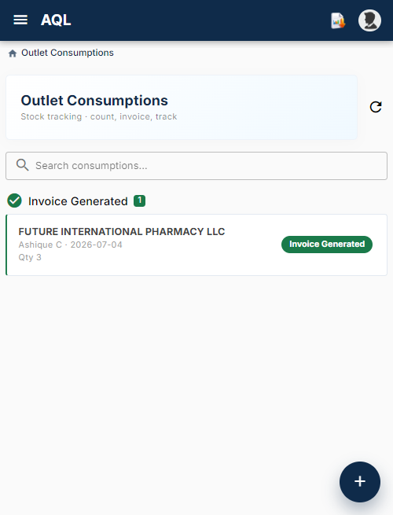

2. Tap on any record to view its complete details, computed sales breakdown, and linked invoices/restocks.

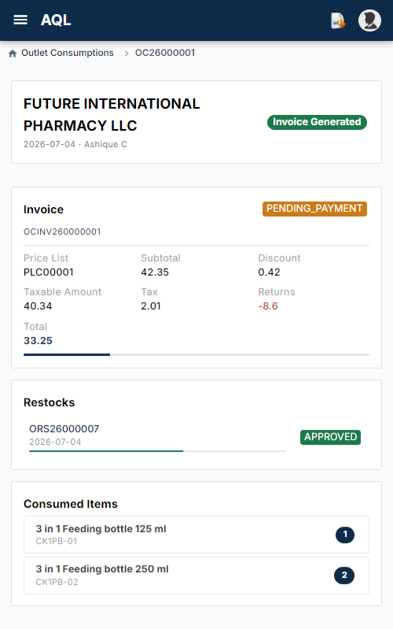

---

### 2. Invoices

Review the bills generated for your sales.

1. Open **Consumption Invoices** from the sidebar.
2. All existing active invoices will be displayed. Outstanding invoices are typically marked as `PENDING_PAYMENT` or `PARTIALLY_PAID`.

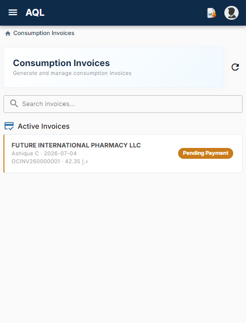

3. Tap on any invoice record in the list to open its complete invoice details page. Here you can inspect invoice totals, taxes, and SKU-level breakdowns.

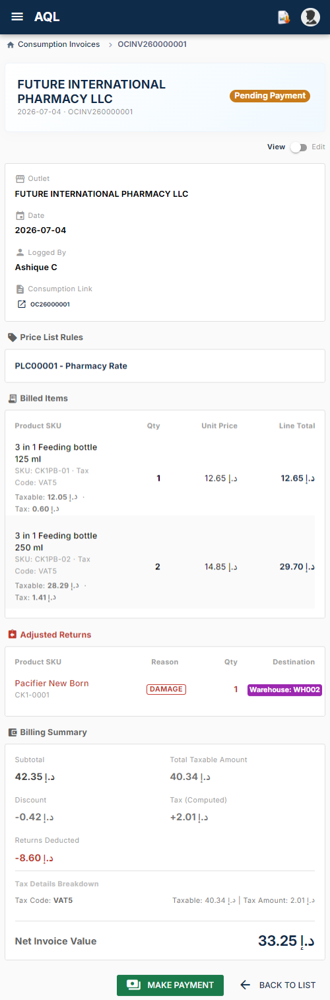

4. **Edit Mode**: You can edit the invoice by switching the edit toggle/button located just below the header panel on top.

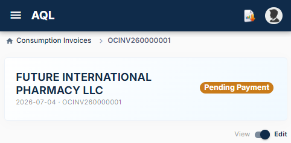

5. Once in edit mode, all details—such as item prices, quantities, and discounts—become editable. Save your changes once done.

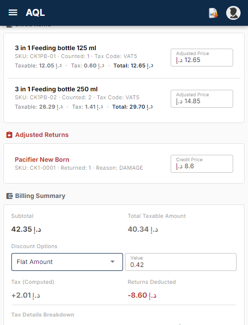

6. **Download Invoice PDF**: Click the download button on the top toolbar (just to the left of your profile picture) while on the invoice details page to download the document.

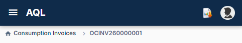

7. Here is an example of the downloaded invoice document layout:

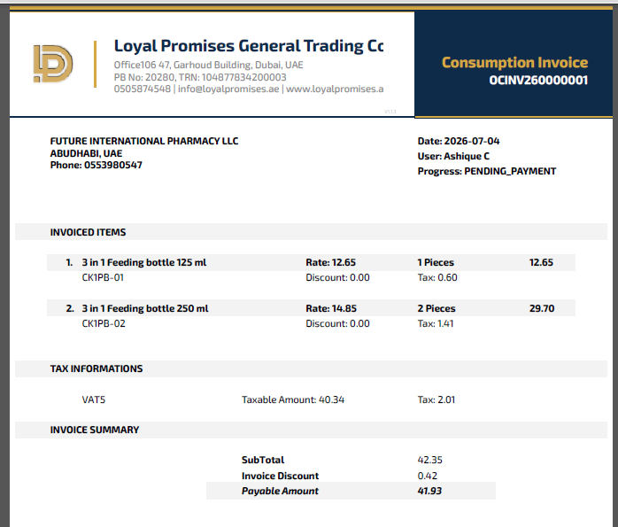

8. **Make Payment**: You can initiate a collection payment directly from the bottom of the invoice details page by clicking the **MAKE PAYMENT** button.

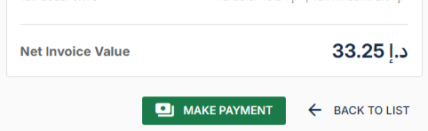

---

### 3. Payment Collection

Collect cash, cheques, or bank transfers from store managers and record them in AQL.

#### Step: Log a New Payment Collection
1. Go to **Outlet Payments** in the sidebar.
2. A list of pending invoices will be displayed.

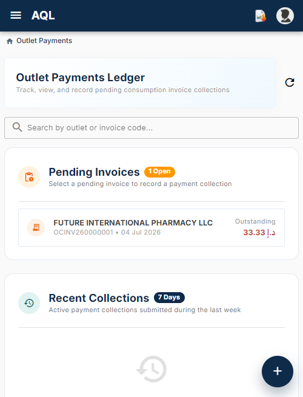

3. Tap on any record to open the collection page.

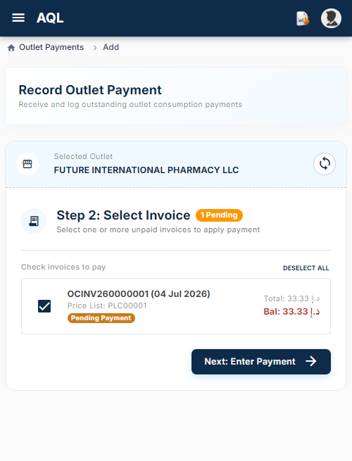

4. Select all the pending invoices you are collecting payment for from this outlet. This allows you to enter any payment amount and distribute it across these selected invoices.
5. Click **Next** to proceed to the entry page.

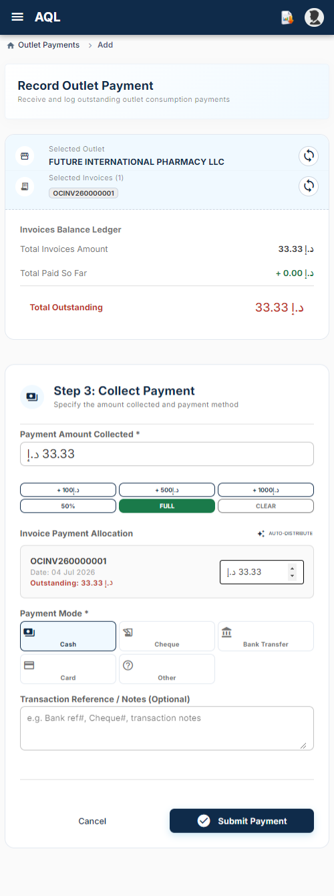

6. Enter the total **Amount** collected.
7. If multiple invoices are selected, you can allocate specific portions of the payment to each invoice below.
8. Choose the **Payment Mode** (Cash, Cheque, Bank Transfer, etc.) and write any optional comments or reference numbers (e.g., cheque numbers or transaction IDs).
9. Submit the payment.

---

#### Step: View and Download Receipts
1. Once successfully submitted, the payment will appear in the **Recent Collections** section on the Outlet Payments page.

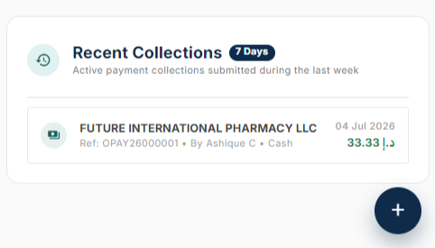

2. Tap on any payment record to view its complete details and invoice allocations.

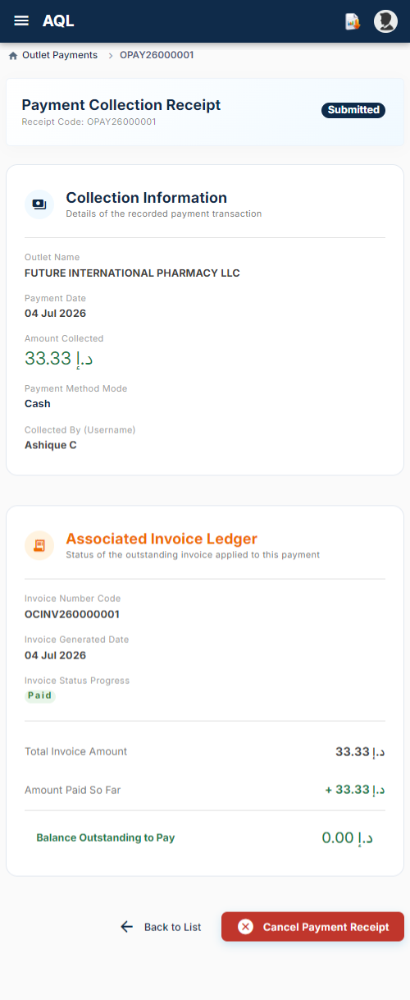

3. **Download Receipt**: Click the download button on the top toolbar (just before your profile picture) to download the payment receipt PDF.
4. Here is a sample of the downloaded payment receipt document:

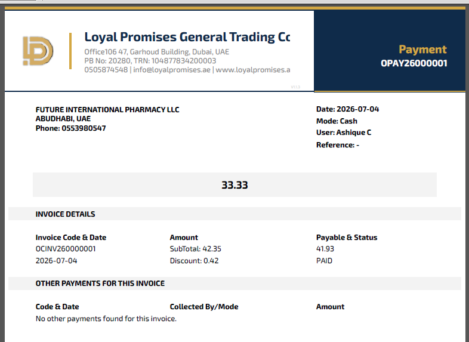

---

> [!IMPORTANT]
> **Dynamic Document Download**: A report/download button is dynamically visible on the top toolbar if there is any document or report available for download on the current page. For example, when on a payment details page, the receipt download button is enabled. Similar download options are available across other pages like invoices, visits, etc., whenever printable/downloadable files are generated.

---

### 4. End of Day: Unloading the Van

At the end of the day, you shall return all unsold stock in your van back to the Main Warehouse. Create a Transfer while selecting Source, Destination, and choose Instant wisely.

---

### 5. Dashboard Analytics

Monitor your daily performance and collections:
1. Select **Dashboard** in the sidebar.
2. Check key performance widgets:
   - **Visits Completed**: Shows completed visits vs. planned visits for today.
   - **Pending Collections**: Total outstanding collections (AED) you need to collect.
   - **Daily Sales**: Total AED value of stock consumed today.
