# AQL — Field Executive User Manual

Welcome to your hands-on guide to AQL! This manual is designed to guide you through your daily activities as a Field Sales Executive. You will learn how to load inventory into your van, plan store visits, record sales, issue invoices, collect payments, and manage outlet stock balances.

---

## Daily Quick-Start Timeline

```mermaid
gantt
    title Field Executive Daily Routine
    dateFormat  HH:mm
    axisFormat %H:%M
    
    section Start of Day
    Load Van (Warehouse Transfers)  :active, 08:00, 08:30
    Route Review (Outlet Visits)    :08:30, 09:00
    
    section Field Operations
    Store Visit Loop (Consumptions) :09:00, 16:30
    Payment Collection (Payments)   :10:00, 16:30
    Fulfill Refills (Deliveries)    :11:00, 16:30
    
    section End of Day
    Unload Van (Warehouse Transfers):16:30, 17:00
```

---

## 1. Start of Day: Provisioning Stock (Loading the Van)

Before heading out, you must transfer inventory from the **Main Warehouse** into your **Van Warehouse**.

### Step 1.1: Initiate the Transfer Request
1. Open the sidebar menu and select **Warehouse** -> **Transfers**.
2. Click the **Add** (+) button in the top right corner.
3. Fill in the transfer details:
   - **Source Warehouse**: Select the Main Warehouse (e.g., `MW01`).
   - **Destination Warehouse**: Select your designated Van Warehouse (e.g., `VW04`).
   - **Is Instant**: Set to `FALSE` (this sends the request to your manager for approval).
4. Click **Add Item** to specify products to load:
   - Select the **SKU**. The system will display the current stock available in the Main Warehouse storage.
   - Enter the **Quantity** you want to load into your van.
   - Repeat for all SKUs needed for the day.
5. Click **Send for Approval** at the bottom of the screen. The transfer progress is now set to `PENDING_APPROVAL`.

---

### Step 1.2: Claim & Complete the Transfer
Once your manager approves the request, the transfer's status changes to `APPROVED`. You must physically load the items and confirm they are in your van.

1. In the **Transfers** index page, go to the **Approved** tab and click on your transfer record.
2. Click the **Complete** (or **Claim & Complete**) button.
3. Assign the received stock to storage areas inside your van (e.g., Storage Name: `default` or specific racks). If needed, you can split quantities across different racks.
4. Click **Complete Warehouse Transfer**.

> [!TIP]
> Completing the transfer automatically logs the inventory into your van's system ledger. You are now responsible for these items.

---

## 2. Route Planning & Visits

Keep track of which outlets you must visit and organize your daily schedule.

### Step 2.1: View Your Visit Lists
1. Select **Outlet Visits** from the sidebar menu.
2. Locate the four tabs:
   - **Overdue**: Visits scheduled for past dates that were never completed. *Action required: Reschedule or Cancel.*
   - **Today**: Store visits scheduled for today. This is your primary route checklist.
   - **This Week / Future**: Visits planned later in the week.
   - **History**: Record of completed, postponed, and cancelled visits.

---

### Step 2.2: Schedule a New Visit (On the Fly)
If you need to visit an unscheduled outlet:
1. Click **Add** in the **Outlet Visits** menu.
2. Select the **Outlet** from the dropdown list.
3. Pick the scheduled **Date**.
4. Add an optional planned note (e.g., *"Urgent collection request"*).
5. Click **Plan Visit**. The progress starts as `PLANNED`.

---

### Step 2.3: Manage Visited, Postponed, or Cancelled Visits
You can update your visit status directly:
- **Complete**: Opens the checklist to mark the visit as done. AQL automatically plans your next visit (e.g., 14 days later) based on the outlet's visit frequency rule.
- **Postpone**: Requires a postponement reason and a new target date. The system automatically cancels the current visit and creates a new planned visit for that new date.
- **Cancel**: Requires a cancellation reason. Marks the visit as `CANCELLED` in history.

---

## 3. At the Outlet: Count & Consumption

This is the core activity of your store visit. You will count the stock on the shelves and let the app calculate what was sold.

### Step 3.1: Start the Consumption Record
1. Go to **Outlet Consumptions** in the sidebar.
2. Click **Add**.
3. Select the **Outlet** you are visiting. The app will automatically detect and link today's upcoming planned visit.

---

### Step 3.2: Record Shelf Stock Counts
1. You will see a list of SKUs currently assigned to the outlet.
2. The **System Qty** column shows the stock balance expected on the shelves.
3. Physically count the stock on the shelf and type it into the **Counted Stock** field.
4. The system automatically computes the **Sold Qty** as:
   $$\text{Sold Qty} = \max(\text{System Qty} - \text{Counted Qty}, 0)$$

> [!IMPORTANT]
> The stock-count page is optimized for mobile screens. Enter counts SKU-by-SKU carefully. If a SKU is missing from the list, you can add it manually.

---

### Step 3.3: Review Summary & Restock Request
1. Click **Next** to proceed to the Summary step.
2. Review the read-only summary of sold quantities. This is what you will bill the customer.
3. Under the **Restock Request** section, the app automatically populates replenishment quantities matching the sold items (to refill the shelf to its target levels).
4. You can edit these replenishment quantities or add additional SKUs if the store requires more stock.

---

### Step 3.4: Final Checklist & Submission
Before hitting submit, look at the checklist items at the bottom of the page:
- `[x] Complete Selected Visit`: Check this to mark your visit as `COMPLETED`.
- `[x] Schedule Next Visit`: Check this to automatically plan the next visit.
- `[x] Generate Invoice`: Check this to instantly generate a sales invoice for the sold quantities.
- `[x] Place Restock Request`: Saves the replenishment request as a draft.
- `[x] Submit Restock Immediately`: Sends the restock request to your manager for approval immediately.

Click **Submit**. Under the hood, this posts negative stock movements for the sold stock and schedules your follow-up actions.

---

## 4. Billing & Invoicing

Review the bills generated for your sales.

### Step 4.1: View consumption invoices
1. Select **Consumption Invoices** from the sidebar menu.
2. Locate the invoice matching your sale. Outstanding invoices are marked as `PENDING_PAYMENT` or `PARTIALLY_PAID`.
3. Open the invoice to inspect the items, unit prices (resolved using the assigned price list), taxable amount, subtotal, and tax totals.

> [!NOTE]
> If you did not generate the invoice during the count submission, you can open the completed **Outlet Consumptions** record and click the **Generate Invoice** button on its details page.

---

## 5. Payment Collection

Collect cash, cheques, or transfers from store managers and record them in AQL.

### Step 5.1: Select the Outlet & Outstanding Invoices
1. Go to **Outlet Payments** in the sidebar.
2. Select the **Outlet**. The app immediately lists all invoices with outstanding balances.
3. Check the boxes for the invoices you are collecting payment for.

---

### Step 5.2: Enter Payment Details & Submit
1. Enter the total collected **Amount** in the input field.
2. Select the **Payment Mode** (e.g., *Cash*, *Cheque*, *Bank Transfer*, *Card*).
3. If applicable, write down the **Reference** (e.g., Cheque number or transaction ID).
4. **Auto-Distribution**: The app will automatically distribute your payment oldest-first across the selected invoices. You can manually adjust these values if needed.
5. Click **Submit Payment**.
   - Fully paid invoices transition to `PAID`.
   - Partially paid invoices transition to `PARTIALLY_PAID`.

> [!WARNING]
> If you make a mistake, you can cancel a payment from the payment details page (requires a cancellation comment). This rolls back the payment amount and updates the invoice status back to unpaid.

---

## 6. Restocking & Refilling (Outlet Deliveries)

When a restock request is approved, you must physically deliver the items to the outlet.

### Step 6.1: Track Restock Approvals
1. Check **Outlet Restocks** in the sidebar.
2. When the manager approves the restock, the status changes to `APPROVED`, and items transition to `ALLOCATED` (this reserves the stock from your van).

---

### Step 6.2: Create and Fulfill the Delivery
1. Select **Outlet Deliveries** in the sidebar.
2. Click **Add**.
3. Select the **Allocated Restock Items** for the outlet.
4. Click **Submit** to create the delivery record. The delivery progress transitions to `IN_TRANSIT`.
5. Once you physically deliver the items and refill the store shelves:
   - Open the delivery record.
   - Mark the items as **Delivered**.
   - *Under the hood*: This sets progress to `COMPLETED` and posts positive stock movements to the outlet's shelves, updating their inventory balance.

---

## 7. Unsold & Damaged Stock Returns

Return damaged, expired, or slow-moving items from an outlet back to a warehouse.

### Step 7.1: Log a Return
1. Select **Outlet Returns** in the sidebar.
2. Click the **Add** (+) button.
3. Fill in the return details:
   - **Outlet**: Select the outlet returning the stock.
   - **SKU**: Select the product.
   - **Quantity**: Enter the quantity to return.
   - **Reason**: Select the reason (e.g., `DAMAGE`, `EXPIRED`, `SLOW_MOVING`, `RECALL`, `OVERSTOCK`).
   - **Invoice Adjustment Required**: Check `TRUE` if the store needs credit/refund for this return.
   - **Warehouse Code**: Select the destination warehouse where you are taking this returned stock (e.g., your van or the main warehouse).
4. Click **Submit**.

---

## 8. End of Day: Unloading the Van

At the end of the day, you must return all unsold stock in your van back to the **Main Warehouse**.

### Step 8.1: Create the Return Transfer
1. Open the sidebar menu and select **Warehouse** -> **Transfers**.
2. Click **Add** (+).
3. Fill in the details:
   - **Source Warehouse**: Select your Van Warehouse (e.g., `VW04`).
   - **Destination Warehouse**: Select the Main Warehouse (e.g., `MW01`).
   - **Is Instant**: Set to `FALSE`.
4. Click **Add Item** to specify products to unload:
   - Select the SKU.
   - Enter the remaining quantity left in your van.
5. Click **Send for Approval**.
6. Return the physical goods to the warehouse. The warehouse manager will inspect the items, approve the transfer, and click **Complete** to log the stock back into the Main Warehouse ledger.

---

## 9. Monitoring Tools: Outlet Hub & Dashboard

### Step 9.1: The Outlet Hub (360° Store View)
Use the **Outlet Hub** to check a store's details before walking in:
1. Select **Outlet Hub** in the sidebar.
2. Select the **Outlet**.
3. Inspect key tabs:
   - **Stock Balance**: Current shelf quantities (`OutletStorages`).
   - **Operating Rules**: Credit limits, visit frequency, and price lists.
   - **History tabs**: View past visits, restocks, returns, consumptions, invoices, and payments.

---

### Step 9.2: Dashboard Analytics
Monitor your daily performance and collections:
1. Select **Dashboard** in the sidebar.
2. Check key performance widgets:
   - **Visits Completed**: Shows completed visits vs. planned visits for today.
   - **Pending Collections**: Total outstanding collections (AED) you need to collect.
   - **Daily Sales**: Total AED value of stock consumed today.

