# AQL — Installation Guide

This guide will walk you through installing the AQL application on your mobile device (Android and iOS).

---

## Android Installation

### Step 1: Visit the Web App URL
Open your mobile browser (such as Google Chrome) and visit the provided URL, for example:
[https://aqlpwa.web.app/?t=LPAJAEGCC](https://aqlpwa.web.app/?t=LPAJAEGCC)
Wait for the page to load fully.

---

### Step 2: Automatic Install Prompt
On modern Android devices, an automatic installation prompt will pop up at the top/bottom of the screen. Tap the prompt to install.

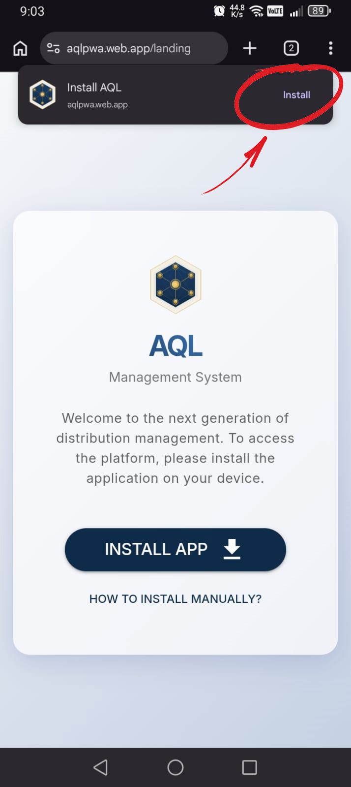

---

### Step 3: Manual Installation (If Prompt is Missed/Not Displayed)
If the automatic installation prompt does not appear or was dismissed, you can install the app manually:

1. Tap the browser options menu (usually three vertical dots in the top right corner).

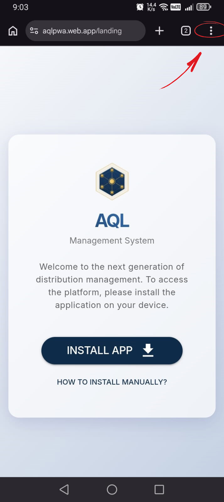

2. Select **Add to Home screen** (or **Install app**).

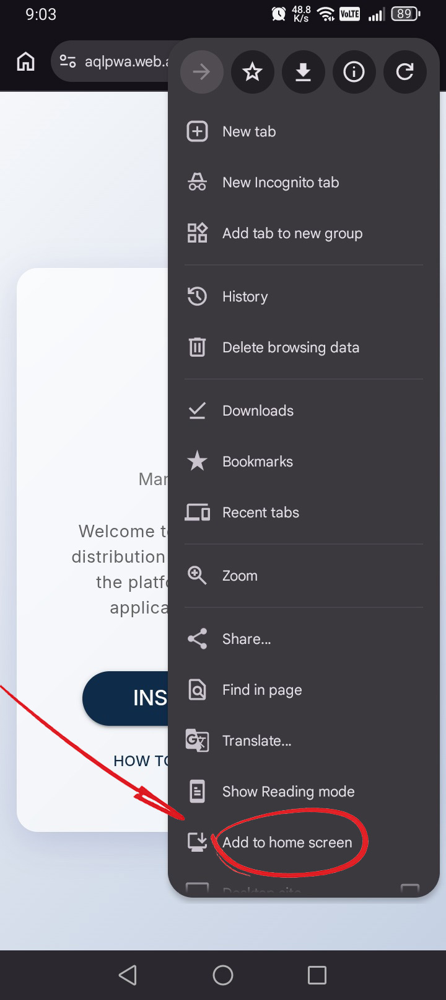

3. Tap **Install** in the dialog box.

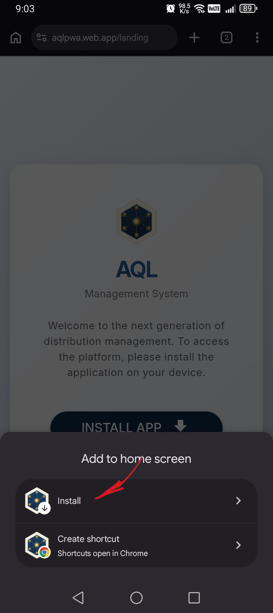

4. Confirm by tapping **Install** again on the system prompt.

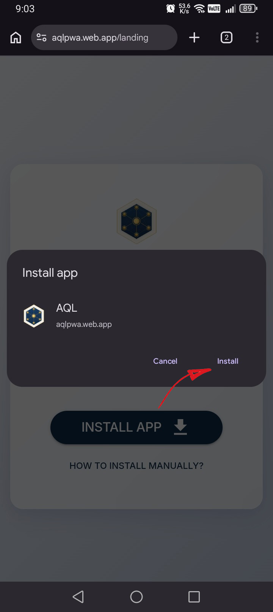

---

### Step 4: Progress and Icon Placement
Wait a short moment. You can monitor the progress of the installation in your device's notification drawer. Once complete, you will receive a notification.

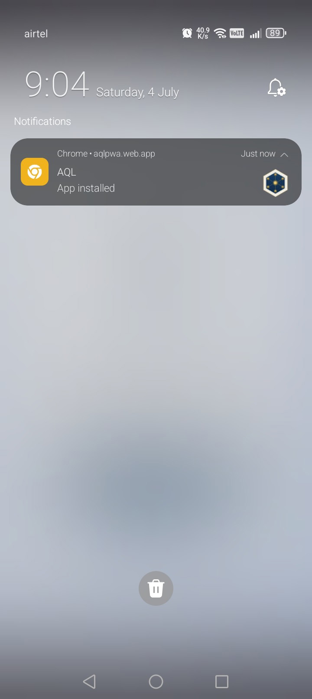

The AQL icon will now be placed on your device's home screen or app drawer.

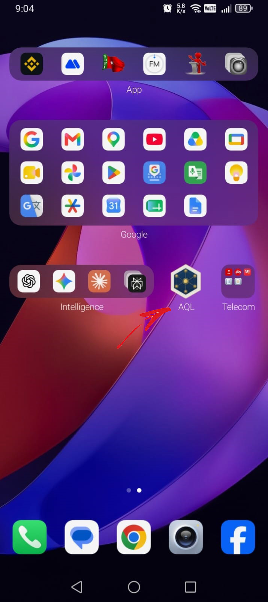

---

### Step 5: Start / Log In
Tap the AQL icon to open the app and reach the login/start screen.

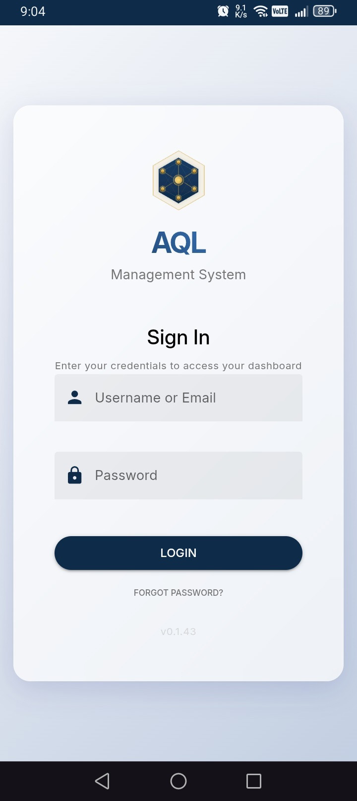

---

## iOS Installation

### Step 1: Open URL in Safari
1. Open the Safari browser on your iOS device.
2. Visit the provided web application URL.

---

### Step 2: Share Menu
Tap the **Share** button (the square icon with an arrow pointing upwards) in Safari's bottom toolbar.

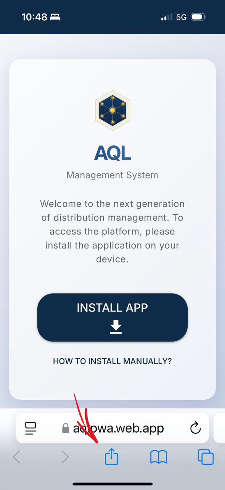

---

### Step 3: Find Add to Home Screen
Scroll down the share options list to find and select **Add to Home Screen**.

1. Scroll down the menu options.

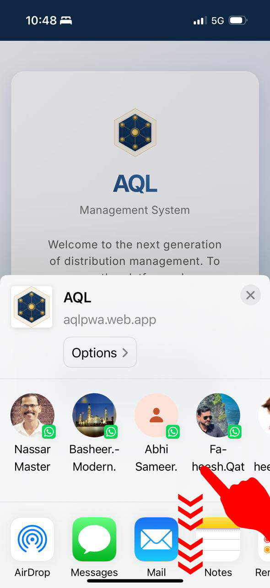

2. Continue scrolling if needed.

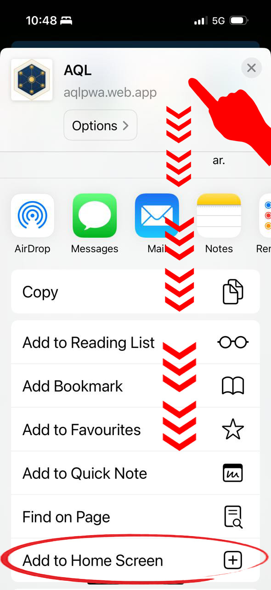

3. Tap **Add to Home Screen**.

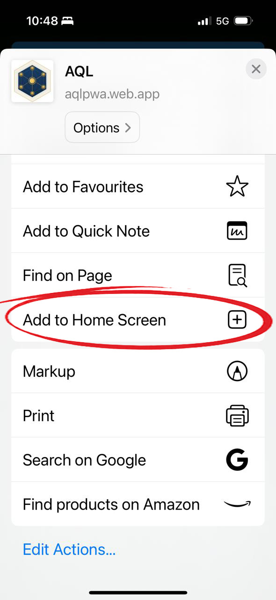

---

### Step 4: Add to Home Screen Confirmation
Tap the **Add** button in the top right corner.

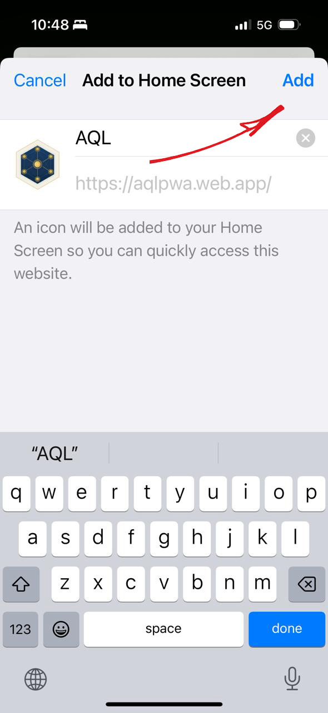

---

### Step 5: Launch the App
Within a few seconds, the **AQL** icon will appear on your device's home screen. Tap the icon to launch the application and open the login screen.

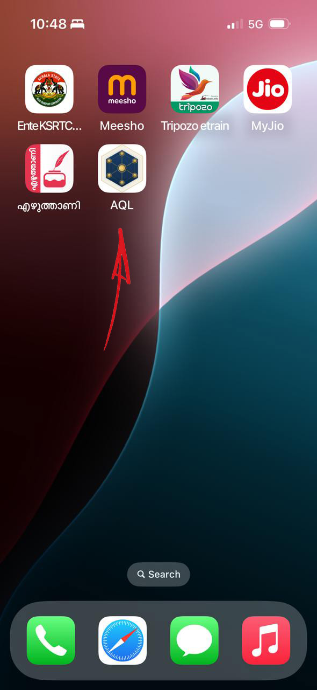

