# AQL — Operations Manager User Manual

Welcome to your hands-on guide to AQL from the **Operations Manager's** perspective. This manual covers how you set up the system — products, prices, warehouses, outlets, and vans — and how you oversee field executives through transfer approvals, restock approvals, and end-of-day stock returns.

---

## Getting Started

### Step 0.1: Log In to AQL

1. Open AQL.
2. Enter your **Email** and **Password**.
3. Click **Login**.
4. The system loads your personalized dashboard based on your role and permissions.

> [!NOTE]
> If you do not have login credentials, ask your system administrator to create a user account for you.

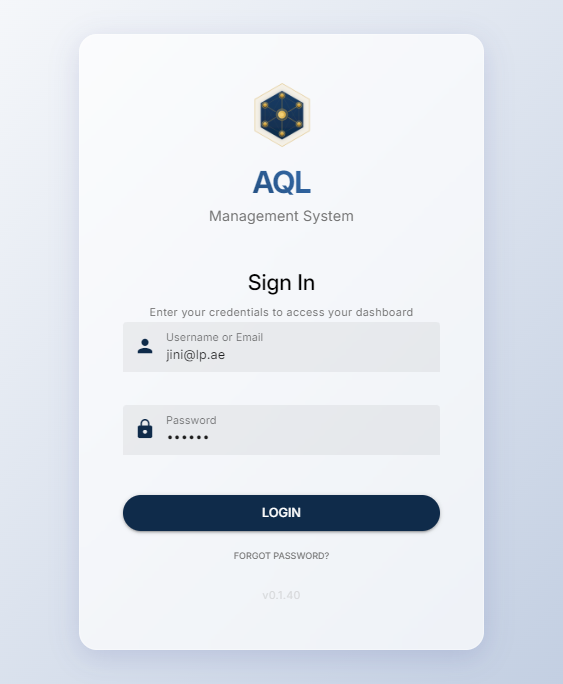

---

### Step 0.2: Understand the Sidebar Menu

After logging in, the **sidebar menu** on the left side of the screen is your primary navigation tool. The menu items you see depend on your role and permissions. As a manager, you will typically see:

| Menu Group | Items You Use |
|---|---|
| **Product** | Products, SKUs, Price Lists |
| **Warehouse** | Warehouses, Stock List, Direct Stock Entry, Transfers |
| **Outlet Operations** | Outlets, Outlet Operating Rules |
| **Field Sales** | Outlet Hub, Outlet Visits, Outlet Restocks, Outlet Deliveries |
| **Dashboard** | Performance overview widgets |

Throughout this manual, you will be directed to navigate using patterns like **Warehouse** -> **Transfers** or **Master** -> **Products**.

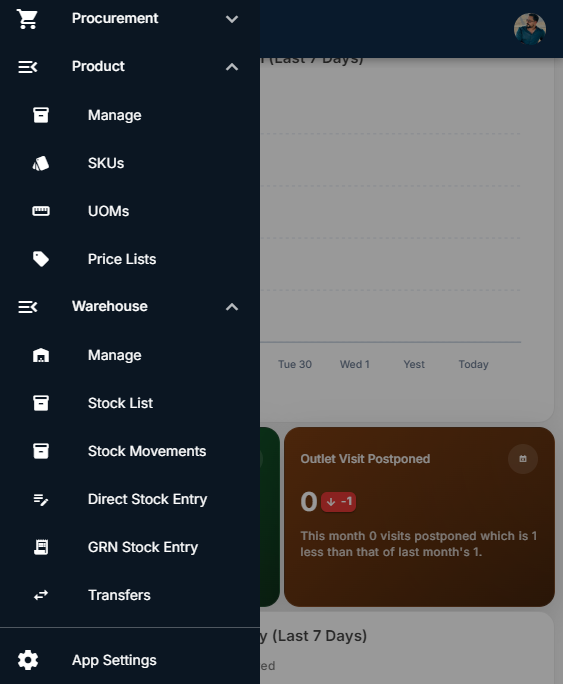

---

## Pre-Flight Checklist (Before Field Executives Start)

Complete these setup steps **before** field executives begin their daily operations. These define what products exist, what they cost, where stock lives, and which outlets receive service.

---

## 1. Product Management

Before any sales can happen, you must define the products and their variants (SKUs) in the system.

### Step 1.1: Create a Product

1. Open the sidebar menu and select **Product** -> **Manage**.
2. Click the **Add** (+) button in the top right corner.
3. Fill in the product details:
   - **Name**: Enter the product name (e.g., `Baby Wipes 80s`).
   - **Variant Types**: If the product has variants, enter them as a comma-separated list (e.g., `Size,Flavor,Color`). Leave blank for single-SKU products.
   - **Status**: Set to `Active` by default.
4. Click **Save**.

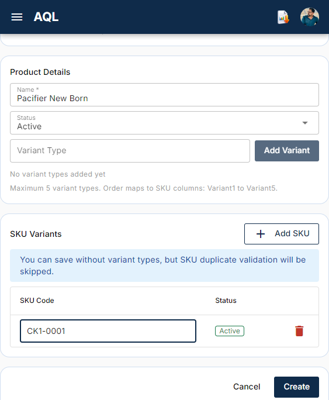

---

### Step 1.2: Add SKUs (Stock Keeping Units)

After saving the product, the system prompts you to add SKUs. SKUs are the sellable variants of a product.

1. Fill in each SKU row:
   - **Variant Values**: If the product has variant types (e.g., Size = `100pcs`, Flavor = `Unscented`), fill one value per variant column.
   - **UOM**: Unit of Measure (e.g., `PCS`, `BOX`, `CTN`).
   - **Barcode**: Optional barcode number.
   - **Tax Code**: Optional tax classification.
2. Add more SKU rows as needed using the **Add SKU** button.
3. Click **Save All** to create the product and all its SKUs at once.

> [!TIP]
> You can also edit products later and add/remove SKUs. SKUs are soft-deleted (set to `Inactive`) rather than permanently removed.

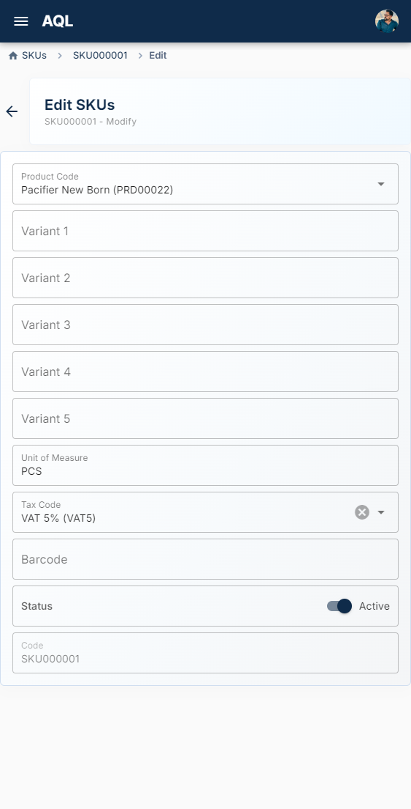

---

### Step 1.3: View & Edit Products

1. Go to **Products** > **Manage** in the sidebar to see all products with their SKU counts.
2. Click on a product to view its details and SKU table.
3. Use the **Edit** button to change product name, variant types, or add/remove SKUs.

> [!NOTE]
> Changing `VariantTypes` on a product that already has SKUs requires confirmation. The system remaps existing variant values in memory before saving.

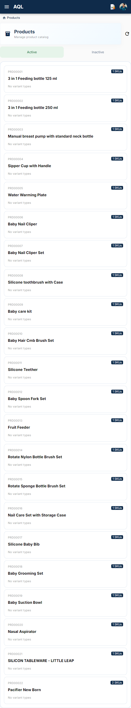

---

## 2. Price List Setting

Price lists define how much each SKU sells for. Every outlet must have a price list assigned.

### Step 2.1: Create a Price List

1. Select **Master** -> **Price Lists** from the sidebar.
2. Click the **Add** (+) button.
3. Fill in the price list details:
   - **Name**: A descriptive name (e.g., `Wholesale - Dubai`, `Retail - Abu Dhabi`).
   - **Currency**: Set to `AED`.
   - **Is Default**: Set to `TRUE` if this should be the fallback price list for outlets without a specific assignment. Only one price list can be default.
4. Click **Save**.

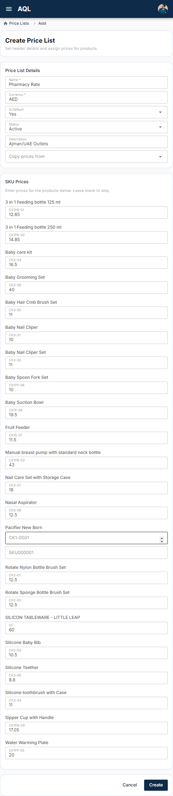

---

### Step 2.2: Add SKU Prices

1. Select **Master** -> **Price Lists** from the sidebar.
2. Click the decided price list from the list.
3. Enter prices directly in the grid.
4. Click **Save**.

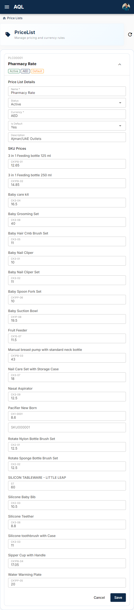

---

## 3. Warehouse Creation

Warehouses are physical storage locations. You need at least one **Main Warehouse** to hold bulk stock.

### Step 3.1: Create a Main Warehouse

1. Select **Warehouse** -> **Manage** from the sidebar.
2. Click the **Add** (+) button.
3. Fill in the warehouse details:
   - **Name**: A descriptive name (e.g., `Main Warehouse - Dubai`).
   - **Type**: Set to `Main`.
   - **Country**: Defaults to `UAE`.
   - **Province / City / Area**: Location details.
   - **Tax Registration Number / Name**: Optional tax details.
4. Click **Save**.

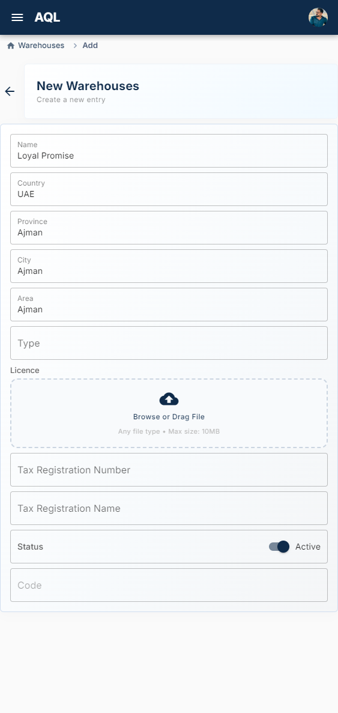

---

### Step 3.2: Add Storage Locations

Warehouses can have multiple storage areas (racks, shelves, zones). By default, a warehouse has a `_default` storage.

1. Open the warehouse record from the **Warehouses** list.
2. Storage locations are managed through **Stock Movements** or automatically created when receiving stock.
3. To view current storage locations, navigate to **Warehouse** -> **Stock List** and select the warehouse.

---

## 4. Warehouse Stock Management (Direct Stock Entry)

Use Direct Stock Entry to add initial stock or adjust quantities in any warehouse.

### Step 4.1: Select a Warehouse

1. Go to **Warehouse** -> **Direct Stock Entry** in the sidebar.
2. Select the target warehouse from the tappable cards.

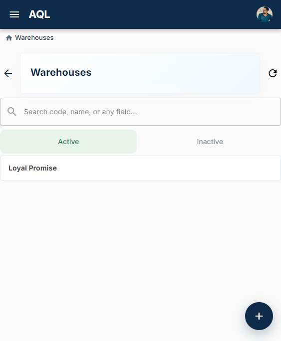

---

### Step 4.2: Enter Stock Quantities

1. The grid loads all existing stock rows for the selected warehouse.
2. For each SKU, enter the current physical quantity in the **Qty** field.
3. For new stock, select or type a **Storage Name** (e.g., `Rack-A`, `Shelf-3`). Type a new name to create a new storage location on the fly.

> [!IMPORTANT]
> Only the **difference** (delta) between the new and original quantity is sent to the server. If you change a row from 50 to 60, the system posts a `+10` stock movement.

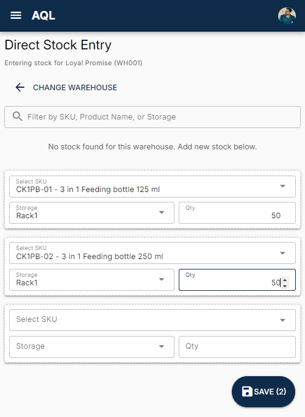

---

### Step 4.3: Save Stock Changes

1. Click **Save** to submit the changes.
2. A success notification confirms the update. The grid refreshes automatically with the new quantities.

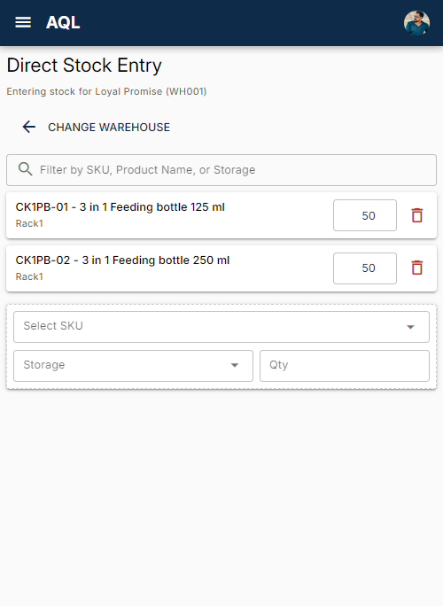

---

## 5. View Stock List

Monitor current stock levels across all warehouses.

### Step 5.1: View All Warehouses Stock Summary

1. Go to **Warehouse** -> **Stock List** in the sidebar.
2. All active warehouses are displayed as selection cards with a summary (SKU count, storage count, total quantity).

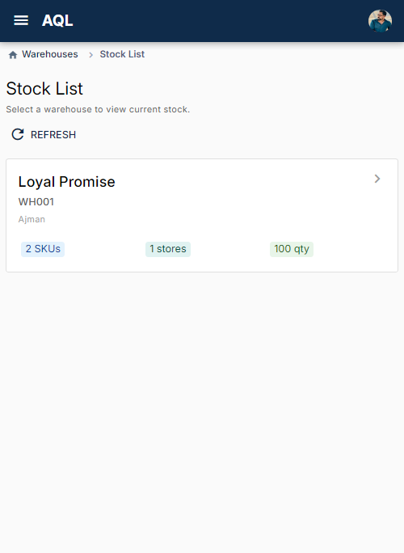

---

### Step 5.2: Drill into a Warehouse Stock

1. Click on a warehouse card to view its detailed stock.
2. The stock page shows all SKUs organized by storage location:
   - **Storage Name** (e.g., `Rack-A`, `Default`)
   - **SKU Code** and **Product Name**
   - **Variant Values** (if applicable)
   - **Current Quantity**

> [!TIP]
> Use the search/filter bar to find specific SKUs, products, or storage locations within a warehouse.

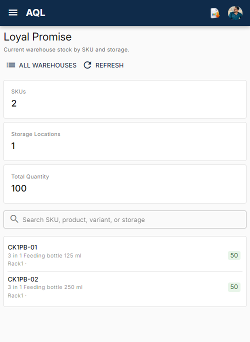

---

## 6. Outlet Creation

Outlets are the retail stores your field executives visit. You must create each outlet before field operations can begin.

### Step 6.1: Create an Outlet

1. Select **Outlet Operation** -> **Outlets** from the sidebar.
2. Click the **Add** (+) button.
3. Fill in the outlet details:
   - **Name**: Outlet/business name (required).
   - **Contact Person**: Store manager or owner name.
   - **Phone / Email**: Contact details.
   - **Country / Province / City / Area**: Location information.
   - **Communication Address**: Full address for delivery routing.
   - **Map Location Link**: Google Maps link for navigation.
   - **Tax Registration Number / Name**: Optional tax details.
4. Click **CREATE**.

> [!NOTE]
> You can also upload outlet photos (storefront, interior) and a trade licence document as file attachments.

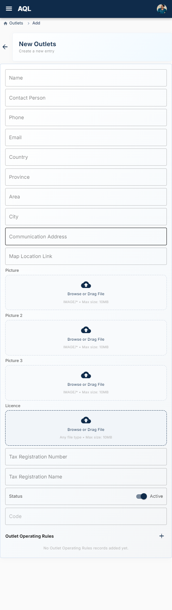

---

### Step 6.2: View & Manage Outlets

1. The **Outlets** list shows all registered outlets with their contact details.
2. Click an outlet to view its full profile, including its operating rules, visit history, and stock balance.
3. Use the **Outlet Hub** (sidebar -> **Field Sales** -> **Outlet Hub**) for a 360° view including stock balance, operating rules, and all history tabs.

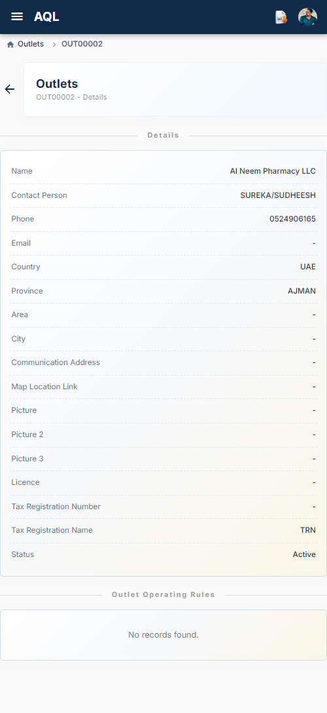

---

## 7. Setting Operation Rules

Outlet Operating Rules define the commercial terms for each outlet: credit limits, visit frequency, and price list assignment.

### Step 7.1: Create Operating Rules for an Outlet

1. Select **Outlet Operation** -> **Operating Rules** from the sidebar.
2. Click the **Add** (+) button.
3. Fill in the rules:
   - **Outlet Code**: Select the outlet from the dropdown.
   - **Price List Code**: Select the price list assigned to this outlet. Leave blank to fall back to the default price list.
   - **Max Stock Value Limit**: Maximum value of stock the outlet can hold (leave `0` for unlimited).
   - **Visit Frequency Days**: How often the outlet should be visited (default: `14` days).
   - **Credit Limit**: Maximum credit amount allowed (`0` means no credit).
4. Click **CREATE**.

> [!IMPORTANT]
> Each outlet can have only **one** operating rules record. If you need to update rules, edit the existing record rather than creating a new one.

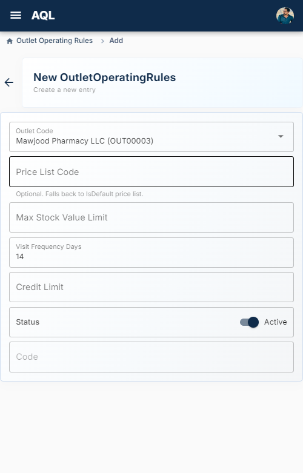

---

### Step 7.2: Pricing Resolution Chain

When field executives generate invoices at an outlet, the system resolves prices in this order:
1. **Outlet Operating Rules** `PriceListCode` (explicit assignment).
2. **Default Price List** where `IsDefault = TRUE` (fallback).

> [!TIP]
> Set up your most commonly used price list as the default, then override per outlet only when needed.

---

## 8. New Warehouse (Van) Creation

Each field executive needs a **Van Warehouse** to load stock into before heading out. Van warehouses are regular `Warehouses` records with `Type = Van`.

### Step 8.1: Create a Van Warehouse

1. Go to **Warehouse** -> **Manage** and click **Add**.
2. Fill in the van details:
   - **Name**: Name the van warehouse (e.g., `Van - Firose`, `VW-04`).
   - **Type**: Set to `Van`.
   - **Country / City / Area**: The operating region for this van.
3. Click **Save**.

> [!TIP]
> Use a consistent naming convention for van warehouses (e.g., `VW-{number}` or `Van - {Executive Name}`) to easily identify them in transfer screens.

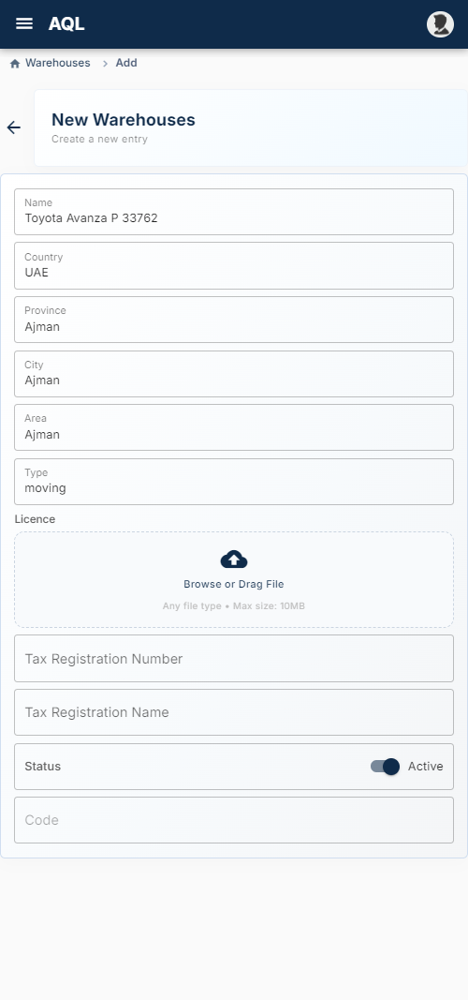

---

### Step 8.2: Linking Vans to Field Executives

The system links van warehouses to field executives **operationally** rather than through a dedicated field. When a field executive initiates a warehouse transfer from the Main Warehouse to `VW-04`, that van becomes associated with that executive for the day.

---

## 9. Transfer Approval (Van Loading)

Field executives request to load stock from the Main Warehouse into their van. As the manager, you must approve or reject these requests.

### Step 9.1: Review Pending Transfer Requests

1. Go to **Warehouse** -> **Transfers** in the sidebar.
2. Click the **Pending Approval** tab (or the default filter showing `PENDING_APPROVAL` records).
3. Each transfer shows:
   - **Source Warehouse**: Main Warehouse.
   - **Destination Warehouse**: Van Warehouse (e.g., `VW-04`).
   - **Requested By**: The field executive's name.
   - **Items**: List of SKUs and quantities requested.
   - **Date**: When the request was created.

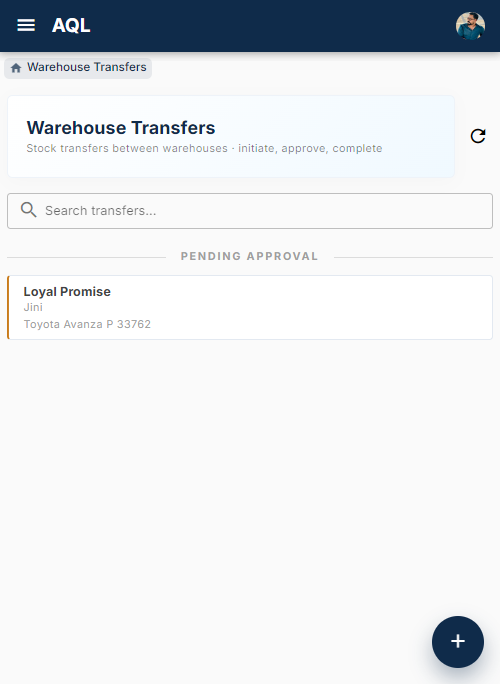

---

### Step 9.2: Approve or Reject the Transfer

1. Click on the transfer record to open its details.
2. Review the requested SKUs and quantities.
3. Click **Approve** to authorize the transfer, or **Reject** (with a required reason comment) to decline.

> [!WARNING]
> Approving a transfer does **not** move the stock yet. It changes the status to `APPROVED`, allowing the field executive to complete the transfer (physically load the items and confirm in the system).

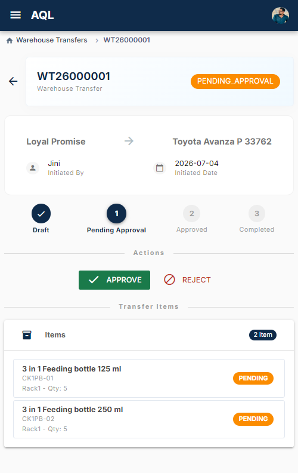

---

### Step 9.3: Post-Approval Flow

Once approved:
- The transfer status changes to `APPROVED`.
- The field executive sees the approved transfer in their **Approved** tab.
- The field executive physically loads the items and clicks **Complete** (or **Claim & Complete**) to log the stock into their van.
- Completed transfers create negative `StockMovements` for the Main Warehouse and positive `StockMovements` for the Van Warehouse.

---

### 9.4 Instant Transfer (Bypassing Approval)

While creating a **Warehouse Transfer**, an **Instant Fullfill** option is available when you set the destination storage. This flow bypasses both the approval and complete steps for transfers that are internal to your warehouse system.

**Steps:**

1. Navigate to **Warehouse** -> **Transfers**.
2. Click **Add** (+) to create a new transfer.
3. Set **Source Warehouse** and **Destination Warehouse**.
4. Check **Is Instant**: Set to `TRUE`. This option appears when you select a destination storage directly.
5. Select or enter a **Storage Name** in the destination (use `Default` for the default storage).
6. Click **Add Item** to add SKU and quantity details.
7. Click **Save**.

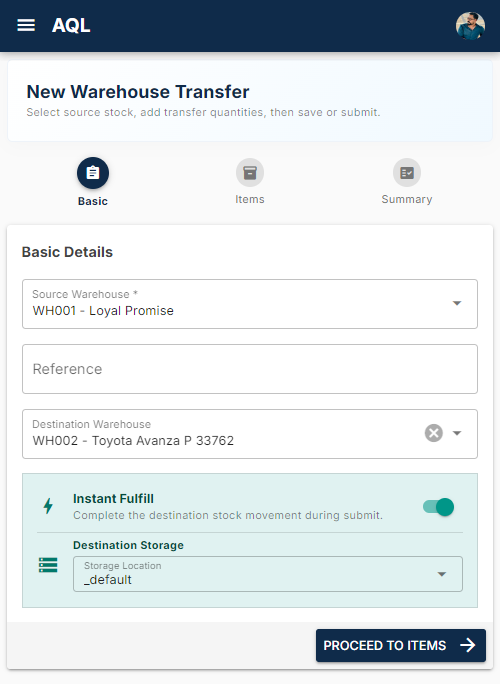

> [!IMPORTANT]
> Instant transfers skip the entire approval chain (`PENDING_APPROVAL` → `APPROVED` → `COMPLETED`). Stock movements are applied immediately, and the field executive does not need to perform a separate **Complete** action.

**Use Cases:**

- Internal reallocation between your own warehouses (e.g., moving stock from a regional hub to a local branch).
- Emergency stock adjustments where approval delay is not acceptable.
- System setup and testing scenarios.

> [!WARNING]
> Use Instant transfers only for internal warehouse movements. Never use this option when transferring to a **Van Warehouse** — it bypasses the critical approval checkpoint that ensures the field executive physically handles the items.

---

## 10. End of Day — Warehouse (Van) Unload Approval

At the end of the day, field executives return unsold stock from their van to the Main Warehouse. As the manager, you must approve and complete this return.

### Step 10.1: Field Executive Initiates Return

The field executive creates a warehouse transfer:
- **Source Warehouse**: Van Warehouse (e.g., `VW-04`).
- **Destination Warehouse**: Main Warehouse.
- **Is Instant**: Set to `FALSE` (requires manager approval).
- **Items**: Remaining unsold quantities for each SKU.

The transfer enters `PENDING_APPROVAL` status.

---

### Step 10.2: Review & Approve the Return

1. Go to **Warehouse** -> **Transfers**.
2. Locate the return transfer (Van -> Main Warehouse) in the `PENDING_APPROVAL` tab.
3. Click to open the transfer details.
4. Review the returned SKUs and quantities against what was loaded in the morning.
5. Click **Approve** to authorize the return.

> [!IMPORTANT]
> The field executive has already physically returned the goods to the warehouse. Your approval logs the stock back into the Main Warehouse ledger. Inspect the returned items before approving.

---

### Step 10.3: Complete the Transfer

1. After approval, the transfer status changes to `APPROVED`.
2. In the **Approved** tab, open the transfer record.
3. Click **Complete** to finish the return.
